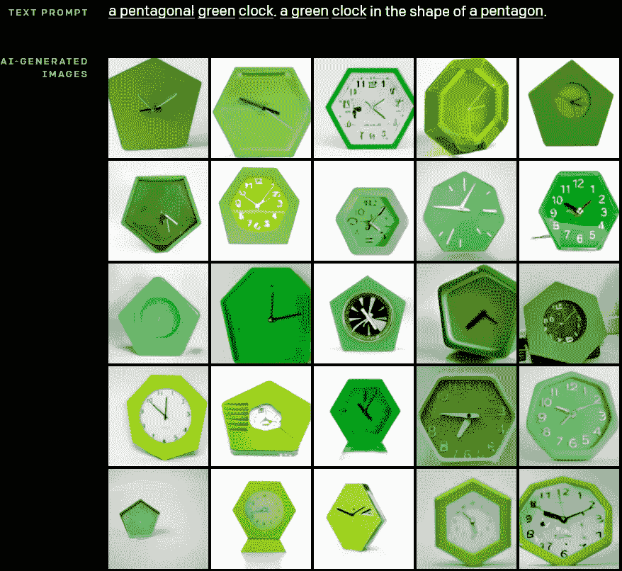
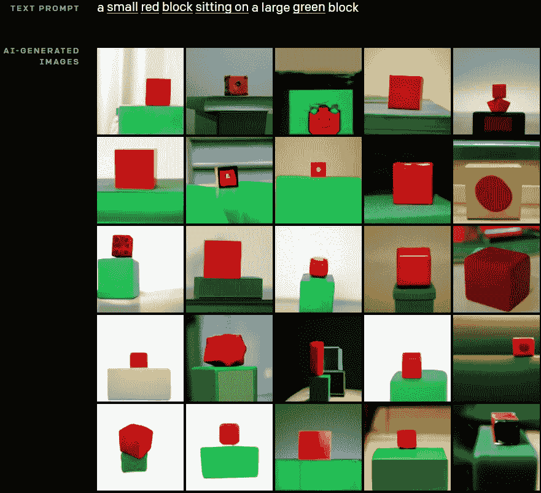
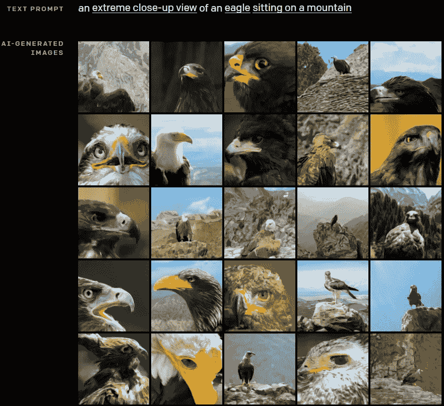
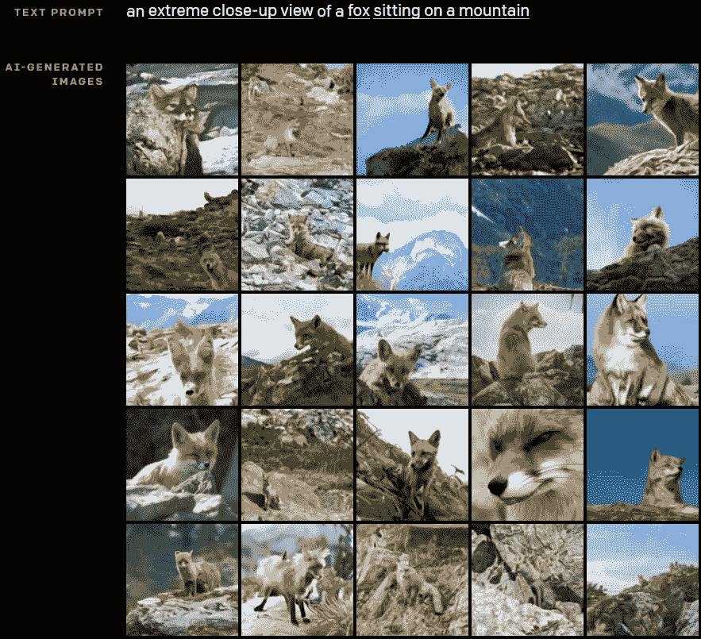
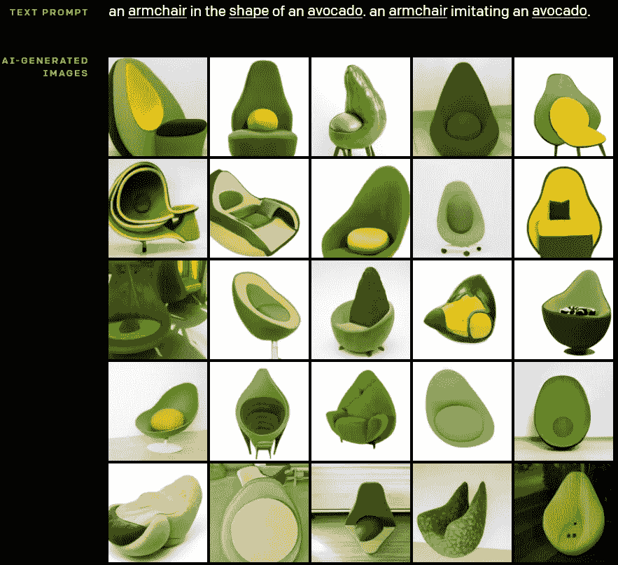
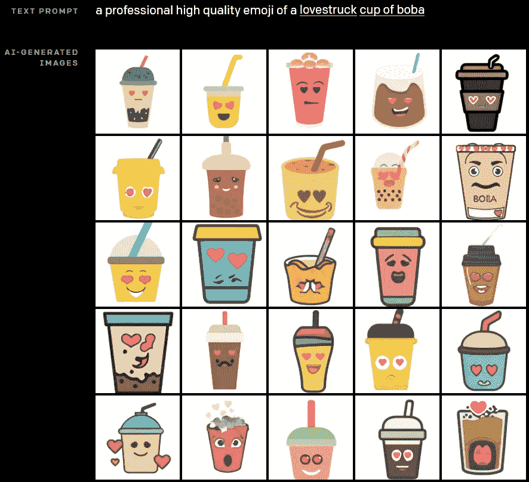
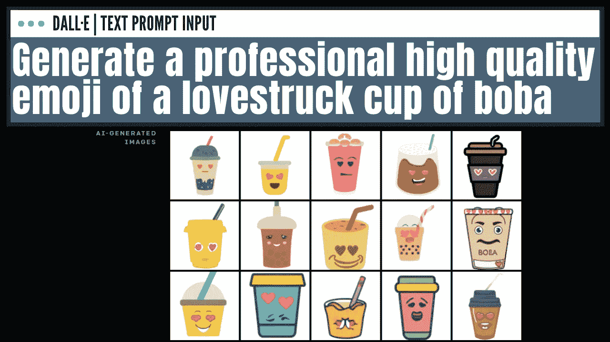

# DALL E:从文本标题生成图像！灵感来自 OpenAI 的 GPT-3 和图像-GPT

> 原文：<https://pub.towardsai.net/dall-e-generate-images-from-text-captions-inspired-by-gpt-3-and-image-gpt-from-openai-aacd7cd46e03?source=collection_archive---------1----------------------->

## [计算机视觉](https://towardsai.net/p/category/computer-vision)，[自然语言处理](https://towardsai.net/p/category/nlp)

## OpenAI 成功训练了一个能够从文本字幕生成图像的网络。它与 GPT 3 号和 GPT 图像非常相似，产生了惊人的效果。

DALL-E 是 OpenAI 基于 GPT-3 开发的新型神经网络。
事实上，它是 GPT 3 的缩小版，使用了 120 亿个参数，而不是 1750 亿个。但它经过专门训练，可以从文本描述中生成图像，使用文本图像对的数据集，而不是像 GPT-3 那样的非常广泛的数据集。它可以使用自然语言从文本字幕中创建图像，就像 GPT 3 创建网站和故事一样。

图片经由[https://openai.com/blog/dall-e/](https://openai.com/blog/dall-e/)

这是图像 GPT 和 GPT-3 的延续，我在以前的视频中都提到过，如果你还没有看过的话。

DALL-E 与 GPT-3 非常相似，因为它也是一个转换器语言模型，接收文本和图像作为输入，以多种形式输出最终的转换图像。它可以编辑图像中特定对象的属性，正如您在这里看到的。或者甚至同时控制多个对象及其属性。这是一项非常复杂的任务，因为网络必须理解对象之间的关系，并基于其理解创建图像。就拿这个例子来说，网络上出现了“一个戴着蓝色帽子、红色手套、绿色衬衫和黄色裤子的小企鹅表情符号”。所有这些组成部分都需要理解，物体，颜色，甚至物体的位置。这意味着手套必须是红色的，并且戴在企鹅的手上，其他地方也一样。考虑到任务的复杂性，结果是非常令人印象深刻的。

图片来自[https://openai.com/blog/dall-e/](https://openai.com/blog/dall-e/)

我们可以看到另一个更简单的例子，我们将“一个红色小块放在一个绿色大块上”输入网络。现在它只需要知道有两个块，它们的颜色，一个小一个大。这对我们来说似乎很简单，但是要做到这一点需要很高的理解水平。正如你所看到的，它仍然不完美，但是我们已经非常接近了！

图片来自[https://openai.com/blog/dall-e/](https://openai.com/blog/dall-e/)

DALL-E 还能够改变场景的视点。例如，在这里，我们发送了“一只山鹰的特写镜头”，这些是结果。

图片来自[https://openai.com/blog/dall-e/](https://openai.com/blog/dall-e/)

在这里，我们只是把鹰换成了狐狸，这就是生成的结果。

图片来自 https://openai.com/blog/dall-e/

当然，一个简单的标题可以产生无限的似是而非的图像，如果你想到一幅“日出时狐狸坐在田野里的画”，没有人知道你在想什么。有许多变量，如狐狸本身，它的颜色，它在看哪里，它的位置是什么，我们甚至没有谈论背景和绘画的风格。幸运的是，由于它与 GPT-3 非常相似，我们可以向输入文本添加细节，并生成更接近我们预期的东西，正如你在这里看到的不同风格的绘画一样。

图片来自 https://openai.com/blog/dall-e/

它还可以使用彼此不相关的对象生成图像，如创建一个逼真的鳄梨椅，或生成新的表情符号等原始和看不见的插图。

图片经由[https://openai.com/blog/dall-e/](https://openai.com/blog/dall-e/)

简而言之，他们将 DALL-E 描述为一个简单的只有解码器的变换器。如果你不熟悉变形金刚，你一定要看看我做的关于它们的视频。

正如我提到的，它接收文本和图像作为令牌形式的输入，就像 GPT-3 一样，以产生转换后的图像。正如我在之前的视频中所描述的，它使用自我注意力来理解文本的上下文和对图像的稀疏注意力。关于它是如何工作的，或者它到底是如何被训练的，没有太多的细节，但是他们将会发表一篇论文来解释他们的方法。简而言之，这个 DALL-E 网络表明，通过语言操纵视觉概念现在已经触手可及，我很兴奋地阅读他们即将发表的论文！

当然，这只是这个名为 DALL-E 的新 OpenAI 网络的概述。我强烈邀请你关注 OpenAI 关于即将到来的论文的新闻，以便更好地了解技术，或者订阅我的频道。它一发布我就一定会报道。

如果你喜欢我的工作，并想了解最新的人工智能技术，你绝对应该在我的社交媒体频道上关注我。

*   支持我的最好方式就是在 [**中**](https://medium.com/@whats-ai) 关注我。
*   订阅我的 [**YouTube 频道**](https://www.youtube.com/channel/UCUzGQrN-lyyc0BWTYoJM_Sg) 。
*   在 [**LinkedIn**](https://www.linkedin.com/in/whats-ai/) **上关注我的项目。**
*   一起学习 AI，加入我们的 [**Discord 社区**](https://discord.gg/learnaitogether) ，*分享你的项目、论文、最佳课程，寻找 Kaggle 队友，等等！*
*   订阅我的 [**简讯**](http://eepurl.com/huGLT5) ！

## **参考文献**

**OpenAI 的博客链接**:[https://openai.com/blog/dall-e/](https://openai.com/blog/dall-e/)，OpenAI，2021–01–05。

[https://youtu.be/nLzfDVwQxRU](https://youtu.be/nLzfDVwQxRU)