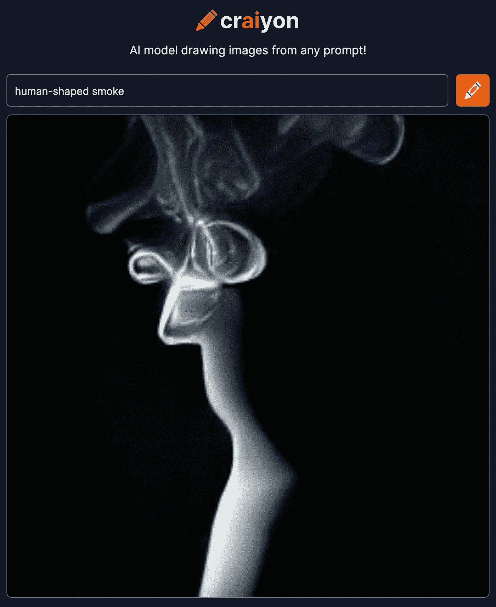

# DALL-E 真正的意义

> 原文：<https://pub.towardsai.net/dall-e-true-significance-e7b44b396f38?source=collection_archive---------4----------------------->

## 文字转图像是一种艺术形式吗？

来自 Craiyon 网站，符合使用条款。

首先，DALL-E 是什么？

Open AI 在 2020 年发布的深度学习模型 GPT-3 最初的目的是处理看起来类似于人工文本的自然语言，用于聊天机器人、文章摘要等应用。它是如此成功，以至于许多研究人员试图将其应用于其他任务。其中最杰出的是文本到图像生成系统“DALL-E”，也是由 Open-AI 开发的，它实际上只是对 GPT 3 框架的巧妙使用，可能不是最初开发的初衷。

你见过 DALL-E 工作吗？如果没有，现在就跑到你的浏览器，打开[www.craiyon.com](http://www.craiyon.com)网站，进入掩体，尝试“鲨鱼吃汉堡”或任何你想到的疯狂想法。这篇文章上面的图片是我自己得到的一个非常怪异的结果。

“Craiyon”是 DALL-E mini 的部署，它给你低分辨率的照片，因为它是免费的。但你肯定会同意我的观点:DALL-E 太棒了。

# DALL-E 的潜力如何？

这才是这篇文章真正要讨论的问题。

DALL-E 目前的用途是检查有趣的好奇心。你输入一个描述，你就会得到一个图像。你大笑或者困惑地看着它，然后你继续前进。

但是现在考虑以下场景:

“Amazing Pics”是一家尖端的平面设计机构，应该创造一种超现实主义的景观，有橙色的天空和一种带漩涡的海洋。他们在 DALL-E 的文本输入栏中键入短语“橙色天空和海洋漩涡的超现实主义景观”，点击 return，然后等待一分钟左右。

传送一组图像。

设计师选择其中一个并添加到文本字段“绿色海洋”

一组新的图像出现了，海洋被涂上了更多的绿色。

设计师挑选了一个，加上“岩石应该是粗糙的”，然后点击回车键。

诸如此类。你明白了。

这种情况超出了 DALL-E 目前的能力，但并没有超出太多；目前还没有提供逐步细化图像的功能。

有了这个稍微改进的 DALL-E,“惊人的照片”机构将能够在大约 10 分钟内创建一个梦幻般的高质量“创意”图像。这就是为什么“惊人的照片”会得到所有的平面设计合同。文本到图像的功能定义了整个市场。

# DALL-E 有创意吗？

现在，可以肯定的是，你已经注意到了上面场景中的一个小细节:一个人在循环中。

当 DALL-E 提供一组图像时，人类决定哪一个符合要求。人类设计师是如何做到的？挑选“最佳”图片有一个主观方面。还是“最美丽”或“最大胆”？

然后我们意识到一些事情:

> *主体性是人类的领域*。
> 
> *DALL-E 只是一个算法装置*。

我们不能说 DALL-E 是“创造性的”,因为“创造性的”图像是人类发出的一个呼唤。这就是为什么 DALL-E 首先给你一组图像。选择的是你。

情况很像摄影。许多人认为这是艺术，但摄影师不创造照片的主题或背景。他或她只是选择在艺术形象中捕捉现实的哪一部分。

现实本身并不美丽；摄影师选择了它的一部分，它将向看照片的人传达情感。

我们有了第二个认识:

> 情人眼里出西施。

当然，在人类的眼里。

我们可以进一步扩展摄影类比，因为当前的摄影设备(包括手机)可以将几张“括号”照片组合起来构建图像，例如，捕捉一整群人，这样就不会有人闭着眼睛出现。

但在这种情况下，由此产生的图像在现实世界中从未存在过！它是由算法生成的，就像 DALL-E 的情况一样。摄影师甚至没有“从现实世界中选择一件作品”

我们可以断定 DALL-E 绝不是艺术家。它只是一个图像生成器，而且是一个出色的生成器。

# 最后的想法

也许你可以训练一个机器学习算法来选择人类最可能选择的图像:你用生成的图像集和选择的图像作为标签来构建一个大型数据集，然后训练一个算法来预测选择。

但是，嘿，一个普通的“人类”预测选择不会削减它。首先，没有“人类偏好的图像”这种东西，最多有一个*流行的*人类选择的图像。每个人都有不同的感受力。

无论如何，我确信，如果一个全自动的“艺术”图像生成器被开发出来，一些人会开始谈论“数字创造力”、“机器人情感”、“合成创造者的权利”等等。

从我的角度来看，人眼(或者更确切地说，人类思维)赋予生成的图像以主观品质。就像它在摄影领域已经存在了一个多世纪一样。