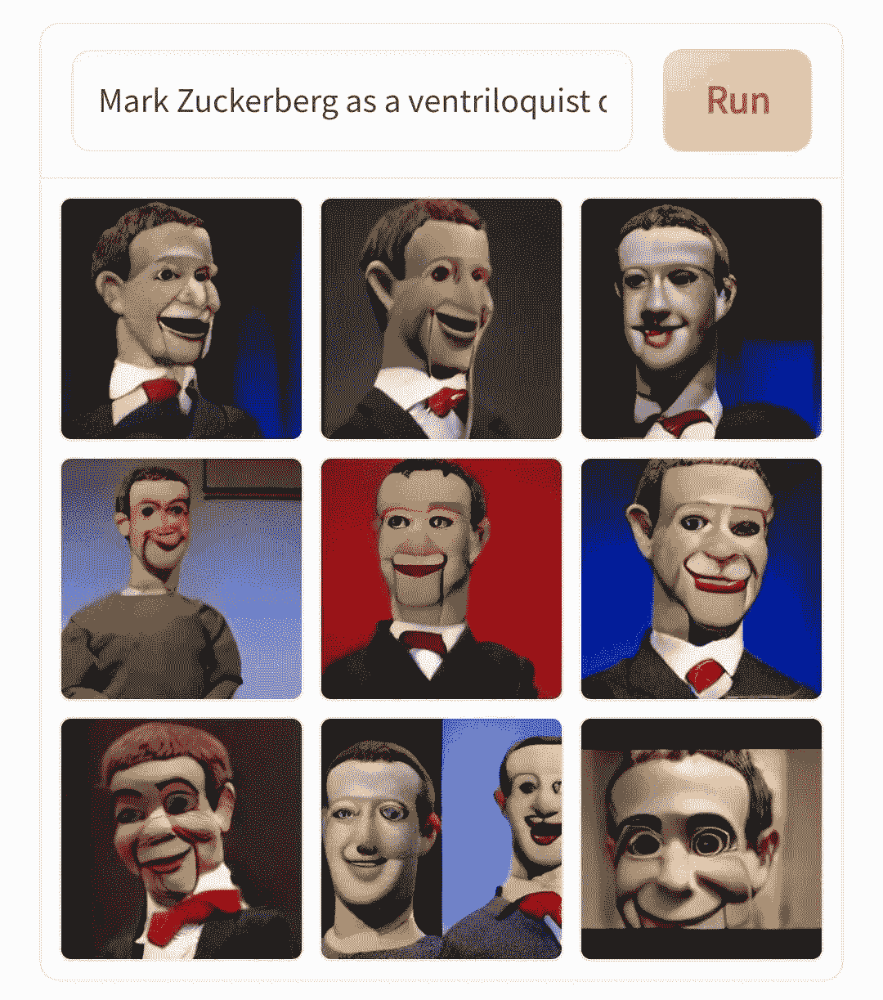
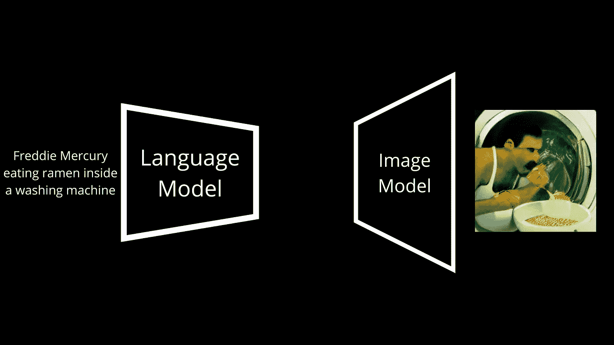
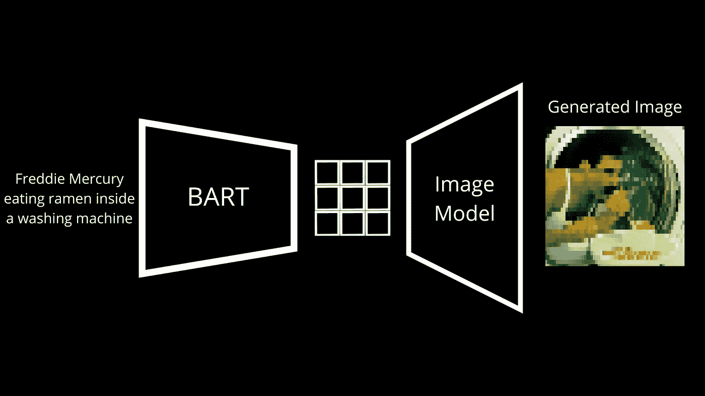
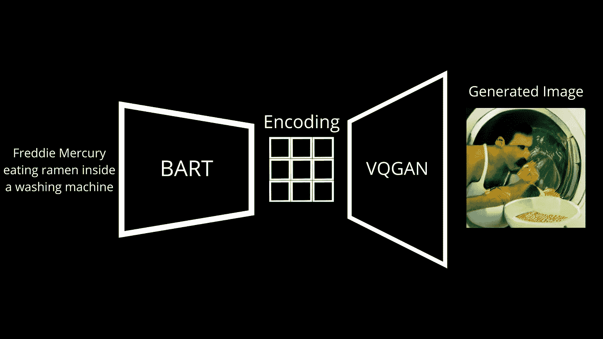
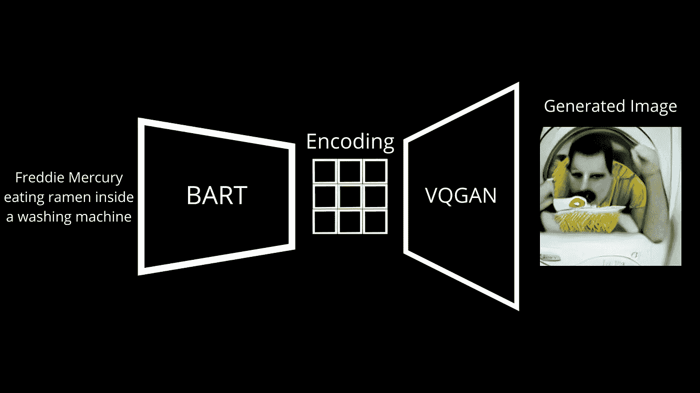

# Dalle Mini 非常棒，你可以使用它！

> 原文：<https://pub.towardsai.net/dalle-mini-is-amazing-and-you-can-use-it-820404e67196?source=collection_archive---------0----------------------->

## Dalle mini 是一个免费的开源人工智能，可以从文本输入中生成令人惊叹的图像。它是这样工作的。

> *原载于*[*louisbouchard . ai*](https://www.louisbouchard.ai/dalle-mini/)*，前 2 天看了一下于* [*我的博客*](https://www.louisbouchard.ai/dalle-mini/) *！*

[Dalle-mini 示例。](https://huggingface.co/spaces/dalle-mini/dalle-mini)

我相信你在过去的几天里已经在你的推特上看到了类似的图片。如果你想知道它们是什么，它们是由一个叫 DALL E mini 的人工智能生成的图像。如果你从未看过这些，你需要阅读这篇文章，因为你错过了。如果你想知道这是怎么可能的，那么，你正在写一篇完美的文章，不到五分钟你就会知道答案。

DALL E 这个名字一定已经耳熟能详了，因为在过去的一年里，我报道了 Open AI 制作的这个模型的两个版本，并取得了令人难以置信的结果。但是这个不一样。DALL E mini 是一个开源社区创建的项目，灵感来自 DALL E 的第一个版本，自那以来一直在不断发展，由于 Boris Dayma 和所有贡献者的努力，现在已经取得了令人难以置信的成果。

是的，这意味着你可以马上玩它，多亏了 huggingface。链接在下面的参考资料中，但是在阅读这篇文章之前，请给它几秒钟的时间。这将是值得的，你会比你周围所有认识的人更了解这个人工智能。

dalle-mini 模型概述。

在核心部分，DALL E mini 与 DALL E 非常相似，所以我最初关于该型号的视频是对这一款的很好介绍。正如您所怀疑的，它有两个主要组件，一个语言和一个图像模块。

首先，它必须理解文本提示，然后根据它生成图像，这是两个非常不同的事情，需要两个非常不同的模型。与 DALL E 的主要区别在于模型的架构和训练数据，但端到端的过程几乎是相同的。这里，我们有一个叫做 BART 的语言模型。BART 是一个经过训练的模型，用于将文本输入转换为下一个模型可以理解的语言。在训练过程中，我们向 DALL E mini 输入多对带有字幕的图像。BART 获取文本标题并将其转换为离散的标记，我们根据生成的图像和作为输入发送的图像之间的差异对其进行调整。

BART 模型和编码。

但是，这个产生图像的东西是什么？我们称之为解码器。它将采用 BART 生成的新字幕表示，我们称之为编码，并将其解码为图像。在这种情况下，图像解码器是 VQGAN，这是一个我已经在频道上介绍过的模型，所以如果你有兴趣，我肯定会邀请你观看。

迷你山谷中的 VQGAN

简而言之，VQGAN 是一个非常好的架构，可以做相反的事情。它学习如何从这样的编码映射开始，并从中生成图像。正如你所怀疑的，GPT-3 和其他语言生成模型做着非常相似的事情，对文本进行编码，并将新生成的映射解码为新的文本，然后发送给你。这是同样的事情，但是用像素来形成图像，而不是用字母来形成句子。它通过互联网上数以百万计的编码图像对进行学习，所以基本上你发布的带有字幕的图像，最终可以非常准确地重建出原始图像。

向编码中添加噪声以产生图像的变化

然后，您可以输入新的编码，这些编码看起来像训练中的编码，但有一点不同，它将生成一个全新但相似的图像。类似地，我们通常只给这些编码添加一点噪声，以生成表示相同文本提示的新图像。

瞧！这就是 DALL E mini 如何学习从你的文本标题中生成图片。

## 观看视频中的更多结果:

正如我提到的，它是开源的，多亏了 Huggingface，你甚至可以马上玩它。当然，这只是一个简单的概述，为了清楚起见，我省略了一些重要的步骤。如果你想知道更多关于这个模型的细节，我在下面的参考资料中链接了很多资源。我最近还在 YouTube 上发布了两个短视频，展示了一些有趣的结果和 T2 与 DALL E 2 在相同文本提示下的比较结果。

看着挺爽的！

我希望你喜欢这篇文章和视频，如果是的话，请花几秒钟让我在评论中知道[，并留下一个喜欢的](https://youtu.be/qOxde_JV0vI)。

我们会再见面的，不是下周，而是两周之后，带着另一篇惊人的论文！

## 参考

阅读全文:[https://www.louisbouchard.ai/dalle-mini/](https://www.louisbouchard.ai/dalle-mini/)
DALL E mini vs DALL E 2:[https://youtu.be/0Eu9SDd-95E](https://youtu.be/0Eu9SDd-95E)最古怪/最搞笑的 DALL E Mini 结果:[https://youtu.be/9LHkNt2cH_w](https://youtu.be/9LHkNt2cH_w)
玩 DALL E Mini:[https://huggingface.co/spaces/dalle-mini/dalle-mini](https://huggingface.co/spaces/dalle-mini/dalle-mini)
DALL E Mini 代码:[https://github.com/borisdayma/dalle-mini](https://github.com/borisdayma/dalle-mini)
鲍里斯·戴马的推特:[https://twitter.com/borisdayma](https://twitter.com/borisdayma)
鲍里斯·戴伟大而完整的技术报告 ref _ src = tw src % 5 etfw % 7 ctw camp % 5 etweembed % 7 ctw term % 5E 1536294746041114624% 7 ctw gr % 5E % 7 ctw con % 5es 1 _&ref _ URL = https % 3A % 2F % 2 fwww . redditmedia . com % 2f media embed % 2 fvbqh2s % 3f response % 3d true is _ night mode % 3d true
v):[https://www.louisbouchard.ai/newsletter/](https://www.louisbouchard.ai/newsletter/)

加入我们的 Discord 频道，一起学习 AI:
https://Discord . gg/learnai Together