# Tableau 中的仪表板和故事:Tableau 桌面专家认证之路

> 原文：<https://pub.towardsai.net/dashboards-stories-in-tableau-a-road-to-tableau-desktop-specialist-certification-e93f1f3a0614?source=collection_archive---------3----------------------->

## 第 13 章:通过免费的 Udemy Tableau 转储，窥视仪表盘和 Tableau 中的故事

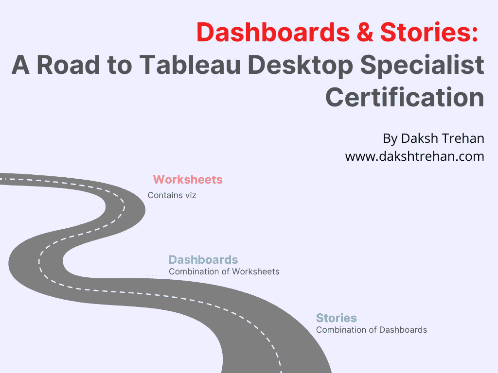

欢迎来到第十三章，在这一章中，我们将学习仪表盘和 [Tableau](https://medium.com/u/fcbe60d0bf8b?source=post_page-----e93f1f3a0614--------------------------------) 中的故事。

> 如果你想浏览其他章节，请访问: [**画面:这是什么？为什么它是最好的？；Tableau 桌面专家认证之路。**](https://dakshtrehan.medium.com/tableau-what-it-is-1e2cdff35440)

> 如果您想直接访问 Tableau 桌面专家笔记，请在此处访问它们→[https://dakshtrehan . comment . site/Tableau-Notes-c 13 fceda 97 b 94 BDA 940 edbf 6751 cf 30](https://dakshtrehan.notion.site/Tableau-Notes-c13fceda97b94bda940edbf6751cf303)
> 
> 使用链接访问免费 Tableau 认证转储(有效期至 2022 年 7 月 6 日):
> 
> [https://www . udemy . com/course/tableau-desktop-specialist-certification-dumps-2022/？coupon code = e3f 08189 fa 4 bafae 72 BC](https://www.udemy.com/course/tableau-desktop-specialist-certification-dumps-2022/?couponCode=E3F08189FA4BAFAE72BC)

创建多个可视化效果后，您可以使用它们来创建仪表板。创建多个仪表板后，您可以将它们组合起来创建一个故事。

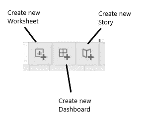

# 目录

*   **仪表板**
    –仪表板布局
    –仪表板中的对象
    –仪表板操作
    –创建仪表板的最佳实践
    –附加注释
*   **故事**
    –故事布局
    –故事中的对象
    –创建故事的最佳实践
    –附加注释
*   **本主题的认证问题示例**

# 仪表板

仪表板可以被认为是各种可视化的组合。

## 仪表板布局

**仪表板的布局可以定义为:手机、平板电脑、桌面和默认。**

在定义仪表板的大小时，我们可以从三个选项中选择:

**固定大小→** 我们可以为仪表板定义一个固定的大小，我们可以从多个预定义的选项中进行选择。

**自动→** 仪表盘会根据其构成的对象自动配置尺寸。

**范围→** 我们可以给出一个仪表盘的尺寸范围。

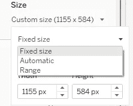

## 仪表板中的对象

除了我们的可视化，我们还可以添加各种对象到我们的仪表板，以增加吸引力，使它更有吸引力。

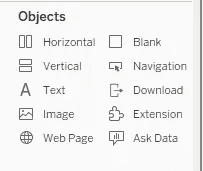

**水平&垂直→** 这些是布局容器，允许你以水平或垂直格式添加工作表。

**文本→** 这允许您在仪表板中添加静态文本。

**图片→** 我们可以用它给我们的仪表盘添加一个背景图片或者静态图片。

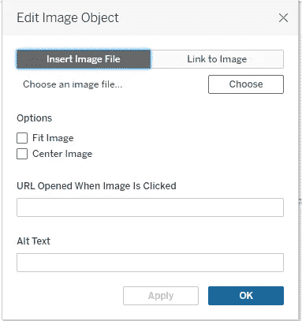

使用这个对象，我们可以添加一个网页到我们的仪表板。

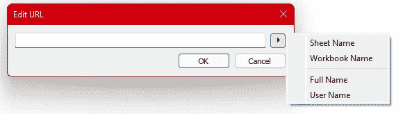

**空白→** 它允许你在仪表板上添加一些空白区域。

**导航→** 它可以让您导航到其他仪表板或工作表。

**下载→** 它将让观众下载各种格式的仪表板。

**扩展→** 它将允许用户向仪表板添加第三方扩展。

**询问数据→** 它允许用户输入对话，这些对话稍后可以由仪表板的作者回答。

我们可以添加平铺或浮动格式的对象。

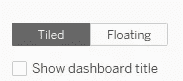

**浮动格式是首选，因为它有助于创建更具吸引力和优化的仪表板。**

## 仪表板操作

要采用仪表板操作，请转到仪表板>操作。

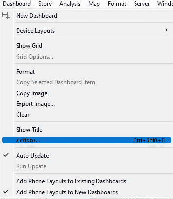

我们可以实现的仪表板操作有:**过滤、突出显示、转到 URL、转到工作表、更改参数、更改设置值。**

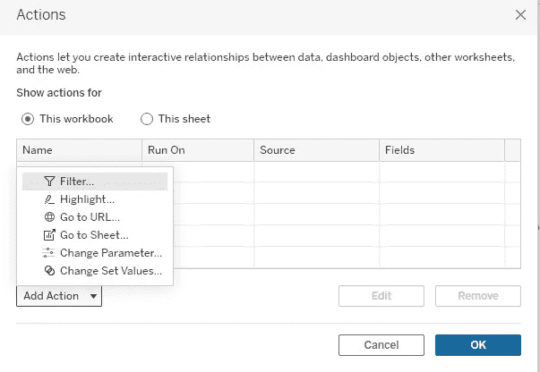

对于“*转到 URL* ”，我们可以指定链接将被打开的位置。

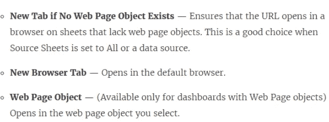

来源:Tableau 文件

这些动作可以通过**悬停、选择、菜单来触发。**

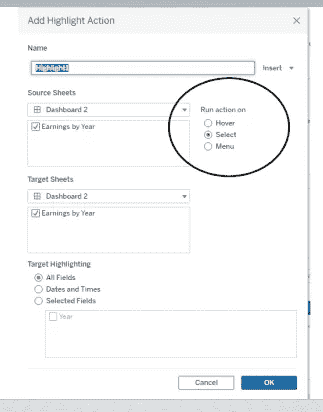

1.  **悬停→** 一旦用户悬停在视图中的任何标记上，这将改变设置。
2.  **选择→** 这将在用户点击视图中的任何标记时触发动作。
3.  **菜单→** 当用户右击标记并在上下文菜单中选择一个选项时，将触发动作。

选择如何运行操作以及源工作表和目标工作表。

## 创建仪表板的最佳实践

*   将最重要的可视化内容放在仪表板的左上角。
*   默认情况下，仪表板的大小设置为固定，使其自动。
*   通过在视图中引入过滤器和参数，为用户提供灵活性。
*   工具提示是向仪表板添加额外信息的一个很好的选择。
*   在单个仪表板中使用有限数量的可视化效果。
*   要简洁明了。

## 附加注释

*   创建过滤动作时，使用悬停高亮显示、选择过滤和菜单动作显示工具提示。
*   Tableau Dashboard 中允许的安全 URL 前缀是 HTTP、HTTPS 和 FTP。
*   工具提示中的可视化是静态图像，而不是交互式视图。
*   如果您在源表中使用 Show Me 来更改视图结构，您将重置所有工具提示编辑，包括工具提示引用中的 Viz。
*   我们可以导出 jpg，png，emf，BMP 格式的仪表板。可以通过选取“仪表板”>“导出图像”来完成导出。
*   如果工作表出现在仪表板中，我们不能删除它。
*   当我们修改工作表或仪表板时，工作表和仪表板中的视图都会改变。

# 故事

故事可以被称为各种仪表板的组合。

## 仪表板布局

在定义仪表板的大小时，我们可以从三个选项中选择:

**固定大小→** 我们可以为我们的故事定义一个固定的大小，我们可以从多个预定义的选项中进行选择。

**自动→** 故事会根据构成的对象自动配置大小。

**范围→** 我们可以给我们的故事的大小一个范围。

## 故事中的对象

我们可以为我们的故事添加不同的表、仪表板或标题。

## 创建故事的最佳实践

*   保持简洁明了。
*   使用时间顺序的方法。
*   使用过滤器使其具有交互性。
*   减少加载时间。

## 附加注释

*   如果工作表正在任何文章中使用，则工作表的“删除”选项将被禁用。
*   如果我们修改了文章中使用的任何工作表，文章中的视图也会随之改变，反之亦然。

# **本主题的认证问题示例**

**以下哪些选项可用于导出用于构建视图/可视化的数据？【选择 2】**

a.JSON 格式
b. MS Access 数据库
c. CSV 文件
d. PDF 文件

**解决方案:** CSV 文件，MS Access 数据库

**我们可以在 Tableau 中的故事点上同时添加仪表板和工作表吗？**

a.真
b .假

**解:**假

**为了根据您的数据定制链接，我们可以在 URL 中自动输入字段值作为 ____。**

a.设置
b .过滤器
c .计算字段
d .参数

**解决方案:**参数

**以下哪些是可以添加到用户仪表板的交互元素？**

a.过滤操作
b .编辑工具提示操作
c .转到 URL 操作
d .突出显示操作

**解决方案:**过滤操作、转到 URL 操作、突出显示操作

**在 Tableau 中创建仪表板时，以下哪些是有效对象？【选择 2】**

a.文本
b .扩展
c .视频
d .链接

**解决方案:**文本，扩展

> 使用链接访问免费 Tableau 认证转储(有效期至 2022 年 7 月 6 日):
> 
> [https://www . udemy . com/course/tableau-desktop-specialist-certification-dumps-2022/？coupon code = e3f 08189 fa 4 bafae 72 BC](https://www.udemy.com/course/tableau-desktop-specialist-certification-dumps-2022/?couponCode=E3F08189FA4BAFAE72BC)

# 参考资料:

[1] [Tableau 帮助| Tableau 软件](https://www.tableau.com/support/help)

[2] [个人笔记](https://dakshtrehan.notion.site/Tableau-Notes-c13fceda97b94bda940edbf6751cf303)

[3] [Tableau 桌面专家考试(新花样— 2021) — Apisero](https://apisero.com/tableau-desktop-specialist-exam-new-pattern-2021/)

# 感谢阅读！

请随意鼓掌，这样我就知道这篇文章对你有多有帮助，并在你的社交网络上分享它，这对我很有帮助。

如果你喜欢这篇文章，想了解更多**机器学习，数据科学，Python，BI。请考虑订阅我的时事通讯:**

> [达克什·特雷汉的简讯](https://mailchi.mp/b535943b5fff/daksh-trehan-weekly-newsletter)。

在网上找到我:[www.dakshtrehan.com](http://www.dakshtrehan.com/)

在 LinkedIn 与我联系:[www.linkedin.com/in/dakshtrehan](http://www.linkedin.com/in/dakshtrehan)

阅读我的科技博客:[www.dakshtrehan.medium.com](http://www.dakshtrehan.medium.com/)

在 Instagram 上联系我:[www.instagram.com/_daksh_trehan_](http://www.instagram.com/_daksh_trehan_)

# 想了解更多？

[YouTube 是如何利用 AI 推荐视频的？](/how-is-youtube-using-ai-to-recommend-videos-38a142c2d06d)
[利用深度学习检测新冠肺炎](https://towardsdatascience.com/detecting-covid-19-using-deep-learning-262956b6f981)
[逃不掉的 AI 算法:抖音](https://towardsdatascience.com/the-inescapable-ai-algorithm-tiktok-ad4c6fd981b8)
[GPT-3 向一个 5 岁的孩子解释。](/gpt-3-explained-to-a-5-year-old-1f3cb9fa030b)
[Tinder+AI:一场完美的牵线搭桥？](https://medium.com/towards-artificial-intelligence/tinder-ai-a-perfect-matchmaking-b0a7b916e271)
[一个内部人士的使用机器学习卡通化指南](https://medium.com/towards-artificial-intelligence/an-insiders-guide-to-cartoonization-using-machine-learning-ce3648adfe8)
[谷歌是如何做出“哼哼来搜索？”](/how-google-made-hum-to-search-865f224b70d0)
[一行神奇的代码执行 EDA！](/one-line-magical-code-to-perform-eda-f83a731fbc35)
[给我 5 分钟，我给你深度假！](/give-me-5-minutes-ill-give-you-a-deepfake-ce83a645b0f9)

> *欢呼*