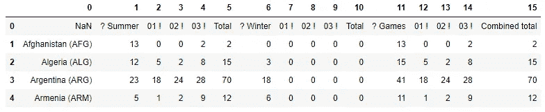
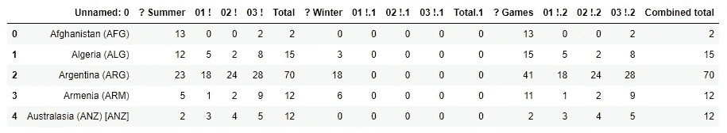
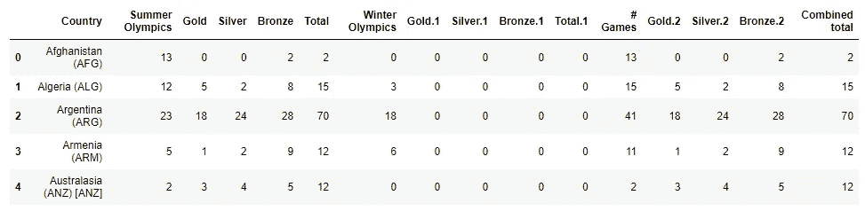
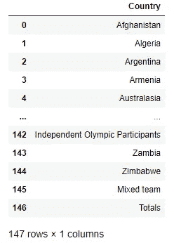
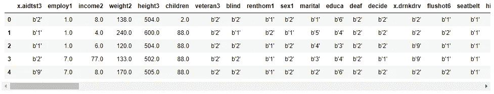
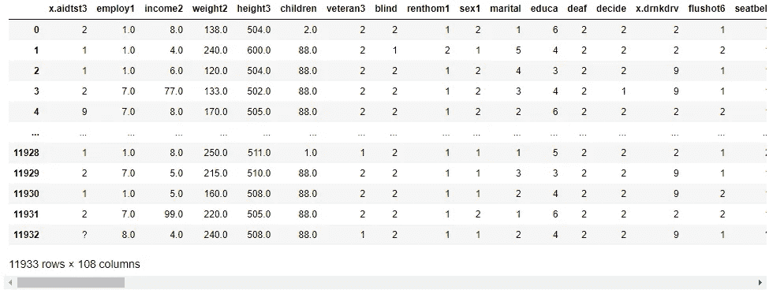
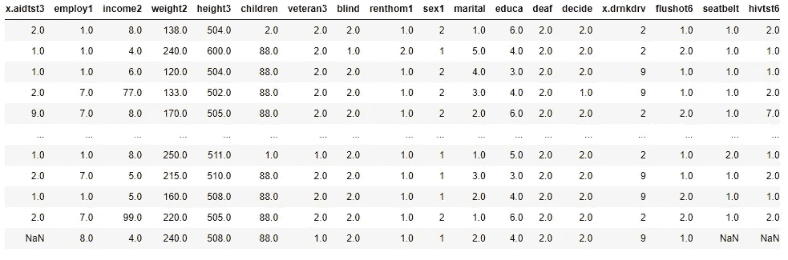
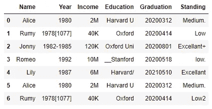
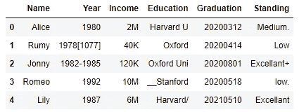

# Python 中数据科学家/分析师日常工作中的常见数据清理任务

> 原文：<https://pub.towardsai.net/data-analysis-91a38207c92b?source=collection_archive---------0----------------------->


布鲁克斯·赖斯在 [Unsplash](https://unsplash.com?utm_source=medium&utm_medium=referral) 上的照片

## [数据分析](https://towardsai.net/p/category/data-analysis)

## 数据清理备忘单

如果你是数据科学家、数据分析师或机器学习工程师，数据清理是你生活中必不可少的一部分。在现实生活中，很难找到完全干净并可以立即使用的数据。在深入分析、可视化或机器学习之前，数据清理是几乎所有现实世界项目中非常常见的任务。

本文将关注一般的和非常常见的数据清理任务。我们将使用几个不同的数据集来演示不同的数据清理过程。

不再介绍了。让我们开始行动吧！

首先，我将从 olympics.csv 数据集开始。这是一个用于实践的非常常见的数据集。我将使用的第一个数据集是奥林匹克数据集。我从 Coursera 的课程中找到了这个数据集。我必须在使用前做一些清洁工作。以下是数据集的链接:

[](https://github.com/rashida048/Datasets/blob/master/olympics.csv) [## master rashida048/Datasets 上的 Datasets/olympics.csv

### 在 GitHub 上创建一个帐户，为 rashida048/Datasets 开发做出贡献。

github.com](https://github.com/rashida048/Datasets/blob/master/olympics.csv) 

在这里，我导入必要的包，使用“read_csv”函数将数据集读入 DataFrame 格式，并使用。head()函数。

```
import pandas as pd
import numpy as npolympics = pd.read_csv("olympics.csv")
olympics.head()
```



> **找到正确的标题**

在数据框中，第一行上面显然不是标题。标题实际上是行索引为 1 的下一行。因此，在 read_csv 方法中，可以使用一个额外的参数“header=1”来实现这一点。在这里，我再次读取数据集:

```
olympics = pd.read_csv("olympics.csv", header=1)
olympics.head()
```



> **重命名列**

这里的列名看起来不太清楚，也不容易理解。第一列包含所有国家的名称。但是它有一个奇怪的名字！上面写着“01！”, '02!'，或者 03 年！，应该是‘金’、‘银’、‘铜’。因此，让我们使用“重命名”功能来重命名这些列。“rename”函数采用一个字典，其中键是原始列名，值是新列名。

```
col_names = {'Unnamed: 0': 'Country',
               '? Summer': 'Summer Olympics',
               '01 !': 'Gold',
               '02 !': 'Silver',
               '03 !': 'Bronze',
               '? Winter': 'Winter Olympics',
               '01 !.1': 'Gold.1',
               '02 !.1': 'Silver.1',
               '03 !.1': 'Bronze.1',
               '? Games': '# Games',
               '01 !.2': 'Gold.2',
               '02 !.2': 'Silver.2',
               '03 !.2': 'Bronze.2'}olympics.rename(columns=col_names, inplace=True)#Checking the olympics DataFrame with the new column names
olympics.head()
```



列名是固定的！

> **去掉文本中多余的尾部**

请看第一列中的国家名称。在国名之后，括号中有一个缩写。有时它甚至有两次。那是不必要的。它在可视化或任何分析中都不好看。这需要被删除。

为此，我们将使用“应用地图”功能。“applymap”函数采用应该应用于我们打算执行更改的一列或多列的函数。这里我们定义一个函数，它将一个字符串作为参数，并在找到第一个括号“(”后删除所有内容。

```
def get_country(st):
    if ' (' in st:
        return st[:st.find(' (')]
    else:
        return st
```

我们将使用该函数作为“applymap”函数中的参数。

```
pd.DataFrame(olympics['Country']).applymap(get_country)
```



如您所见，在国家一栏中，我们现在只有国家名称。如果我们有多个具有相同清洗要求的色谱柱，我们可以同时在所有色谱柱上使用“applymap”。

这个数据集现在可以进行分析或可视化了！

我的下一个数据集将是关节炎数据集。这个数据集是我在硕士课程中的一门课的作业。它是“飞机救援消防”格式。这是这个数据集的链接。

[](https://github.com/rashida048/Datasets/blob/master/project-2018-BRFSS-arthritis.arff) [## 数据集/项目-2018-BRFSS-关节炎。rashida048 大师的飞机救援消防/数据集

### 在 GitHub 上创建一个帐户，为 rashida048/Datasets 开发做出贡献。

github.com](https://github.com/rashida048/Datasets/blob/master/project-2018-BRFSS-arthritis.arff) 

如果您不熟悉这种格式，也不用担心。我们的重点是数据清理。下面是如何将这个“arff”格式的数据集加载到 pandas 数据帧中:

```
from scipy.io import arffd = arff.loadarff("project-2018-BRFSS-arthritis.arff")
df = pd.DataFrame(d[0])
```



这个数据集有 108 列和 11933 行。所以，相当大的数据集！

> **将字节型数据转换为数值型数据**

这个数据集中的第一个敌人是 b'2 '类型的数据。这些是字节类型的数据，对任何与数据相关的项目都不友好。我们想要简单的数字数据。即使我们得到文本数据，我们也要以某种方式将它们转换成数字数据，对吗？因此，这种字节类型的数据需要转换成某种更易于管理的格式。

首先，我将它们解码成字符串形式。

以下函数将 DataFrame 作为参数，检查是否有包含字节类型数据的列，然后将它们解码为字符串类型。

```
def convert_str(df):
    for i in df.columns:
        if type(df[i][0]) == bytes:
            df[i] = df[i].str.decode("utf-8")
    return dfdf = convert_str(df)
df
```



字节类型的数据被转换成字符串类型。但是，仍然有一个问题。看上面一列的最后一个值。是一个“？”。可能还有更多呢？就像在不同的位置，我们不能在一个大的数据集中逐一检查。使用一个循环，我们将检查每一列。如果有的话？，它将被一个空字符串替换。

```
for i in df.columns:
    if type(df[i][0]) == str:
        df[i] = df[i].str.replace('?', '')

df
```


再看第一列的最后一个值，那个'？'不见了！

但这也不能解决问题。因为所有这些字节类型的数据都被转换为字符串类型。理想情况下，我们需要数字数据。现在让我们把它们转换成数字数据。

```
col = []
for i in df.columns:
    if type(df[i][0]) == str:
        col.append(i)
df[col] = df[col].apply(pd.to_numeric, errors = 'coerce')
```



最后一行显示了几个空值，整个数据集可能包含更多的空值。我们应该检查每一列中 null 值的数量。

```
df.isnull().sum()
```

输出:

```
x.aidtst3    805
employ1       34
income2      114
weight2      180
height3      198
            ... 
x.michd      114
x.ltasth1      0
x.casthm1      0
x.state        0
havarth3       0
Length: 108, dtype: int64
```

我们有很多空值要处理。

> **处理空值**

有几种常用的方法来处理空值。一种方法是使用这段简单的代码删除所有的空值，这段代码将删除所有包含空值的行:

```
df.dropna()
```

问题是，这样你可能只剩下几行数据。如果数据集真的很大，甚至在删除空值后，您有足够的数据来分析，它可能是好的。但是我不鼓励你像那样删除整行数据。您可能会丢失重要信息。

另一种方法是用零填充所有空值，如下所示:

```
df.fillna(0)
```

这将用零填充所有的空值。如果这符合你的目的，那就去做吧。

空值也可以用之前的值填充:

```
df.fillna(method = "bfill")
```

同样，您可以用紧随其后的值填充空值:

```
df.fillna(method="ffill")
```

这些是所有可用的选项。最后，我将展示一种我最喜欢的方式。我通常用中间值填充空值。用平均值或标准正常值填充空值也很常见。因此，我们将遍历所有列，并使用它们的中值填充所有列的空值。

```
for i in df.columns:
    df[i].fillna(df[i].median(), inplace=True)
```

让我们再次检查每一列中 null 值的数量:

```
df.isnull().sum()
```

输出:

```
x.aidtst3    0
employ1      0
income2      0
weight2      0
height3      0
            ..
x.michd      0
x.ltasth1    0
x.casthm1    0
x.state      0
havarth3     0
Length: 108, dtype: int64
```

不再有空值！

这个数据集现在应该可以使用了。

接下来，我将有一个数据集，其中的每一列都需要清理。这个数据集是专门为本教程准备的。我在这里添加了一些非常常见的问题类型来解决。

以下是数据集的链接:

[](https://github.com/rashida048/Datasets/blob/master/people.csv) [## master rashida048/Datasets 上的 Datasets/people.csv

### 此时您不能执行该操作。您已使用另一个标签页或窗口登录。您已在另一个选项卡中注销，或者…

github.com](https://github.com/rashida048/Datasets/blob/master/people.csv) 

它看起来是这样的:

```
ppl = pd.read_csv("people.csv")
ppl
```



你可以看到几乎每个专栏都有一些工作要做。

> **删除重复数据**

如果你注意到，有些人进来了两次。“爱丽丝”和“鲁米”的数据是重复的。这很常见。它可能被输入两次，或者两个不同的人取走了他们的数据。在进行任何其他数据清理之前，让我们先清除重复数据:

```
people = people.drop_duplicates(subset="Name")
people
```



重复的不见了！让我们一个接一个地研究柱子。

> **获取简单的四位数年份数据**

从“年份”列开始，有些值不是 4 位数的年份。它有一些额外的值，应该在分析前删除。

我们将使用正则表达式仅获取 4 位数的年份值:

```
year_ex = people["Year"].str.extract(r'^(\d{4})',
                                    expand=False)
year_ex
```

输出:

```
0    1980
1    1978
2    1982
3    1992
4    1987
Name: Year, dtype: object
```

我们有简单的四位数年份！

> **用普通数值评估收入**

现在是“收入”列，其中有包含“K”、“M”的字符串值。对于带有收入值的分析或可视化，数值会更有用。所以，这个“K”和“M”需要用三个 0 和六个 0 来代替:

```
people["Income"].replace({"K": "*1e3", "M": "*1e6"}, regex=True).map(pd.eval).astype(int)
```

输出:

```
0     2000000
1       40000
2      120000
3    10000000
4     6000000
Name: Income, dtype: int32
```

在教育栏中，哈佛、斯坦福或牛津这几个词带有一些额外的单词或字符。如果你想在分析中使用这些数据，两个哈佛的数据将被认为是两个不同的数据。因此，我们需要去掉那些额外的字符，只为同一所大学提供简单且完全相同的字符串。我是这样做的。

首先，为三所不同的大学创建三个布尔变量。

```
edu = people["Education"]
harvard = edu.str.contains("Harvard")
stanford = edu.str.contains("Stanford")
oxford = edu.str.contains("Oxford")
```

现在，如果字符串包含“Harvard ”,我们将使用“Harvard ”,如果字符串包含“Stanford ”,则使用“Stanford ”,以此类推，并使用嵌套的 np.where()函数。

```
people["Education"] = np.where(harvard, "Harvard",
                              np.where(stanford, "Stanford",
                                      np.where(oxford, "Oxford", people["Education"])))
```

输出:

```
0     Harvard
1      Oxford
2      Oxford
3    Stanford
4     Harvard
Name: Education, dtype: object
```

看啊！我们现在有非常简单的一个单词的名字。没有其他困惑！

> **将时间序列数据转换为日期时间格式**

现在，“毕业”一栏。要分析 pandas 中的时间或日期数据，使用“datetime”格式很有用。我觉得这也更清楚了。如果有时序数据，这是一个常见的数据清理任务。很多时候，它们并不是以友好的方式出现的。

将其转换为“日期时间”格式非常简单:

```
pd.to_datetime(people['Graduation'])
```

输出:

```
0   2020-03-12
1   2020-04-14
2   2020-08-01
3   2020-05-18
4   2021-05-10
Name: Graduation, dtype: datetime64[ns]
```

搞定了。

> **清除数字或特殊字符，只有纯文本**

最后，这个“站立”栏。几乎总是，文本数据需要一些数据清理。打字错误、不必要的数字和字符无时无刻不在出现。几乎从未发生过，你得到文本数据非常干净。首先，我们将使所有的字符串小写。这样‘低’和‘低’就不会有什么不同。

```
people["Standing"] = people["Standing"].str.lower()
```

我将使用一个简单的正则表达式去掉所有数字和其他字符:

```
people["Standing"].map(lambda x: re.sub('([^a-z]+)', '', x))
```

输出:

```
0       medium
1          low
2    excellant
3          low
4    excellant
Name: Standing, dtype: object
```

干净简单！

## **结论**

数据可能以多种不同的方式出现。有这么多不同的数据清理选项。在本文中，我想列出一些日常数据清理的常见数据清理任务。有这样一个清单可以节省很多时间。在未来，我会增加更多的数据清理选项。

请随时关注我的[推特](https://twitter.com/rashida048)、脸书[页面](https://www.facebook.com/Regenerative-149425692134498)，并查看我的新 [YouTube 频道](https://www.youtube.com/channel/UCzJgOvsJJPCXWytXWuVSeXw)

## 更多阅读

[](https://towardsdatascience.com/all-the-datasets-you-need-to-practice-data-science-skills-and-make-a-great-portfolio-74f2eb53b38a) [## 练习数据科学技能和制作优秀投资组合所需的所有数据集

### 大量不同种类的数据集

towardsdatascience.com](https://towardsdatascience.com/all-the-datasets-you-need-to-practice-data-science-skills-and-make-a-great-portfolio-74f2eb53b38a) [](https://towardsdatascience.com/30-very-useful-pandas-functions-for-everyday-data-analysis-tasks-f1eae16409af) [## 30 个非常有用的熊猫函数，用于日常数据分析任务

### 熊猫小型张

towardsdatascience.com](https://towardsdatascience.com/30-very-useful-pandas-functions-for-everyday-data-analysis-tasks-f1eae16409af) [](https://towardsdatascience.com/exploratory-data-analysis-with-some-cool-visualizations-in-pythons-matplotlib-and-seaborn-library-99dde20d98bf) [## 利用 Python 的 Matplotlib 和 Seaborn 中的高级可视化进行探索性数据分析…

### 探索国际足联数据集

towardsdatascience.com](https://towardsdatascience.com/exploratory-data-analysis-with-some-cool-visualizations-in-pythons-matplotlib-and-seaborn-library-99dde20d98bf) [](/text-data-visualization-with-wordcloud-of-any-shape-in-python-8cec334e5c4f) [## 用 Python 中任意形状的 WordCloud 实现文本数据可视化

### 学习生成任何形状的单词云

pub.towardsai.net](/text-data-visualization-with-wordcloud-of-any-shape-in-python-8cec334e5c4f) [](https://towardsdatascience.com/a-beginners-guide-to-match-any-pattern-using-regular-expressions-in-r-fd477ce4714c) [## 使用 R 中的正则表达式匹配任何模式的初学者指南

### 这比你想象的要容易

towardsdatascience.com](https://towardsdatascience.com/a-beginners-guide-to-match-any-pattern-using-regular-expressions-in-r-fd477ce4714c) [](https://medium.com/illumination/i-tried-intermittent-fasting-for-a-month-and-here-is-my-experience-and-results-9d4adb8fbc48) [## 我尝试了一个月的间歇禁食，以下是我的经验和结果

### 间歇性禁食是当今健康爱好者的时髦用语。已经不算太新了。人们知道这件事…

medium.com](https://medium.com/illumination/i-tried-intermittent-fasting-for-a-month-and-here-is-my-experience-and-results-9d4adb8fbc48)