# 熊猫数据分析项目—逐步指南(Ted 演讲数据)

> 原文：<https://pub.towardsai.net/data-analysis-project-with-pandas-step-by-step-guide-ted-talks-data-49da88e996a5?source=collection_archive---------2----------------------->

## 数据分析项目指南—使用 Pandas power 从您的数据中获取有价值的信息


由[卢卡斯·布拉塞克](https://unsplash.com/@goumbik?utm_source=medium&utm_medium=referral)在 [Unsplash](https://unsplash.com?utm_source=medium&utm_medium=referral) 拍摄的照片

> Pandas 库是数据科学工作流多个阶段的强大工具，包括数据清理、可视化和探索性数据分析。然而，熊猫图书馆的规模和复杂性使得发现完成任何给定任务的最佳方式具有挑战性。
> 
> 在本文中，您将使用熊猫来回答关于多个真实世界数据集的问题。通过每次练习，你将学到重要的数据科学技能以及使用熊猫的“最佳实践”。在本教程结束时，您将能够更加流利地使用 pandas 来正确有效地回答您自己的数据科学问题。

# 目录:

探索性数据分析就是回答一个特定的问题。在本帖中，我们将尝试回答以下问题:

1.  哪些谈话引发了最多的网上讨论？
2.  TED 历史上有哪些“最好”的活动值得参加？
3.  *平均来说，哪些职业的 TED 演讲最有趣？*

# 读取数据

第一步是获取数据并将其加载到内存中。你可以从这个链接下载资料: [TED 演讲](https://www.kaggle.com/rounakbanik/ted-talks)。我们正在用熊猫进行数据处理。用于数据可视化的 Matplotlib、Seaborn 和 hvPlot。

成功读取数据后，我们需要检查我们的数据。熊猫有很多功能，可以让我们快速有效地发现我们的数据。这里的目标是找到关于数据的更多信息，并成为您正在使用的数据集的主题专家。

一般来说，我们需要了解以下问题:

1.  我们有什么样的数据，我们如何对待不同类型的数据？
2.  数据中缺失了什么，你是如何处理的？
3.  如何添加、更改或删除功能以充分利用您的数据？

## 数据的形状

使用'`.shape`'查看数据帧形状:行、列

```
(2550, 17)
```

## 熊猫数据类型

要检查数据的类型，您可以使用`.dtypes`，它将返回一系列与`dtype`相关的列。熊猫一般有 7 种类型:

*   `**object**`、`**int64**`、`**float64**`、`**category**`、**、**、`**datetime64**`、**、**都是本文将要涉及的。
*   `**bool**`:真/假值。可以是一个`NumPy`T7。
*   `**timedelta[ns]**`:两个日期时间之间的差异。

```
comments               int64
description           object
duration               int64
event                 object
film_date              int64
languages              int64
main_speaker          object
name                  object
num_speaker            int64
published_date         int64
ratings               object
related_talks         object
speaker_occupation    object
tags                  object
title                 object
url                   object
views                  int64
dtype: object
```

## 关于数据的信息

`.info()`方法打印关于数据帧的信息，包括索引`dtype`和列、非空值以及内存使用情况。

```
<class 'pandas.core.frame.DataFrame'>
RangeIndex: 2550 entries, 0 to 2549
Data columns (total 17 columns):
 #   Column              Non-Null Count  Dtype 
---  ------              --------------  ----- 
 0   comments            2550 non-null   int64 
 1   description         2550 non-null   object
 2   duration            2550 non-null   int64 
 3   event               2550 non-null   object
 4   film_date           2550 non-null   int64 
 5   languages           2550 non-null   int64 
 6   main_speaker        2550 non-null   object
 7   name                2550 non-null   object
 8   num_speaker         2550 non-null   int64 
 9   published_date      2550 non-null   int64 
 10  ratings             2550 non-null   object
 11  related_talks       2550 non-null   object
 12  speaker_occupation  2544 non-null   object
 13  tags                2550 non-null   object
 14  title               2550 non-null   object
 15  url                 2550 non-null   object
 16  views               2550 non-null   int64 
dtypes: int64(7), object(10)
memory usage: 338.8+ KB
```

# 缺少值

缺失数据(或缺失值)被定义为没有为感兴趣的观察中的变量存储的数据值。在机器学习中，我们需要处理缺失值。缺失值有多种类型:

*   **标准缺失值**:这些是熊猫可以检测到的缺失值。
*   **非标准缺失值**:有时可能会有不同格式的缺失值。
*   **意外缺失值**:例如，如果我们的特征应该是一个字符串，但是有一个数值类型，那么从技术上讲，这也是一个缺失值。

从统计学的角度理解这些不同类型的缺失数据很重要。缺失数据的类型将影响您处理缺失值的方式。

*   有时你只是想删除那些行。其他时候你会替换他们。
*   替换缺失值的一种非常常见的方法是使用中值(对于对象)或平均值(对于数值)。

但是这些方法都很弱，有时我们需要关于数据和统计研究的领域知识来填充缺失的值。

```
comments              0
description           0
duration              0
event                 0
film_date             0
languages             0
main_speaker          0
name                  0
num_speaker           0
published_date        0
ratings               0
related_talks         0
speaker_occupation    6
tags                  0
title                 0
url                   0
views                 0
dtype: int64
```

```
comments              0
description           0
duration              0
event                 0
film_date             0
languages             0
main_speaker          0
name                  0
num_speaker           0
published_date        0
ratings               0
related_talks         0
speaker_occupation    0
tags                  0
title                 0
url                   0
views                 0
dtype: int64
```

## 关于数据的描述性统计

`.describe()`生成描述性统计。描述性统计总结了数据集分布的集中趋势、分散和形状，不包括`NaN`值。

分析数字和对象序列，以及混合数据类型的`DataFrame`列集。根据所提供的内容，输出会有所不同。有关更多详细信息，请参考下面的注释。

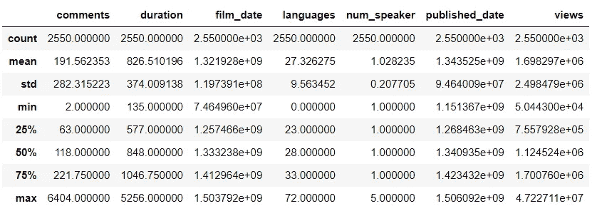

# 哪些谈话引发了最多的网上讨论？

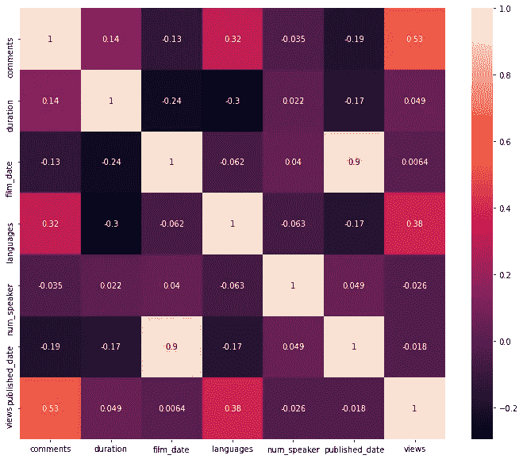

从热图来看，浏览量与语言和评论密切相关。

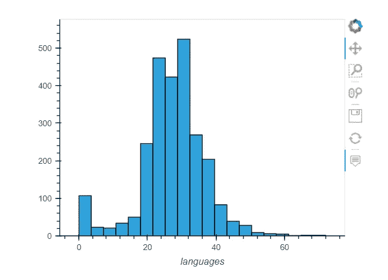

## 这种方法的局限性

1.  子注释(嵌套注释)。
2.  上线多久了？

要纠正这种行为，一个解决方案是按视图规范化注释。

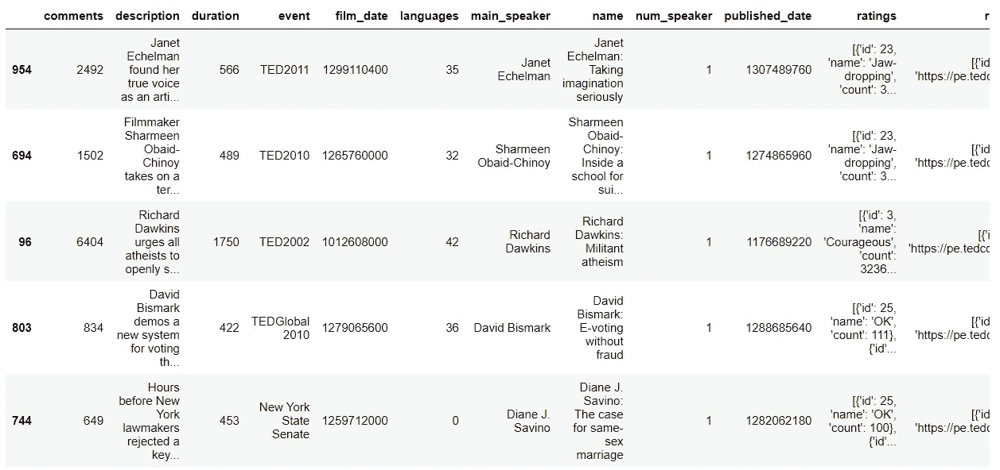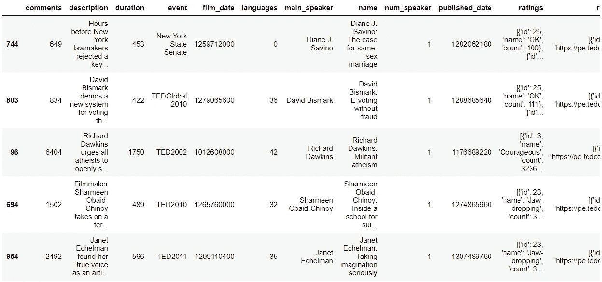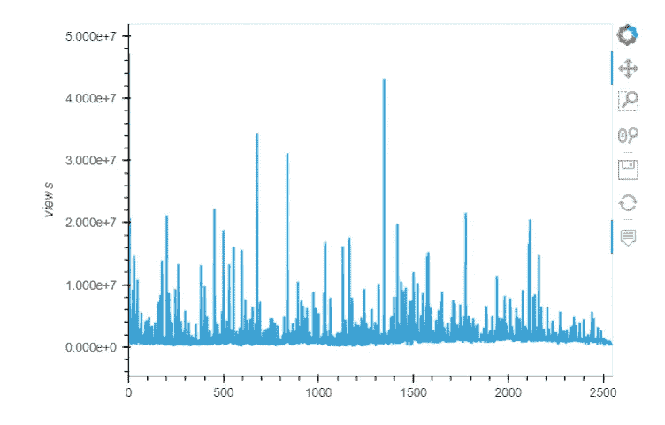

## 课程:

1.  分析数据时，考虑数据的局限性和偏差
2.  让你的结果易于理解

# 可视化评论的分布

线形图在这里并不合适(用它来衡量一段时间内的情况)

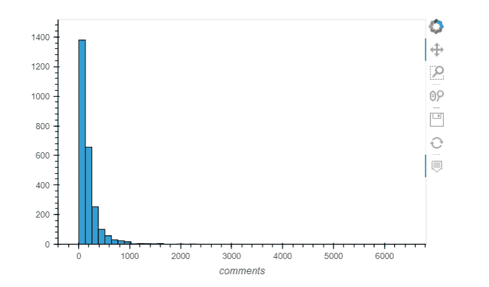

检查我们从图中删除了多少观察值:

```
(32, 19)
```

过滤数据后，我们只丢失少量数据。这个过程称为排除异常值。

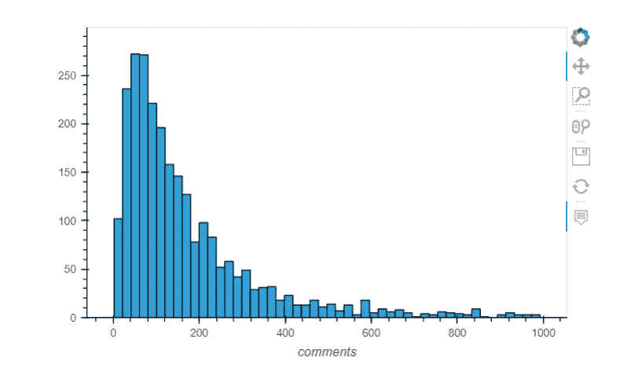

## 课程:

1.  根据您正在回答的问题和您正在处理的数据类型选择您的绘图类型
2.  使用熊猫一行程序快速遍历情节
3.  尝试修改绘图默认值
4.  创造情节涉及决策

# 画出每年举行的会谈次数

事件列并不总是包含年份

```
1280    TEDGlobal 2012
163            TED2005
1593    TEDGlobal 2013
2027     TEDWomen 2015
197            TED2008
1286        TEDxAustin
1115      TEDxBrussels
1381          TEDxCHUV
159            TED2007
193            TED2007
Name: event, dtype: object
```

我们不能依赖`event`特征，因为大多数事件没有年份:

```
0    1140825600
1    1140825600
2    1140739200
3    1140912000
4    1140566400
Name: film_date, dtype: int64
```

结果看起来不太对:

```
0   1970-01-01 00:00:01.140825600
1   1970-01-01 00:00:01.140825600
2   1970-01-01 00:00:01.140739200
3   1970-01-01 00:00:01.140912000
4   1970-01-01 00:00:01.140566400
Name: film_date, dtype: datetime64[ns]
```

现在结果看起来是正确的:

```
0   2006-02-25
1   2006-02-25
2   2006-02-24
3   2006-02-26
4   2006-02-22
Name: film_date, dtype: datetime64[ns]
```

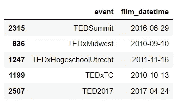

新列使用了`DateTime`数据类型(这是一个自动转换):

```
comments                       int64
description                   object
duration                       int64
event                         object
film_date                      int64
languages                      int64
main_speaker                  object
name                          object
num_speaker                    int64
published_date                 int64
ratings                       object
related_talks                 object
speaker_occupation            object
tags                          object
title                         object
url                           object
views                          int64
comments_per_view            float64
views_per_comment            float64
film_datetime         datetime64[ns]
dtype: object
```

`DateTime`列在`dt`名称空间下有方便的属性:

```
0    2006
1    2006
2    2006
3    2006
4    2006
Name: film_datetime, dtype: int64
```

使用`value_counts()`统计每年的会谈次数:

```
2013    270
2011    270
2010    267
2012    267
2016    246
2015    239
2014    237
2009    232
2007    114
2017     98
2008     84
2005     66
2006     50
2003     33
2004     33
2002     27
1998      6
2001      5
1984      1
1983      1
1991      1
1994      1
1990      1
1972      1
Name: film_datetime, dtype: int64
```

点是按照你给熊猫的顺序绘制和连接的:

需要在绘图前对索引进行排序:

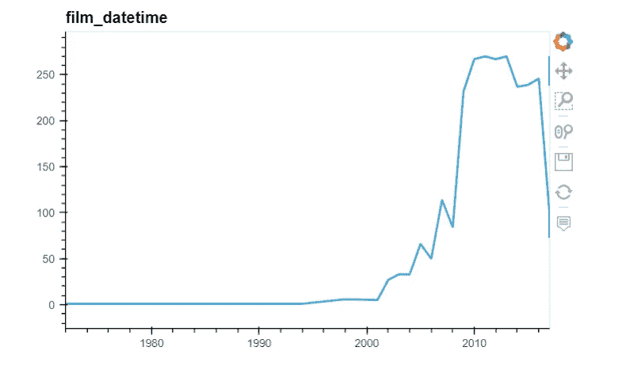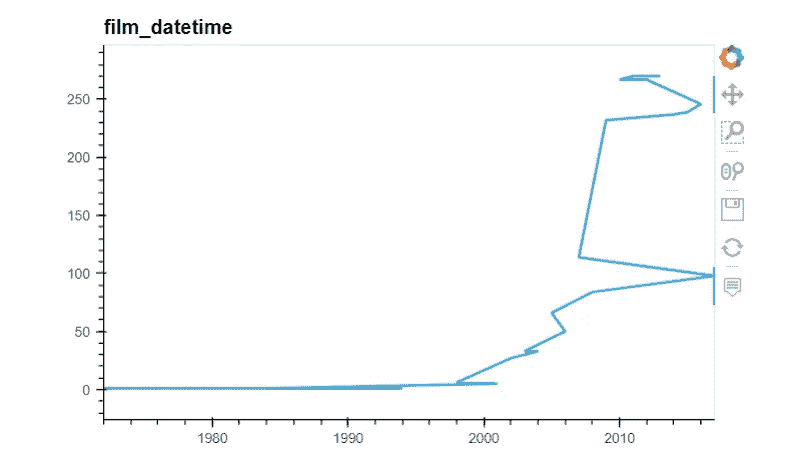

```
Timestamp('2017-08-27 00:00:00')
```

## 课程:

1.  阅读文档
2.  对日期和时间使用 DateTime 数据类型
3.  一边走一边检查你的工作
4.  考虑排除可能不相关的数据

# TED 历史上“最好”参加的活动是什么？

```
355
274
```

数一数会谈的次数(如果你重视多样性，这很好，但可能不是很好的会谈):

```
TED_2009    199
TED_2010    184
TED_2011    184
TED_2013    183
TED_2012    178
Name: event, dtype: int64
```

使用视图作为“谈话质量”的代理:

```
event
AORN Congress                  149818.0
Arbejdsglaede Live             971594.0
BBC TV                         521974.0
Bowery Poetry Club             676741.0
Business Innovation Factory    304086.0
Name: views, dtype: float64
```

找出最大值，但我们不知道平均有多少次谈话:

```
event
TEDxNorrkoping        6569493.0
TEDxCreativeCoast     8444981.0
TEDxBloomington       9484259.5
TEDxHouston          16140250.5
TEDxPuget Sound      34309432.0
Name: views, dtype: float64
```

显示会谈次数及其平均值(具有最高平均值的事件只有 1 或 2 次会谈):

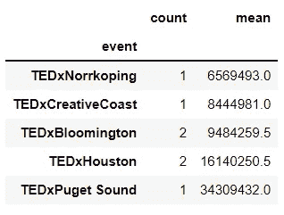

计算每个事件的总浏览量:

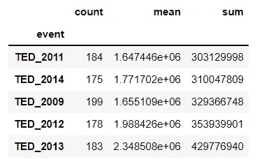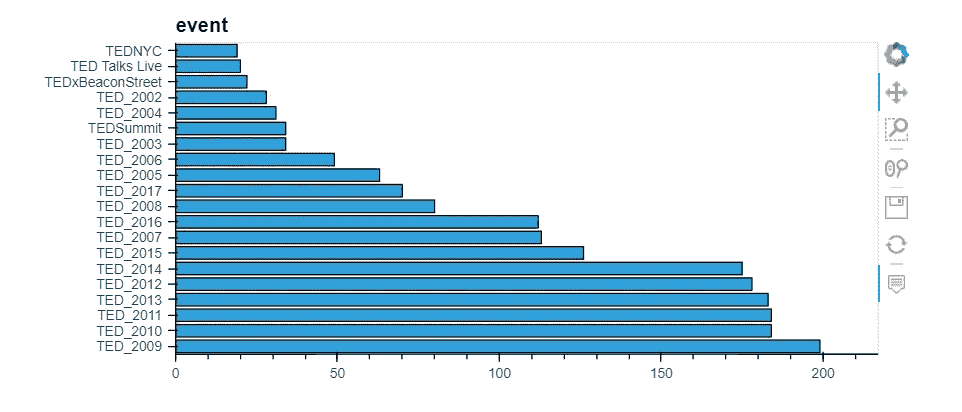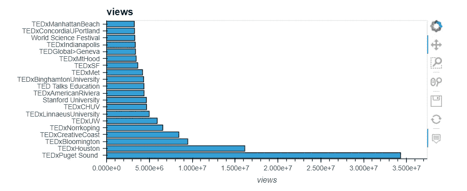

## 课程:

1.  创造性地思考如何利用你所掌握的数据来回答你的问题
2.  小心小样本

# 拆开评级数据

以前，用户可以在 TED 网站上给演讲贴标签(有趣的、鼓舞人心的、令人困惑的等等。)

```
0    [{'id': 7, 'name': 'Funny', 'count': 19645}, {...
1    [{'id': 7, 'name': 'Funny', 'count': 544}, {'i...
2    [{'id': 7, 'name': 'Funny', 'count': 964}, {'i...
3    [{'id': 3, 'name': 'Courageous', 'count': 760}...
4    [{'id': 9, 'name': 'Ingenious', 'count': 3202}...
Name: ratings, dtype: object
```

检查第一次谈话评分数据的两种方法:

```
"[{'id': 7, 'name': 'Funny', 'count': 19645}, {'id': 1, 'name': 'Beautiful', 'count': 4573}, {'id': 9, 'name': 'Ingenious', 'count': 6073}, {'id': 3, 'name': 'Courageous', 'count': 3253}, {'id': 11, 'name': 'Longwinded', 'count': 387}, {'id': 2, 'name': 'Confusing', 'count': 242}, {'id': 8, 'name': 'Informative', 'count': 7346}, {'id': 22, 'name': 'Fascinating', 'count': 10581}, {'id': 21, 'name': 'Unconvincing', 'count': 300}, {'id': 24, 'name': 'Persuasive', 'count': 10704}, {'id': 23, 'name': 'Jaw-dropping', 'count': 4439}, {'id': 25, 'name': 'OK', 'count': 1174}, {'id': 26, 'name': 'Obnoxious', 'count': 209}, {'id': 10, 'name': 'Inspiring', 'count': 24924}]"
```

```
str
```

使用 Python 的`ast`模块(抽象语法树)将其转换成有用的东西:

```
list[{'id': 7, 'name': 'Funny', 'count': 19645},
 {'id': 1, 'name': 'Beautiful', 'count': 4573},
 {'id': 9, 'name': 'Ingenious', 'count': 6073},
 {'id': 3, 'name': 'Courageous', 'count': 3253},
 {'id': 11, 'name': 'Longwinded', 'count': 387},
 {'id': 2, 'name': 'Confusing', 'count': 242},
 {'id': 8, 'name': 'Informative', 'count': 7346},
 {'id': 22, 'name': 'Fascinating', 'count': 10581},
 {'id': 21, 'name': 'Unconvincing', 'count': 300},
 {'id': 24, 'name': 'Persuasive', 'count': 10704},
 {'id': 23, 'name': 'Jaw-dropping', 'count': 4439},
 {'id': 25, 'name': 'OK', 'count': 1174},
 {'id': 26, 'name': 'Obnoxious', 'count': 209},
 {'id': 10, 'name': 'Inspiring', 'count': 24924}]list
```

定义一个函数，将评级系列中的元素从
字符串转换为列表:

测试功能:

```
[{'id': 7, 'name': 'Funny', 'count': 19645},
 {'id': 1, 'name': 'Beautiful', 'count': 4573},
 {'id': 9, 'name': 'Ingenious', 'count': 6073},
 {'id': 3, 'name': 'Courageous', 'count': 3253},
 {'id': 11, 'name': 'Longwinded', 'count': 387},
 {'id': 2, 'name': 'Confusing', 'count': 242},
 {'id': 8, 'name': 'Informative', 'count': 7346},
 {'id': 22, 'name': 'Fascinating', 'count': 10581},
 {'id': 21, 'name': 'Unconvincing', 'count': 300},
 {'id': 24, 'name': 'Persuasive', 'count': 10704},
 {'id': 23, 'name': 'Jaw-dropping', 'count': 4439},
 {'id': 25, 'name': 'OK', 'count': 1174},
 {'id': 26, 'name': 'Obnoxious', 'count': 209},
 {'id': 10, 'name': 'Inspiring', 'count': 24924}]
```

Series apply 方法将函数应用于序列中的每个元素，并返回一个序列:

```
0    [{'id': 7, 'name': 'Funny', 'count': 19645}, {...
1    [{'id': 7, 'name': 'Funny', 'count': 544}, {'i...
2    [{'id': 7, 'name': 'Funny', 'count': 964}, {'i...
3    [{'id': 3, 'name': 'Courageous', 'count': 760}...
4    [{'id': 9, 'name': 'Ingenious', 'count': 3202}...
Name: ratings, dtype: object
```

`lambda`是一个更简短的选择:

```
0    [{'id': 7, 'name': 'Funny', 'count': 19645}, {...
1    [{'id': 7, 'name': 'Funny', 'count': 544}, {'i...
2    [{'id': 7, 'name': 'Funny', 'count': 964}, {'i...
3    [{'id': 3, 'name': 'Courageous', 'count': 760}...
4    [{'id': 9, 'name': 'Ingenious', 'count': 3202}...
Name: ratings, dtype: object
```

一个更短的选择是直接应用函数(没有`lambda`):

```
0    [{'id': 7, 'name': 'Funny', 'count': 19645}, {...
1    [{'id': 7, 'name': 'Funny', 'count': 544}, {'i...
2    [{'id': 7, 'name': 'Funny', 'count': 964}, {'i...
3    [{'id': 3, 'name': 'Courageous', 'count': 760}...
4    [{'id': 9, 'name': 'Ingenious', 'count': 3202}...
Name: ratings, dtype: object
```

```
[{'id': 7, 'name': 'Funny', 'count': 19645},
 {'id': 1, 'name': 'Beautiful', 'count': 4573},
 {'id': 9, 'name': 'Ingenious', 'count': 6073},
 {'id': 3, 'name': 'Courageous', 'count': 3253},
 {'id': 11, 'name': 'Longwinded', 'count': 387},
 {'id': 2, 'name': 'Confusing', 'count': 242},
 {'id': 8, 'name': 'Informative', 'count': 7346},
 {'id': 22, 'name': 'Fascinating', 'count': 10581},
 {'id': 21, 'name': 'Unconvincing', 'count': 300},
 {'id': 24, 'name': 'Persuasive', 'count': 10704},
 {'id': 23, 'name': 'Jaw-dropping', 'count': 4439},
 {'id': 25, 'name': 'OK', 'count': 1174},
 {'id': 26, 'name': 'Obnoxious', 'count': 209},
 {'id': 10, 'name': 'Inspiring', 'count': 24924}]
```

```
listdtype('O')comments                       int64
description                   object
duration                       int64
event                         object
film_date                      int64
languages                      int64
main_speaker                  object
name                          object
num_speaker                    int64
published_date                 int64
ratings                       object
related_talks                 object
speaker_occupation            object
tags                          object
title                         object
url                           object
views                          int64
comments_per_view            float64
views_per_comment            float64
film_datetime         datetime64[ns]
ratings_list                  object
dtype: object
```

## 课程:

1.  注意熊猫中的数据类型
2.  必要时随时使用应用

# 计算每次谈话获得的评分总数

**奖励练习:**

*   对于每个谈话，计算负面评价的百分比
*   对于每个演讲，计算自发表以来每天收到的平均评分数

```
[{'id': 7, 'name': 'Funny', 'count': 19645},
 {'id': 1, 'name': 'Beautiful', 'count': 4573},
 {'id': 9, 'name': 'Ingenious', 'count': 6073},
 {'id': 3, 'name': 'Courageous', 'count': 3253},
 {'id': 11, 'name': 'Longwinded', 'count': 387},
 {'id': 2, 'name': 'Confusing', 'count': 242},
 {'id': 8, 'name': 'Informative', 'count': 7346},
 {'id': 22, 'name': 'Fascinating', 'count': 10581},
 {'id': 21, 'name': 'Unconvincing', 'count': 300},
 {'id': 24, 'name': 'Persuasive', 'count': 10704},
 {'id': 23, 'name': 'Jaw-dropping', 'count': 4439},
 {'id': 25, 'name': 'OK', 'count': 1174},
 {'id': 26, 'name': 'Obnoxious', 'count': 209},
 {'id': 10, 'name': 'Inspiring', 'count': 24924}]
```

```
{'id': 7, 'name': 'Funny', 'count': 19645}
```

```
19645
```

```
93850
```

```
[{'id': 7, 'name': 'Funny', 'count': 544},
 {'id': 3, 'name': 'Courageous', 'count': 139},
 {'id': 2, 'name': 'Confusing', 'count': 62},
 {'id': 1, 'name': 'Beautiful', 'count': 58},
 {'id': 21, 'name': 'Unconvincing', 'count': 258},
 {'id': 11, 'name': 'Longwinded', 'count': 113},
 {'id': 8, 'name': 'Informative', 'count': 443},
 {'id': 10, 'name': 'Inspiring', 'count': 413},
 {'id': 22, 'name': 'Fascinating', 'count': 132},
 {'id': 9, 'name': 'Ingenious', 'count': 56},
 {'id': 24, 'name': 'Persuasive', 'count': 268},
 {'id': 23, 'name': 'Jaw-dropping', 'count': 116},
 {'id': 26, 'name': 'Obnoxious', 'count': 131},
 {'id': 25, 'name': 'OK', 'count': 203}]
```

```
2936
```

```
0    93850
1     2936
2     2824
3     3728
4    25620
Name: ratings_list, dtype: int64
```

```
93850
```

```
0    93850
1     2936
2     2824
3     3728
4    25620
Name: ratings_list, dtype: int64
```

```
93850
```

```
0    93850
1     2936
2     2824
3     3728
4    25620
Name: ratings_list, dtype: int64
```

```
count     2550.000000
mean      2436.408235
std       4226.795631
min         68.000000
25%        870.750000
50%       1452.500000
75%       2506.750000
max      93850.000000
Name: num_ratings, dtype: float64
```

## 课程:

1.  将你的代码分成小块来写，边写边检查你的工作
2.  Lambda 最适合简单的函数

# 平均来说，哪些职业的 TED 演讲最有趣？

额外练习:

*   对于每一次谈话，计算最频繁的评级
*   对于每次谈话，清理职业数据，这样每次谈话只有一个职业

## 第一步:计算搞笑评分的数量

```
0    [{'id': 7, 'name': 'Funny', 'count': 19645}, {...
1    [{'id': 7, 'name': 'Funny', 'count': 544}, {'i...
2    [{'id': 7, 'name': 'Funny', 'count': 964}, {'i...
3    [{'id': 3, 'name': 'Courageous', 'count': 760}...
4    [{'id': 9, 'name': 'Ingenious', 'count': 3202}...
Name: ratings_list, dtype: object
```

```
True    2550
Name: ratings, dtype: int64
```

```
[{'id': 3, 'name': 'Courageous', 'count': 760},
 {'id': 1, 'name': 'Beautiful', 'count': 291},
 {'id': 2, 'name': 'Confusing', 'count': 32},
 {'id': 7, 'name': 'Funny', 'count': 59},
 {'id': 9, 'name': 'Ingenious', 'count': 105},
 {'id': 21, 'name': 'Unconvincing', 'count': 36},
 {'id': 11, 'name': 'Longwinded', 'count': 53},
 {'id': 8, 'name': 'Informative', 'count': 380},
 {'id': 10, 'name': 'Inspiring', 'count': 1070},
 {'id': 22, 'name': 'Fascinating', 'count': 132},
 {'id': 24, 'name': 'Persuasive', 'count': 460},
 {'id': 23, 'name': 'Jaw-dropping', 'count': 230},
 {'id': 26, 'name': 'Obnoxious', 'count': 35},
 {'id': 25, 'name': 'OK', 'count': 85}]
```

```
59
```

```
0    19645
1      544
2      964
3       59
4     1390
Name: funny_ratings, dtype: int64
```

```
0
```

## 第二步:计算搞笑评分的百分比

```
1849                       Science humorist
337                                Comedian
124     Performance poet, multimedia artist
315                                  Expert
1168             Social energy entrepreneur
1468                          Ornithologist
595                  Comedian, voice artist
1534                         Cartoon editor
97                                 Satirist
2297                          Actor, writer
568                                Comedian
675                          Data scientist
21                     Humorist, web artist
194                                Jugglers
2273                    Comedian and writer
2114                    Comedian and writer
173                                Investor
747                                Comedian
1398                               Comedian
685             Actor, comedian, playwright
Name: speaker_occupation, dtype: object
```

```
2549               Game designer
1612                   Biologist
612                     Sculptor
998               Penguin expert
593                     Engineer
284               Space activist
1041         Biomedical engineer
1618      Spinal cord researcher
2132    Computational geneticist
442                     Sculptor
426              Author, thinker
458                     Educator
2437      Environmental engineer
1491             Photojournalist
1893     Forensic anthropologist
783             Marine biologist
195                    Kenyan MP
772             HIV/AIDS fighter
788            Building activist
936                Neuroengineer
Name: speaker_occupation, dtype: object
```

## 第三步:按职业分析搞笑率

```
speaker_occupation
Comedian                       0.512457
Actor, writer                  0.515152
Actor, comedian, playwright    0.558107
Jugglers                       0.566828
Comedian and writer            0.602085
Name: funny_rate, dtype: float64
```

```
count       2550
unique      1458
top       Writer
freq          51
Name: speaker_occupation, dtype: object
```

## 第四步:关注数据中有代表性的职业

```
Writer                                51
Designer                              34
Artist                                34
Journalist                            33
Entrepreneur                          31
                                      ..
Neuroanatomist                         1
Foreign policy strategist              1
Mythologist                            1
Designer, illustrator, typographer     1
Computational geneticist               1
Name: speaker_occupation, Length: 1458, dtype: int64
```

```
pandas.core.series.Series
```

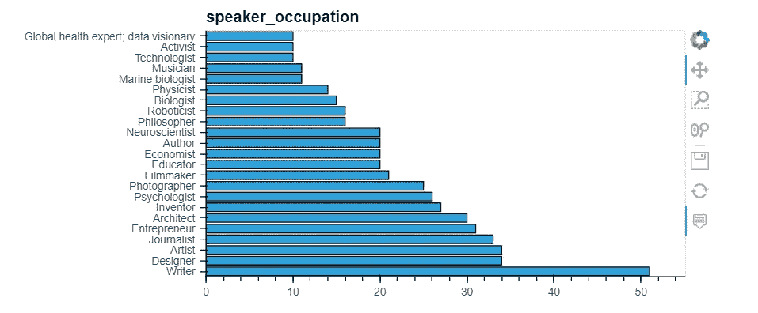

```
Index(['Writer', 'Designer', 'Artist', 'Journalist', 'Entrepreneur',
       'Architect', 'Inventor', 'Psychologist', 'Photographer', 'Filmmaker', 'Educator', 'Economist', 'Author', 'Neuroscientist', 'Philosopher', 'Roboticist', 'Biologist', 'Physicist', 'Marine biologist', 'Musician', 'Technologist', 'Activist', 'Global health expert; data visionary', 'Astronomer', 'Poet', 'Oceanographer', 'Graphic designer', 'Philanthropist', 'Singer/songwriter', 'Behavioral economist',
       'Historian', 'Social psychologist', 'Novelist', 'Futurist', 'Engineer',
       'Computer scientist', 'Astrophysicist', 'Mathematician', 'Comedian',
       'Photojournalist', 'Reporter', 'Evolutionary biologist',
       'Techno-illusionist', 'Writer, activist', 'Legal activist',
       'Social entrepreneur', 'Performance poet, multimedia artist',
       'Singer-songwriter', 'Climate advocate', 'Producer', 'Paleontologist',
       'Environmentalist, futurist', 'Science writer', 'Sound consultant',
       'Investor and advocate for moral leadership', 'Game designer',
       'Cartoonist', 'Tech visionary', 'Sculptor', 'Social Media Theorist',
       'Surgeon', 'Data scientist', 'Physician', 'Researcher', 'Chemist',
       'Musician, activist', 'Violinist', 'Chef'],
      dtype='object')
```

## 第五步:按职业重新分析搞笑率(仅限顶级职业)

```
(792, 24)
```

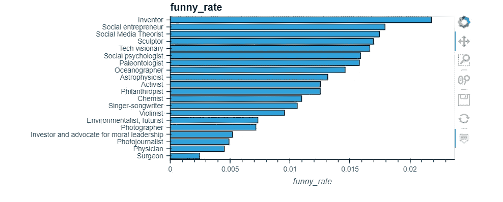

## 课程:

1.  检查您对数据的假设
2.  检查你的结果是否合理
3.  利用 pandas 操作经常输出数据帧或序列的事实
4.  小心小样本
5.  考虑丢失数据的影响
6.  数据科学家很搞笑

# 链接和资源:

*   链接到本教程使用的数据: [*TED 演讲*](https://www.kaggle.com/rounakbanik/ted-talks)
*   链接 [*完整笔记本*](https://www.kaggle.com/faressayah/data-science-best-practices-with-pandas-part-1)
*   第二部分: [*熊猫综合数据分析—第二部分*](https://medium.com/mlearning-ai/data-science-best-practices-with-pandas-part-ii-5394fb8b7e4d)
*   这篇博客跟随了来自`**Kevin Markham**`的`**PyCon 2019**`的演讲。PyCon: [全大会](https://www.youtube.com/watch?v=ZjrUmNq41Eo&t=3778s)。凯文·马卡姆 Youtube 频道:[数据学院](https://www.youtube.com/user/dataschool)