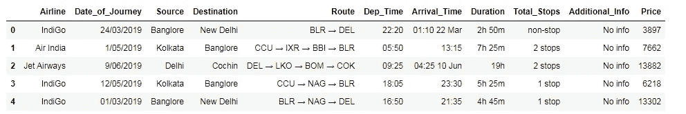
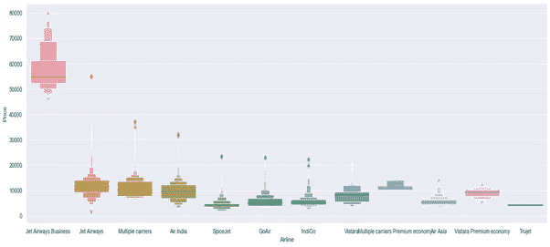
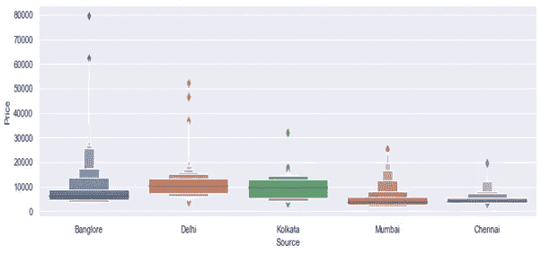
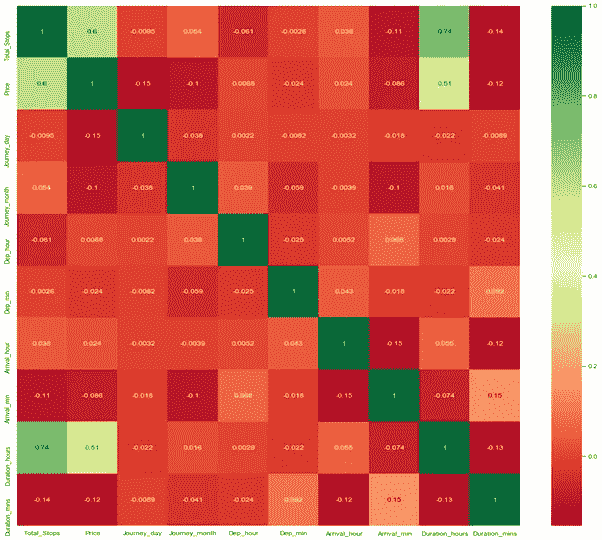
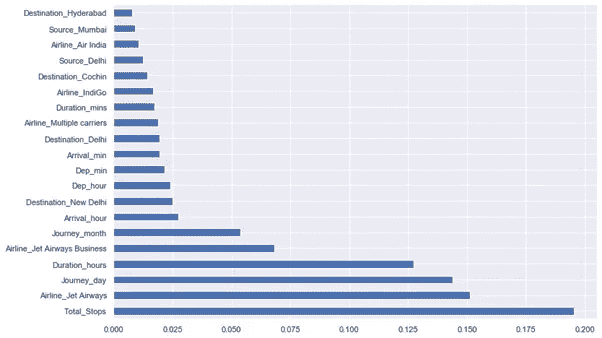
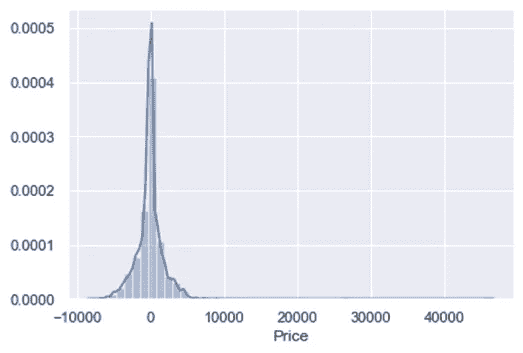
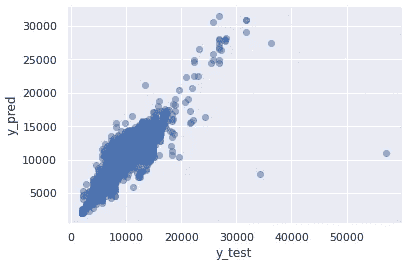

# Python 中随机森林的航班价格预测

> 原文：<https://pub.towardsai.net/data-analytics-425e3403bff7?source=collection_archive---------0----------------------->

## [数据分析](https://towardsai.net/p/category/data-analysis)

## 清理、EDA、特征选择和机器学习分类器


由[塞巴斯蒂安·格罗乔维奇](https://unsplash.com/@sebastiangrochowicz?utm_source=medium&utm_medium=referral)在 [Unsplash](https://unsplash.com?utm_source=medium&utm_medium=referral) 上拍摄的照片

在本文中，我们将考虑一些特征来预测航班的价格，如航空公司、来源、目的地、路线、旅行日期、总停留次数和一些其他信息。

以下是所用数据集的链接:[航班票价预测 MH | Kaggle](https://www.kaggle.com/nikhilmittal/flight-fare-prediction-mh/)

让我们从导入库开始:

```
import numpy as np
import pandas as pd
import matplotlib.pyplot as plt
import seaborn as snssns.set()
```

**导入数据集:**

1.使用 pandas.read_excel 读取数据，因为数据是 excel 格式的。

2.检查所有与数据相关的信息，即空值的数量。

3.如果存在空值，则可以执行以下操作，

*   在 sklearn 中使用插补方法输入数据
*   fillna()方法用于用中心值(即平均值、中值和众数)填充 nan 值。

4.现在使用 data.describe()描述数据。

```
train_data = pd.read_excel("Data_Train.xlsx")pd.set_option(‘display.max_columns’, None)
train_data.head()
```



飞行数据。作者的照片

检查数据信息

```
train_data.info()#output:
<class 'pandas.core.frame.DataFrame'>
RangeIndex: 10683 entries, 0 to 10682
Data columns (total 11 columns):#   Column           Non-Null Count  Dtype
---  ------           --------------  -----
0   Airline          10683 non-null  object
1   Date_of_Journey  10683 non-null  object
2   Source           10683 non-null  object
3   Destination      10683 non-null  object
4   Route            10682 non-null  object
5   Dep_Time         10683 non-null  object
6   Arrival_Time     10683 non-null  object
7   Duration         10683 non-null  object
8   Total_Stops      10682 non-null  object
9   Additional_Info  10683 non-null  object
10  Price            10683 non-null  int64dtypes: int64(1), object(10)
memory usage: 918.2+ KB
```

检查持续时间的频率:

```
train_data[“Duration”].value_counts()#Output:
2h 50m    550
1h 30m    386
2h 45m    337
2h 55m    337
2h 35m    329
    …
42h 5m     1
28h 30m    1
36h 25m    1
40h 20m    1
30h 25m    1Name: Duration, Length: 368, dtype: int64train_data.dropna(inplace = True)
```

查找数据中存在的空值总数:

```
train_data.isnull().sum()Airline            0
Date_of_Journey    0
Source             0
Destination        0
Route              0
Dep_Time           0
Arrival_Time       0
Duration           0
Total_Stops        0
Additional_Info    0
Price              0dtype: int64
```

[](/bitcoin-price-prediction-with-rnn-and-lstm-in-python-f912d57c483e) [## 用 Python 实现 RNN 和 LSTM 的比特币价格预测

### 使用深度学习预测比特币价格

pub.towardsai.net](/bitcoin-price-prediction-with-rnn-and-lstm-in-python-f912d57c483e) 

## **探索性数据分析**

这是一种通过总结数据的主要特征来分析数据的方法。

从信息来看， ***行程日期*** 特征是一个对象类型。为了在特性中使用这个列，我们必须将它转换成预测的时间戳。

我们需要 pandas 函数 ***to_datetime*** 将对象数据类型转换为时间戳类型。

*   分别用 ***.dt.day*** 和 ***.dt.month*** 方法从日期中提取日和月。

```
train_data[“Journey_day”] = pd.to_datetime(train_data.Date_of_Journey, format=”**%d**/%m/%Y”).dt.daytrain_data[“Journey_month”] =
     pd.to_datetime(train_data[“Date_of_Journey”], format = “**%d**/%m
     /%Y”).dt.month
```

我们可以在转换为整数后删除 date_of_journey 列。

```
train_data.drop(["Date_of_Journey"], axis = 1, inplace = True)
```

当一架飞机离开登机口时，称为起飞时间。现在从 ***Dep_Time*** 中提取值，方法与***Date _ of _ Journey***相同。

```
#Extracting Hours
train_data[“Dep_hour”] =
          pd.to_datetime(train_data[“Dep_Time”]).dt.hour#Extracting Minutes
train_data[“Dep_min”] =
        pd.to_datetime(train_data[“Dep_Time”]).dt.minute#Dropping the extra column features like Dep_Time
train_data.drop([“Dep_Time”], axis = 1, inplace = **True**)
```

当飞机停在登机口时，那就是到达时间。现在，我们将从 ***到达时间中提取 ***旅程日期*** 。***

```
#Extracting Hours
train_data[“Arrival_hour”] = 
           pd.to_datetime(train_data.Arrival_Time).dt.hour#Extracting Minutestrain_data[“Arrival_min”] =
         pd.to_datetime(train_data.Arrival_Time).dt.minute#Now we can drop Arrival_Time as it is of no usetrain_data.drop([“Arrival_Time”], axis = 1, inplace = True)
```

出发时间和到达时间之间的差别是飞机到达目的地所需的时间。现在，duration 列将被赋值并转换为一个列表。

```
duration = list(train_data["Duration"])**for** i **in** range(len(duration)):
    *#Check if duration contains only hour or mins*    
    **if** len(duration[i].split()) != 2:
        **if** "h" **in** duration[i]:
            *# Adds 0 minute
*            duration[i] = duration[i].strip() + " 0m"   
        **else**:
            *# Adds 0 hour* duration[i] = "0h " + duration[i] duration_hours = []
duration_mins = []**for** i **in** range(len(duration)):
    #*Extract hours from duration* duration_hours.append(int(duration[i].split(sep = "h")[0])) *#Adding duration_hours and duration_mins list to train_data
    #dataframe* duration_mins.append(int(duration[i].split(sep = "m")[0].split()
                                                             [-1])) train_data["Duration_hours"] = duration_hours
train_data["Duration_mins"] = duration_mins*#Extracts only minutes from duration* train_data.drop(["Duration"], axis = 1, inplace = **True**)
```

## **处理分类数据**

有许多方法可以处理分类数据。一些分类数据如下。

1.  **名义数据** —没有任何顺序的数据:在这种情况下使用 OneHotEncoder。
2.  **顺序数据** —按顺序排列的数据:在这种情况下使用 LabelEncoder。

```
train_data["Airline"].value_counts()#output:
Jet Airways                          3849
IndiGo                               2053
Air India                            1751
Multiple carriers                    1196
SpiceJet                              818
Vistara                               479
Air Asia                              319
GoAir                                 194
Multiple carriers Premium economy      13
Jet Airways Business                    6
Vistara Premium economy                 3
Trujet                                  1Name: Airline, dtype: int64
```

从图上我们可以很容易地观察到 jet_Airways_Business 的价格最高。除了第一家航空公司之外，所有列功能都具有相同的介质。

```
#Airline vs Pricesns.catplot(y = "Price", x = "Airline", data =
          train_data.sort_values("Price", ascending = False),
                                 kind="boxen",
                                 aspect = 4, height = 8)
plt.show()
```



作者的照片

由于航空公司是名义上的分类数据，我们将执行一次热编码。

```
Airline = train_data[["Airline"]]
Airline = pd.get_dummies(Airline, drop_first= True)
train_data["Source"].value_counts()#output:
Delhi       4536
Kolkata     2871
Banglore    2197
Mumbai       697
Chennai      381Name: Source, dtype: int64#Source vs Pricesns.catplot(y = "Price", x = "Source", 
          data = train_data.sort_values("Price", ascending = False),
          kind="boxen", height = 4, aspect = 3)plt.show()
```



作者的照片

由于源是名义分类数据，我们将执行一次热编码。

```
Source = train_data[["Source"]]
Source = pd.get_dummies(Source, drop_first= Truetrain_data["Destination"].value_counts()#output:
Cochin       4536
Bangalore    2871
Delhi        1265
New Delhi     932
Hyderabad     697
Kolkata       381Name: Destination, dtype: int64
```

由于目标是名义分类数据，我们将执行一次热编码。

```
Destination = train_data[["Destination"]]
Destination = pd.get_dummies(Destination, drop_first = **True**)
train_data["Route"]#output:
0                    BLR → DEL
1        CCU → IXR → BBI → BLR
2        DEL → LKO → BOM → COK
3              CCU → NAG → BLR
4              BLR → NAG → DEL
             ...
10678                CCU → BLR
10679                CCU → BLR
10680                BLR → DEL
10681                BLR → DEL
10682    DEL → GOI → BOM → COKName: Route, Length: 10682, dtype: object
```

附加信息包含几乎 80%的无信息。我们可以看到 ***路线*** 和 ***Total_Stops*** 列之间是有关联的，所以去掉其中一个。

```
train_data.drop(["Route", "Additional_Info"],axis=1, inplace = True)
```

我们将对分配有相应键的值进行标签编码。

```
train_data.replace({"non-stop": 0, "1 stop": 1, "2 stops": 2, 
                    "3 stops": 3, "4 stops": 4}, inplace = True)
```

连接数据帧→列车数据+航空公司+来源+目的地

```
data_train = pd.concat([train_data, Airline, Source, Destination], axis = 1)data_train.drop(["Airline", "Source", "Destination"], axis = 1, inplace = **True**)data_train.shape#output:
(10682, 30)
```

现在，我们将使用**测试集**数据进行计算。

```
test_data = pd.read_excel("Test_set.xlsx")*#*Preprocessingprint("Test data Info")
print("-"*75)
print(test_data.info())print()
print() print("Null values :")
print("-"*75)test_data.dropna(inplace = **True**)print(test_data.isnull().sum())#EDA
#Date_of_Journeytest_data["Journey_day"] = pd.to_datetime(test_data.Date_of_Journey, 
                                          format="**%d**/%m/%Y").dt.daytest_data["Journey_month"]=
                       pd.to_datetime(test_data["Date_of_Journey"], 
                                      format = "**%d**/%m/%Y").dt.monthtest_data.drop(["Date_of_Journey"], axis = 1, inplace = **True**)#Dep_Timetest_data["Dep_hour"]= pd.to_datetime(test_data["Dep_Time"]).dt.hourtest_data["Dep_min"]=pd.to_datetime(test_data["Dep_Time"]).dt.minutetest_data.drop(["Dep_Time"], axis = 1, inplace = **True**)#Arrival_Timetest_data["Arrival_hour"]=
                pd.to_datetime(test_data.Arrival_Time).dt.hourtest_data["Arrival_min"]=
                pd.to_datetime(test_data.Arrival_Time).dt.minutetest_data.drop(["Arrival_Time"], axis = 1, inplace = **True**)#Durationduration = list(test_data["Duration"])**for** i **in** range(len(duration)):
    # This condition will the check the hours or minutes in duration
    # column **if** len(duration[i].split()) != 2:    
        **if** "h" **in** duration[i]:
            # Adds 0 minuteduration[i] = duration[i].strip() + " 0m"   
        **else**:
            # Adds 0 hour
            duration[i] = "0h " + duration[i] duration_hours = []
duration_mins = []**for** i **in** range(len(duration)):
    # Extract hours from duration
    duration_hours.append(int(duration[i].split(sep = "h")[0]))

    *# Extracts only minutes from duration*   
    duration_mins.append(int(duration[i].split(sep = "m")[0].split()
                                                             [-1]))
# Adding Duration column to test settest_data["Duration_hours"] = duration_hours
test_data["Duration_mins"] = duration_mins
test_data.drop(["Duration"], axis = 1, inplace = **True**)# Categorical dataprint("Airline")
print("-"*75)
print(test_data["Airline"].value_counts())Airline = pd.get_dummies(test_data["Airline"], drop_first= **True**)print()
print("Source")
print("-"*75)
print(test_data["Source"].value_counts())Source = pd.get_dummies(test_data["Source"], drop_first= **True**)print()
print("Destination")
print("-"*75)
print(test_data["Destination"].value_counts())Destination = pd.get_dummies(test_data["Destination"], drop_first = **True**)# Additional_Info contains almost 80% no_info
# We can see that there is correlation between ***Route*** and ***Total_Stops* **  columns, so drop one of them.test_data.drop(["Route", "Additional_Info"], axis= 1, inplace= **True**)# Replacing Total_Stopstest_data.replace({"non-stop": 0, "1 stop": 1, "2 stops": 2, "3 stops": 3, "4 stops": 4}, inplace = **True**)#Concatenate dataframe--> test_data + Airline + Source + Destinationdata_test = pd.concat([test_data, Airline, Source, Destination]
                      , axis = 1)data_test.drop(["Airline", "Source", "Destination"], axis = 1,
                 inplace = **True**)print()
print()
print("Shape of test data : ", data_test.shape)
```

[](/machine-learning-16c8ccc2c7b8) [## 无监督学习中不同类型的聚类方法

pub.towardsai.net](/machine-learning-16c8ccc2c7b8) 

## **功能选择**

找出有助于目标变量并与目标变量有良好关系的最佳特征。以下是一些特征选择方法。

1.  热图
2.  特征重要性
3.  选择最佳

```
data_train.shape#output:
(10682, 30)X = data_train.loc[:, ['Total_Stops','Journey_day','Journey_month',
               'Dep_hour', 'Dep_min', 'Arrival_hour', 'Arrival_min',
             'Duration_hours', 'Duration_mins', 'Airline_Air India',
             'Airline_GoAir','Airline_IndiGo','Airline_Jet Airways', 
         'Airline_Jet Airways Business','Airline_Multiple carriers',
             'Airline_Multiple carriers Premium economy', 
             'Airline_SpiceJet','Airline_Trujet', 'Airline_Vistara',
             'Airline_Vistara Premium economy','Source_Chennai',
             'Source_Delhi', 'Source_Kolkata', 'Source_Mumbai',
             'Destination_Cochin', 'Destination_Delhi',
             'Destination_Hyderabad','Destination_Kolkata',
             'Destination_New Delhi']
```

查找独立属性和从属属性之间的相关性

```
plt.figure(figsize = (18,18))
sns.heatmap(train_data.corr(), annot = **True**, cmap = “RdYlGn”)plt.show()
```



要素的热点图。作者的照片

## **使用 ExtraTreesRegressor 分类器的重要特性**

```
from sklearn.ensemble import ExtraTreesRegressorselection = ExtraTreesRegressor()selection.fit(X, y)#output:
ExtraTreesRegressor(bootstrap=False, ccp_alpha=0.0, criterion=’mse’,
           max_depth=None, max_features=’auto’, max_leaf_nodes=None,
           max_samples=None, min_impurity_decrease=0.0,
           min_impurity_split=None, min_samples_leaf=1,
           min_samples_split=2, min_weight_fraction_leaf=0.0,
           n_estimators=100, n_jobs=None, oob_score=False,
           random_state=None, verbose=0, warm_start=False)
```

我们将绘制图表，从数据中获得重要的见解。

```
plt.figure(figsize = (12,8))feat_importances = pd.Series(selection.feature_importances_,
                             index=X.columns)feat_importances.nlargest(20).plot(kind=’barh’)plt.show()
```



作者的照片

[](/understand-and-building-n-gram-model-in-nlp-with-python-addddbdb71fc) [## 用 Python 理解和构建自然语言处理中 N 元语法模型

### 自然语言处理中的文本建模技术

pub.towardsai.net](/understand-and-building-n-gram-model-in-nlp-with-python-addddbdb71fc) 

## **使用随机森林拟合模型**

1.  数据集现在被分成训练集和测试集。
2.  如果需要，对数据进行缩放

*   在随机林中不进行缩放

3.导入模型

4.符合数据

5.预测 w.r.t X _ test 测试

6.在回归检查 RSME 分数

7.绘图图表

```
**from** **sklearn.model_selection** **import** train_test_splittrain_x, text_x, train_y, test_y= train_test_split(X, y, test_size
                                     = 0.2, random_state = 42)**from** **sklearn.ensemble** **import** RandomForestRegressor
reg_rf = RandomForestRegressor()
reg_rf.fit(train_x, train_y)y_pred = reg_rf.predict(X_test)
reg_rf.score(train_x, train_y)#output:
0.9539164511170628reg_rf.score(test_x, test_y)#output:
0.798383043987616sns.distplot(test_y-pred_y)
plt.show()
```



作者的照片

绘制散点图

```
plt.scatter(test_y, pred_y, alpha = 0.5)
plt.xlabel("test_y")
plt.ylabel("pred_y")
plt.show()
```



作者的照片

```
**from** **sklearn** **import** metricsprint('MAE:', metrics.mean_absolute_error(test_y, pred_y))
print('MSE:', metrics.mean_squared_error(test_y, pred_y))
print('RMSE:', np.sqrt(metrics.mean_squared_error(test_y, pred_y)))#output:
MAE: 1172.5455945373583
MSE: 4347276.1614450775
RMSE: 2085.0122688955757metrics.r2_score(test_y, pred_y)#output:
0.7983830439876158
```

因此，最终的 r2 分数约为 80 分，相当不错。

## 结论

我们在这个项目中采用了很多技术。我们看到了当我们拥有大量特性时，如何执行探索性数据分析和特性选择。

我希望你喜欢这篇文章。通过我的 [LinkedIn](https://www.linkedin.com/in/data-scientist-95040a1ab/) 和 [twitter](https://twitter.com/amitprius) 联系我。

# 推荐文章

[1。NLP —零到英雄用 Python](https://medium.com/towards-artificial-intelligence/nlp-zero-to-hero-with-python-2df6fcebff6e?sk=2231d868766e96b13d1e9d7db6064df1)
2。 [Python 数据结构数据类型和对象](https://medium.com/towards-artificial-intelligence/python-data-structures-data-types-and-objects-244d0a86c3cf?sk=42f4b462499f3fc3a160b21e2c94dba6)
3。[Python 中的异常处理概念](/exception-handling-concepts-in-python-4d5116decac3?source=friends_link&sk=a0ed49d9fdeaa67925eac34ecb55ea30)
4。[为什么 LSTM 在深度学习方面比 RNN 更有用？](/deep-learning-88e218b74a14?source=friends_link&sk=540bf9088d31859d50dbddab7524ba35)
5。[神经网络:递归神经网络的兴起](/neural-networks-the-rise-of-recurrent-neural-networks-df740252da88?source=friends_link&sk=6844935e3de14e478ce00f0b22e419eb)
6。[用 Python 充分解释了线性回归](https://medium.com/towards-artificial-intelligence/fully-explained-linear-regression-with-python-fe2b313f32f3?source=friends_link&sk=53c91a2a51347ec2d93f8222c0e06402)
7。[用 Python](https://medium.com/towards-artificial-intelligence/fully-explained-logistic-regression-with-python-f4a16413ddcd?source=friends_link&sk=528181f15a44e48ea38fdd9579241a78)
充分解释了 Logistic 回归 8。[concat()、merge()和 join()与 Python](/differences-between-concat-merge-and-join-with-python-1a6541abc08d?source=friends_link&sk=3b37b694fb90db16275059ea752fc16a)
9 的区别。[与 Python 的数据角力—第一部分](/data-wrangling-with-python-part-1-969e3cc81d69?source=friends_link&sk=9c3649cf20f31a5c9ead51c50c89ba0b)10。[机器学习中的混淆矩阵](https://medium.com/analytics-vidhya/confusion-matrix-in-machine-learning-91b6e2b3f9af?source=friends_link&sk=11c6531da0bab7b504d518d02746d4cc)