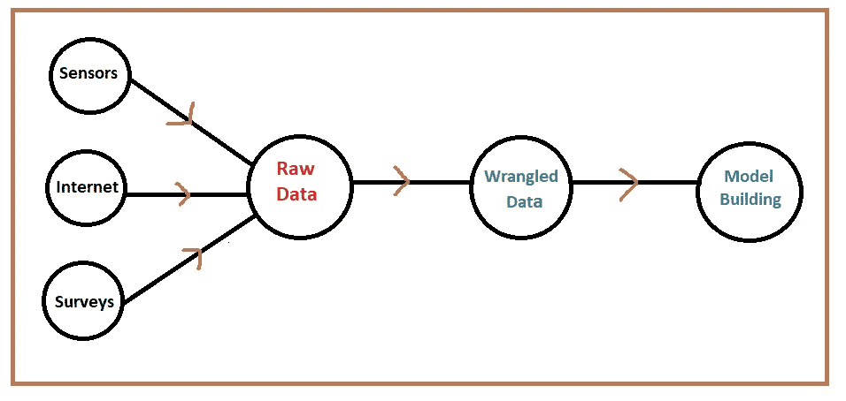
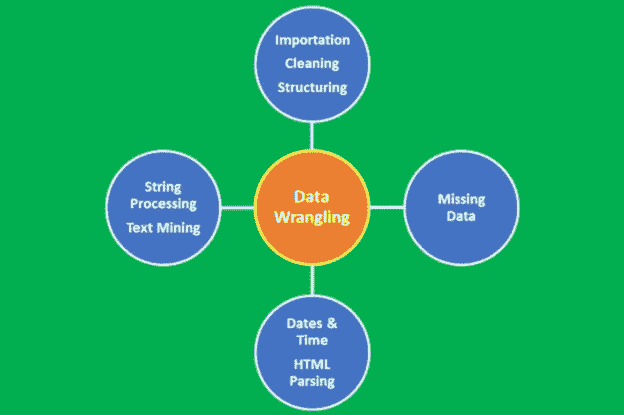
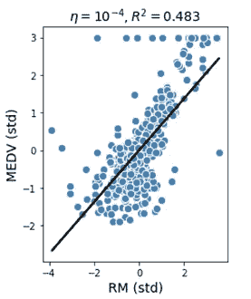
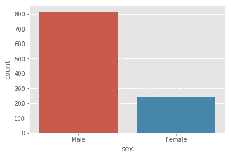
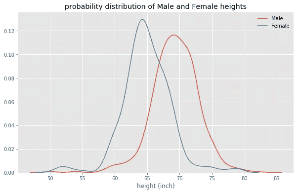

# 数据基础教程

> 原文：<https://pub.towardsai.net/data-basics-tutorial-3a5c15ff1692?source=collection_archive---------4----------------------->

## [数据科学](https://towardsai.net/p/category/data-science)

## 学习数据的基本原理，包括数据来源、实验设计、数据争论、数据缺陷和数据预处理



Benjamin O. Tayo 的图片

J 顾名思义，数据科学是一门将科学方法应用于数据的科学，其目标是研究不同特征之间的关系，并基于这些关系得出有意义的结论。因此，数据是数据科学的关键组成部分。数据集是在任何给定时间用于分析或建模的特定数据实例。数据集有不同的类型，如数字数据、分类数据、文本数据、图像数据、语音数据和视频数据。数据集可以是静态的(不变)或动态的(随时间变化，例如股票价格)。此外，数据集也可能依赖于空间。例如，美国的温度数据与非洲的温度数据会有很大不同。对于刚开始的数据科学项目，最流行的数据集类型是包含数字数据的数据集，通常以逗号分隔值(CSV)文件格式存储。

模型的预测能力取决于构建模型时所用数据的质量。因此，在使用数据进行分析之前，检查数据来源的可靠性极其重要。

**高质量数据的优势**

a)高质量的数据不太可能产生错误。

b)高质量的数据可以导致较低的泛化误差，即一个模型很容易捕捉真实生活的影响，并可以应用于预测目的的看不见的数据。

c)由于较小的不确定性，高质量的数据将产生可靠的结果，即数据捕捉真实的效果并且具有较小的随机噪声。

d)包含大量观测值的高质量数据会减少方差误差(方差误差根据**中心极限定理**随样本量减少)。

我们将在本文中涉及的主题如下:

*   了解可用于数据科学项目的各种数据源
*   当数据不可用时，如何设计实验来收集数据或模拟数据
*   数据争论，将数据从原始形式转换为整齐形式以备分析的过程
*   数据中的缺陷
*   预处理数据

# **1。开放数据来源**

数据科学是一个非常实用的领域，你可以在实践中学习。提高你在数据科学和机器学习方面的技能的最好方法是继续从事几个数据科学项目。有时，找到合适的数据集用于您的项目可能会很有挑战性。令人欣慰的是，有如此多的免费资源可供使用，您可以从中获得干净、结构化的数据集，以便进行分析和建模。本节将讨论可用于分析和建模的各种免费开放数据来源。

如果你对可以用来练习数据科学和机器学习技能的开放和免费数据集感兴趣，这里有一些开放资源:

## **1.1 R 数据集包**

[R 数据集包](https://stat.ethz.ch/R-manual/R-devel/library/datasets/html/00Index.html)包含各种数据集。有关完整列表，请使用

```
library(help = “datasets”)
```

例如，**女性**是属于包含女性身高和体重的数据集包的数据集，可以通过以下方式访问:

```
data(“women”)head(women)
```

**1.2 R Dslabs 包**

R [**dslabs**](https://www.rdocumentation.org/packages/dslabs/versions/0.7.1) 包包含数据集和函数，可用于数据科学课程和研讨会中的数据分析练习、作业和项目。二十六(26)个数据集可用于数据可视化、统计推断、建模、线性回归、数据争论和机器学习方面的案例研究。

可以按如下方式安装和访问 dslabs 软件包:

```
install.packages(“dslabs”)library(“dslabs”)data(package =’dslabs’)
```

例如，[***heights***](https://github.com/bot13956/Bayes_theorem)数据集包含在 R 的 dslabs 包中，可以使用 R Studio 中的以下代码将其转换为逗号分隔值(CSV)文件格式:

```
install.packages(‘dslabs’)library(dslabs)write.csv(heights, “heights.csv”, row.names = F)
```

## **1.3 Python Sklearn 数据集**

[Python sklearn 数据集](https://scikit-learn.org/stable/datasets/index.html#toy-datasets)附带了一些标准数据集，例如用于分类的[虹膜](https://en.wikipedia.org/wiki/Iris_flower_data_set)和[数字](https://archive.ics.uci.edu/ml/datasets/Pen-Based+Recognition+of+Handwritten+Digits)数据集以及用于回归的[波士顿房价数据集](https://archive.ics.uci.edu/ml/machine-learning-databases/housing/)。

Sklearn 数据集的访问方式如下:

```
from sklearn import datasetsiris = datasets.load_iris()digits = datasets.load_digits()boston = datasets.load_boston()
```

## **1.4 加州大学欧文分校(UCI)机器学习知识库**

UCI 目前维护着 487 个[数据集](https://archive.ics.uci.edu/ml/datasets.php)作为对机器学习社区的服务，可用于数据科学课程和研讨会中的数据分析实践、作业和项目。

## **1.5 Kaggle 数据集**

Kaggle 数据集也包含了许多非常具有挑战性的数据科学和机器学习项目的数据集。

## **1.6 来自互联网的数据**

有时你可以从网站上抓取数据，但是需要做大量的工作来清理、组织和重塑数据。然而，一些网站包含的数据格式清晰且结构化。非结构化数据的一个例子是大学城数据集的列表，它可以从[维基百科](https://en.wikipedia.org/wiki/List_of_college_towns#College_towns_in_the_United_States)中抓取。然后可以将抓取的数据整理并保存为文本文件以供进一步分析: [**数据整理教程:大学城数据集**](https://medium.com/towards-artificial-intelligence/tutorial-on-data-wrangling-college-towns-dataset-a0e8f8dfb6ae) 。互联网数据的另一个优势是它可以实时收集，例如股票数据或新冠肺炎数据。这种类型的数据非常适合于时间序列分析和预测。

Python 和 R 程序提供了一些资源，如果您知道文件的 URL，就可以从 CSV 文件导入数据。

***(i)使用 Python 和文件的 URL*** 导入 CSV 文件

```
import pandas as pddf = pd.read_csv(‘https://archive.ics.uci.edu/ml/machinelearning-databases/breast-cancer-wisconsin/wdbc.data',header=None)
```

***(二)使用 R 和文件的 URL*** 导入 CSV 文件

*   **download.file()函数**

此功能将下载一个 CSV 文件，并将其另存为一个新文件:

```
download.file(“[https://raw.githubusercontent.com/bot13956/datasets/master/introduction_to_physics_grades.csv](https://raw.githubusercontent.com/bot13956/datasets/master/introduction_to_physics_grades.csv)", “grades.csv”)
```

*   **read.csv()函数**

此函数将下载文件并将其保存为数据框:

```
data<-read.csv(“[https://raw.githubusercontent.com/bot13956/datasets/master/introduction_to_physics_grades.csv](https://raw.githubusercontent.com/bot13956/datasets/master/introduction_to_physics_grades.csv)")
```

***(三)从 pdf 文件中提取数据***

除了 CSV 文件格式，还可以从 pdf 文件中提取互联网数据: [**使用 Python 从 PDF 文件中提取数据，R**](https://medium.com/towards-artificial-intelligence/extracting-data-from-pdf-file-using-python-and-r-4ed8826bc5a1) 。

# **2。当数据不可用时**

在第 1 节中，我们一直假设我们已经有了数据，或者我们假设我们想要的任何数据都可以很容易地收集到，例如，如果我们想使用一个人的 twitter 或脸书订阅源的内容来预测这个人关注某个音乐家的可能性，那么在需要时可以从 Twitter 或脸书订阅源获得数据。

有时我们没有数据，获取完整的数据集要么是不可能的，要么会花费太长时间。如果是这种情况，那么我们需要设计一种收集最佳数据子集的方法，这种方法可以快速、经济地获得。在这种情况下，我们需要确保收集的数据足以回答我们需要的问题。以下是一些获取非公开免费数据的方法:

## **2.1 从组织或公司购买原始数据**

这种方法成本高。但它节省了时间，因为有时从公司或组织购买的数据可能已经是结构化格式，可以直接用于分析，而无需清理和重新整理数据。

## **2.2 调查数据**

这种方法涉及成本，因为设计和实施调查需要资金。此外，从调查中收集的数据可能包含大量缺失数据或格式不正确的数据，例如，有人可能将自己的年龄输入为“28”，而不是 28，因此需要做大量工作来预处理、组织、清理和调整从调查中收集的数据。

## **2.3 实验设计**

数据在数据科学和机器学习中起着核心作用。最常见的情况是，我们假设用于分析或建模的数据是现成的和免费的。有时，我们可能没有数据，获取完整的数据集要么是不可能的，要么需要太长时间来收集。在这种情况下，我们需要设计一种方法来尝试收集我们可以快速有效地获得的数据的最佳子集。设计一个实验来收集数据的过程称为 ***实验设计*** 。实验设计的一些例子包括调查和临床试验。

**设计数据收集实验时需要牢记的因素**

***(一)*** ***时间***

我们需要确保实验可以在合理的时间内设计和实施。例如，假设某个组织的客户服务部门正在经历呼叫数量的指数级增长。组织可以设计员工和客户都可以参与的调查。这必须以迅速和及时的方式完成，以便可以分析收集的数据并将其用于数据驱动的决策，从而帮助改善客户体验。如果没有及时执行实验设计和数据分析，可能会对销售和利润产生负面影响。

***(二)*** ***数据量***

在设计实验时，我们需要确保从实验中收集的数据足以回答我们需要回答的问题。与总体数据相比，收集的数据量必须很小，否则，将需要很长时间来收集。样本数据必须能代表整个人口。例如，为研究药物疗效而设计的实验应该在人口统计学上具有代表性(应该包括不同的年龄组、性别、种族等)。).

***(三)*** ***决定重要因素***

在设计收集数据的实验时，你需要决定你的因变量或预测变量是什么。例如，如果实验的目标是收集数据，使您能够估计给定社区的房价，您可能会决定根据预测因素或特征(如卧室数量、浴室数量、平方英尺、邮政编码、学区、建造年份、HOA 等)来预测房价。理解重要特性和控制特性是很重要的。

**(四)** **成本**

设计一个收集数据的实验可能会非常昂贵。执行实验也可能涉及成本。例如，参与调查的参与者可以获得报酬，作为鼓励参与的奖励。重要的是，在设计一个实验之前，你要估计执行实验的成本，以及实验的收益是否大于风险。例如，如果调查结果可以改善客户体验并增加利润，那么投资就是值得的。

## **2.4 模拟数据**

这种方法主要用于随机过程。例如，您可以使用蒙特卡罗模拟来模拟遵循给定概率分布(如毒物分布或正态分布)的数据。这种生成原始数据的方法是免费的。在这种情况下，概率方法可用于建立模型。用来模拟现实生活现象的一些著名的概率分布有**均匀分布**、**高斯或正态分布**、**伯努利分布**、**泊松分布**，或**指数分布**。

下面是一个机器学习模型的例子，其中蒙特卡罗模拟用于创建原始样本数据集的副本: [**随机过程的机器学习模型**](https://medium.com/towards-artificial-intelligence/machine-learning-model-for-stochastic-processes-c65a96f0b8c5) 。

# **3。数据争论**



**图 1** :数据角力过程。Benjamin O. Tayo 的图片

数据争论是将数据从其原始形式转换为便于分析的整洁形式的过程。数据争论是数据预处理中的一个重要步骤，包括几个过程，如数据导入、数据清理、数据结构化、字符串处理、HTML 解析、处理日期和时间、处理缺失数据和文本挖掘。

对于任何数据科学家来说，数据争论的过程都是至关重要的一步。在数据科学项目中，很少能够轻松访问数据进行分析。数据更可能存在于文件、数据库中，或者从网页、tweets 或 pdf 等文档中提取。知道如何争论和清理数据将使您能够从数据中获得关键的洞察力，否则这些洞察力将被隐藏。

使用大学城数据集的数据争论的例子可以在这里找到:[关于数据争论的教程](https://medium.com/towards-artificial-intelligence/tutorial-on-data-wrangling-college-towns-dataset-a0e8f8dfb6ae)

# **4。数据缺陷**

在本节中，我们将讨论几个可能影响数据质量的因素。我们还将讨论可以采取的措施，以保持您的数据没有缺陷。

## **4.1 错误数据**

数据收集会在不同层面产生错误。例如，调查可以设计为收集数据。然而，参与调查的个人可能并不总是提供正确的信息。例如，参与者可能输入了错误的年龄、身高、婚姻状况或收入信息。当在为记录和收集数据而设计的系统中存在错误时，也可能发生数据收集中的错误。例如，温度计中的传感器故障会导致温度计记录错误的温度数据。人为错误也可能导致数据收集错误，例如，技术人员可能在数据收集期间错误地读取仪器。

由于调查通常是随机的，因此几乎不可能防止参与者提供虚假数据。通过对测量仪器进行定期质量保证检查，确保它们以最佳水平运行，可以减少使用仪器收集的数据的误差。通过让另一名技术人员或工作人员复查读数，可以减少仪器读数中的人为误差。

## **4.2 缺失数据**

大多数数据集包含缺失值。处理缺失数据的最简单方法是简单地丢弃数据点。但是，删除样本或删除整个特性列是不可行的，因为我们可能会丢失太多有价值的数据。在这种情况下，我们可以使用不同的插值技术来估计数据集中其他训练样本的缺失值。最常见的插值技术之一是**均值插补**，我们只需用整个特征列的平均值替换缺失值。输入缺失值的其他选项有**中值**或最频繁**(模式)**，后者用最频繁的值替换缺失值。无论您在模型中采用何种插补方法，您都必须记住，插补只是一种近似值，因此可能会在最终模型中产生误差。如果所提供的数据已经过预处理，那么您必须找出丢失的值是如何被考虑进去的。原始数据被丢弃的百分比是多少？使用什么插补方法来估计缺失值？

## **4.3 数据中的异常值**

离群值是与数据集的其余部分非常不同的数据点。异常值通常只是坏数据，例如，由于传感器故障；受污染的实验；或者记录数据中的人为错误。有时，异常值可能表示真实的情况，例如系统中的故障。离群值非常常见，在大型数据集中是意料之中的。检测数据集中异常值的一种常用方法是使用箱线图。**图 2** 显示了一个包含大量离群值的数据集的简单回归模型。离群值会显著降低机器学习模型的预测能力。处理异常值的常见方法是简单地忽略数据点。然而，去除真实数据异常值可能过于乐观，导致模型不现实。处理异常值的高级方法包括 RANSAC 方法。



**图 2** :使用带有异常值的数据集的简单回归模型(图片由 Benjamin O. Tayo 制作:[坏的和好的回归分析](https://medium.com/towards-artificial-intelligence/bad-and-good-regression-analysis-700ca9b506ff))。异常值的存在显著降低了模型的质量(低 R2 分数)

## **4.4 数据冗余**

包含数百或数千个要素的大型数据集通常会导致冗余，尤其是当要素相互关联时。在具有太多特征的高维数据集上训练模型有时会导致过度拟合(模型捕获真实和随机影响)。此外，一个拥有太多特征的过于复杂的模型可能很难解释。解决冗余问题的一种方法是通过特征选择和维度缩减技术，如 [PCA(主成分分析)](https://medium.com/towards-artificial-intelligence/mathematics-of-principal-component-analysis-with-r-code-implementation-595a340908fa)或使用[协方差矩阵图](https://medium.com/towards-artificial-intelligence/feature-selection-and-dimensionality-reduction-using-covariance-matrix-plot-b4c7498abd07)。

## **4.5 不平衡数据**

当数据集中不同类别的数据比例不相等时，就会出现不平衡数据。使用 [***高度***](https://github.com/bot13956/Bayes_theorem) 数据集可以演示不平衡数据集的示例。

```
import numpy as np import pandas as pddf = pd.read_csv(“heights.csv”)plt.figure()sns.countplot(x=”sex”, data = df)plt.show
```



**图 3** 。数据集的分布。N=1050: 812(男性)和 238(女性)身高。这表明我们有一个非常不平衡的数据集，男性身高占 77%，女性身高占 23%。

从**图 3** 中，我们观察到数据集在男性和女性类别中并不一致。如果有人对计算数据的平均身高感兴趣，这将给出一个偏向男性平均身高的值。处理这个问题的一个方法是计算每个类别的平均身高，如图**图 4** 所示。此外，基于单一身高变量预测性别(男性或女性)的[机器学习模型](https://medium.com/towards-artificial-intelligence/bayes-theorem-explained-66ebf8285fcc)在预测男性类别方面比女性类别表现更好。



**图 4** 。男女身高分布。

## **4.6 数据缺乏可变性**

当数据集包含的要素太少而不能代表全貌时，它就缺乏可变性。例如，基于平方英尺预测房屋价格的数据集只缺少可变性。解决这个问题的最好方法是包含更多的代表性特征，如卧室数量、浴室数量、建造年份、地段大小、HOA 费用、邮政编码等。

## **4.7 数据丢失**

存储数据可能会导致错误，因为一些数据可能会被错误地保存，或者部分数据可能会在存储过程中丢失。检索数据也会产生错误，因为数据的某些部分可能会丢失或损坏。

## **4.8 动态数据**

在这种情况下，数据不是静态的，而是依赖于时间并且每次都在变化，例如股票数据。在这种情况下，应使用时间相关的分析工具(如时间序列分析)来分析数据集和进行预测建模(预测)。

## **4.9 数据大小**

在这种情况下，样本数据的大小可能太小，不能代表整个人口。这可以通过确保样本数据集足够大并能代表总体来解决。包含大量观测值的大样本会减少方差误差(方差误差根据 [**中心极限定理**](https://towardsdatascience.com/proof-of-central-limit-theorem-using-monte-carlo-simulation-34925a7bc64a) 随样本量减少)。较大样本的主要缺点是收集数据可能需要大量时间。此外，就计算时间(训练和测试模型所需的时间)而言，用非常大的数据集构建机器学习模型在计算上可能非常昂贵。

# **5。数据预处理**

## **5.1 数据插补**

大多数数据集包含缺失值。处理缺失数据的最简单方法是简单地丢弃数据点。但是，删除样本或删除整个特性列是不可行的，因为我们可能会丢失太多有价值的数据。在这种情况下，我们可以使用不同的插值技术来估计数据集中其他训练样本的缺失值。最常见的插值技术之一是**均值插补**，我们只需用整个特征列的平均值替换缺失值。输入缺失值的其他选项有**中值**或**最频繁(模式)**，后者用最频繁的值替换缺失值。无论您在模型中采用何种插补方法，您都必须记住，插补只是一种近似值，因此可能会在最终模型中产生误差。如果提供的数据已经过预处理，那么您必须找出丢失值是如何被考虑的。原始数据被丢弃的百分比是多少？使用什么插补方法来估计缺失值？

## 5.2 数据缩放

缩放要素将有助于提高模型的质量和预测能力。例如，假设您希望构建一个模型，根据预测变量(如*收入*和*信用评分*)来预测目标变量*信用度*。因为信用评分范围从 0 到 850，而年收入范围可能从 25，000 美元到 500，000 美元，如果不缩放您的特征，该模型将偏向于*收入*特征。这意味着与*收入*参数相关的权重因子将非常小，这将导致预测模型仅基于*收入*参数来预测*信用度*。

为了使要素具有相同的比例，我们可以决定使用要素的规范化或标准化。大多数情况下，我们假设数据是正态分布的，并默认为标准化的，但事实并非总是如此。在决定是使用标准化还是规范化之前，首先要了解要素的统计分布情况，这一点很重要。如果特征趋向于均匀分布，那么我们可以使用归一化( *MinMaxScale* r)。如果特征是近似高斯的，那么我们可以使用标准化( *StandardScaler* )。同样，请注意，无论您采用标准化还是规范化，这些都是近似方法，必然会导致模型的总体误差。

## 5.3 数据编码

数据编码用于编码分类变量。例如，我们可以用以下标签对虹膜数据集进行编码

*   “0”:setosa
*   【1】:云芝
*   “2”:海滨

使用下面的代码:

```
from sklearn import datasetsimport pandas as pdurl = '[https://raw.githubusercontent.com/bot13956/linear-discriminant-analysis-iris-dataset/master/iris.data.csv'](https://raw.githubusercontent.com/bot13956/linear-discriminant-analysis-iris-dataset/master/iris.data.csv')iris = pd.read_csv(url)target = iris.values[:,4]from sklearn.preprocessing import LabelEncoderclass_le = LabelEncoder()y = class_le.fit_transform(target)
```

## **5.4 数据分区**

在机器学习中，数据集通常被划分为训练集和测试集。该模型在训练数据集上训练，然后在测试数据集上测试。因此，测试数据集充当看不见的数据集，可用于估计泛化误差(在部署模型后将模型应用于真实世界数据集时预期的误差)。在 scikit-learn 中，训练/测试分割估计器可用于分割数据集，如下所示:

```
X_train, X_test, y_train, y_test = train_test_split(X, y, test_size = 0.3)
```

这里，X 是特征矩阵，y 是目标变量。在这种情况下，测试数据集被设置为 30%。

# 摘要

总之，我们已经讨论了数据的各个方面，包括诸如数据源、实验设计、转换原始数据和预处理数据以将其转换成可供分析的形式等主题。