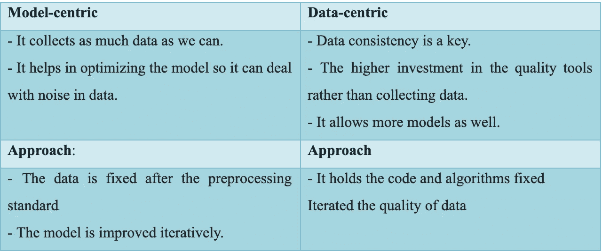
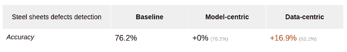

# 以数据为中心的人工智能:解码炒作

> 原文：<https://pub.towardsai.net/data-centric-ai-decoding-the-hype-618d0e3e4b3b?source=collection_archive---------1----------------------->

## **以数据为中心的方法以模型为中心——关注人工智能**

来自[派克斯](https://www.pexels.com/photo/colleagues-looking-at-survey-sheet-3183153/?utm_content=attributionCopyText&utm_medium=referral&utm_source=pexels)的[派克斯](https://www.pexels.com/@fauxels?utm_content=attributionCopyText&utm_medium=referral&utm_source=pexels)的照片

数据库及其对基于 ML 的解决方案的质量的影响提供了不同的会话，这对 NG 会话很重要(扎加蒂，2021)。优点是数据的准备及其团队的投入大。Andrew 与他的团队讨论了在准备数据时贡献更大的不同优势，证明了提高数据质量对于收集三倍于大量数据的数据是有效的。

## 不同的数据，相同的模型

它由组成解决方案的组件所知，这些组件有助于作为人工智能实践者的开发:

> **“AI 系统=代码+数据，其中代码表示模型/算法”**

它是指我们可以通过编码来改进它，或者通过给出一些解决方案来改进数据。两种解决方案都能更好地解决这个问题。为了成功，取得适当平衡的最佳方法是什么？

数据通过数据库或 Kaggle 是免费的；例如，它提供了更多的模型，在这些模型中，中心方法处理或多或少表现良好的改进解决方案。这意味着改进解决方案需要关注唯一可以调整和改变的元素，即代码。然而，我们在行业中看到的是一个非常不同的故事。Andrew NG 表达了一个观点，所以我完全同意:到目前为止，以模型为中心的方法已经对 ML 领域团队中各种数据科学的可用设备产生了重大影响。

# 以数据为中心与以模型为中心

在我看来，实现一个可靠的人工智能解决方案需要平衡“以模型为中心和以数据为中心的观点”；然而，我意识到数据方面的价值更大。令人高兴的是，这一观点不是基于直觉，而“Andrew NG 和他的团队”选择使用真实世界的数据通过不同的实验来证明这一点。但首先，让我们澄清什么是以模型为中心和以数据为中心。

作者图片

会议期间展示的一个例子是钢板中的缺陷检测——它给出了来自不同钢板的照片序列，以构建最佳模型来识别制造过程中的缺陷，它在基线系统的基础上提供了最佳精度，并为调整良好的超参数提供了视觉模型。目标是达到 90%的准确率。它是如何通过不同的精确度来实现的。

基准模型要提高 90 %,它给出了以模型为中心的不可能，它给出了网络体系结构搜索的改进，它给出了最先进的体系结构。数据驱动的方法是识别干净的噪声标签和不一致性。调查结果如下:

作者图片

它处理钢板缺陷检测，其中基线表示基线中的精确度为 76.2%，以模型为中心的精确度为+0%，以数据为中心的精确度为+16.9%，这表明了数据驱动方法的改进(Dario，2021)。

采用以数据为中心的方法的好处不仅限于计算机的视野；它们也适用于其他领域，如自然语言处理(NLP)和“表格和时间序列数据”

为什么从模型转换到以数据为中心的方法很重要？

数据在人工智能研究中极其重要，采取优先获得高质量数据的策略至关重要——毕竟，有用的数据不容易通过噪音获得，而且获得起来极其昂贵。我们对待人工智能的方式就像我们在建造房子的时候会关心最好的材料一样。正确的超参数和模型选择给出了可概括的结果，它给出了更好的性能，并且它可优化地影响系统，它给出了高质量的模型来训练，并且它用于训练模型。AI 提供了干净和去噪的数据集，成为数据结构中的基本区分器。半监督学习技术对于检测和纠正不一致非常有益，并且合成数据可以用于产生和模拟更多事件，以帮助解决泛化问题。

# **最终想法**

数据是当今最昂贵的资产之一，这要归功于所涉及的基础设施、专门用于数据的人力资源数量以及在最佳环境下获取数据的罕见性。在人工智能开发的每个阶段都必须保持和提高数据质量，根据定义，每个阶段都需要各种框架和工具，并且不要忘记，这必须在持续的基础上交付和测量，使 MLOps 成为在人工智能解决方案开发中实现合适和成功的以数据为中心的范式的宝贵盟友。

# 参考

Hajij，m .，Zamzmi，g .，Ramamurthy，K. N .，和 Saenz，A. G. (2021 年)。以数据为中心的人工智能需要重新思考数据概念。 *arXiv 预印本 arXiv:2110.02491* 。

扎加蒂公司、Ng 公司和布雷桑公司(2021 年)。用于接触者追踪和疫情调查的 Wi-Fi 会话数据仓库。在*大规模以数据和知识为中心的系统交易 XLVIII* (第 85-104 页)。斯普林格，柏林，海德堡。

拉菲·卡兰西克。, (2021).需要以数据为中心的 ML 平台。可从以下网址获得:[https://databricks . com/blog/2021/06/23/need-for-data-centric-ml-platforms . html](https://databricks.com/blog/2021/06/23/need-for-data-centric-ml-platforms.html)

法比亚娜·克莱门特。，(2019)从以模型为中心到以数据为中心。可在:[https://towards data science . com/from-model-centric-to-data-centric-4 beb 8 ef 50475](https://towardsdatascience.com/from-model-centric-to-data-centric-4beb8ef50475)获得

达里奥·拉德西克。, (2021).以数据为中心 vs 以模型为中心的 AI？答案很清楚。可从以下网址获得:

[https://towards data science . com/data-centric-vs-model-centric-ai-the-answer-is-clear-4b 607 c 58 af 67](https://towardsdatascience.com/data-centric-vs-model-centric-ai-the-answer-is-clear-4b607c58af67)