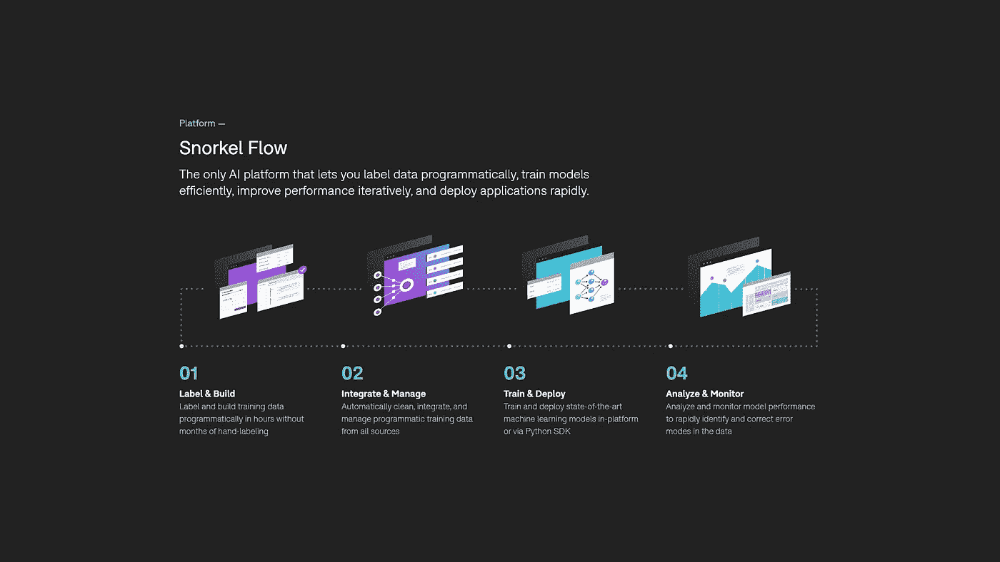
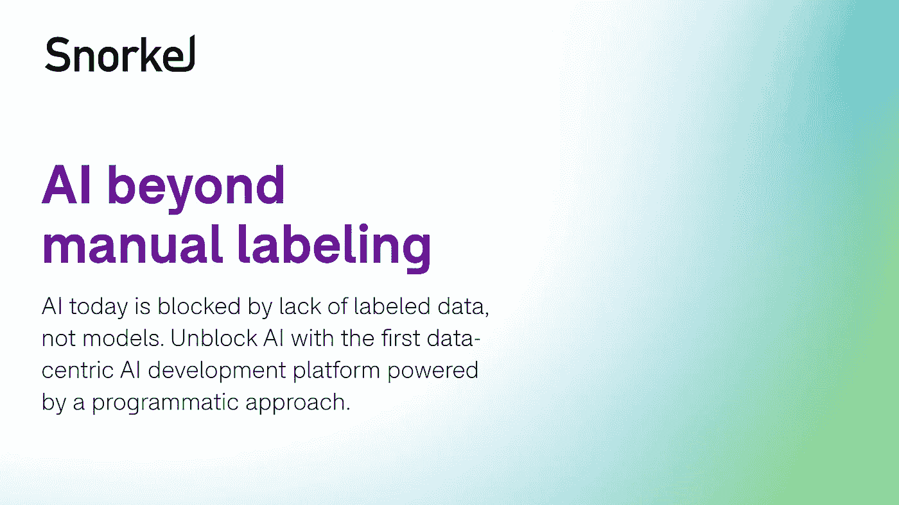
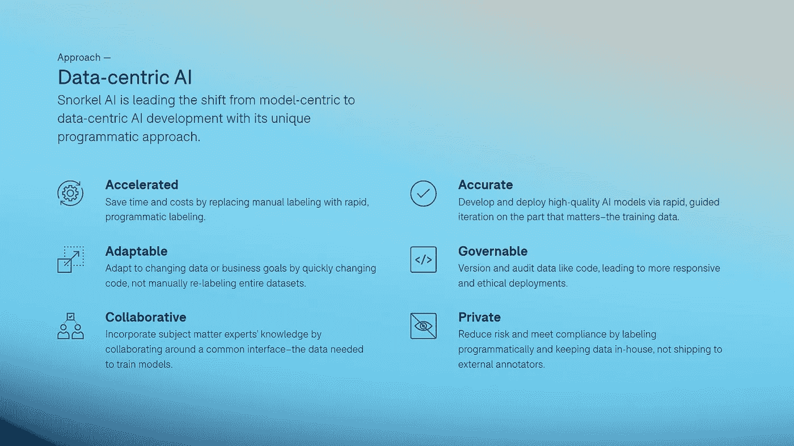
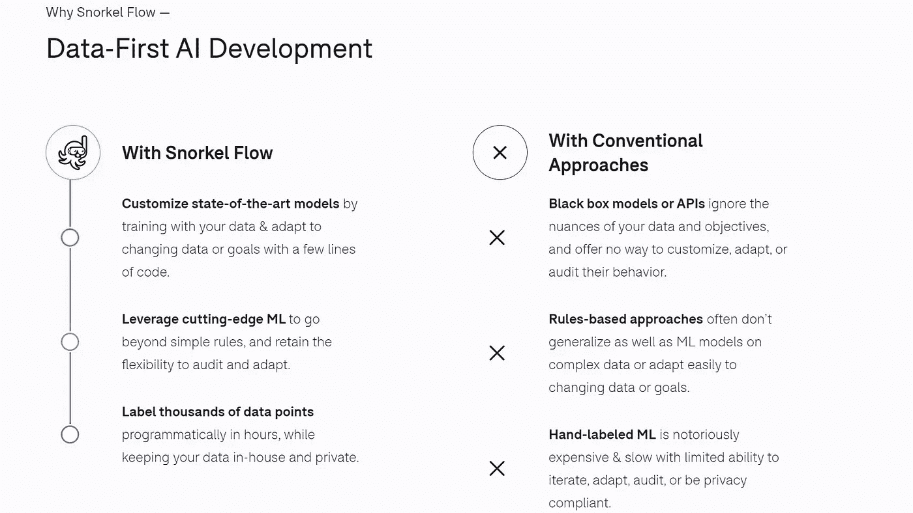
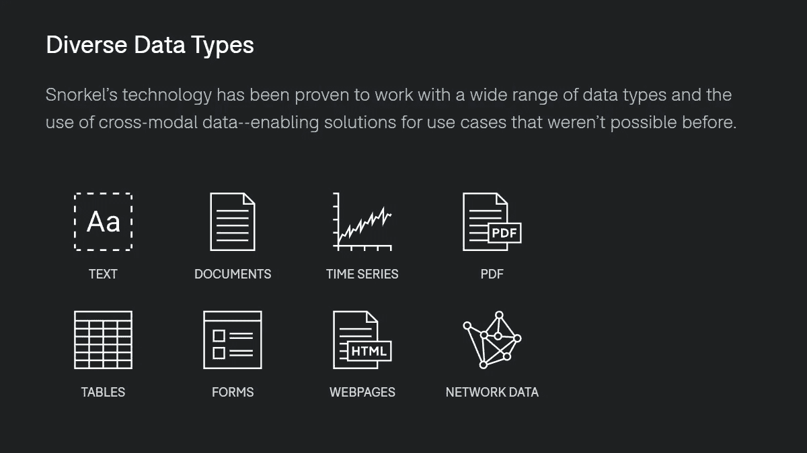
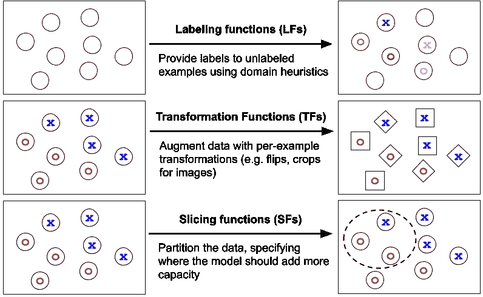

# 以数据为中心的人工智能与浮潜人工智能:企业人工智能平台

> 原文：<https://pub.towardsai.net/data-centric-ai-with-snorkel-ai-the-enterprise-ai-platform-a8ed0803c24c?source=collection_archive---------1----------------------->

来源:浮潜 AI

## [以数据为中心的人工智能](https://towardsai.net/p/category/data-centric-ai)

## 以数据为中心的 AI 企业平台展示:[潜流](https://snorkel.ai/platform) by [潜流 AI](https://snorkel.ai)

以数据为中心的人工智能专注于数据，将其作为组织中人工智能部署成败的仲裁者。相反，以模型为中心的方法关注模型的细节，而对数据不太重要。一般的想法是，以模型为中心的方法对于在 ML 管道中建立精确的模型是必要的。

然而，人工智能的最新进展已经证实了这一信念是错误的——相反，为一个模型建立一个“足够好”的起点使从业者能够进行大量的进一步培训、验证和准确性改进，同时也能够更深入地洞察所用数据的本质。

人工智能组织和企业开始转型，并将其工作重点转向更以数据为中心的人工智能方法，与以模型为中心的方法形成对比，因为他们开始意识到以数据为中心的方法(也称为软件 2.0)对 ML 管道至关重要，以提高准确性和快速人工智能应用程序开发。

人工智能的格局正在从以模型为中心向以数据为中心的人工智能转变，虽然有一些很酷的方式来实现它，但潜泳人工智能的人们正在全力以赴地开发潜泳流，这是第一个真正以数据为中心的人工智能平台，植根于最先进的数据编程和弱监管方法，旨在解决将当前人工智能实践转向更强大的以数据为中心的方法的巨大挑战

在这篇短文中，我们将谈论浮潜人工智能。以数据为中心的人工智能方法背后的发明者:

来源:浮潜 AI

# 关于浮潜 AI

浮潜人工智能始于 2015 年斯坦福人工智能实验室的一个研究项目。最初着手通过训练数据探索机器学习的更高层次接口。浮潜人工智能有超过 50 篇同行评审的出版物，发表在 ICML、自然、ICLR、IEEE、NeurIPS、 [**和更多**](https://snorkel.ai/technology/) 上，为浮潜流背后的核心技术提供动力。此外，snuck 的技术已经在谷歌、英特尔、苹果、美国三大银行中的两家、美国司法部和其他领先机构得到开发和部署。

来源:浮潜 AI

# 首个以数据为中心的人工智能平台

浮潜流是一个由弱监督[ [2](https://ai.stanford.edu/blog/weak-supervision/) ]和程序化数据标记[ [3](https://bencw99.github.io/files/kdd2019_dcclworkshop.pdf) 方法驱动的 AI 开发平台。使用浮潜流，数据科学团队可以与主题专家合作，快速构建高度精确的人工智能应用。此外，它允许用户创建和管理大量的训练数据、训练模型、分析，并通过迭代模型以及训练数据和部署来提高性能—所有这些都在一个平台中完成。

来源:浮潜 AI

# 浮潜流擅长在哪里？

*   以编程方式在几个小时内标记和构建训练数据，而不是几个月甚至几年的手工标记。
*   整合和管理来自所有来源的程序化培训数据，包括数据清理和数据切片。
*   在平台内或通过 Python SDK 训练和部署最先进的机器学习模型。
*   分析和监控模型性能，以快速识别和纠正数据中的错误模式。

> **了解更多关于** [**浮潜流平台**](https://snorkel.ai/platform/) **。**

来源:浮潜 AI

# 强力胶案例研究

使用标准模型(即预训练的 BERT)和最小化的调整，潜航人工智能团队能够利用关键的抽象以编程方式构建和管理训练数据，以在 SuperGLUE 上实现最先进的结果——一种新策划的基准；评估“通用语言理解技术”的六个任务。

在 SuperGLUE 基准测试及其四个组件任务上使用编程抽象实现了一个新的 SOTA。强力胶类似于[胶](https://gluebenchmark.com/)，但包含“更困难的任务，这些任务被选择来最大化难度和多样性。选择这些任务是为了显示基于 BERT 的基线与人类绩效之间的巨大差距。”

来源:浮潜 AI

在重现了 BERT++基线之后，我们对这些模型(基线模型、默认学习率等等)进行了最小程度的调整。)并发现，通过应用上述编程抽象，我们注意到在 SuperGLUE 基准测试中提高了+4.0 分(表明与人类性能的差距减少了 21%)。

论文[ [5](https://arxiv.org/abs/1905.00537) ]也给出了关于潜航器的行业用例的更新，甚至更多规模的应用，例如，潜航器 Drybell 中的[**Google**](https://ai.googleblog.com/2019/03/harnessing-organizational-knowledge-for.html)到科学工作中的 [**核磁共振成像分类**](https://www.nature.com/articles/s41467-019-11012-3) 和 [**全基因组自动关联研究(GWAS)**](https://ai.stanford.edu/~kuleshov/papers/gwaskb-manuscript.pdf)，两者都在 [**自然通讯**](https://www.nature.com/ncomms/) 中被接受。

# [工业案例研究](https://snorkel.ai/case-studies/)

*   谷歌已经在关键的机器学习管道中使用了 sprock 来取代 100k+的手写标注标签。
*   一家顶级美国银行使用 scupport Flow 快速构建人工智能应用程序，从他们的文档中分类和提取信息。
*   苹果用一个基于内部通气管的系统构建应用程序，该系统以多种语言回答了数十亿次查询，处理了数万亿条记录，错误减少了 2.9 倍。
*   一家《财富》500 强生物技术先驱利用通气管流量从临床试验中提取关键慢性病数据，在几分钟内准确处理 30 万份文档。

# 参考

[1]“浮潜:在弱监督下的快速训练数据创建。”亚历克斯·拉特纳，斯蒂芬·h·巴赫，亨利·埃伦贝尔，杰森·弗里斯，吴森，克里斯·雷，斯坦福大学，[https://arxiv.org/pdf/1711.10160.pdf](https://arxiv.org/pdf/1711.10160.pdf)

[2]“弱监督:机器学习的新编程范式。”亚历克斯·拉特纳，帕罗马·瓦尔马，布雷登·汉考克，克里斯·雷等人，赛欧博客，2019，[https://ai.stanford.edu/blog/weak-supervision/](https://ai.stanford.edu/blog/weak-supervision/)

[3]“弱监管的互动程序化标签。”本杰明·科恩-王，斯蒂芬·穆斯曼，亚历克斯·拉特纳，克里斯·雷，，2019，【https://bencw99.github.io/files/kdd2019_dcclworkshop.pdf】

[4]“浮潜干铃:在工业规模上部署弱监管的案例研究。”斯蒂芬·h·巴赫、丹尼尔·罗德里格兹、、邵海东、卡桑德拉·夏、苏维克·森、亚历山大·拉特纳、布雷登·汉考克、胡曼·阿尔博尔齐、拉胡尔·库奇哈尔、克里斯多夫·雷、罗布·马尔金、西格莫德、2019、[https://arxiv.org/abs/1812.00417](https://arxiv.org/abs/1812.00417)

[5]王，亚历克斯等.〈强力胶:通用语言理解系统的一个更具粘性的基准.〉2019.SuperGLUE 由 6 个数据集组成:承诺库(CB，De Marneffe 等人，2019 年)、似是而非的选择(COPA，Roemmele 等人，2011 年)、多句子阅读理解数据集(MultiRC，Khashabi 等人，2018 年)、识别文本蕴涵(合并自 RTE1、Dagan 等人，2006 年、RTE2、Bar Haim 等人，2006 年、RTE3、Giampiccolo 等人，2007 年和 RTE5、bent

 [## 帮助将人工智能和技术初创公司扩展到企业|走向人工智能

### 《走向人工智能》每月通过我们的定制软件为数百万科技读者提供服务。我们拥有成千上万的人工智能和…

sponsors.towardsai.net](https://sponsors.towardsai.net)  [## 店铺↓ |走向 AI

### 发布最好的技术、科学和工程|社论→https://towardsai.net/p/editorial |订阅→…

ws.towardsai.net](https://ws.towardsai.net/shop)  [## 加入我们吧↓ |面向人工智能成员|数据驱动的社区

### 加入人工智能，成为会员，你将不仅支持人工智能，但你将有机会…

members.towardsai.net](https://members.towardsai.net)