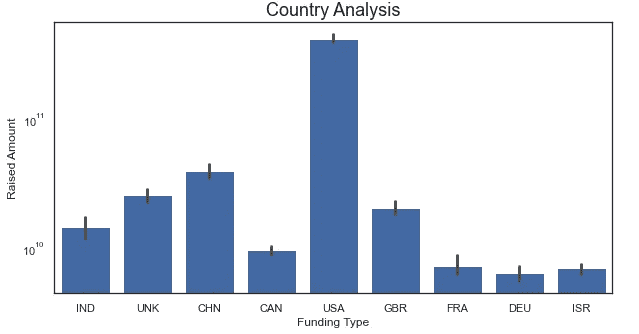
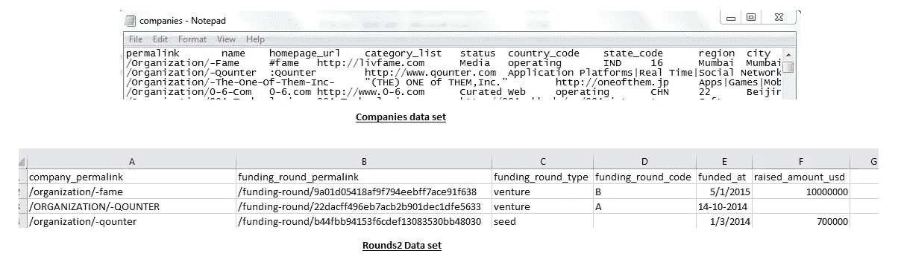
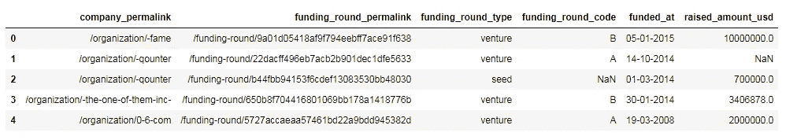
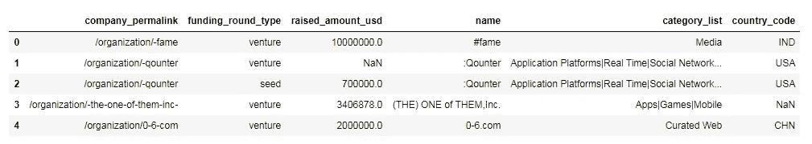
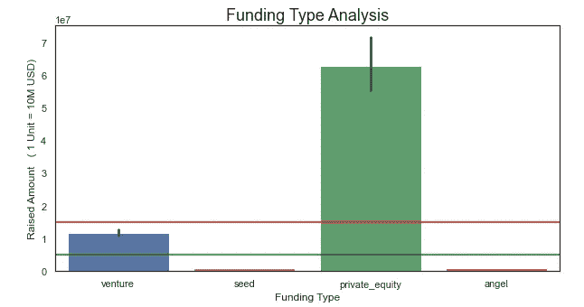

# 用 Python 实现投资项目的数据清洗

> 原文：<https://pub.towardsai.net/data-cleaning-of-an-investment-project-with-python-a969bbdd875c?source=collection_archive---------0----------------------->

## [数据科学](https://towardsai.net/p/category/data-science)

## 基金投资数据的数据预处理步骤



资金分析。作者的照片

在本文中，我们将讨论数据清洗和一些来自基金投资公司分析的见解。投资公司想从数据中了解投资排名前九的国家。

有两个数据集可用

1.  **公司:**这是一个文本文件
2.  **rounds2:** 这是一个 CSV 文件

数据可用**h**T8**ere**。

数据集的原始视图如下所示:



数据集视图。作者的照片

## 让我们用 python 做一些实际的事情

```
**#imporing the libraries**
import pandas as pd
import numpy as np
```

现在，导入数据

```
**#importing companies txt file**
companies = pd.read_csv("companies.txt", sep="**\t**", encoding =
                        "unicode_escape")**#importing rounds2 csv file
import** **codecs**
rounds2_file = codecs.open("rounds2.csv","r",encoding='utf-8',
                            errors='ignore')
rounds2 = pd.read_csv(rounds2_file)
```

我们观察到这两个数据有列 permalink 和 company permalink，其中两个数据框的第一个索引处的组织名称相同，但一个是大写，一个是小写。

```
**#we need to lower the alphabet in both the data frames**
companies['permalink'] =companies['permalink'].apply(**lambda** x:
       x.strip().lower().encode('utf-8').decode('ascii', 'ignore'))companies['name'] =companies['name'].apply(**lambda** x:
                  str(x).encode('utf-8').decode('ascii', 'ignore'))
```

查看公司数据

```
companies.head()
```


公司数据。作者的照片

```
rounds2['company_permalink']=rounds2['company_permalink'].apply(**lamb
  da** x: x.strip().lower().encode('utf-8').decode('ascii', 'ignore'))
```

查看 rounds2 数据

```
rounds2.head()
```



rounds2 数据。作者的照片

现在，我们将检查两个数据集中唯一公司的数量。

```
**#finding unique companies in these two data frames**

print("Unique companies in 'companies data' are: ",
       len(companies.permalink.unique()))

print("Unique companies in 'rounds2 data' is: ",
      len(rounds2.company_permalink.unique()))**#output:**
Unique companies in 'companies data' is:  66368
Unique companies in 'rounds2 data' is:  66368
```

为了对数据集进行适当的数据清理，我们需要合并两个数据集。

```
**#merging of these two data set**
master_frame=pd.merge(rounds2,companies,how="left",left_on="company_
                      permalink",right_on="permalink")
```

主数据集的形状

```
master_frame.shape**#output:**
(114949, 16)
```

要知道数据集中缺失的值

```
master_frame.isnull().sum()**#output:**
company_permalink              0
funding_round_permalink        0
funding_round_type             0
funding_round_code         83809
funded_at                      0
raised_amount_usd          19990
permalink                      1
name                           1
homepage_url                6135
category_list               3411
status                         1
country_code                8679
state_code                 10947
region                     10168
city                       10165
founded_at                 20521
dtype: int64
```

计算空值的百分比

```
round(100*(master_frame.isnull().sum()/len(master_frame.index)), 2)**#output:**
company_permalink           0.00
funding_round_permalink     0.00
funding_round_type          0.00
funding_round_code         72.91
funded_at                   0.00
raised_amount_usd          17.39
permalink                   0.00
name                        0.00
homepage_url                5.34
category_list               2.97
status                      0.00
country_code                7.55
state_code                  9.52
region                      8.85
city                        8.84
founded_at                 17.85
dtype: float64
```

读取任务文件后，主框架中的一些列不需要数据。

```
master_frame = master_frame.drop(['funding_round_code',
                                  'funding_round_permalink',
                                  'funded_at','permalink',
                                  'homepage_url','state_code',
                                  'region', 'city',
                                  'founded_at','status'], axis = 1)

print(round(100*(master_frame.isnull().sum()/len(master_frame.index)),2))**#output:**
company_permalink      0.00
funding_round_type     0.00
raised_amount_usd     17.39
name                   0.00
category_list          2.97
country_code           7.55
dtype: float64
```

现在，查看删除不必要的列后的数据集。

```
master_frame.head()
```



数据集视图。作者的照片

尽管如此，数据集中仍有许多 nan 值。现在，我们将删除按行排列的“金额”列。

```
**#need to remove those rows that have nan dollars in raised_amount**
master_frame = master_frame[~np.isnan(master_frame['raised_amount_usd'])]

**#null values after deletion of rows**
round(100*(master_frame.isnull().sum()/len(master_frame.index)), 2)**#output:**
company_permalink     0.00
funding_round_type    0.00
raised_amount_usd     0.00
name                  0.00
category_list         1.10
country_code          6.16
dtype: float64
```

我们看到***category _ list***和 ***country_code*** 中有 nan 值，我们不能为国家分析检查点删除它们。

```
**# Replacing nan values to unknown - UNK**
master_frame.loc[pd.isnull(master_frame['country_code']),
                ['country_code']] = 'UNK'**# Replacing nan values to undefined** 
master_frame.loc[pd.isnull(master_frame['category_list']),
                ['category_list']] = "undefined"round(100*master_frame.isnull().sum()/len(master_frame.index)), 2)**#output:**
company_permalink     0.0
funding_round_type    0.0
raised_amount_usd     0.0
name                  0.0
category_list         0.0
country_code          0.0
dtype: float64
```

[](/data-preprocessing-concepts-with-python-b93c63f14bb6) [## Python 中的数据预处理概念

### 一种为机器学习估值器准备数据的稳健方法

pub.towardsai.net](/data-preprocessing-concepts-with-python-b93c63f14bb6) [](/understand-time-series-components-with-python-4bc3e2ba1189) [## 用 Python 理解时间序列组件

### 机器学习中预测模型的基本概念及实例

pub.towardsai.net](/understand-time-series-components-with-python-4bc3e2ba1189) 

现在，我们的数据几乎是干净的，我们可以做分析。

让我们在“基金类型”列中查看基金的类型。

```
master_frame['funding_round_type'].unique()**#output:**array(['venture', 'seed', 'undisclosed', 'convertible_note',
       'private_equity', 'debt_financing', 'angel', 'grant',
       'equity_crowdfunding', 'post_ipo_equity', 'post_ipo_debt',
       'product_crowdfunding', 'secondary_market',
       'non_equity_assistance'], dtype=object)
```

该公司只对如下所示的四种资金类型感兴趣:

```
master_frame=master_frame[master_frame['funding_round_type'].isin(['
                        seed','angel','venture','private_equity'])]
```

假设公司想投资 1000 万到 1500 万英镑在创业公司。因此，根据美元金额找到合适的基金类型如下所示:

```
**#we will groupby all these four funding to get total USD amount**df_by_funding_type = master_frame.groupby('funding_round_type')
         round(df_by_funding_type['raised_amount_usd'].mean(), 5)**#output:**
funding_round_type
angel             9.586945e+05
private_equity    7.330859e+07
seed              7.198180e+05
venture           1.174895e+07
Name: raised_amount_usd, dtype: float64
```

根据这个结果绘制条形图。

```
**#importing plotting libraries**
import matplotlib.pyplot as plt
import seaborn as sns

sns.set(style="white")**# bar plot with default statistic=mean**
plt.figure(figsize=(10,5))
g=sns.barplot(x='funding_round_type', y='raised_amount_usd'
              , data=master_frame)g.set(xlabel='Funding Type',ylabel='Raised Amount( 1 Unit=10M USD)')
g.set_title('Funding Type Analysis',fontsize =18)

plt.axhline(5000000, color='green')
plt.axhline(15000000, color='red')

plt.show()
```



四种融资类型的条形图。作者的照片

现在，我们将找到排名前九的国家

```
**# Top funding country wise**
venture_df = master_frame[master_frame["funding_round_type"]=="venture"]#highest top nine countries funding
venture_by_country = venture_df.groupby('country_code')venture_by_country['raised_amount_usd'].sum().sort_values(ascending=
                    **False**).head(9)**#output:**
country_code
USA    4.225108e+11
CHN    3.983542e+10
UNK    2.550611e+10
GBR    2.024563e+10
IND    1.439186e+10
CAN    9.583332e+09
FRA    7.259537e+09
ISR    6.907515e+09
DEU    6.346960e+09
Name: raised_amount_usd, dtype: float64
```

上述结果有利于投资排名前九的国家。

## 结论:

本文根据投资公司的需求，给出了数据清理的基本思路。

我希望你喜欢这篇文章。通过我的 [LinkedIn](https://www.linkedin.com/in/data-scientist-95040a1ab/) 和 [twitter](https://twitter.com/amitprius) 联系我。

# 推荐文章

[1。NLP —零到英雄用 Python](https://medium.com/towards-artificial-intelligence/nlp-zero-to-hero-with-python-2df6fcebff6e?sk=2231d868766e96b13d1e9d7db6064df1)
2。 [Python 数据结构数据类型和对象](https://medium.com/towards-artificial-intelligence/python-data-structures-data-types-and-objects-244d0a86c3cf?sk=42f4b462499f3fc3a160b21e2c94dba6)
3。[Python 中的异常处理概念](/exception-handling-concepts-in-python-4d5116decac3?source=friends_link&sk=a0ed49d9fdeaa67925eac34ecb55ea30)
4。[用 Python 进行主成分分析降维](/principal-component-analysis-in-dimensionality-reduction-with-python-1a613006d531?source=friends_link&sk=3ed0671fdc04ba395dd36478bcea8a55)
5。[用 Python 全面讲解 K-means 聚类](https://medium.com/towards-artificial-intelligence/fully-explained-k-means-clustering-with-python-e7caa573176a?source=friends_link&sk=9c5c613ceb10f2d203712634f3b6fb28)
6。[用 Python 充分解释了线性回归](https://medium.com/towards-artificial-intelligence/fully-explained-linear-regression-with-python-fe2b313f32f3?source=friends_link&sk=53c91a2a51347ec2d93f8222c0e06402)
7。[用 Python](https://medium.com/towards-artificial-intelligence/fully-explained-logistic-regression-with-python-f4a16413ddcd?source=friends_link&sk=528181f15a44e48ea38fdd9579241a78)
充分解释了 Logistic 回归 8。[用 Python 做时间序列的基础知识](https://medium.com/towards-artificial-intelligence/basic-of-time-series-with-python-a2f7cb451a76?source=friends_link&sk=09d77be2d6b8779973e41ab54ebcf6c5)
9。[与 Python 的数据角力—第一部分](/data-wrangling-with-python-part-1-969e3cc81d69?source=friends_link&sk=9c3649cf20f31a5c9ead51c50c89ba0b)10。[机器学习中的混淆矩阵](https://medium.com/analytics-vidhya/confusion-matrix-in-machine-learning-91b6e2b3f9af?source=friends_link&sk=11c6531da0bab7b504d518d02746d4cc)