# 数据协作变得更加容易

> 原文：<https://pub.towardsai.net/data-collaboration-made-easier-b0bfbeab48f1?source=collection_archive---------3----------------------->

## [创新](https://towardsai.net/p/category/innovation)，[新闻](https://towardsai.net/p/category/news)，[科技](https://towardsai.net/p/category/technology)

## 一种数据协作工具，无需任何 IT 提升即可消除小型团队的数据混乱

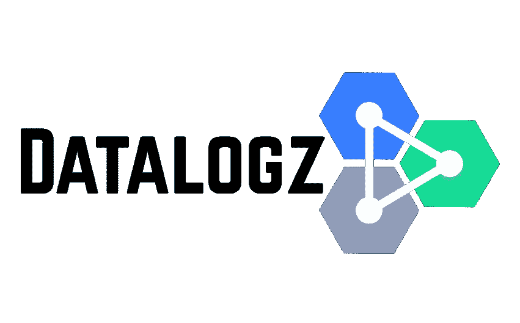

来源: [DataLogz](https://datalogz.io/)

不管接受与否，每个数据科学/分析团队都面临着管理、组织和协作他们正在处理的数据集的困难。 [**DataLogz**](https://datalogz.io) 是一款免费的 web 工具，为数据科学和分析团队提供了零实施成本的解决方案，无需复杂的 IT 程序即可组织数据。该工具可以立即使用，没有任何忙乱，这有助于更快地理解数据，以现代方式产生有价值的见解和记录数据，而不是传统的电子表格或 word 文档，当然，没有人喜欢阅读。

在我开始应用程序的工作之前，让我介绍一下 [DataLogz](https://datalogz.io) 的创始人洛根·哈文。洛根毕业于德州农工大学，工程学专业，目前在捷蓝航空公司担任助理工业工程师。当大多数人在 COVID19 锁定期间玩 Houseparty 时，Logan 创建了这个应用程序来打发时间，现在它已经被列入[产品搜索](https://www.producthunt.com/posts/datalogz)、[泡泡](https://bubble.io/blog/bubble-app-datalogz/)以及更多。

 [## 洛根·哈文-工业助理工程师-捷蓝航空| LinkedIn

### 查看洛根·哈文在全球最大的职业社区 LinkedIn 上的个人资料。洛根有 5 份工作列在他们的…

www.linkedin.com](https://www.linkedin.com/in/logan-havern-53473a101/) 

## 主页

我们先来熟悉一下主页。

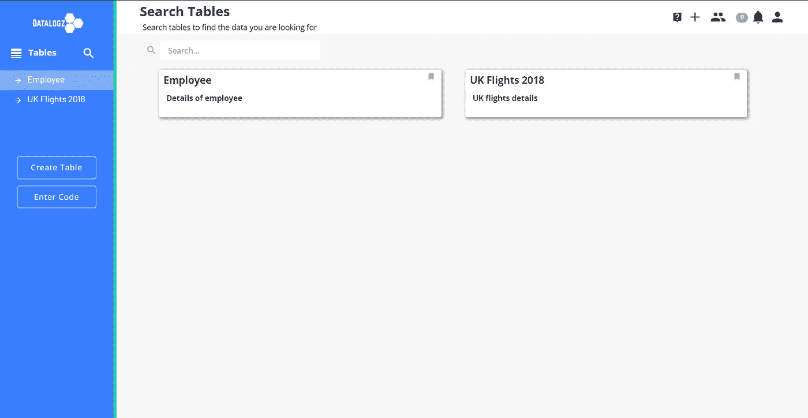

如你所见，目前，我有两个数据集细节:员工和英国 2018 航班。如果你有几个数据细节，应用程序提供了一个搜索栏，让我们的生活更加轻松

## 创建表格

由于该应用程序的目的是让事情变得简单，所以创建表格也很容易。您只需为您的表命名，添加描述，并从电子表格中复制粘贴数据集列名。

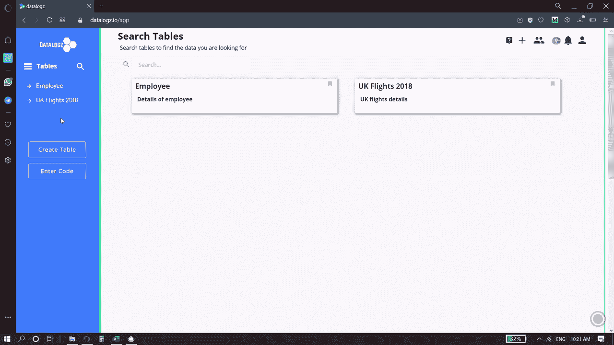

对，就是这样。只需点击 3 到 4 次鼠标，您的表格就创建好了。现在是时候给你的表格添加细节，赋予它意义了。

## 向表中添加详细信息

从左侧窗格中选择您想要的表格，点击顶部的*定义*选项卡。现在，您可以向表中的每一列添加数据类型和描述。

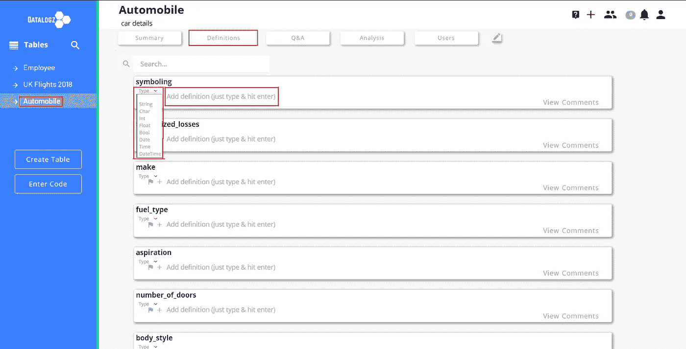

你还可以通过点击*编辑图标*标签做更多的事情。除了添加数据类型和描述之外，您还可以添加或删除列、导出到 CSV、复制表，当然，还可以删除表。

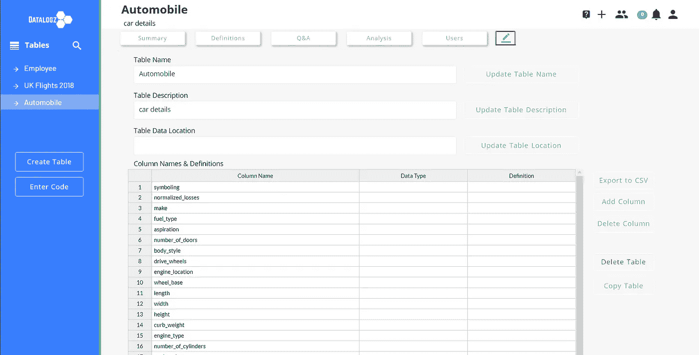

## 添加团队成员

一旦创建了数据集，就可以添加能够访问该表以读取、修改和获得更改通知的团队成员。您可以通过输入团队成员的电子邮件 ID 或共享唯一的表格代码来添加团队成员。

从左侧窗格中选择表格名称，单击*用户*选项卡，然后单击*邀请用户*以启动弹出窗口，您可以在其中输入电子邮件 ID 或复制唯一代码。

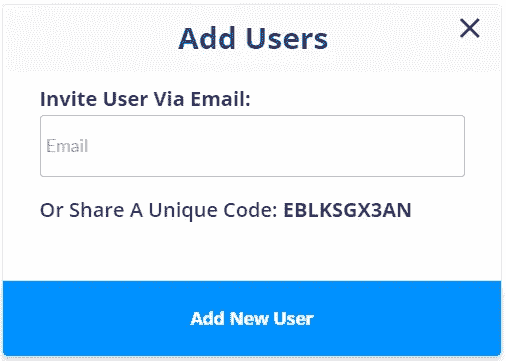

## 添加您的分析

创建一个表并添加细节只是传统文档的一种替代方法。该应用程序的主要优势是添加您的分析。您可以在本地机器上分析数据，这些数据可以在应用程序上可视化并添加见解，以便您的团队可以在需要时访问、阅读和编辑。最棒的是，你的每个队友都可以添加他们自己版本的分析。这可以在*分析*选项卡下完成。

## 通知变更

只有当任何团队成员做出的更改可以通知到你的队友时，该应用程序才能充分使用。

例如，您发现输入了错误的列数据类型，团队已经开始处理数据集。您可以更改应用程序中的数据类型，然后单击 *Notify* 选项卡，此时会出现一个弹出窗口，添加描述并选择通知您的团队的方法，而不是通过电子邮件向每个人发送更新。您可以选择仅在应用程序上通知，也可以同时在应用程序和电子邮件上通知。

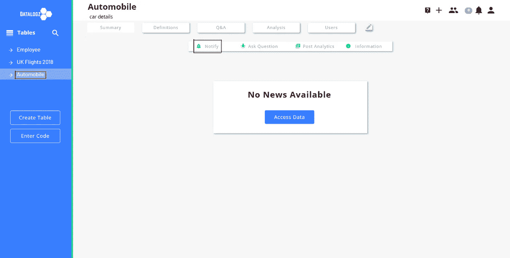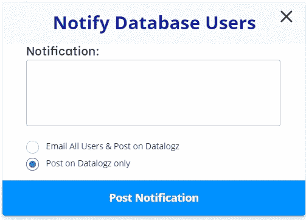

## 问题和答案

我最喜欢的功能是使用该应用程序，就像任何其他社交媒体应用程序一样，发布问题，你的团队成员可以对你的问题发表评论。这是最好的协作方式，尤其是当在家工作已经成为新常态的时候。

考虑一个场景，您想知道是否有人已经完成了工作的分析部分。这是一个可以问你的团队领导的小问题，他可能就坐在大厅的对面。尽管如此，当每个人都在家工作时，你要么给每个人发邮件，要么给你的团队领导打电话。DataLogz 简化了这一过程，你可以点击 *Q & A* 选项卡提出你的问题，然后等待你团队中的某个人做出回应。

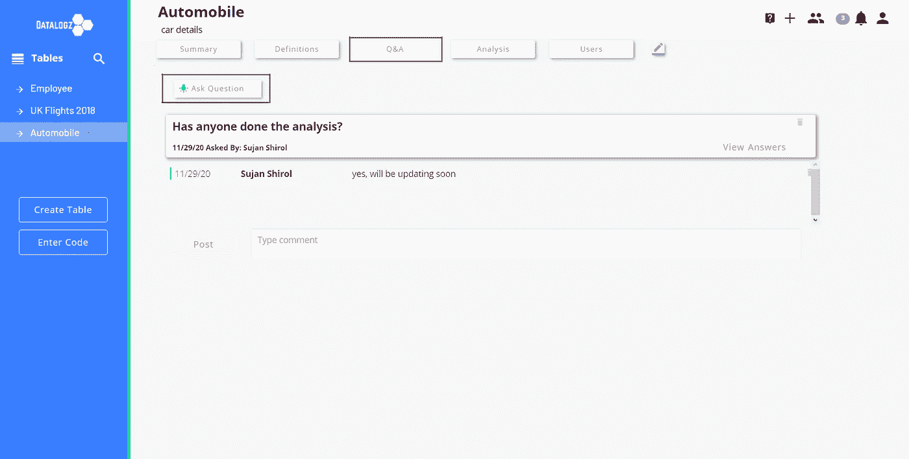

它还会在应用程序的通知选项卡上通知，并且所有团队成员都会收到来自应用程序的电子邮件。

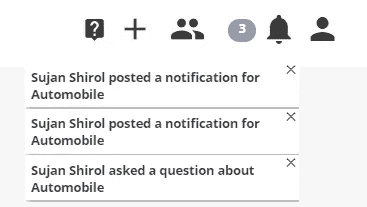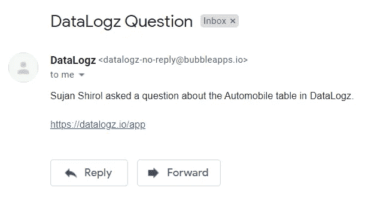

感谢您的阅读。我希望这篇文章内容丰富。如果您需要任何进一步的信息，请联系 [Logan Havern](https://www.linkedin.com/in/logan-havern-53473a101/) 。

乔恩·泰森在 [Unsplash](https://unsplash.com?utm_source=medium&utm_medium=referral) 上的照片

**我们来连线**

 [## 印度卡纳塔克邦班加罗尔城市大学

### 我相信教学是最好的学习方式。技术作家在媒体的最大出版物的启动，走向人工智能&…

www.linkedin.com](https://www.linkedin.com/in/sujan-shirol/)