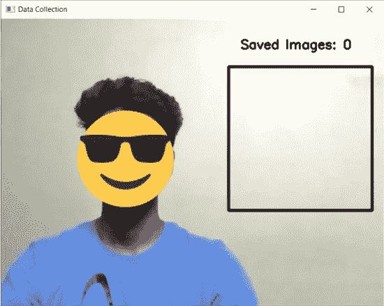
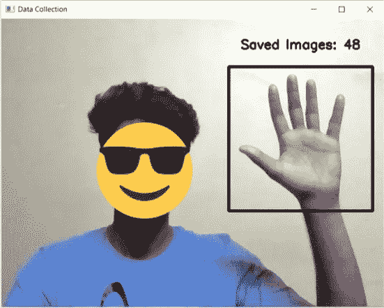
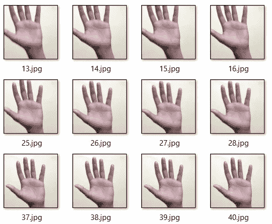

# 使用 OpenCV 收集数据

> 原文：<https://pub.towardsai.net/data-collection-using-opencv-cc5aa7f27255?source=collection_archive---------3----------------------->

OpenCV 是“开源计算机视觉”的缩写，是一个机器学习库，旨在实现图像处理和计算机视觉应用。与对象检测和识别相反，OpenCV 的一个尚未开发的应用是它收集数据的能力。更准确地说，它可用于通过将图像本地保存在您的机器中来创建数据集。请允许我详细说明。

OpenCV 允许您访问机器中的网络摄像头，并处理它捕获的图像。这个想法包括处理

下面是一个简单的代码片段。(在这个演示中，我将使用 Python v 3.9.7)

**导入库**:我们需要 python 的 *OpenCV* 和 *OS* 库来执行数据收集。如果您没有预安装这些软件包，可以通过在命令提示符下执行以下命令来安装它们:

*   OpenCV: *pip 安装 opencv-python*
*   操作系统: *pip 安装操作系统*

**初始化**:下一步是创建一个 VideoCapture 对象，从系统的网络摄像头实时捕捉视频。这里有一个原始文档的链接— [Docs](https://docs.opencv.org/4.x/dd/d43/tutorial_py_video_display.html) 。我们还需要三个变量:

*   *flag_collecting* :这是一个布尔变量，作为暂停/恢复按钮。
*   *images_collected* :这是一个整数变量，用来表示系统中采集并保存的图像数量。
*   *images_required* :这是一个整数变量，用于表示我们打算采集的图像数量。

然后我们必须使用操作系统库中的*mkdir*(make-directory 的缩写)命令创建一个文件夹/目录(在本例中为 testing_demo)。

**代码的症结**:如果这是你第一次使用 OpenCV，我建议你通过[这个](https://docs.opencv.org/4.x/dd/d43/tutorial_py_video_display.html)文档来理解代码的样板部分。我将逐行解释对标准代码的所有修改，以确保它更容易理解。

第 3 行:我必须使用 *flip()* 命令沿 y 轴翻转帧，以确保视频以正确的方式呈现给我。

第 5 行:while 循环将一直运行，直到收集的图像等于所需的图像。

第 8 行:使用 cv2.rectangle 命令，我在屏幕上提到的坐标之间画了一个黑色方块。

第 11–14 行:我提取黑色方块内的切片帧或屏幕的一部分。然后，我将这些提取的帧保存在上面创建的目录中。这将产生尺寸为 240x240 像素的图像。OpenCV 中坐标系的原点位于左上角。(80，320)是从原点开始的 y 坐标，它随着向下移动而增加。(380，620)是从原点开始的 x 坐标，它随着向右移动而增加。所以(380，80)和(620，320)对应黑色方块的左上和右下坐标。

第 16–18 行:显示在给定坐标下采集的图像数量。

第 21–22 行:键盘字符‘s’(代表开始/停止)用于暂停或恢复图像采集。它实际上相当于一个切换按钮。

第 23 行:键盘字符“q”(表示退出)用于关闭窗口

**应用**:我原本是用这种技术来收集手形符号的图像，以创建一个图像数据集(在 Kaggle 上有:[手形符号](https://www.kaggle.com/datasets/abhinowww/hand-cricket-symbols))，但极限只是你的想象。您可以用任何东西创建影像数据集。发挥创造力！

**实现**:我添加了一些这段代码运行的图片。建议在你身后用一面普通的墙来收集数据，以确保帧中没有外部噪声。

请原谅我粗陋的穿着品味。

下面的图像是在我运行代码之后，在我按下键盘上的字符' s '之前拍摄的，这将启动图像收集过程。

图像采集前的初始状态

现在这个图像是在我运行代码之后，在我按下键盘上的字符' s '之后拍摄的。如您所见，收集的图像数量显示在黑色方块上方。这个黑色方块的大小可以根据用户的意愿改变成任何形状或大小。

图像收集期间的中间状态

这是图像收集的结果。

收集的样本图像

这是我所遇到的收集和格式化图像数据的最简单的方法之一。暂时就这样吧！回头见！