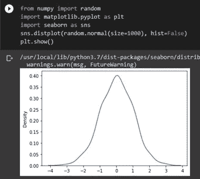
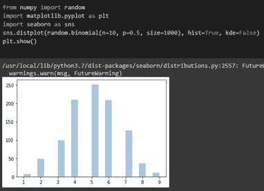
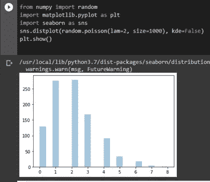
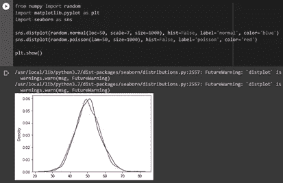
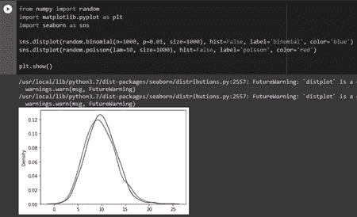

# 通过 Python 使用 Numpy 进行数据分发

> 原文：<https://pub.towardsai.net/data-distribution-using-numpy-with-python-3b64aae6f9d6?source=collection_archive---------0----------------------->

## [统计数据](https://towardsai.net/p/category/statistics)

## 统计学中重要的概率分布


由 [Carlos Muza](https://unsplash.com/@kmuza?utm_source=medium&utm_medium=referral) 在 [Unsplash](https://unsplash.com?utm_source=medium&utm_medium=referral) 上拍摄的照片

> ***正态/高斯分布***

“正态分布”，也称为“高斯分布”或“钟形曲线”，是统计学中最重要的概率分布之一，因为它符合许多自然现象，如血压、智商得分、测量误差等。因此，正态分布是连续的。

**正态分布使用 python 程序**

在正态分布中，我们使用 random.normal()函数来获得正态分布。

该函数主要有三个参数:

1.  **loc** :该参数描述了平均值，也表示直到钟的峰值存在。
2.  **标度**:该参数描述了标准偏差，也意味着分配图形分布的平坦度。
3.  **尺寸**:该参数描述了要显示的图形的尺寸。

*   **让我们看一个简单的程序来生成大小为 2*5 的随机正态分布**

**程序**

```
from numpy import randomx = random.normal(size=(2*5))**Explanation:** The above program finds a Normal distribution having a matrix size of two rows and five columns.
```

**输出**

```
[[-0.67740728 -0.14930913 -0.76195278 1.18255458 0.55254747][-2.53518812 -0.82533421 0.38608556 -0.64574332 0.75281676]]
```

*   **现在让我们来看一个生成随机正态分布的程序，大小为 4*2，平均值为 1，标准偏差为 2**

**程序:**

```
From numpy import randomx = random.normal(loc=1, scale=2, size=(4,2))print(x)
```

**输出:**

```
[[-0.34362887 4.38734593]
 [ 2.50183963 2.5900816 ]
 [ 4.18926006 2.24994328]
 [ 0.7707717 0.04108879]]
```

**说明:**上面的程序是寻找一个矩阵大小为“4，2”(其中“4”是行数，“2”是列数)，钟形图的峰值(loc)设为 1，图形的平坦度(scale)设为“2”的分布。

*   **正态分布的可视化**

```
from numpy import random
import matplotlib.pyplot as plt
import seaborn as snssns.distplot(random.normal(size=1000), hist = False)plt.show()
```



作者的照片

> ***二项分布***

二项式分布，或著名的伯努利分布，是离散的，用于计算一次又一次重复该过程时出现的特定成功次数。

为了找出 10%的孩子是高分者，而 70%的孩子通过了考试的概率。

**二项分布使用 Python 程序**

在二项分布中，我们使用 random.binomial()函数来获得二项分布。该函数有三个参数:

1.  **n** =该参数表示要执行的试验次数。
2.  **p** =该参数表示每次试验发生的概率。
3.  **大小** =该参数描述了数组的大小。

*   **让我们看一个简单的程序来生成抛硬币的概率。**

```
from numpy import randomx = random.binomial (n=6, p=0.5, size=10)print(x)
```

**输出:**

```
[3 3 3 4 3 4 2 3 1 3]
```

**解释:**上面的程序显示了抛硬币的概率，其中试验次数(n)为‘6’，数据点数(大小)为 10。因此，当程序每次执行时，它都返回不同的值，因为每次抛硬币的概率都不同。

*   **二项分布的可视化**

```
from numpy import random
import matplotlib.pyplot as plt
import seaborn as snssns.distplot(random.binomial(n=10, p=0.5, size=1000), hist=True, kde=False)plt.show()
```



作者的照片

**二项式分布与正态分布有何不同？**

两种发行版之间唯一的区别是:二项式是离散的，而正态分布是连续的。这也意味着二项式分布在图中任何两点之间都没有数据点，而正态分布有。

[](/z-statistics-t-statistics-p-statistics-are-still-confusing-you-87557047e20a) [## Z-统计量，T-统计量，P-统计量还在迷惑你？

### 机器学习统计学中的定义和概念

pub.towardsai.net](/z-statistics-t-statistics-p-statistics-are-still-confusing-you-87557047e20a) [](/chi-square-hypothesis-testing-in-statistics-87884bc73d99) [## 统计学中的卡方假设检验

### 分类特征之间的关系关联

pub.towardsai.net](/chi-square-hypothesis-testing-in-statistics-87884bc73d99) 

> ***泊松分布***

泊松分布描述了在大量人群中发生的罕见事件的概率分布。泊松分布也是离散的，但是二项式分布和泊松分布之间有细微的差别。让我们通过比较两者来理解这个理论。二项式分布/实验发现 50 只羊中有多少只黑羊，而泊松分布/实验关注的是在两个小时的时间间隔内有多少只羊逃跑。让我们使用一个 python 程序(NumPy)来深入研究这个概念。

**泊松分布使用 Python 程序**

在泊松分布中，我们使用 random.poisson()函数来获得泊松分布。该函数有两个参数:

1.  **lmp** =该参数表示现有的出现次数。
2.  **大小** =该参数描述了数组的大小。

*   **让我们看一个简单的程序，为 5 的出现生成 2 * 2**

```
from numpy import randomx = random.poisson(lam=5, size=10)print(x)
```

**输出:**

```
[[7 6]
[2 6]]
```

**说明:**上面的程序显示了数字 5 在一个 2x2 大小的矩阵中出现的次数。

*   **泊松分布的可视化**

```
from numpy import random
import matplotlib.pyplot as plt
import seaborn as snssns.distplot(random.poisson(lam=2, size=1000), kde=False)plt.show()
```



作者的照片

泊松分布和正态分布有什么不同？

正态分布是连续的，而泊松分布是离散的。让我们用一个简单的程序来理解这个概念:

**程序:**

```
from numpy import random
import matplotlib.pyplot as plt
import seaborn as snssns.distplot(random.normal(loc=50, scale=7, size=1000), hist=False, label=’normal’, color= ‘blue’)sns.distplot(random.poisson(lam=50, size=1000), hist=False, label=’poisson’, color= ‘red’)plt.show()
```



作者的照片

这里，蓝色表示正态分布，红色表示泊松分布。

**泊松分布和二项分布有什么不同？**

二项式分布和泊松分布之间的区别非常微妙，因为二项式分布是完全离散的，而泊松分布是连续的。但是当下列条件成立时，不会观察到这种差异:

*   如果 n 值很大。
*   如果 p 值接近“0”。

当这两个条件在二项式分布中为真时，它变得几乎等同于泊松分布。即 nxp = lam。因此，它们都属于离散类别。

让我们通过可视化来理解这个概念:

**节目:**

```
from numpy import random
import matplotlib.pyplot as plt
import seaborn as snssns.distplot(random.binomial(n=1000, p=0.01, size=1000), hist=False, label=’binomial’, color= ‘blue’)sns.distplot(random.poisson(lam=10, size=1000), hist=False, label=’poisson’, color= ‘red’)plt.show()
```



作者的照片

**结论:**

总之，本文已经介绍了使用 NumPy 的概率分布的基础知识以及每个分布之间的差异。我强烈推荐阅读更多关于使用 NumPy 发行版的文章，因为有很多关于这个主题的文章可以尝试。

我希望你喜欢这篇文章。通过我的 [LinkedIn](https://www.linkedin.com/in/data-scientist-95040a1ab/) 和 [twitter](https://twitter.com/amitprius) 联系我。

# 推荐文章

[1。NLP —零到英雄与 Python](https://medium.com/towards-artificial-intelligence/nlp-zero-to-hero-with-python-2df6fcebff6e?sk=2231d868766e96b13d1e9d7db6064df1)
2。 [Python 数据结构数据类型和对象](https://medium.com/towards-artificial-intelligence/python-data-structures-data-types-and-objects-244d0a86c3cf?sk=42f4b462499f3fc3a160b21e2c94dba6)3 .[Python 中的异常处理概念](/exception-handling-concepts-in-python-4d5116decac3?source=friends_link&sk=a0ed49d9fdeaa67925eac34ecb55ea30)
4。[用 Python 进行主成分分析降维](/principal-component-analysis-in-dimensionality-reduction-with-python-1a613006d531?source=friends_link&sk=3ed0671fdc04ba395dd36478bcea8a55)
5。[用 Python 全面讲解 K-means 聚类](https://medium.com/towards-artificial-intelligence/fully-explained-k-means-clustering-with-python-e7caa573176a?source=friends_link&sk=9c5c613ceb10f2d203712634f3b6fb28)
6。[用 Python](https://medium.com/towards-artificial-intelligence/fully-explained-linear-regression-with-python-fe2b313f32f3?source=friends_link&sk=53c91a2a51347ec2d93f8222c0e06402)
7 全面讲解了线性回归。[用 Python](https://medium.com/towards-artificial-intelligence/fully-explained-logistic-regression-with-python-f4a16413ddcd?source=friends_link&sk=528181f15a44e48ea38fdd9579241a78)
充分解释了 Logistic 回归 8。[concat()、merge()和 join()与 Python](/differences-between-concat-merge-and-join-with-python-1a6541abc08d?source=friends_link&sk=3b37b694fb90db16275059ea752fc16a)
的区别 9。[与 Python 的数据角力—第一部分](/data-wrangling-with-python-part-1-969e3cc81d69?source=friends_link&sk=9c3649cf20f31a5c9ead51c50c89ba0b)
10。[机器学习中的混淆矩阵](https://medium.com/analytics-vidhya/confusion-matrix-in-machine-learning-91b6e2b3f9af?source=friends_link&sk=11c6531da0bab7b504d518d02746d4cc)