# 使用 Julia Lang 的数据工程

> 原文：<https://pub.towardsai.net/data-engineering-using-julia-lang-c2c7454b180f?source=collection_archive---------2----------------------->

这篇博客的目的是了解如何使用 Julia Lang 构建数据工程管道。网上有很多博客都在讲 DE 的理论，这里我就来讲代码，少理论多代码。


**导入必要的库和数据集**

```
using CSV
using DataFrames
using Dates#load the datasets into memory
emp_df = CSV.read("D:\\Julia\\emp.csv", DataFrame)print(typeof(emp_df))
#first()to access top 5 records
first(emp_df,5)
```


```
dept_df = CSV.read("D:\\Julia\\dept.csv", DataFrame)
print(typeof(dept_df))
first(dept_df,5)
```

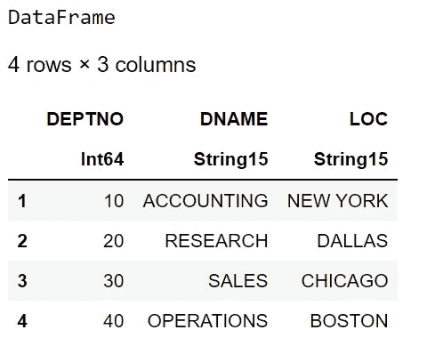

**数据操作**

1.  **过滤记录**

```
#filter out records for deptno=30
dept30=filter(row ->row[“DEPTNO”] == 30,emp_df)
dept30
#row is a keyword in julia via we can access the column names
```

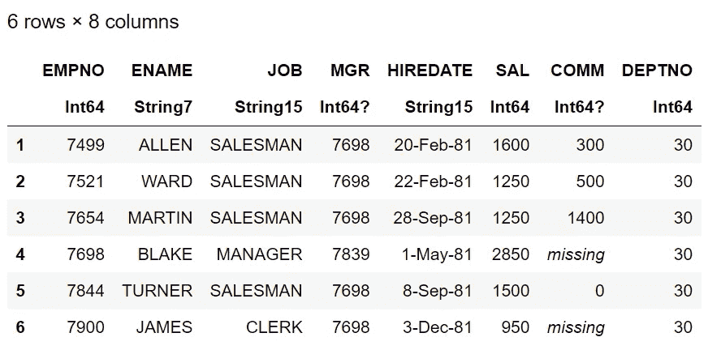

```
#filter multiple conditions
filter(row ->row.SAL> 500 && row.SAL <=1800,emp_df)
```

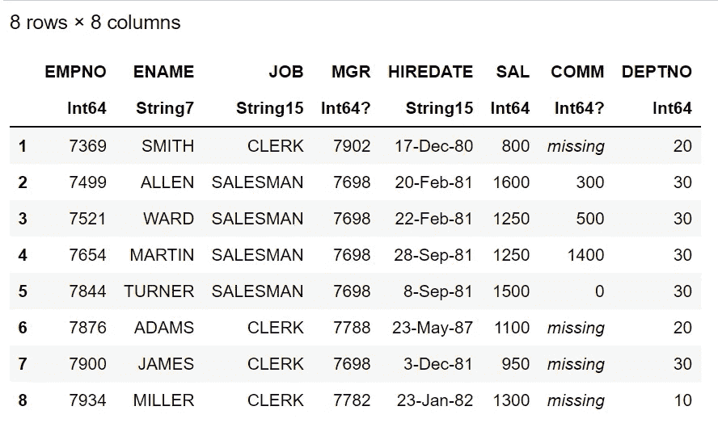

2.**对记录进行排序**

```
srt_df= sort(emp_df, order(:DEPTNO, rev=false))
first(srt_df,7)
```

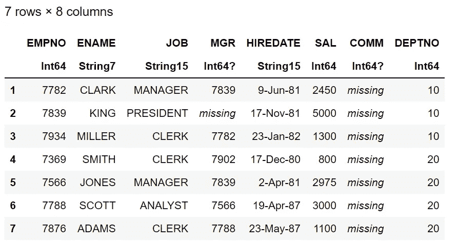

**3。群组&聚合**

```
#create a seperate small subset for groupby ops
group_df= select(emp_df,”DEPTNO”,”SAL”)
first(group_df,7)
```

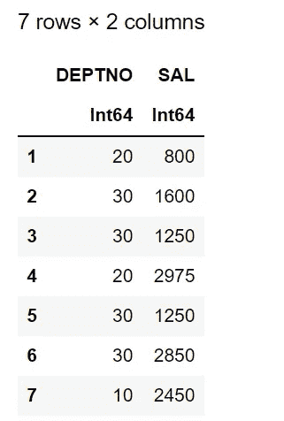

```
#groupby creates a grouped dataframe other than normal dataframe, somewhat similar to pandas groupby
typeof(gd)#access group information using array indexes
println(gd[1])
println(gd[2])
println(gd[3])
```

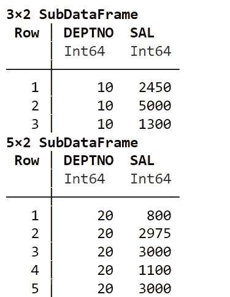

**聚合**

```
using Statisticsprintln(“sum of sal deptwise “,combine(gd, :SAL => sum))
println(“ — — — — — — — — — — — — — — — — — — — — — — — “)
println(“avg of sal deptwise “,combine(gd, :SAL => mean))
```

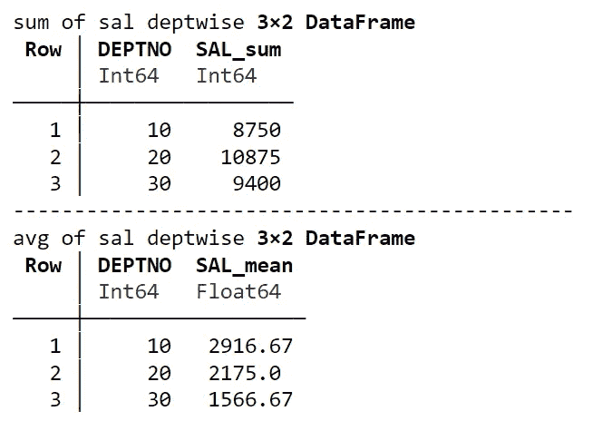

```
println(“max of sal deptwise “,combine(gd, :SAL => maximum))
println(“ — — — — — — — — — — — — — — — — — — — — — — — “)
println(“sum of sal deptwise “,combine(gd, :SAL => minimum))
```

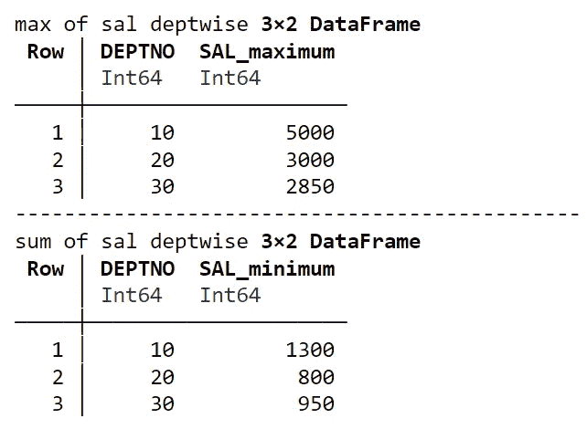

**4。朱莉娅·UDFs**

```
#WAF to calculate tax of employees and add Tax as derived column in existing dataframe.
#function is the keyword to write a udffunction taxes(sal)
 tax=0
 if sal>500 && sal<=1250
 tax=sal*.125
 elseif sal>1250 && sal<=1750
 tax=sal*.175
 elseif sal>1750 && sal<=2500
 tax=sal*.225
 elseif sal>2500
 tax=sal*.25
 else
 tax=0
 end
end#create a derived column to add calculated taxesemp_df[!, “Taxes”] = taxes.(emp_df.SAL)
first(emp_df,8)
```

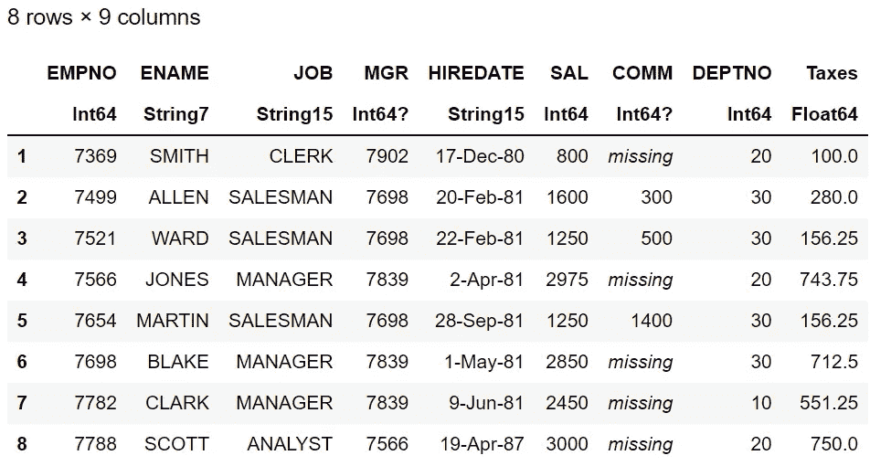

5.**加入**

```
#merge the emp_df with grouped df 
agg_df= innerjoin(emp_df,grp_df, on= :DEPTNO)
first(agg_df,10)
```

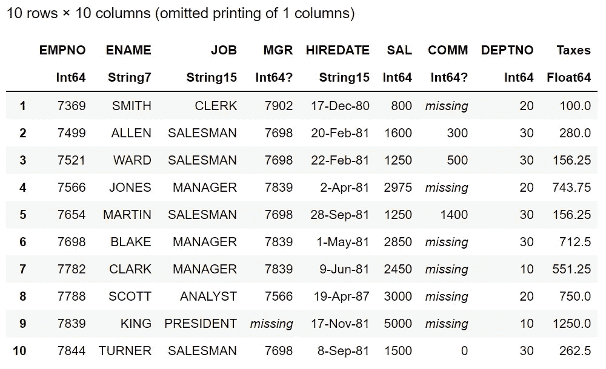

对数据框执行 SQL like select 并将数据集写入 CSV 文件:

```
CSV.write("D:\\Julia\\empagg_out.csv", 
    select(agg_df, "EMPNO", "ENAME", "SAL", "COMM", "DEPTNO","Taxes","SAL_sum" => "SalSum"))
```

连接员工和部门数据集

```
inner_df= innerjoin(emp_df,dept_df, on= :DEPTNO)
first(inner_df,8)
```


```
out_df=select(inner_df,”EMPNO”,”ENAME”,”SAL”,”COMM”,”DEPTNO”,”DNAME”)
first(out_df,8)
```

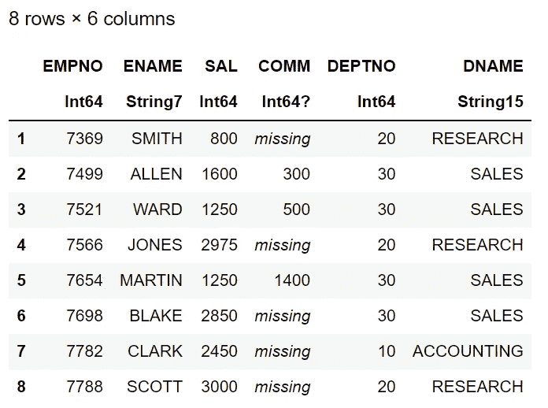

```
CSV.write(“D:\\Julia\\empd_out.csv”, out_df)
```

# 总结:

读取 CSV 数据集

数据操作:筛选、排序、分组、聚合、连接。

UDF 和派生列。

将 Julia 数据帧写入 CSV 文件

感谢所有阅读我的博客的人，如果你喜欢我的内容和解释，请在媒体上关注我并分享你的反馈，这将永远帮助我们所有人提高我们的知识。

谢谢

Vivek Chaudhary