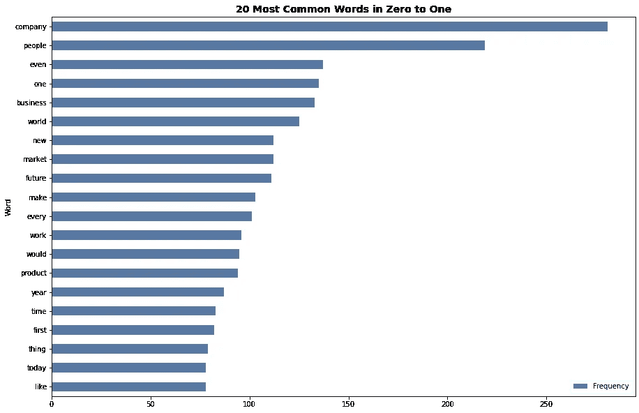
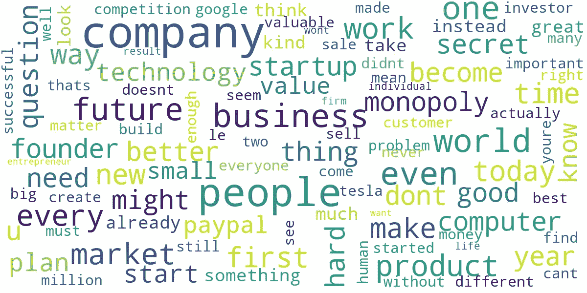
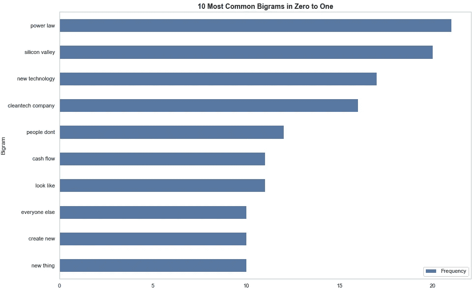
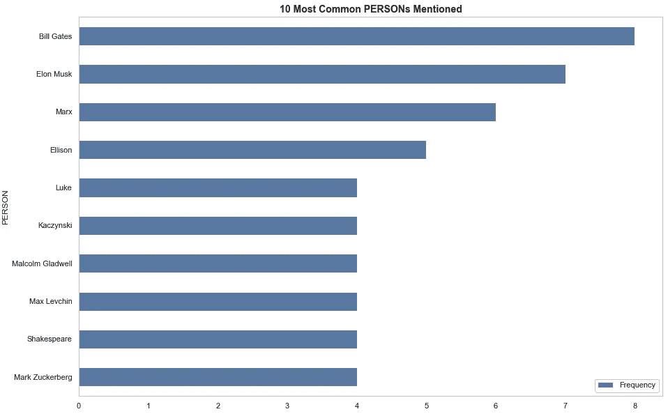
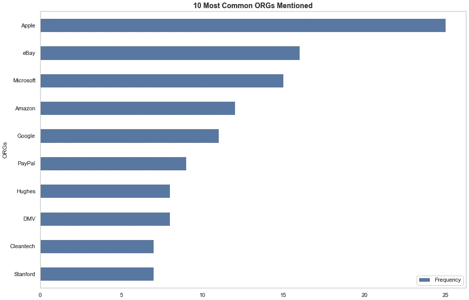
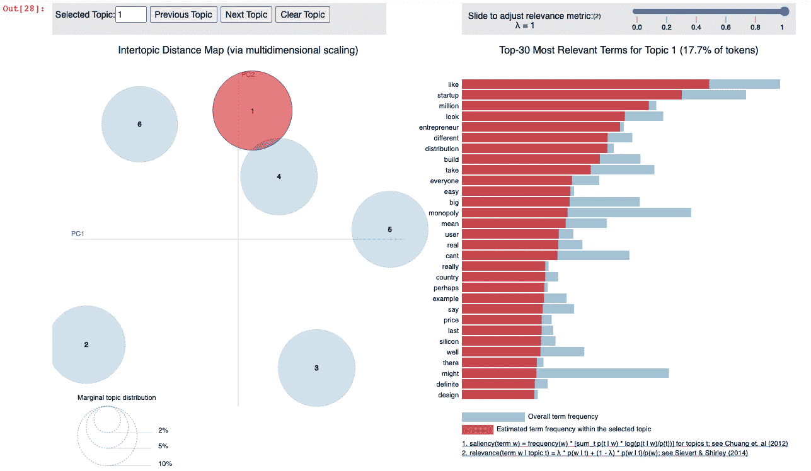

# 彼得·泰尔对零到一的数据探索

> 原文：<https://pub.towardsai.net/data-exploration-of-zero-to-one-by-peter-thiel-5349e57eaf7d?source=collection_archive---------5----------------------->

## [自然语言处理](https://towardsai.net/p/category/nlp)

## "卓越的思维是罕见的，但勇气比天才更稀缺."—彼得·泰尔的《零比一》。

K 彼得·泰尔的《零对一》作为终极创业剧本和政治宣言，带你踏上从他在斯坦福大学获得法律学位到他在 PayPal 最终成功的旅程。Thiel 强调了全球化社会中产品差异化的重要性。他通过分析竞争激烈的曼哈顿餐馆市场展示了微薄的利润，并赞美了商业中无所不能的垄断。他抨击教育系统麻木了好奇心。他让大概念变得如此容易理解，以至于到了书的结尾，你会想起身开始头脑风暴新的商业想法。

看完商务本现象，我决定应用文本分析和 NLP 原理来分析零到一。我买了他书的电子版，转换成文本文件。分析了 40，867 个单词和 207，012 个字符(没有空格)，以下是我的发现:

**使用的工具:**Jupyter 笔记本中的 Python 3.9

使用的库: NLTK，Gensim，PyLDAvis & Spacy

**关键步骤:**文本预处理、标记化、词条化&主题建模

**预处理:**

我使用了 *Regex* 库来去除文本文件中的数字和换行符。然后，我使用了 NLTK 库来标记、删除停用词并对数据进行词条化。这个预处理步骤对我的分析至关重要。

**最常用词/词云:**

找到最常见的单词有助于为接下来的分析定下节奏。虽然仅凭这一步不能得出任何结论，但我想找出书中最常见的 20 个单词，作为未来调查的垫脚石。我使用了来自*集合*库中的计数器函数，使用语料库的预处理列表创建了一个最常用单词的元组。从单词 cloud 和条形图中可以看出,“公司”、“人员”和“业务”等宏观概念贯穿全书。有趣的是，《大富翁》甚至不在前 20 名。

双重人格:

在这一步，我使用了来自 *sklearn* 库中的 CountVectorizer 函数将原始文本转换为 ngram 范围(2，2)的稀疏向量。然后，我使用转换方法从语料库中创建了一个字典。之后，我绘制了图表来查看书中最常出现的二元模型。

二元模型的结果清楚地显示了彼得·泰尔对权力法则的热爱。有趣的是，该图还突出了小说技术和硅谷在书中的影响。这是有意义的，因为在整本书中，泰尔重申了创造差异化产品的重要性，并敦促读者利用技术创造价值。不过，目前还不清楚这些结果是他在 PayPal 时的轶事，还是反映了他对技术的意识形态。此外，“清洁技术公司”被提到了 20 次。这很有趣，因为它提出了一个问题，即彼得·泰尔是否认为清洁技术应该是当今创始人的主要关注点。

**命名实体识别:**

这部分分析更多的是为了找出泰尔在书中引用了哪些公司和著名创始人。通过从 *Spacy* 加载 en_core_web_sm 库，并对语料库的标记化列表使用 NLP 函数，我能够使用 Counter 函数提取书中提到的最常见的组织和人员(我检查了文档标签是‘ORG’代表组织还是‘PERSON’代表人员)。不出所料，Thiel 谈到苹果和比尔·盖茨是成功公司和创始人的支柱。泰尔重申了他对苹果的钦佩，他提到苹果的次数和提到贝宝的次数差不多(我假设在本文中每当提到易贝，泰尔指的是贝宝最初的利基市场:一种在易贝使用的电子支付方式。将易贝和贝宝被提及的次数相加，得到 26 次，比苹果被提及的次数多 1 次)。

**话题造型:**

对于主题建模，我使用了来自 *gensim* 库的 pyLDAvis 和 LdaMulticore 来查找同现关键词，并发现书中隐藏的主题。 [DataCamp](https://www.datacamp.com/community/tutorials/discovering-hidden-topics-python) 提供了一个关于在给定文档中查找主题数量的深入且易于使用的教程。在找到最佳数量的主题后，我创建了一个潜在的狄利克雷分配(LDA)模型，并准备了一个可视化工具来查看我的结果。主题 1 完美地阐释了书中最具冲击力的主题。通过提及“创业”、“企业家”和“垄断”，这部分分析完美地将彼得·泰尔的意识形态概括为 0 到 1。

读完这本书后，我发现自己在思考从自己的偏见中收集的独特主题。文本分析提供了从零到一的一些关键要点的有用见解。使用数据分析技术来探索这本书的主题让我对它的许多不同观点有了更完整的理解。

有兴趣的可以在我的 GitHub 上找到代码库:[零对一](https://github.com/saadfkhan/zerotoone/blob/main/Zero%20To%20One%20by%20Peter%20Thiel.ipynb)。