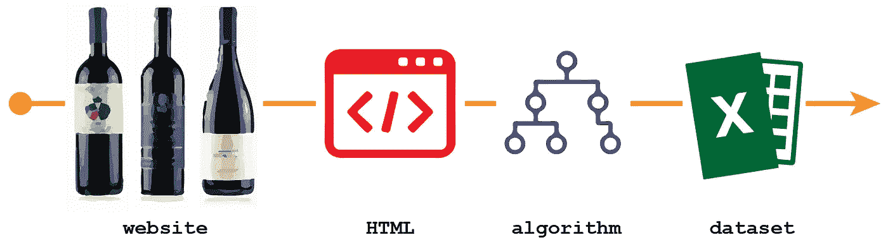
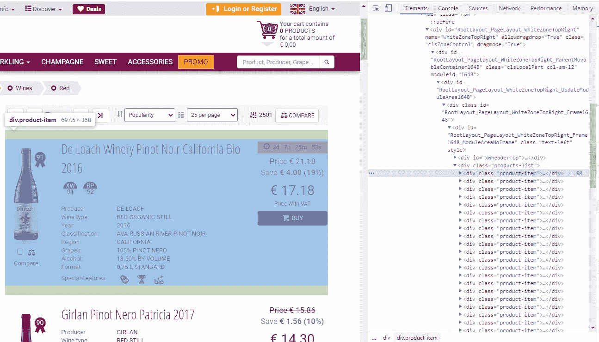
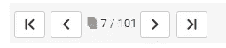
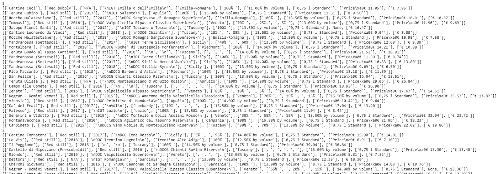
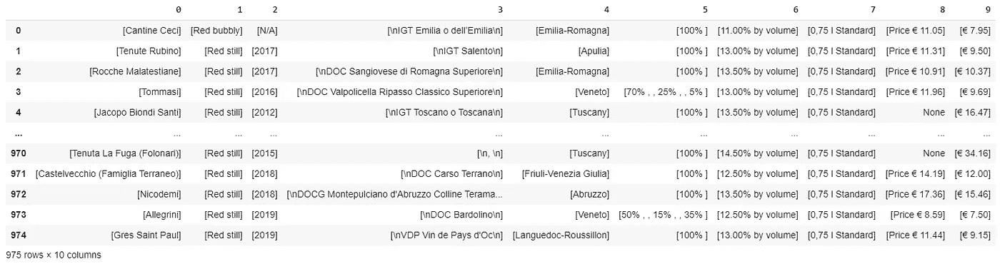

# 毫不客气地进行数据挖掘

> 原文：<https://pub.towardsai.net/data-mining-without-being-discourteous-e6dc431c206c?source=collection_archive---------2----------------------->

## [数据挖掘](https://towardsai.net/p/category/data-mining)

## 从 Xtrawine.com 网上搜集酒单

[***完整代码可在我的 Github repo 获得。***](https://github.com/arditoibryan/Projects/tree/master/20200613_Wine_Price_Estimator)

在本文的第一部分，我将重点介绍一种称为 web 抓取的数据挖掘技术。这组算法允许程序员访问页面的 HTML 代码，以从页面中提取信息。如果你能够在同一个网站的数百个页面中迭代，你可以下载大量的信息。

## 网页抓取是如何工作的？



4 步程序

网页抓取可以总结为以下步骤:

1.  隔离网站中存储信息的区块
2.  连接到执行 URL 请求的网站
3.  下载 HTML 代码
4.  提取方块
5.  为每个块提取单个信息
6.  遍历每个网页
7.  创建数据集
8.  导出数据集

# 1.隔离块

第一部分实际上比看起来更复杂。没有技术规则来识别源代码中的主要块。如果你想建立一个成功的网络抓取算法，你必须从一开始就假设信息在整个网站中以一种模式组织(至少在你想从中提取信息的集合页面中)。



www.xtrawine.com

# 2.连接到网站

现在我们已经确切地知道了我们想要什么，并且知道在哪里可以找到它，我们可以使用请求模块进行第一次连接。

```
import requests
from bs4 import BeautifulSoupURL = '[https://www.xtrawine.com/en/wines/red/195?p=7'](https://www.xtrawine.com/en/wines/red/195?p=7')
page = requests.get(URL)
```

# 3.下载 HTML 代码

```
soup = BeautifulSoup(page.content, 'html.parser')
soup
```

建立连接后，我就可以下载 HTML 代码了。为此，我将使用一个名为美丽的汤的模块。

让我看看我刚刚下载的内容:


汤产量的样本

在下面的步骤中，我将从大量的代码中分离出我需要的数据，并逐段提取。

# 4.提取方块

这是事情开始变得具有挑战性的部分。您需要调整自己的算法以适应包含您想要下载的所有信息的代码。每个网页的结构都不一样，有的很乱，有的把每个对象都存储在同一个类下，有的按 id 存储…

```
def request_(URL):
  page = requests.get(URL)
  soup = BeautifulSoup(page.content, 'html.parser')#finding elements by class name
  job_elems = soup.find_all(class_='product-item')
  job_elems
```

从上图可以看出，每个葡萄酒部分(带有附加信息)都存储在类 **product_item** 下。我将隔离所有项目，并将其命名为 job_elems。job_elems 中的每个元素都是一个部分，包含页面上一种葡萄酒的所有信息。

# 5.为每个块提取单个信息

我现在将浏览每个块，提取每个相关信息，将它们收集到一个列表中。大多数葡萄酒信息(生产商、葡萄酒种类、地区……)都存储在类别**右**下(我必须研究网页代码才能找到这些信息)。

## 例子

* * *下面是一个例子，不包括在主代码中:这是搜索所有**右**类的样子。它们包含在一个列表中，所以我们可以通过调用 list_[n]来访问我们想要提取的第 n 行。

```
all_wines = list()
job_elems[0]
list_ = job_elems[0].find_all(class_='right')
list_
[
<td class="right"><a alt="De loach wines" href="/en/producers/de-loach/1687" title="De loach wines">De Loach</a></td>,
 <td class="right">Red organic still</td>,
 <td class="right">2016</td>,
 <td class="right">
 <div id="RootLayout_PageLayout_WhiteZoneTopRight_Frame1648_Module1648_repProducts_ctl00_pnlAppl">
 <a href="/en/appellations/sonoma-valley/721">AVA Russian River Pinot Noir</a>
 </div>
 </td>,
 <td class="right"><a href="/en/zones/california/59">California</a></td>,
 <td class="right">100% <a class="simpleLnk" href="/en/grape-varieties/pinot-nero/111">Pinot Nero</a></td>,
 <td class="right">13.50% by volume</td>,
 <td class="right">0,75 l Standard</td>,
 <td class="right xw-item-properties">
 <i class="filter-small xwi-promo" title="Special discount"></i>
 <i class="filter-small xwi-award" title="Most awarded"></i>
 <i class="filter-small xwi-bio" title="Organic or Biodynamic"></i>
 </td>
]
```

例如，如果我想提取葡萄酒的生产商，我会查看第一行代码。

```
<td class="right"><a alt="De loach wines" href="/en/producers/de-loach/1687" title="De loach wines">De Loach</a></td>
```

为了提取它，我需要使用方法`find`:

```
list_[0].find('a').find_all(text=True, recursive=False)
['De Loach']
```

## 回到真正的代码

为了恢复这个功能，我编写了从网页中提取每一个葡萄酒信息的所有规范。

```
 all_wines = list()
  for job_elem in job_elems:
    single_wine = list()list_ = job_elem.find_all(class_='right')
    single_wine.append(list_[0].find('a').find_all(text=True, recursive=False))
    single_wine.append(list_[1].find_all(text=True, recursive=False))
    single_wine.append(list_[2].find_all(text=True, recursive=False))
    single_wine.append(list_[3].find_all(text=True, recursive=False))
    single_wine.append(list_[4].find('a').find_all(text=True, recursive=False))
    single_wine.append(list_[5].find_all(text=True, recursive=False))
    single_wine.append(list_[6].find_all(text=True, recursive=False))
    single_wine.append(list_[7].find_all(text=True, recursive=False))
```

不幸的是，价格有点难以提取。在这个网站上，有两个关于葡萄酒价格的可能字符串:

*   原价
*   当前价格

不是所有的葡萄酒都有原价，如果他们提供折扣，他们会保留原价和现价。此外，一些页面的代码中仍然存储着一些旧的价格。鉴于这些数据之间的不一致性，我决定保留我在价格列表中找到的第一个原始价格和第一个当前价格。

我将使用 try 语句来防止崩溃，以防算法返回 None。

```
 try:
      price_ = job_elem.find_all(class_='origPrice')
      single_wine.append(price_[0].find_all(text=True, recursive=False))
    except:
      single_wine.append(None) try:
      price_ = job_elem.find_all(class_='currPrice')
      single_wine.append(price_[0].find_all(text=True, recursive=False))
    except:
      single_wine.append(None)

    print(single_wine)
    all_wines.append(single_wine)

  return all_wines
```

# 6.遍历每个网页

艰难的部分已经完成。我们可以有效地从单个网页中提取所有的葡萄酒信息。我们需要做的就是遍历数百个页面来填充数据集。



在网页中，我们可以选择要查看的页面。如果我们查看 URL，从一个页面到另一个页面的唯一变化是最后一个数字:

```
#For page 7 [https://www.xtrawine.com/en/wines/red/195?p=7](https://www.xtrawine.com/en/wines/red/195?p=7) #For page 8
[https://www.xtrawine.com/en/wines/red/195?p=](https://www.xtrawine.com/en/wines/red/195?p=7)8
#...
```

我们可以每次编辑 URL 来遍历每个页面。这就是我们下载整个数据集的方式。

```
import timelist3 = list()
for _ in range(0, 40):
  print(_)
  try:
    time.sleep(40)
    list3.append(request_('[https://www.xtrawine.com/en/wines/red/195?p='+str(_)))](https://www.xtrawine.com/en/wines/red/195?p='+str(_))))
  except:
    pass
  #empty = pd.concat([empty, request_], axis=0)
```



输出的一瞥

该算法将连接到一个页面，运行网页抓取算法提取页面中的代码，然后将它们存储到每页的单个列表中。列表 3 将收集所有这些列表。

完成每个请求后，算法将等待 40 秒，然后开始下一个请求。通过这样做，我们不会在网站上产生过多的流量需求:我们不需要失礼…


> …因为无礼对我来说是无法形容的丑陋。汉尼拔·莱克特

# 7.创建数据集

在收集了存储在 list3 中的相当于 40 页的内容后，我们可以将其转换为数据集:

```
wines = list()
for _1 in list3:
  print(len(_1))
  for _2 in _1:
    wines.append(_2)len(wines)
...
25
25
25
25
25
25
25
25
25
25
25
25
975
```

我们总共存储了 975 行葡萄酒信息。

```
import pandas as pd
wines = pd.DataFrame(wines)
wines
```



精彩结果！我们已经刮了 39 页了。

# 8.导出数据集

现在我们必须将它导出到我们的文件中，这样我们就可以在其他会话中使用它，而不必从头开始。

```
wines.to_csv('wines.csv')
```