# 数据预处理——一个被大众忽视的重要阶段

> 原文：<https://pub.towardsai.net/data-preprocessing-an-important-stage-that-is-ignored-by-masses-7471564af929?source=collection_archive---------3----------------------->

## [数据挖掘](https://towardsai.net/p/category/data-mining)

## 在分析之前，抛光很重要

照片由来自 [Pexels](https://www.pexels.com/photo/multi-colored-folders-piled-up-159519/?utm_content=attributionCopyText&utm_medium=referral&utm_source=pexels) 的 [Pixabay](https://www.pexels.com/@pixabay?utm_content=attributionCopyText&utm_medium=referral&utm_source=pexels) 拍摄

科学界的天才**阿尔伯特·爱因斯坦**曾经引用过:

> 如果给你一个 60 分钟要解决的问题，那么花 55 分钟定义这个问题，然后花 5 分钟解决它。

无论我迄今为止在数据科学领域做了什么，我现在都想用一种不同的方式来重新定义这句话，如下所示:

> ***“如果给你一个数据集来执行分析以创建可视化，然后应用算法来训练模型以产生最佳性能，那么将大部分时间花在数据预处理技术上以获得更干净和正确的数据。”***

# 为什么我们需要数据预处理？

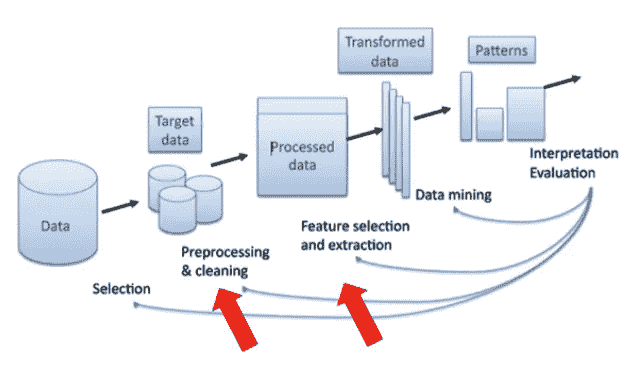

[来源](https://recommender-systems.readthedocs.io/en/latest/_images/Kdd-process.png)

在数据挖掘过程中，所获得的数据集并不总是需要完全精炼并准备好被训练成模型。数据集可能包含异常值、噪声或重复值，从而导致数据的不正确可视化。此外，在训练模型时，质量差的数据集可能会为我们提供非常好的性能或准确性，但在模型测试期间，它可能会生成很高的错误值。这将损害机器学习中方差和偏差的经验法则。为了避免这种情况，我们引入了一些在数据预处理阶段细化数据时使用的技术。

# 数据预处理技术

*   聚合
*   抽样
*   降维
*   特征子集选择
*   特征创建
*   离散化和二值化
*   变量变换

# 聚合

聚合是将两个或多个属性组合成一个属性的技术。

## 聚合的目的

## 数据简化:

当我们组合这些属性时，我们获得了一个更小的数据集，其中包含了更少的属性。这有助于我们减少内存使用和快速响应时间。在下面的示例中，属性税与收入合并，因为税块适用于收入超过 5L 的人。最终，由于通过应用条件来合并列，记录减少了。

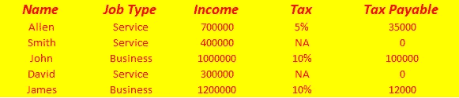

作者图片

作者图片

## 比例变化:

可以通过应用比例的变化来聚集数据集。这里我们改变了给定数据集的可能值的总数。例如，在这里的给定数据帧中，计算给定一天中每一分钟的股价。如果我们每周都要分析数据呢？因此，我们得出给定一周的最高价、最低价、收盘价和总成交量的值。这将显著减少数据集中的记录。

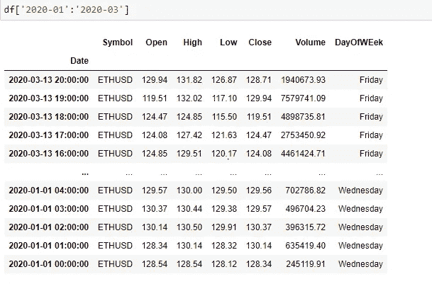

作者图片

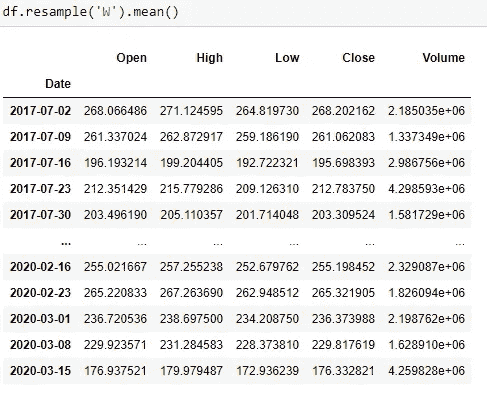

作者图片

# 抽样

*   抽样是用于数据选择的主要技术。

–它通常用于数据的初步调查和最终数据分析。

*   **采样用于数据挖掘，因为处理整个感兴趣的数据集太昂贵或太耗时。**

## 取样类型

## **简单随机抽样**

给定人群中的每条记录都有同等的机会被选中。

## **无替换取样**

选择每个记录将从原始群体中删除该记录。

## **替换取样**

选择记录并不会将其从原始群体中移除。这些记录可以在以后用于取样。

## **分层抽样**

当采样时，记录被分割成分区，从单个分区中选取单个记录。

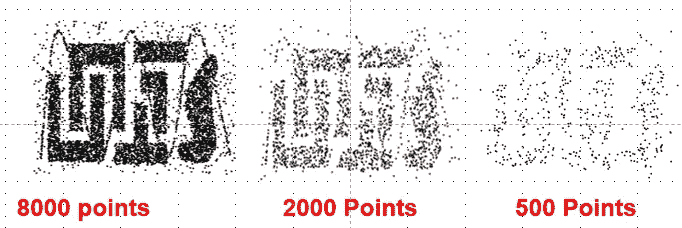

作者图片

上图是一个更好理解采样概念的例子。从原始图中删除点可能不会影响原始图，但仍然会产生预期的结果。

# 降维

它是一种找出对输出有很大影响的最相关的特征并丢弃最不相关的特征以降低建模的计算成本并执行模型的平滑功能的技术。

## 优势:

*   去除不相关的特征。
*   提高模型的预测精度。
*   促进存储和计算成本的降低。
*   提高对数据和模型的理解。

考虑我们用来解释聚合概念的同一个例子。我们可以直接根据个人的收入来计算应纳税额，而不是用百分比来表示税收。因此，减少要素或列会缩短模型的计算时间。

# 特征子集选择

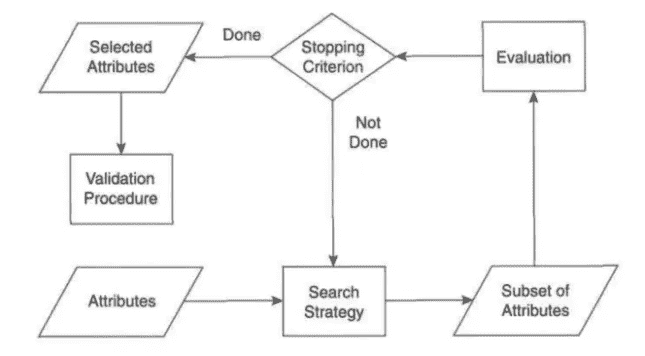

数据挖掘简介—庞-谭宁、迈克尔·斯坦巴克、维平·库马尔

特征子集选择也是一种类型降维技术。这里，我们选取了有助于定义鲁棒系统的最佳输出集，该系统可以使我们的误差率最小。在数据挖掘过程中，任何不包含与输出要素相关的特定信息的特定要素都会被丢弃或忽略。

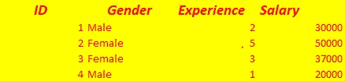

作者图片

在上图中，我们正在计算一名员工的工资。在这种情况下，我们需要员工的 id、工作年限和部门。一个人的性别对输出几乎没有任何影响。因此，在使用该模型计算雇员的工资时，我们放弃了性别列。

应用特征选择技术的方法很少，如下所述:

## **强力方法:**

用户必须尝试所有可能的特征子集作为数据挖掘算法的输入。这种方法是一种试错法，在实践中不推荐使用。

## 过滤方法:

在运行数据挖掘算法之前选择功能。我们找到特征之间的依赖性并定义相关性。相关值介于-1 到 1 之间。相关值越高，特征就变得越重要。

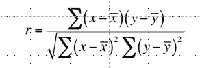

作者图片

## 包装方法:

使用数据挖掘算法作为黑盒来查找属性的最佳子集。

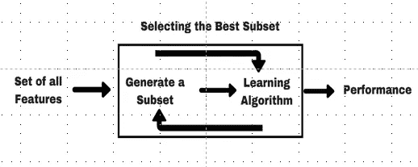

作者图片

# 特征创建

## 特征抽出

从一组给定的属性生成有限特征的过程称为特征提取。例如，如果给你一个名人的面部图像，那么可能仅仅发生代表图像像素的一些边缘或边界就足以让个人识别该名人。因此，如果给我们一个 60*60 像素的图像，那么我们可以将图像的大小调整为 35*35 像素，只包含微小的细节，这对于了解图像所代表的内容是必要的。

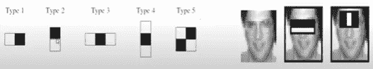

[来源](https://www.researchgate.net/publication/327415969_A_Study_on_Face_Detection_Using_Viola-Jones_Algorithm_for_Various_Backgrounds_Angels_and_Distances)

在上面的图像中，我们可以只提取眼睛部分或者两眼之间的部分来生成图像供用户查看。

## 特征构造

从现有要素构建新要素的过程称为要素构造。例如，如果我们得到如下所示的学生数据，它包含 4 个特征，如姓名、id、科学和数学分数。如果老师想要计算这两个科目的分数百分比，那么我们插入一个根据这两个科目的分数计算的新列。

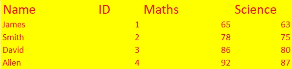

作者图片

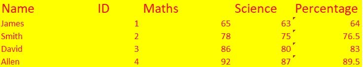

作者图片

# 离散化和二值化

## [数]离散化

离散化是一种根据值对要素进行分组的方法。

更一般地说，它是一种为变量的给定连续值集指定离散范围的方法。

如下所示，我们定义了该国某个特定城市某个家庭的平均成员人数。从通过各种来源收集的不同数据中可以看出，某个城市的家庭成员一般都在一个确定的范围内。定义给定要素范围的过程有助于通过减小数据集的大小来降低计算的复杂性。

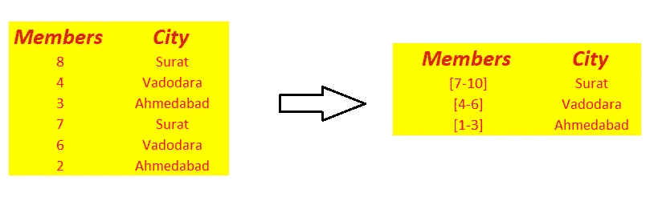

作者图片

## 二值化

这是一种将属性转换成二进制变量格式的方法。具有多个相关值的特征使用 skit-learn 库中可用的方法进行分类编码，并以 0 和 1 的形式表示。

考虑下面的例子，在这个例子中，我们考虑到了人们和他们所属的国家。因为有大量的国家，所以我们可以将国家的表示转换成二进制格式。

作者图片

# 属性转换

一种在相同比例范围内映射特征的技术。这些特征总是具有不同范围的值。例如，重量总是以千克为单位，其值通常在 80-120 千克之间。人的身高是以厘米为单位来衡量的，它的范围是 160 厘米-180 厘米。因此，在预测输出函数时，所有特征必须落在相同的范围内。为了达到同样的目的，我们使用下面提到的两种著名技术:

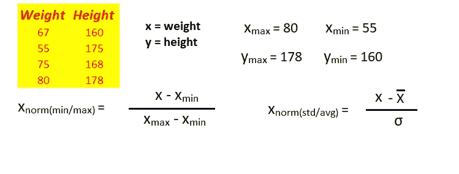

作者图片

## z 分数标准化

一种使用给定特征的均值和标准差来找出给定记录的归一化特征值的方法。归一化值如上图所示，其中平均值从原始值中减去，然后除以其标准偏差。这将在-1 到 1 的范围内转换任何给定特性的值。

## 最小/最大标准化

一种使用特征的最小值和最大值来找出给定记录的归一化特征值的方法。归一化值如上图所示，其中最小值从原始值中减去，然后除以其最大值。这将在 1 到-1 的范围内转换给定特性的值。

来源参考:

 [## 减少数据挖掘算法所需的时间和内存量允许数据|课程英雄

### 减少数据挖掘算法所需的时间和内存量允许来自伊拉斯谟大学 CS FEB53020 的数据…

www.coursehero.com](https://www.coursehero.com/file/p7qdlan/Reduce-amount-of-time-and-memory-required-by-data-mining-algorithms-Allow-data/)  [## 数据挖掘和机器学习中的数据预处理

### 有了详细的概念…

towardsdatascience.com](https://towardsdatascience.com/data-preprocessing-in-data-mining-machine-learning-79a9662e2eb)