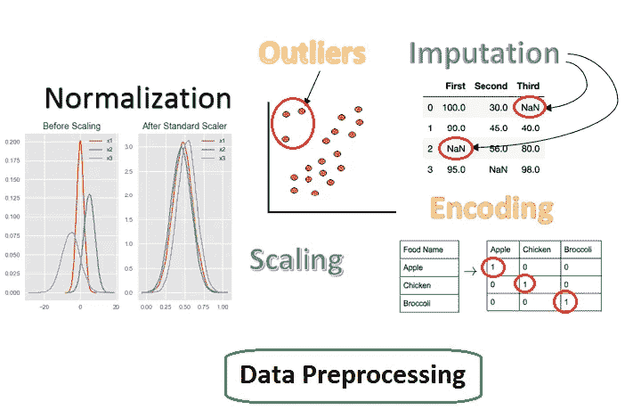
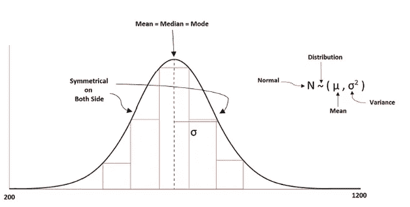
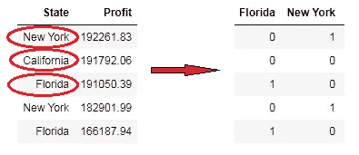
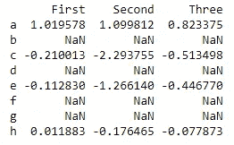
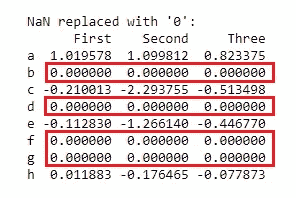

# Python 中的数据预处理概念

> 原文：<https://pub.towardsai.net/data-preprocessing-concepts-with-python-b93c63f14bb6?source=collection_archive---------0----------------------->

## [数据科学](https://towardsai.net/p/category/data-science)

## 一种为机器学习估值器准备数据的稳健方法



数据预处理方法。作者的照片

在本文中，我们将研究一些重要的数据预处理方法。这是一个非常重要的步骤，可视化的数据，并使其在一个合适的形式，使估计(算法)拟合良好，具有良好的准确性。

## 涵盖的主题:

1.  标准化
2.  使用稀疏数据和异常值进行缩放
3.  正常化
4.  分类编码
5.  归罪

> ***标准化***

标准化是处理数据点的平均值和标准偏差的过程。作为原始数据，这些值从很低到很高不等。因此，为了避免模型中的低性能，我们使用标准化。它说，平均值变成零，标准差变成一个单位。

标准化的公式如下所示:

**z =(特征值—均值)/标准差**



典型的均匀分布。作者的照片

当我们使用算法来拟合我们的数据时，它假设数据是集中的，并且所有特征的方差的阶是相同的，否则估计器将不能正确预测。

sklearn 库在预处理类中有一个用 StandardScaler 标准化数据集的方法。

我们使用 import 命令在 python 中使用这个特性。

```
#Before modeling our estimator we should always some preprocessing scaling.# Feature Scaling
from sklearn.preprocessing import StandardScaler
sc = StandardScaler()
X_train = sc.fit_transform(X_train)
X_test = sc.transform(X_test)
```

[](/z-statistics-t-statistics-p-statistics-are-still-confusing-you-87557047e20a) [## Z-统计量，T-统计量，P-统计量还在迷惑你？

### 机器学习统计学中的定义和概念

pub.towardsai.net](/z-statistics-t-statistics-p-statistics-are-still-confusing-you-87557047e20a) 

> ***带有稀疏数据和离群值的缩放***

**稀疏数据缩放:**

数据的缩放是使特征值在“0”和“1”的某个范围内的另一种方式。有两种方法可以做到这一点，即 MinMaxScaler 和 MaxAbsScaler。

python 的例子

```
import numpy as np
X_train = np.array([[ 1., 0.,  2.], [ 2.,  0.,  -1.], [ 0.,  2.,
                                                             -1.]])from sklearn.preprocessing import MinMaxScaler
min_max_scaler = MinMaxScaler()X_train_minmax = min_max_scaler.fit_transform(X_train)print(X_train_minmax)#output:
array([[0.5, 0\. , 1\. ],
       [1\. , 0\. , 0\. ],
       [0\. , 1\. , 0\. ]])
```

正如我们看到的，输入值的范围是“0”和“1”。

创建稀疏数据中心的缩放不是一个好主意，因为它可能会改变其结构。因此，对具有不同比例值的输入原始数据进行比例缩放是很好的。

**带有异常值的缩放:**

当原始数据有许多异常值时，使用均值和方差进行缩放就不能很好地处理数据。因此，我们必须使用更稳健的方法，如四分位法(IQR)，因为异常值受均值和方差的影响。IQR 的范围在 25%和 75%之间，其中移除了中间值并缩放了分位数范围。

`RobustScaler`取一些参数进行缩放。

*   第一个参数是`with_centering`，如果为真，则在缩放之前将数据居中。
*   第二个参数是`with_scaling`,如果为真，那么它在分位数范围内缩放数据。

python 的例子

```
from sklearn.preprocessing import RobustScaler
X = [[ 1., 0.,  2.], [ 2.,  0.,  -1.], [ 0.,  2., -1.]]
transformer = RobustScaler().fit(X)transformer.transform(X)#output:
array([[ 0.,  0.,  2.],
       [ 1.,  0.,  0.],
       [-1.,  2.,  0.]])
```

> ***正常化***

这里的缩放过程是将这些值标准化为它们的单位范数。这种规范化的一个例子是 MinMaxScaler。当我们处理成对形式的二次型时，这个过程是有用的，它可以是基于核的，也可以是基于点积的。

基于向量空间模型(即与文本数据样本相关的向量)也有助于数据过滤。

两种类型的规范化如下所示:

*   归一化:它将输入向量缩放到单位范数。norm 参数用于标准化所有非零值。它需要三个参数 L1、L2 和马克斯，其中 L2 是默认的规范。
*   规格化器:它也做同样的操作，但是在这个过程中 fit 方法是可选的。

Python 的例子:

```
from sklearn.preprocessing import normalize
X = [[ 1., 0., 2.], [ 2., 0., -1.], [ 0., 2., -1.]]
X_normalized = normalize(X, norm=’l2')print(X_normalized)#output:
array([[ 0.4472136 ,  0\.        ,  0.89442719],
       [ 0.89442719,  0\.        , -0.4472136 ],
       [ 0\.        ,  0.89442719, -0.4472136 ]])
```

标准化器示例:

```
from sklearn.preprocessing import Normalizer
X = [[ 1., 0., 2.], [ 2., 0., -1.], [ 0., 2., -1.]]normalizer = preprocessing.Normalizer().fit(X)normalizer.transform(X)#output:
array([[ 0.4472136 ,  0\.        ,  0.89442719],
       [ 0.89442719,  0\.        , -0.4472136 ],
       [ 0\.        ,  0.89442719, -0.4472136 ]])
```

规格化器在开始时在数据处理的流水线中是有用的。

当我们使用稀疏输入时，重要的是将其转换为非 CSR 格式，以避免多个内存副本。CSR 是压缩稀疏行进来的***scipy . Sparse . CSR _ matrix***。

[](/become-a-data-scientist-in-2021-with-these-following-steps-5bf70a0fe0a1) [## 按照以下步骤，在 2021 年成为一名数据科学家

### 走上数据科学家之路需要具备的基本点

pub.towardsai.net](/become-a-data-scientist-in-2021-with-these-following-steps-5bf70a0fe0a1) 

> ***分类编码***

当我们得到一些原始数据集时，一些列不是连续的值，而是在一些二进制和多类别的类别中。因此，为了使它们成为整数值，我们使用编码方法。下面给出了一些编码方法:

*   *****标签编码器:*** 用于将 sklearn 库中的二进制类别编码为数值。**
*   *****一个热编码器:***sk learn 库提供了另一个特性，用新的特性列将 categories 类转换成新的数值 0 和 1。**
*   *****哈希:*** 在高维的情况下比一键编码更有用。当要素中有高基数时使用它。**

**还有很多其他的编码方式，像 ***均值编码*、** ***赫尔默特编码*、*序数编码*、*概率比编码*** 和等等。**

****Python 的例子:****

```
df1=pd.get_dummies(df['State'],drop_first=True)
```

****

**获取假人编码。作者的照片**

> *****插补*****

**当原始数据中存在一些缺失值时，将缺失记录转换为数值称为输入。**

**创建随机数据帧。**

```
# import the pandas library
import pandas as pd
import numpy as npdf = pd.DataFrame(np.random.randn(4, 3), index=['a', 'c', 'e',
'h'],columns=['First', 'Second', 'Three'])df = df.reindex(['a', 'b', 'c', 'd', 'e', 'f', 'g', 'h'])print (df)
```

****

**缺少值的数据帧。作者的照片**

**现在用零值代替。**

```
print ("NaN replaced with '0':")
print (df.fillna(0))
```

****

**用零填充的缺失值。作者的照片**

**用平均值替换缺失值。**

```
from sklearn.impute import SimpleImputer
imp = SimpleImputer(missing_values=np.nan, strategy='mean')
```

**sklearn 提供了简单的估算器来查找 NAN 值并用平均值填充。**

**我们可以在管道中使用估算器来使估算器更好。**

**[](/correlation-and-its-types-in-statistics-7a723dcfd12d) [## 统计学中的相关性及其类型

### 统计学有助于理解机器学习中的行为

pub.towardsai.net](/correlation-and-its-types-in-statistics-7a723dcfd12d) 

> ***结论:***

数据预处理是使数据集对我们的估计者更可靠的一个重要步骤。

我希望你喜欢这篇文章。通过我的 [LinkedIn](https://www.linkedin.com/in/data-scientist-95040a1ab/) 和 [twitter](https://twitter.com/amitprius) 联系我。

# 推荐文章

1.  [NLP —用 Python 从零到英雄](https://medium.com/towards-artificial-intelligence/nlp-zero-to-hero-with-python-2df6fcebff6e?sk=2231d868766e96b13d1e9d7db6064df1)

2. [Python 数据结构数据类型和对象](https://medium.com/towards-artificial-intelligence/python-data-structures-data-types-and-objects-244d0a86c3cf?sk=42f4b462499f3fc3a160b21e2c94dba6)

3. [Python:零到英雄带实例](https://medium.com/towards-artificial-intelligence/python-zero-to-hero-with-examples-c7a5dedb968b?source=friends_link&sk=186aff630c2241aca16522241333e3e0)

4.[用 Python 全面讲解 SVM 分类](https://medium.com/towards-artificial-intelligence/fully-explained-svm-classification-with-python-eda124997bcd?source=friends_link&sk=da300d557992d67808746ee706269b2f)

5.[用 Python 全面解释 K-means 聚类](https://medium.com/towards-artificial-intelligence/fully-explained-k-means-clustering-with-python-e7caa573176a?source=friends_link&sk=9c5c613ceb10f2d203712634f3b6fb28)

6.[用 Python 全面解释线性回归](https://medium.com/towards-artificial-intelligence/fully-explained-linear-regression-with-python-fe2b313f32f3?source=friends_link&sk=53c91a2a51347ec2d93f8222c0e06402)

7.[用 Python 全面讲解逻辑回归](https://medium.com/towards-artificial-intelligence/fully-explained-logistic-regression-with-python-f4a16413ddcd?source=friends_link&sk=528181f15a44e48ea38fdd9579241a78)

8.[Python 时间序列基础](https://medium.com/towards-artificial-intelligence/basic-of-time-series-with-python-a2f7cb451a76?source=friends_link&sk=09d77be2d6b8779973e41ab54ebcf6c5)

9. [NumPy:用 Python 零到英雄](https://medium.com/towards-artificial-intelligence/numpy-zero-to-hero-with-python-d135f57d6082?source=friends_link&sk=45c0921423cdcca2f5772f5a5c1568f1)

10.[机器学习中的混淆矩阵](https://medium.com/analytics-vidhya/confusion-matrix-in-machine-learning-91b6e2b3f9af?source=friends_link&sk=11c6531da0bab7b504d518d02746d4cc)**