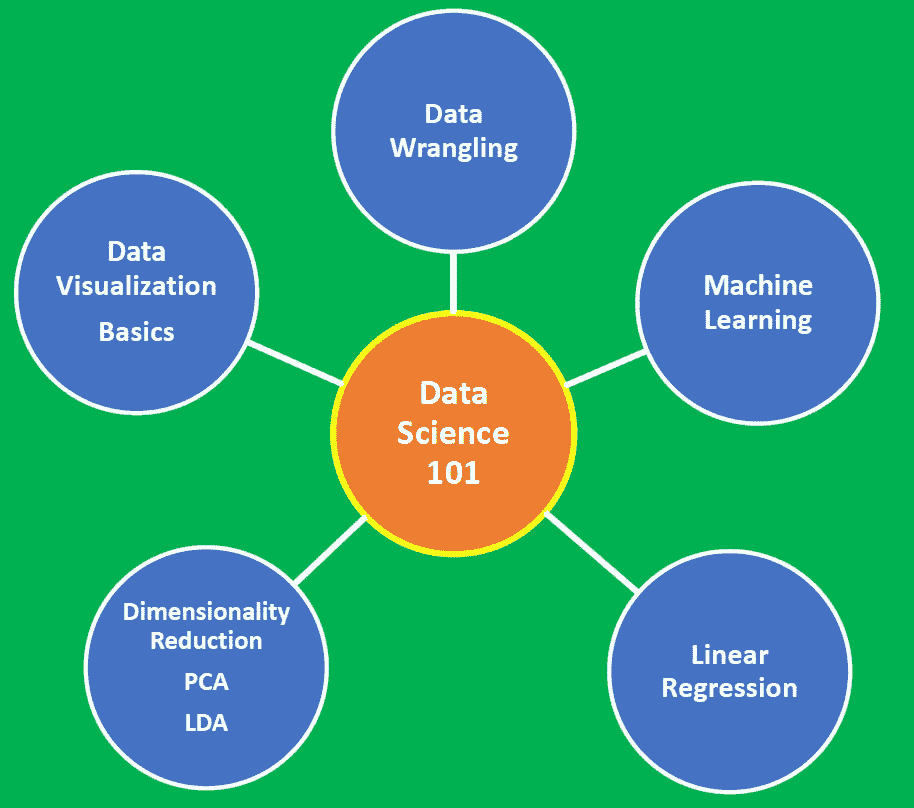

# 数据科学 101 —包含 R 和 Python 代码的中型平台短期课程

> 原文：<https://pub.towardsai.net/data-science-101-a-short-course-on-medium-platform-with-r-and-python-code-included-3cdc9d489c6d?source=collection_archive---------0----------------------->

## 数据科学 101 | [走向 AI](https://towardsai.net)

数据科学 101 面向的是那些之前接触过数据科学概念或了解数据科学概念，并且对 DataCamp、Coursera、Udemy 或 edX 等平台上大多数初级数据科学课程之外的实际应用感兴趣的个人。

本课程将通过真实世界的例子为您提供数据科学所需的基础知识。本课程包含几个使用 R 和 Python 编写代码的示例，R 和 Python 被认为是大多数数据科学组织和行业使用的两大编程语言。

# **为什么您应该学习本课程**

1.  所有课程材料都包含在我的媒体数据科学文章的链接中，因此您无需离开该平台即可访问课程材料。补充课程材料，如数据集、jupyter 笔记本、R 脚本和示例输出文件都包含在我的 GitHub 资源库的链接中。
2.  使用 R 或 Python 为所有示例提供了代码。您可以下载每个示例的代码和数据集，然后出于学习目的对其进行相应的修改，或者修改代码来解决一个完全不同的问题。
3.  本课程也可以作为那些准备数据科学家工作面试的人的快速复习，因为一些课程材料是使用典型的数据科学家面试带回家挑战项目中的材料设计的。
4.  作者拥有 2 年的数据科学教育经验，是在线数据科学出版物[**to AI**](https://medium.com/towards-artificial-intelligence)的顶级撰稿人，每天都在学习新的数据科学概念。因此，请随时留下反馈意见或问题，以便进一步澄清或讨论。

# 您将学到的内容:

*   R 和 Python 的基本编程技能
*   了解如何将原始数据处理成分析所需的格式
*   学习转换数据技术，如主成分分析(PCA)和线性判别分析(LDA)
*   学习基本的数据可视化原理，以及如何使用 R 的 ggplot2、Python 的 matplotlib 和 seaborn 包来应用它们
*   线性回归介绍，包括简单和多重回归问题
*   学习机器流程
*   实现机器学习算法
*   通过激发真实世界的案例研究，深入了解基本的数据科学概念
*   动手体验学习

# 先决条件

本课程假设学生对 R 和 Python 的编程概念有基本的理解。本课程还假设学生熟悉基本的数学技能。请参见文章:[**机器学习必备数学技能**](https://medium.com/towards-artificial-intelligence/4-math-skills-for-machine-learning-12bfbc959c92) 了解更多关于实践数据科学家所需的必备数学技能。

# 模块 1:数据争论

对于任何数据科学家来说，数据争论的过程都是至关重要的一步。在数据科学项目中，很少能够轻松访问数据进行分析。数据更有可能在文件、数据库中，或者从网页、tweets 或 pdf 等文档中提取。知道如何争论和清理数据将使您能够从数据中获得关键的洞察力，否则这些洞察力将被隐藏。

本模块将演示数据争论过程。您将了解以下内容:

1.  使用文件的 URL 从互联网读取 csv 文件，并将其直接转换为数据框进行分析。
2.  非结构化数据的导入
3.  使用字符串处理技术清理和组织非结构化数据
4.  将非结构化数据转换为结构化数据
5.  执行结构化数据的分析
6.  使用 R 和 Python 中的工具从 pdf 中提取数据

**模块链接:**

[使用 R 中的 sapply()函数生成表格](https://medium.com/@benjaminobi/using-sapply-function-in-r-to-generate-a-table-310c8fb931cf)

[使用 R 函数 download.file()和 read.csv()](https://medium.com/@benjaminobi/download-a-file-from-the-internet-using-the-r-functions-download-file-and-read-csv-e7bd415648e4) 从互联网下载文件

[数据争论教程:大学城数据集](https://medium.com/towards-artificial-intelligence/tutorial-on-data-wrangling-college-towns-dataset-a0e8f8dfb6ae)

[使用 Python 和 R 从 PDF 文件中提取数据](https://medium.com/towards-artificial-intelligence/extracting-data-from-pdf-file-using-python-and-r-4ed8826bc5a1)

# 模块 2:数据可视化基础

本模块将教授基本的数据可视化原理，以及如何使用 R 的 ggplot2 和 Python 的 matplotlib 包来应用这些原理。您将了解以下内容:

1.  散点图
2.  条形图
3.  历史程序
4.  概率密度图
5.  线形图
6.  配对图
7.  热图

**模块链接:**

[使用 R 的 ggplot 包的柱状图教程](https://medium.com/towards-artificial-intelligence/tutorial-on-barplots-using-rs-ggplot-package-b7f86104a974)

[数据可视化教程:天气数据](https://medium.com/towards-artificial-intelligence/tutorial-on-data-visualization-weather-data-52efa1bef183)

[好坏回归分析](https://medium.com/towards-artificial-intelligence/bad-and-good-regression-analysis-700ca9b506ff)

[从零开始构建机器学习推荐模型](https://medium.com/towards-artificial-intelligence/machine-learning-model-for-recommending-the-crew-size-for-cruise-ship-buyers-6dd478ad9900)

# 模块 3:降维技术

机器学习算法(如分类、聚类或回归)使用训练数据集来确定权重因子，这些权重因子可应用于未知数据以实现预测目的。在实现机器学习算法之前，有必要在训练数据集中仅选择相关特征。转换数据集以便只选择训练所需的相关特征的过程称为降维。降维非常重要，原因有三:

1.  **防止过度拟合**:具有太多特征的高维数据集有时会导致过度拟合(模型捕捉真实和随机效果)。
2.  **简单性**:具有太多特征的过于复杂的模型可能很难解释，尤其是当特征相互关联时。
3.  **计算效率**:在低维数据集上训练的模型计算效率高(算法的执行需要较少的计算时间)。

因此，降维在数据预处理中起着至关重要的作用。在本模块中，您将学习两种重要的降维技术:

1.  主成分分析
2.  线性判别分析(LDA)

**模块链接:**

[机器学习:通过线性判别分析进行降维](https://medium.com/towards-artificial-intelligence/machine-learning-dimensionality-reduction-via-linear-discriminant-analysis-cc96b49d2757)

[机器学习:通过主成分分析进行降维](https://medium.com/towards-artificial-intelligence/machine-learning-dimensionality-reduction-via-principal-component-analysis-1bdc77462831)

# 模块 4:线性回归

了解如何使用 Python 的 Pylab 和 Sklearn 工具来实现线性回归，这是数据科学中最常见的统计建模方法之一。您将了解以下内容:

1.  使用 Python 构建简单的线性回归器
2.  最小化代价函数的梯度下降算法
3.  超参数调谐
4.  偏差-方差权衡
5.  多元回归分析
6.  模型评估
7.  r 平方值
8.  残差和均方误差(MSE)

**模块链接:**

[机器学习:使用梯度下降的 Python 线性回归估计器](https://medium.com/towards-artificial-intelligence/machine-leaning-python-linear-regression-estimator-using-gradient-descent-b0b2c496e463)

[好坏回归分析](https://medium.com/towards-artificial-intelligence/bad-and-good-regression-analysis-700ca9b506ff)

[材料科学中的线性回归分析](https://medium.com/towards-artificial-intelligence/linear-regression-analysis-in-materials-sciences-a45caac70d70)

[使用 Pylab 的偏差-方差权衡图](https://medium.com/towards-artificial-intelligence/bias-variance-tradeoff-illustration-using-pylab-202943bf4c78)

[从零开始构建机器学习推荐模型](https://medium.com/towards-artificial-intelligence/machine-learning-model-for-recommending-the-crew-size-for-cruise-ship-buyers-6dd478ad9900)

# 模块 5:机器学习

了解机器学习如何用于构建推荐系统和使用蒙特卡罗模拟预测贷款状态。

您将了解以下内容:

1.  协方差矩阵
2.  变量选择
3.  特征标准化
4.  将数据划分为训练集、测试集和验证集
5.  模型结构
6.  模型评估
7.  超参数调谐
8.  交叉验证
9.  主成分分析、线性判别分析和套索回归
10.  Sklearn 的管道工具
11.  蒙特 卡罗模拟

**模块链接:**

[机器学习过程](https://medium.com/@benjaminobi/the-machine-learning-process-3ac14c9a557c)

[从零开始构建机器学习推荐模型](https://medium.com/towards-artificial-intelligence/machine-learning-model-for-recommending-the-crew-size-for-cruise-ship-buyers-6dd478ad9900)

[随机过程的机器学习模型](https://medium.com/towards-artificial-intelligence/machine-learning-model-for-stochastic-processes-c65a96f0b8c5)

# 参考资料和其他资源

1.  **机器学习必备数学技能**:[*https://medium . com/forward-artificial-intelligence/4-Math-Skills-for-Machine-Learning-12 bfbc 959 c 92*](https://medium.com/towards-artificial-intelligence/4-math-skills-for-machine-learning-12bfbc959c92)**。**
2.  **最佳数据科学 MOOC Specializations**:**[*https://medium . com/forward-artificial-intelligence/3-Best-Data-Science-MOOC-Specializations-d58da 382 f 628*](https://medium.com/towards-artificial-intelligence/3-best-data-science-mooc-specializations-d58da382f628)**。****
3.  ****成为数据科学家的 5 个步骤**:[*https://medium . com/forward-artificial-intelligence/成为数据科学家的 5 个步骤-239bbc60a6e3*](https://medium.com/towards-artificial-intelligence/five-steps-to-becoming-a-data-scientist-239bbc60a6e3) 。**
4.  ****数据科学家面试流程—个人经历:**[*https://medium . com/forward-artificial-intelligence/Data-Scientist-Interview-Process-A-Personal-Experience-33295495 b4a 0*](https://medium.com/towards-artificial-intelligence/data-scientist-interview-process-a-personal-experience-33295495b4a0)*。***