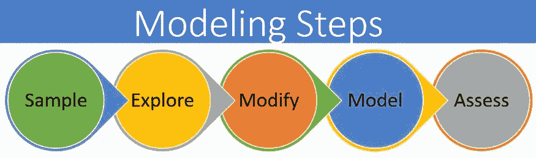
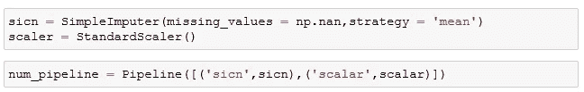

# 数据科学 101:在 Python 中使用管道指南

> 原文：<https://pub.towardsai.net/data-science-101-guide-to-using-pipelines-in-python-8a8667398a18?source=collection_archive---------3----------------------->

## [数据科学](https://towardsai.net/p/category/data-science)

## 在 Python 中使用管道的综合指南

由[坦纳·博瑞克](https://unsplash.com/@tannerboriack?utm_source=medium&utm_medium=referral)在 [Unsplash](https://unsplash.com?utm_source=medium&utm_medium=referral) 上拍摄

在我之前的文章中，我已经深入讨论了使用 Python 和 Alteryx 等不同工具构建机器学习模型的步骤。简而言之，它由以下步骤组成。

作者照片

**采样**:该过程从[数据采样](https://en.wikipedia.org/wiki/Sampling_(statistics))开始，即选择合适的数据集进行建模。

**探索:**这一阶段通过探索变量之间预期和未预期的关系来理解数据，并在[数据可视化](https://www.alteryx.com/solutions/analytics-need/bi-visualization)的帮助下发现任何异常。

**修改**:转换数据→创建新属性并估算缺失值。

**模型**:在建模阶段，重点是将各种建模(机器学习)技术应用于准备好的变量，以创建能够提供期望结果的模型。

**评估**:比较不同的模型，选择一个最符合您的数据且精确度最高的模型。

每次我们向模型中添加数据时，它们都必须经过步骤 1、2 和 3，然后才能被添加到现有模型或新模型中。当你每次想要使用不同的数据集时，不需要经历这三个阶段，你可以使用“管道”来自动执行这些数据准备步骤。在本文中，我将创建一个管道，并使用波士顿房产数据 2019 进行测试。我将使用相同的管道来准备 2020 年的波士顿房产数据。当我开始探索 Pipeline 时，我很少在一个地方找到所有信息的来源。本文将为管道提供一个**综合指南，包括准备数字变量、分类变量，将它们组合成一个步骤，最后准备用于分析的数据。**

首先，我们将加载波士顿房产数据集。我们的目标是准备波士顿房产 2020 数据，以便能够预测单户住宅的价格。

读出数据

我们将创建两个独立的管道—一个用于选择与单户住宅相关的行，另一个用于准备数据进行分析。

# **A)管道 1:选择需要分析的行:**

为了选择分析所需的行，我们将创建一个自定义函数来选择行，并使用 **FunctionTransformer** 函数来调用这个自定义函数(select_rows ),如下所示。最后，我们将使用**管道**功能将这些步骤添加到管道中。这个管道只有一个步骤，但是您可以在每个管道中添加多个步骤，您将在下一节中看到。

管道 1-选择行

# **B)管道 2:数据准备**

管道是将应用于所选列的一系列步骤。众所周知，数字变量和分类变量有不同的数据准备步骤。因此，我们将创建 3 个独立的管道来处理不同类型的独立变量。

1.  **数值变量**:居住面积、浴池数量、壁炉等。

查看数据，变量有一些缺失值。我们将用列值的平均值来估算这些值。为此，我们将使用带有 **strategy = 'mean'** 的**简单估算器**函数，如下所示。我将创建一个 num_pipeline 来应用这些转换。

这里没有显示，但是数字变量的一个常用步骤是在机器学习模型中使用它们之前标准化数据。为此，可以使用 **StandardScaler()** 函数。修订后的管道如下所示:

标准标量函数

**2)分类变量**:‘结构 _ 类别’，R _ 屋顶 _TYP，R _ 外部 _CND 等。

对于分类变量的一部分，我们将通过列的模式来估算缺失值。在用于机器学习模型之前，所有分类变量都必须使用 **OneHotEncoding()** 进行编码。我们将把这两个步骤都添加到管道中，如下所示。

分类变量流水线

分类变量:浴室和厨房风格。

接下来，我们将创建厨房和浴室风格的管道。这些是分类变量，但我们需要一个单独的管道，因为我们必须用“NA”而不是“mode”来估算缺失值。与上一步类似，我们将使用 onehotencoder()对变量进行编码。

厨房和浴室风格管道

现在，我们将使用列转换器将所有单独的管道合并到一个步骤中。要使用 column transformer，您必须传递在上述步骤中创建的管道，以及该特定步骤的列名列表。

最终管道:完整管道

最后，我们将下载 Boston Housing Property 2020 数据集，并通过两个管道传递它，如下所示。第一个管道将选择与单户住宅相关的行。然后，我们将通过完整的管道传递该管道的输出，以准备用于分析的数据。

准备波士顿房产 2020 数据进行分析

# 结论:

管道是用于自动化重复性任务的最重要的概念之一。本文为您提供了使用管道自动化数据准备的分步指南。

你可以在这里找到完整的代码[**！**](http://Medium_Pipeline_DataPrep.ipynb)

# **参考文献:**

1.  Sklearn 文档

 [## sk learn . compose . column transformer-sci kit-learn 0 . 24 . 1 文档

### 将转换器应用于数组或 pandas 数据框架的列。该估计器允许不同的列或列…

scikit-learn.org](https://scikit-learn.org/stable/modules/generated/sklearn.compose.ColumnTransformer.html) 

2.Github 链接:[https://github . com/evjanaki/data preparation/blob/master/Medium _ Pipeline _ data prep . ipynb](https://github.com/evjanaki/DataPreperation/blob/master/Medium_Pipeline_DataPrep.ipynb)