# 使用 Saturn 云部署托管 FastAPI

> 原文：<https://pub.towardsai.net/data-science-4126e13cf7fe?source=collection_archive---------1----------------------->

## [数据科学](https://towardsai.net/p/category/data-science)

[博伊图梅洛·菲特拉](https://unsplash.com/@writecodenow?utm_source=medium&utm_medium=referral)在 [Unsplash](https://unsplash.com?utm_source=medium&utm_medium=referral) 上的照片

总之，本文将探索在 Saturn Cloud 上部署 FastAPI 应用程序的过程。FastAPI 是一个健壮的 web 框架，用于用 Python 语言构建 API。[土星云](https://saturncloud.io?utm_source=Sayar+Medium&utm_medium=FastAPI+Blog&utm_campaign=FastAPI+Blog)是一个致力于扩展机器学习和大数据管道等的平台。

该模型将预测加州的房价中值。让我们直接开始吧。

# 资源

👉[储存库](https://github.com/Sayar1106/cali-house-prices-estimator)

👉 [FastAPI](https://fastapi.tiangolo.com/)

👉 [Scikit-learn](https://scikit-learn.org/stable/)

👉[作业库](https://joblib.readthedocs.io/en/latest/)

# 数据探索

我将用于训练我们机器学习模型的数据集名为“加州房价”这里可以找到[。](https://www.kaggle.com/camnugent/california-housing-prices)

我们的数据内容如下:

这些数据是关于在给定的加州地区发现的房屋，以及基于 1990 年人口普查数据的一些汇总统计数据。注意，数据并不干净，所以需要一些预处理步骤！这些列如下所示，它们的名称不言自明:

*   经度
*   纬度
*   住房 _ 中位数 _ 年龄
*   总房间数
*   总计 _ 间卧室
*   人口
*   家庭
*   中等收入
*   中位数 _ 房屋价值
*   海洋 _ 邻近

在对数据集进行初步探索时，我发现了以下情况:

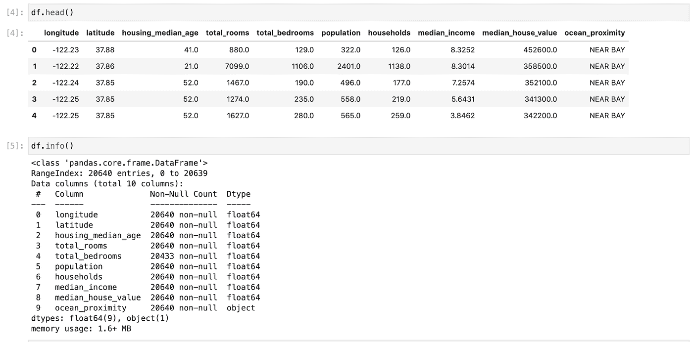

作者图片

所有数字特征之间的相关图向我们展示了以下内容:

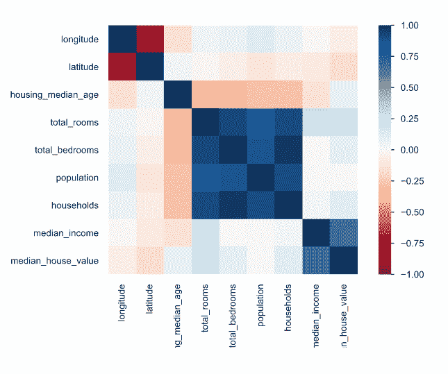

作者图片

从图中可以看出，除了中值收入(median_income)似乎在 0.68 左右具有很强的正相关性之外，大多数数值特征与中值房屋价值(median_house_value)的相关性非常小。

# 数据清理/特征工程

由于 total _ bedrooms 特性缺少值，我必须对其进行估算。为简单起见，我选择中值作为估算特性的度量。

此外，还设计了两个新功能，即“每户房间数”和“每户人口数”

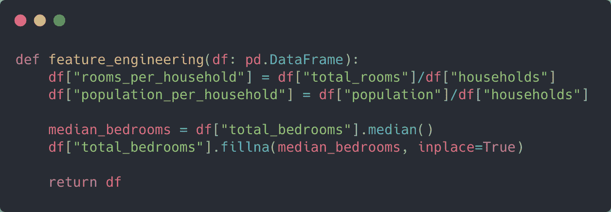

用 [carbon.now.sh](https://carbon.now.sh/) 制作

# 训练模型

我们的存储库看起来像这样:

用 [carbon.now.sh](https://carbon.now.sh/) 制作

requirements.txt 文件包含我们的依赖项。将所有依赖项添加到该文件中是至关重要的，因为在我们的部署过程中会用到它。

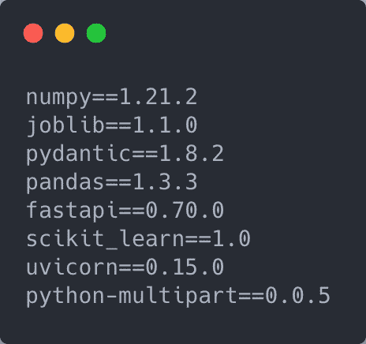

用 [carbon.now.sh](https://carbon.now.sh/) 制成

src/main.py 文件包含我们的训练脚本。让我们看看脚本中的一些基本函数。

我们的培训模型管道相对标准。只有一个分类列(ocean_proximity)。对于其他数字列，我应用了标准的缩放器。ColumnTransformer 估计器有助于促进异构数据的特性转换。

至于模型，我选择了随机森林算法。我使用 scikit-learn 的管道类创建了管道。

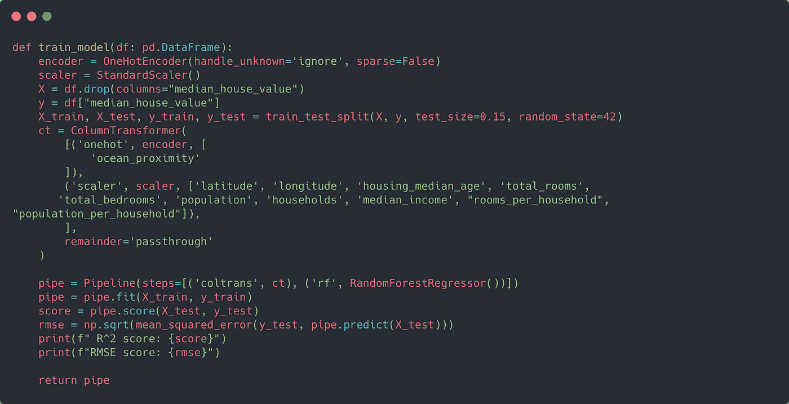

用 [carbon.now.sh](https://carbon.now.sh/) 制作

我使用 joblib 来保存我们的模型。由于模型文件相当大(> 100Mb)，我决定将它存储在 AWS S3。该模型的 R 值约为 0.81，RMSE 约为 49k。

# 设置 FastAPI 服务器和前端

正如您可能已经猜到的，app/main.py 包含我们的服务器代码。由于模型存储在 AWS 中，所以我使用 boto3 将本地副本下载到服务器。

如果您的 bucket 和文件是私有的，您可能需要在 Saturn Cloud 上设置身份验证来访问它。你可以按照这个[指南](https://saturncloud.io/docs/using-saturn-cloud/connect_data/)来做。

我编写了一个简单的函数来从 AWS 加载我们的模型:

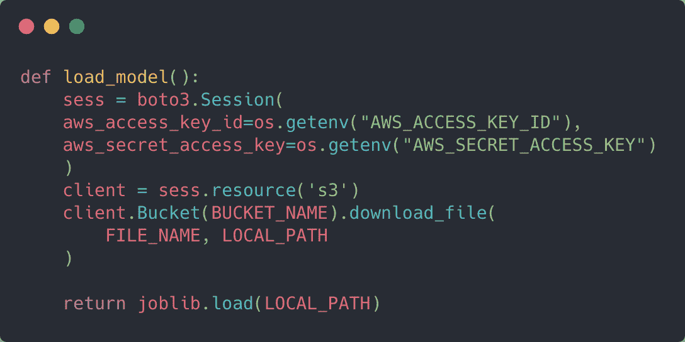

用 [carbon.now.sh](https://carbon.now.sh/) 制作

变量 BUCKET_NAME 和 FILE_NAME 是不言自明的。LOCAL_PATH 是模型将被本地复制到的路径。

我还为应用程序、模型和模板定义了全局变量。

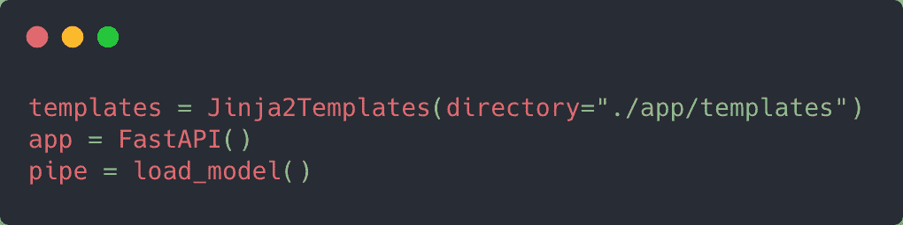

用 [carbon.now.sh](https://carbon.now.sh/) 制作

## 主页

因为我正在创建一个应用程序，所以必须有一个主页作为模型服务器的接口。

我为应用程序创建了一个主页，以便用户可以输入每个功能的值。为了呈现页面，我使用了 Jinja2Templates，它是由 FastAPI 模板提供的。TemplateResponse 呈现标题为“index.html”的登录页面

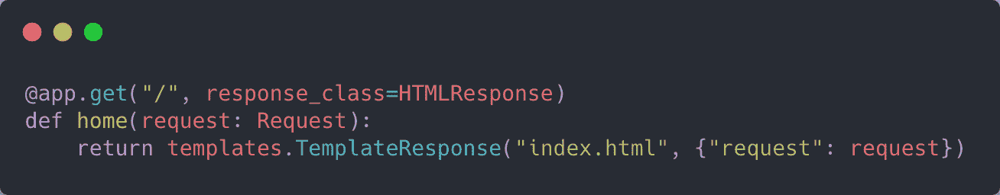

用 [carbon.now.sh](https://carbon.now.sh/) 制作

index.html 包含一个表单，它将作为我们应用程序的前端。页面的正文如下所示:

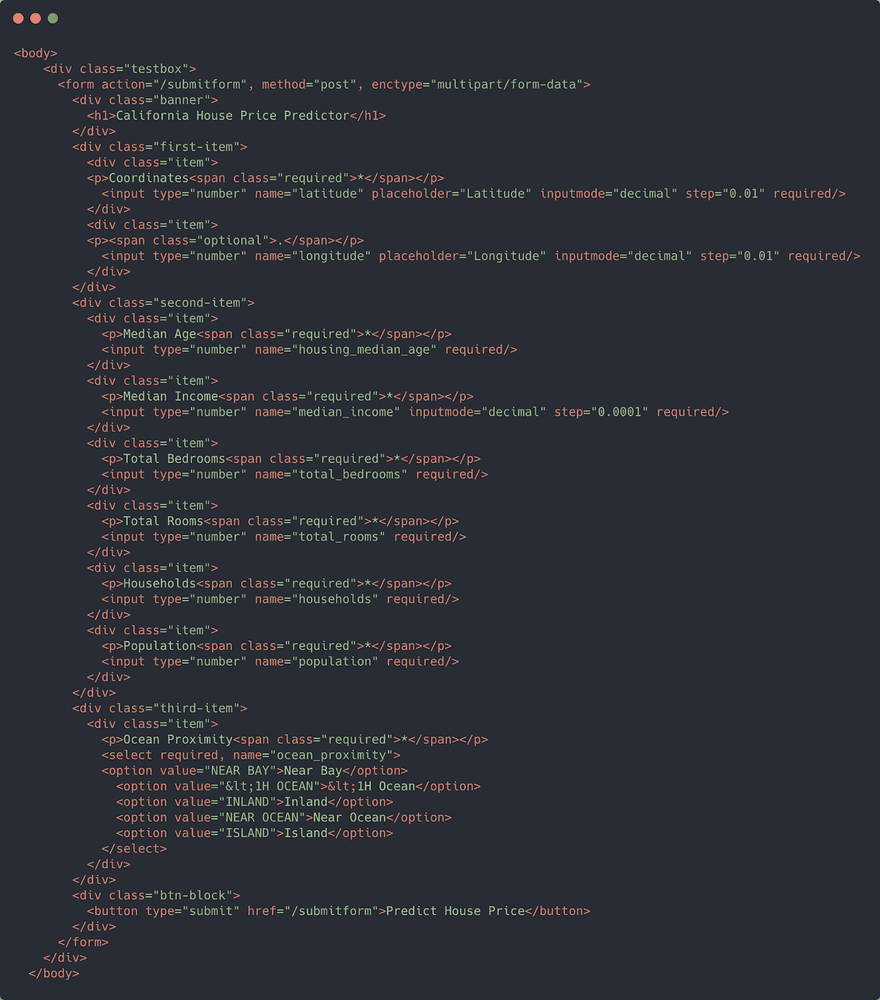

用 [carbon.now.sh](https://carbon.now.sh/) 制作

如果仔细观察 form 标记，您会看到 action 属性被设置为“/submitform ”,请求方法是 POST 请求。

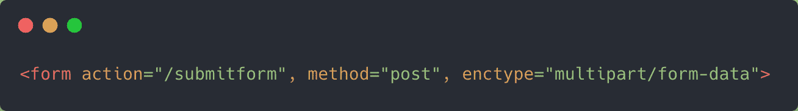

用 [carbon.now.sh](https://carbon.now.sh/) 制作

我们的 FastAPI 服务器需要一个处理表单数据的方法。这个方法需要由 app.post("/submitform ")来修饰，以适当地处理请求。

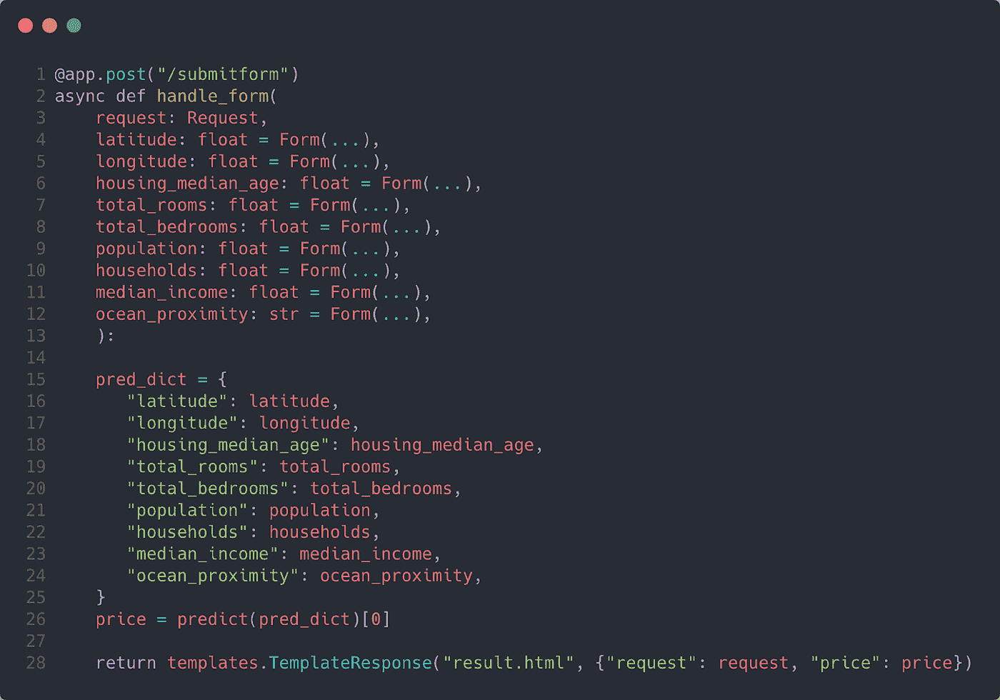

用 [carbon.now.sh](https://carbon.now.sh/) 制成

您会注意到，每个变量都使用 form 设置为表单参数。这个类告诉 FastAPI 每个变量的输入都是从一个表单中接收的。

您还会注意到第 26 行有一个名为 predict 的方法。这个方法实际上是使用适当的格式从表单向模型管道提供输入的地方。因为管道只能接收来自数据帧的输入，所以我首先将数据转换成数据帧。然后，我创建了特性，作为特性工程过程的一部分。最后，我返回模型的预测。

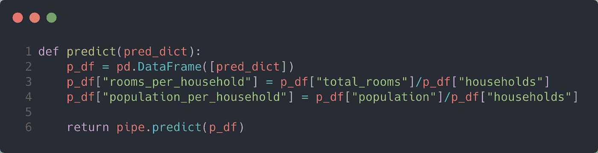

用 [carbon.now.sh](https://carbon.now.sh/) 制作

一旦我有了价格预测，我就使用模板。TemplateResponse 再次返回一个名为 result.html 的页面。除了“请求”，我还通过 TemplateResponse 方法传递了“价格”。最后，我渲染了 result.html 尸体的价格。

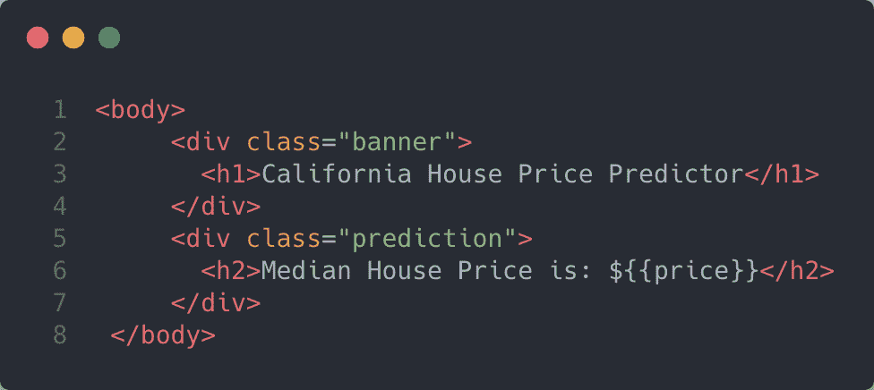

用 [carbon.now.sh](https://carbon.now.sh/) 制作

# 部署到土星云

在设置部署之前，我将所有代码都推送到 Github。要部署它，您必须将您的存储库连接到 Saturn Cloud。为此，您可以遵循本[指南](https://saturncloud.io/docs/using-saturn-cloud/gitrepo/)。

连接您的 repo 后，转到“resources”并选择“New Deployment”。

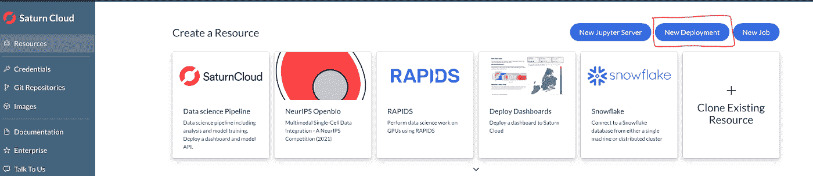

作者图片

在此之后，您将会看到一个表单:

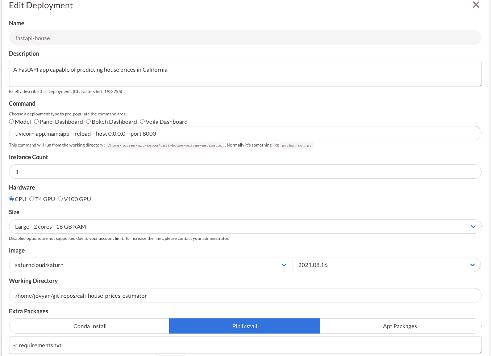

作者图片

填表时有几件事要注意。例如,“命令”是部署将运行来启动应用程序的命令。

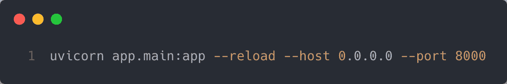

用 [carbon.now.sh](https://carbon.now.sh/) 制作

请注意，Saturn Cloud 要求您的应用程序使用端口 8000 进行侦听。

另外，请注意额外的软件包标题。这是在命令运行之前将用于安装附加软件包的脚本。由于 Saturn Cloud 的默认图像没有像 FastAPI 和 Uvicorn 这样的库，所以将“-r requirements.txt”传递给文本框。

这确保了脚本“` pip install -r requirements.txt`”在启动之前运行，其中包含附加软件包的依赖关系。

请注意，您也可以在本节中写下每个软件包的单独名称来安装它们。

一旦您点击创建按钮，您的部署将被创建。单击它，并将 Github repo 添加到部署中。确保将 Github 资源的路径添加到您的工作目录中。完成后，单击绿色箭头开始部署。

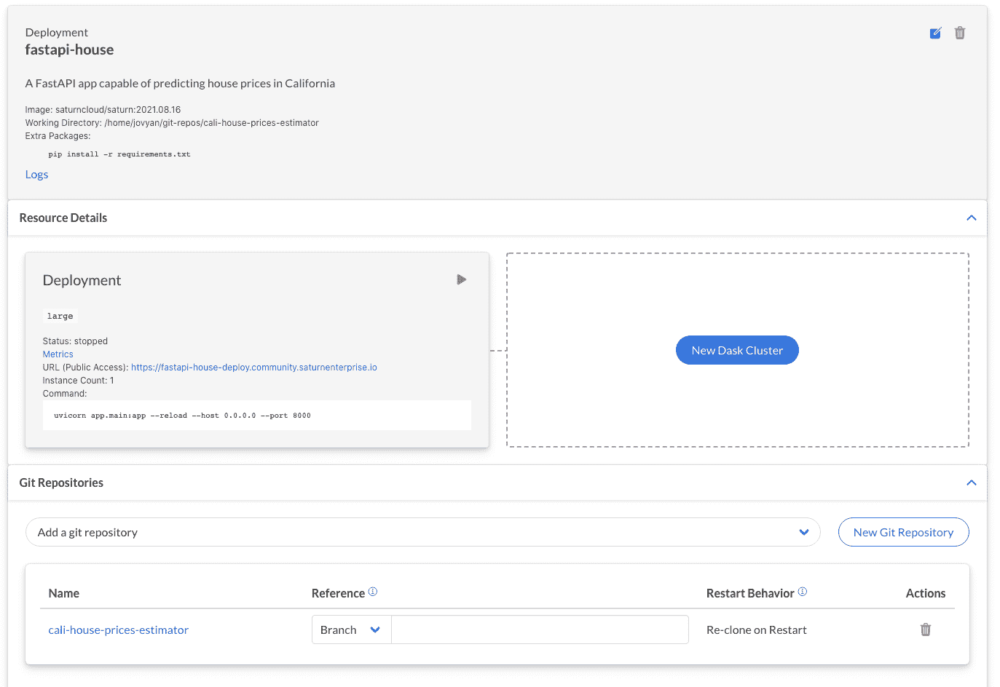

作者图片

部署就绪后，单击公共 URL。您应该会看到这样一个页面:

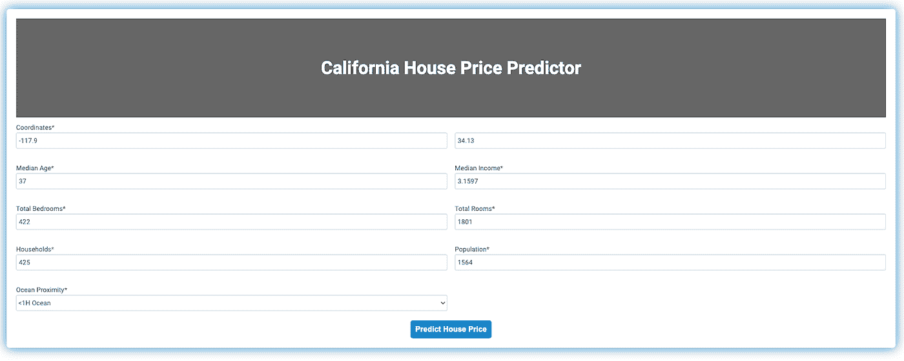

作者图片

填写完表格后，您将看到一个页面，上面有预测价格:

作者图片

注意，我使用了我的测试集的最后一个例子作为输入。实际的房价中值是 133000 美元，所以这个模型做得相当不错！😀

**👉** [**链接到 Github 目录**](https://github.com/Sayar1106/cali-house-prices-estimator)

# 结论

恭喜你！你已经成功地学会了如何在土星云上部署一个 FastAPI 模型！如果你对使用他们的环境感到好奇，他们为数据科学家和团队提供每月 30 小时的免费时间。我希望你喜欢阅读这篇文章。下次见！✋