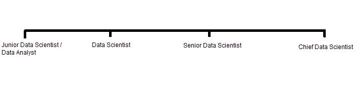

# 数据科学职业道路排名

> 原文：<https://pub.towardsai.net/data-science-career-path-rankings-b15ba395cb51?source=collection_archive---------1----------------------->

## [职业](https://towardsai.net/p/category/careers)，[数据科学](https://towardsai.net/p/category/data-science)

## 引领您的数据科学职业生涯

照片由[蒂姆·格拉夫](https://unsplash.com/@timgraf99?utm_source=medium&utm_medium=referral)在 [Unsplash](https://unsplash.com?utm_source=medium&utm_medium=referral) 拍摄

你不知疲倦地反复查看你的简历，你为你的作品集做了多个项目，你参加了无数次面试，有一天你接到一个陌生号码的电话。你拿起—

“你好”。"你好，请问我是 ________(填写你的姓名)吗？"。“嗯，是的……请问你是哪位？”你困惑地喃喃自语。“你好，我是来自*youreaabouttogethired . ai*的 Lisa，我们联系你是为了通知你，你已经获得了这个角色，我们将通过电子邮件发送确认和合同。什么时候可以开始？”。“是的……我是说昨天……我是说我可以尽快开始”。丽莎嘲笑你的兴奋，并提醒你在插队前留意你的电子邮件。你立刻松了一口气——“终于！!"。但是在突发奇想中，你发现自己在沉思。

你意识到你花了太多时间考虑如何找到一份工作，以至于你从来没有考虑过接下来会发生什么。现在你找到了一份工作，当你第一天上班时，你感到兴奋和缺乏方向的混合，后者开始在你身上生长。

好吧，这个故事有点夸张——你可能不会马上感到悲伤，但在某些时候，你会一直思考在获得第一个角色后，你的职业生涯可能会走向何方。

这不一定是一件坏事，因为许多公司都希望推动员工在公司内成长和进步，在数据科学领域，人们可以遵循一条通用的道路。

数据科学进展时间表(图片由作者提供)

> **注意**:这个时间线是我在这个行业中看到的，尽管根据公司的规模，中间可能会有其他角色。此外，我提到初级数据分析师是进入数据科学的开始阶段的一部分，但不会进一步提到这个主题，因此请在提供的链接中阅读更多信息。

 [## 数据相关角色概述

### 不同视角的数据

towardsdatascience.com](https://towardsdatascience.com/overview-of-data-related-roles-70ca48f8deed) 

鉴于这一时间表，我与几位资深数据科学人员(就工作时间表而言)进行了交谈，以获得一些回顾，或者在某些情况下提供一些见解，了解时间表中每个阶段的工作情况。

## 初级数据科学家

与你可能在招聘板上看到的虚假职位描述相反，作为初级数据科学家，企业只希望你具备基本的数据科学知识，而不是 3 年以上的经验。你的资深同事会意识到你缺乏经验，并且(通常)会很乐意在你的发展中支持你。

很可能每一天对你来说都是一次全新的冒险，在那里你会被所有你将要学习的新事物所震撼。因此，很天真是可以的，因此欢迎学习，一定要问大量的问题，以确保你尽可能多地参与和学习。

您可能不会有非常复杂的任务，尽管需要记住的是，数据科学无论如何都非常复杂，每个公司对复杂程度的定义都不同。这没什么好害怕的，因为当一项任务被分配给你时，你会得到更多高级职员的支持(考虑到公司接受导师文化)。

## 数据科学家

从初级数据科学家的下一个线性发展是成为数据科学家，这可以被视为中级区域，因此到了这个级别，你已经对公司使用的一些主要概念、技术和工具(或快速学习新工具的能力)有了坚实的理解。

当心不要陷入在寻求发展之前你必须知道一切的陷阱。只要你在数据科学(DS)工作流程中的许多领域都有能力，并且你有意识地不具备 DS 工作流程中需要的其他技能。尽管如此，你已经获得了很多专业经验，而且你更有信心独自工作。

进一步强调你在数据科学方面的学习是无止境的，你仍然愿意学习新的方法和技术来提高你的技能，你仍然会问问题。ALOT！现在的一个主要区别是，你可能(应该)扮演一个导师的角色，指导那些寻求职业发展的初级同事。

另一个主要的区别是，当你开始执行任务时，你会更多地参与到决策过程中，因为你对项目工作的整体理解已经提高了(或者至少应该提高)。还是那句话，你不需要什么都知道。只要你知道你需要做什么，你就会做得很好。

## 高级数据科学家

作为一名数据科学家，有些技能你并不精通，但现在你已经在这方面有所成长和提高。你还走得更远，发展了一些你最初日常职责之外的知识。

当然，您对主要概念、技术和实践的理解会显著增强——您也会对它们的不足之处有深刻的直觉。总的来说，你的实践经验非常丰富，从初中时代开始，你的自信心成倍增长。

鉴于你深厚的基础，你有一个庞大的知识目录，使学习新的主题更加无缝，因为他们通常倾向于建立在旧知识的基础上。这也意味着你仍然乐于学习新东西，尽管你更像是初级同事的老师和支持系统。

为了进一步增加您的职责，您可能会是在整个企业中鼓励采用先进的数据科学和分析的人。

## 首席数据科学家

从高级数据科学家到首席数据科学家，界限可能会变得有点模糊。高级数据科学家和首席数据科学家之间的一个主要区别是，高级数据科学家每次主要专注于一个项目，尽管他们可能会研究未来的项目，或者帮助移交给机器学习工程师(或者任何将项目投入生产的人)。

另一方面，首席数据科学家将管理整个数据团队(包括机器学习工程师、数据工程师等)，并将参与各种不同的项目，这些项目涉及与公司相关的技术和业务方面。

因此，可以有把握地说，你的技术能力已经达到顶峰，你现在应该更有商业头脑，而不是展示你的技术神经，当客户在时给你一个座位(取决于公司)。

> “团队的领导者和导师，贡献者，但主要是连接业务战略和数据科学项目的桥梁。”— [创新企业](https://channels.theinnovationenterprise.com/articles/are-you-ready-to-become-a-chief-data-scientist#:~:text=As%20a%20Chief%20Data%20Scientist%2C%20you%20will%20be%20involved%20in,strategy%20and%20data%20science%20projects.)

整体性取决于你，以确保数据团队获得结果，你必须将更新传达回业务部门(如 KPI)，同时处理一些围绕人工智能的道德问题。

## 包裹

这个概述绝对不是通用的，标准会因公司而异，因此在考虑你希望如何推进你的职业生涯时，布局应该只是一个有用的指南。您可能听说过的其他一些角色包括首席数据科学家和首席数据科学家。在与一些首席数据科学家的讨论中，我发现很难区分他们的角色和首席数据科学家的角色，而我无法联系任何首席数据科学家来了解关于该角色的更多信息，并且互联网资源对此非常模糊。

我很想听听人们对这个布局的看法，以及你是否认为我遗漏了什么。

通过 [LinkedIn](https://www.linkedin.com/in/kurtispykes/) 和/或 [Twitter](https://twitter.com/KurtisPykes) 与我联系

## 如果你喜欢这个，你可能也会喜欢:

 [## 数据科学家:适应压力

### 探索成为数据科学家的压力因素

towardsdatascience.com](https://towardsdatascience.com/data-scientists-get-comfortable-being-stressed-192dd974a848)  [## 数据科学:不知道 2021 年还性感吗

### 了解数据科学是否仍然有吸引力，它是否适合你

towardsdatascience.com](https://towardsdatascience.com/data-science-i-wonder-if-its-still-sexy-in-2021-b68006c78f71)  [## 揭穿数据科学的神话

### 他们不告诉你数据科学的真相

towardsdatascience.com](https://towardsdatascience.com/debunking-data-science-myths-83d693fb5ba4)