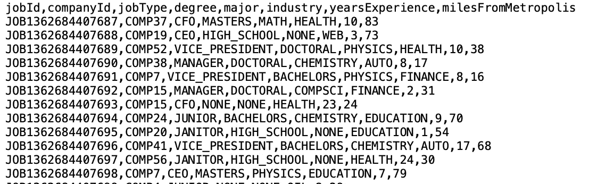
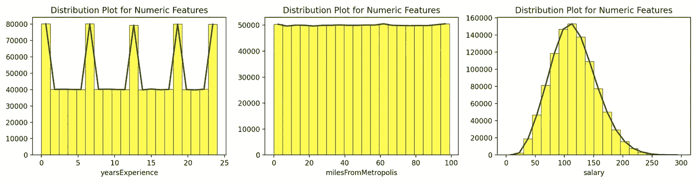
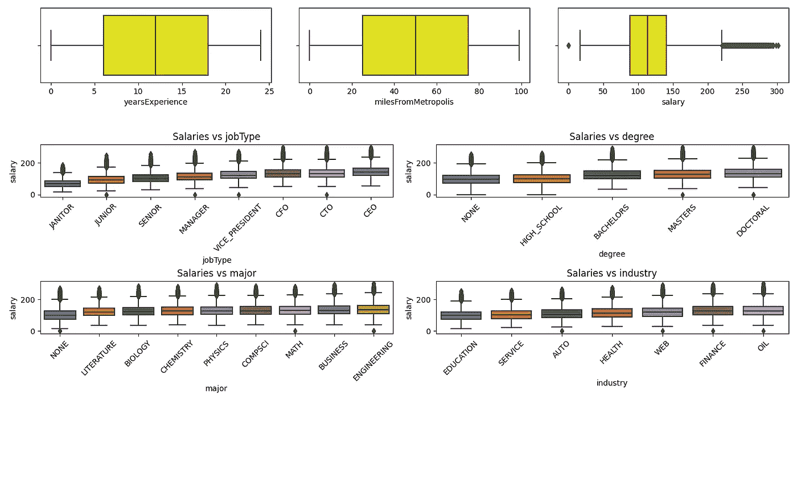
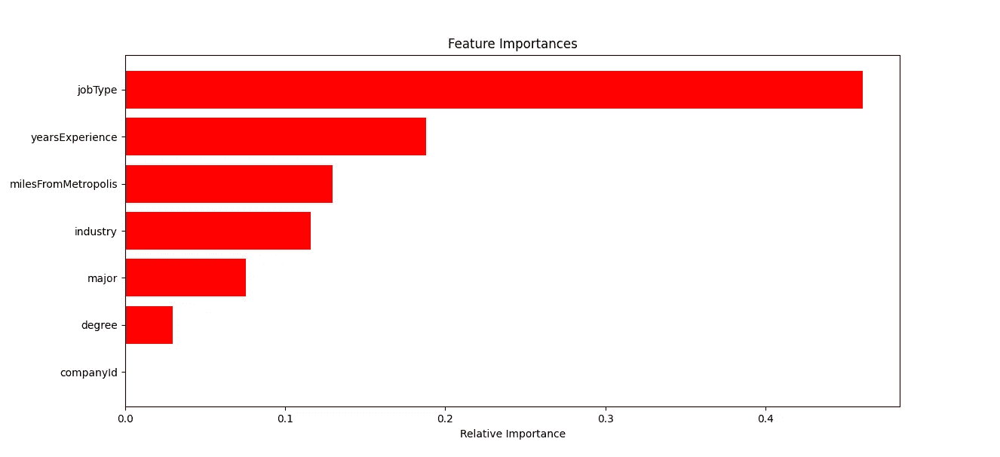

# 数据科学案例研究:预测职位发布的工资

> 原文：<https://pub.towardsai.net/data-science-case-study-predicting-salaries-of-job-postings-e1cbb4e83054?source=collection_archive---------4----------------------->

## 使用 Python 实现的机器学习来预测工作搜索引擎的工作发布的工资的端到端案例研究


赞恩·格里芬在 [Unsplash](https://unsplash.com/images/people?utm_source=unsplash&utm_medium=referral&utm_content=creditCopyText) 上的照片

> “教育不是减少群体数量。教育就是帮助每个学生成功”
> 
> **吴恩达**

在这个端到端的数据科学案例研究中，我们将使用一系列机器学习模型来估计求职引擎**实际上是**的职位发布的工资。我们将使用 K-Fold 交叉验证及其估计的 RMSE/MSE/MAE 来训练和评估多个 ML 模型的性能。表现最佳的模型将在最后被选出，并保存测试职位发布的预测工资。

***GitHub 仓库中有数据和 Python 代码*** [*这里有*](https://github.com/TatevKaren/Predicting-Jop-Postings-Salary)

## 博客的内容

[**1。定义业务和数据科学目标**](#f18f)

[2。数据预处理](#9c70)

[**3。数据可视化**](#e07d)

[**4。方法论(ML 模型比较与描述)**](#509d)

[**5。机器学习模型的分步训练过程**](#0591)

[**6。评估我们的机器学习模型**](#209d)

[**7。特征重要性**](#8ba7)

# 1.定义业务和数据科学目标

如果你曾经尝试过使用现代的求职搜索引擎，比如“[](https://www.glassdoor.ca/index.htm)**”、“ [**事实上**](https://ca.indeed.com/?r=us) ”来搜索“[**【LinkedIn】**](https://www.google.com/url?sa=t&rct=j&q=&esrc=s&source=web&cd=&cad=rja&uact=8&ved=2ahUKEwiEu8yk3o78AhX2HjQIHY5IC_gQFnoECBcQAQ&url=https%3A%2F%2Fca.linkedin.com%2F&usg=AOvVaw3O3wU5fIskZ64tw9aWju8g)”，那么你可能会注意到，一些招聘信息中提到了薪水，但大多数都没有提供这一信息。每个职位发布的工资信息对候选人非常有帮助，因为它为他们节省了大量的前期时间。这将避免候选人经历这一过程，并在最后发现他们不会得到相应或预期的报酬。**

**这对于任何工作搜索引擎来说都是一个主要问题，因为大多数工作发布都不包括工作薪水，增加这些功能可能会提高搜索引擎的用户满意度和参与度。**

**在任何案例研究中，我们需要做的第一件事就是定义和制定业务目标和技术(数据科学)目标，通过完成案例研究或项目来实现这些目标。**

## **商业目标**

***在这个案例研究中，我们的目标是为工作搜索引擎创建一个工资估算功能。这些新职位发布的预计薪资可以为求职者提供薪资信息，从而改善他们的体验。***

## **技术(数据科学)目标**

***本案例研究的技术目标是使用机器学习来预测给定职位描述的工作机会的薪资。***

**我们将回答以下问题:**

1.  **你用了什么软件语言和库来解决这个问题？你为什么选择这些语言/库？**
2.  **我们采取了什么步骤为项目准备数据？有必要清洁吗？**
3.  **应用了什么机器学习方法？**
4.  **我们为什么选择这种方法？**
5.  **我们还考虑了其他什么方法？**
6.  **描述机器学习算法是如何工作的。**
7.  **有必要对特性进行编码或转换吗？是哪一种？**
8.  **哪些特征对薪水影响最大？我们如何确定这些是最重要的？哪些特征对薪水的影响最小？我们是如何识别这些的？**
9.  **我们是如何训练机器学习模型的？在培训期间，有哪些问题值得关注？**
10.  **你是如何评估 RMSE 绩效指标的？**
11.  **除了 RMSE 之外，还有哪些指标有助于评估薪资估算的准确性？为什么？**

# **2.数据预处理**

**让我们快速浏览一下数据。**

## **培训功能**

**train_features.csv:每一行代表一个职位发布的元数据**

****

## **测试功能**

**test_features.csv:类似于 train_features.csv，其中每一行都代表一个职位发布的元数据**

## **培训工资**

**train_salaries.csv:每一行将一个“jobId”与一个“salary”相关联。这是监督机器学习模型的训练相关变量**

```
train_features = 'train_features.csv'
train_response = 'train_salaries.csv'
test_features = 'test_features.csv'
```

```
# loading training features
train_featuresDf = pd.read_csv(train_features, header=0)
# loading salaries: dependent variable
train_responseDf = pd.read_csv(train_response, header=0)
# combining job features and salaries 
trainDf = train_featuresDf.merge(train_responseDf,on=None, how="inner")
# loading test features
testDf = pd.read_csv(test_features, header=0)
```

## **数据清理和准备**

**为了准备项目的数据，我经历了以下步骤**

*   **加载数据集并浏览它们**
*   **将培训功能与培训薪资合并**
*   **识别数字特征和分类特征**
*   **获取一些关于数据的简单描述性统计，看看是否有一些奇怪的值或差异**
*   **已检查缺失的数据点(NULL 和 NA)**
*   **已检查重复项**
*   **检查无效值和异常值(检查非正值、分位数间范围规则、目视检查、浏览数据、可视化数值特征的数据分布以及与响应变量:薪金相关的箱线图)**
*   **标记异常值并将其从数据中删除**
*   **对分类变量进行编码**
*   **将 JobId 作为索引**
*   **为下一个过程保存数据**

**在数据探索和可视化过程中，我发现存在一些无效值，例如看似全职的有薪工作的工资等于 0 的情况。然后我把它从训练集中删除了。我没有观察到数据中有任何缺失值。虽然数据非常干净，但是仍然需要清理过程来识别、标记和删除丢失的值。**

```
# for numeric features only 
        yearsExperience  milesFromMetropolis
count   1000000.000000       1000000.000000
mean         11.992386            49.529260
std           7.212391            28.877733
min           0.000000             0.000000
25%           6.000000            25.000000
50%          12.000000            50.000000
75%          18.000000            75.000000
max          24.000000            99.000000
```

```
def process_validate_data(self):
        '''data exploration and validation process'''
        # load and store training data to dataFrame
        self._create_training_df()
        # load and store test data to dataFrame
        self._create_test_df()
        # get information about the features: categorical and numerical features
        self._get_features_info()
        # get training data statistics
        self._get_trainDf_statistics()
        # get test data statistics
        self._get_testDf_statistics()
        # checking for missing data points
        self._check_missing_data(self.trainDf)
        # checking the number of repeatitions/duplicates
        self._check_duplicates()
        # getting all columns containing negative or 0 values which is something we don't expect
        self._get_invalid_data(self.trainDf, pred_response)
```

```
def _get_features_info(self):
    '''getting categorical and numerical features'''
    self.features_cat = self._get_cat_features(self.trainDf)
    self.features_num = self._get_num_features(self.trainDf)def _get_cat_features(self, df):
    '''finding  categorical columns in Dataframe'''
    self.features_cat = df.select_dtypes(include=['O']).columns.tolist()
    print('List of Categorical Features: {}'.format(self.features_cat))
    return (self.features_cat)def _get_num_features(self, df):
    '''finding numerical columns in Dataframe'''
    self.features_num = df.select_dtypes(exclude=['O']).columns.tolist()
    print('List of Numerical Features: {}'.format(self.features_num))
    return (self.features_num)def _get_trainDf_statistics(self):
    print('Training Data Statistics')
    self._get_statistics(self.trainDf)def _get_testDf_statistics(self):
    print('Test Data Statistics')
    self._get_statistics(self.testDf)def _get_statistics(self, df):
    print('\n  Dataframe Information: \n')
    print('n{}'.format(df.info()))
    print('\n Dataframe Size [#rows, #cols]- {}'.format(df.shape))
    print('\n Numerical Features Statistics: \n \n{}'.format(df.describe()))
    print('\n Categorical Features Stats: \n \n{}'.format(df.describe(include='O')))def _check_missing_data(self, df):
    '''Checking and finding  null or na values in Dataframe'''
    num_missingval = np.sum(df.isna().sum()) + np.sum(df.isnull().sum())
    if num_missingval == 0:
        print('\n\n : There are no missing data points in the data')
    else:
        print('Features or columns that contain missing values\n\n{}'.format(df.isnull().sum()))def _check_duplicates(self):
    '''Checking for duplicates'''
    print('\n : There are {} duplicate values in Train Data'.format(self.trainDf.duplicated().sum()))
    # though we found 5 repetitions in salary feature, this is not a duplicate since multiple jobs can have the same salary
    print('\n : There are {} duplicate values in Test Data'.format(self.testDf.duplicated().sum()))def _get_invalid_data(self, df, cols):
    '''Finding and flagging invalid values'''
    for i in [cols]:
        # we don't expect any of the values to be equal to 0 so we will identify anything <= 0
        inv_counts = np.sum(df[i] <= 0)
        if inv_counts > 0:
            self.invalid_data = True
            print('\n :There are {} duplicates in {} column'.format(inv_counts, i))
```

## **特征编码**

**因为数据中存在分类字符串特征，例如['companyId '，' jobType '，' degree '，' major '，' industry']。要在模型中使用它，必须对这些变量进行编码，以将字符串转换为数值。**

**我们使用 LabelEncoder 来执行编码。我在考虑使用一个热门的编码器，但是那会使我们很难判断特性的重要性。**

```
def clean_encode_df(self):
    '''Cleaning Data From Invalid Data points/Errors'''
    '''Since salaries equal to 0 (lower limit we found) don't make sense, /n we assume they are outliers and we will fag and remove them'''
    if self.invalid_data:
        print('Number of data points before removing invalid rows:- {}'.format(data.trainDf.shape[0]))
        data.trainDf = data.trainDf[data.trainDf['salary'] > 0]
        print('Number of data points after removing invalid rows with zero salary:- {}'.format(data.trainDf.shape[0]))
```

```
 ''' Encoding the categorical labels in training data'''
    trainDf = self.encode_cat_features(data.trainDf, self.features_cat)
    # since this is unique per observations it doesn't make sense to encode it
    # but we still need the jobIds, therefore we will use it as the index
    self.trainDf = trainDf.set_index("jobId").drop("index",1) ''' Encoding the categorical labels in test data'''
    testDf = self.encode_cat_features(data.testDf, self.features_cat, test_data=True)
    self.testDf = testDf.set_index("jobId") def encode_cat_features(self, df, features, test_data=False):
    '''encoding the labels in categorical features'''
    if not test_data:
        for feature in features:
            l_encoder = LabelEncoder()
            l_encoder.fit(df[feature])
            self.labels[feature] = l_encoder
            df[feature] = l_encoder.transform(df[feature])
    else:
        # encoding for test data
        for feature, l_encoder in self.labels.items():
            df[feature] = l_encoder.transform(df[feature])
    return (df)
```

# **3.数据可视化**

**为了了解连续变量的基本分布，我画了它们的分布图。这些图表明变量不遵循正态分布，这是我们在选择需要正态特征的模型时需要记住的。**

****

**图片来源:作者**

```
def _distplot(self):
    '''Creates Distribution Plots for Numeric Features'''
    fig = plt.figure(figsize=(14, 10))
    for index, col in enumerate(self.features_num):
        fig.add_subplot(len(self.features_num), len(self.features_num), index + 1)
        n, x, _ = plt.hist(self.trainDf[col], bins=20, color='yellow', edgecolor='black', linewidth=0.5)
        bin_centers = 0.5 * (x[1:] + x[:-1])
        plt.plot(bin_centers, n, color='darkgreen', linewidth=2)
        plt.title('Distribution Plot for Numeric Features')
        plt.xlabel(str(col))
        plt.tight_layout()
```

**我还绘制了所有变量的箱线图，包括我们要预测的因变量，以及训练集中发布的职位工资。这些可以帮助我们识别不寻常的情况，以及我们可能想要检查并从数据中删除的异常值。我们可以看到，有一些情况，工资等于 0，没有意义。**

****

**图片来源:作者**

```
def _boxplot(self):
    '''Creates BoxPlots for Categorical and Numeric Features'''
    df = self.trainDf.copy()
    fig = plt.figure(figsize=(14, 9))
    for index, col in enumerate(self.features_cat):
        if len(self.trainDf[col].unique()) < 10:
            df[col + '_mean'] = df.groupby(col)[self.pred_response].transform('mean')
            fig.add_subplot(4, 2, index + 1)
            sns.boxplot(x=col, y=self.pred_response, data=df.sort_values(col + '_mean'))
            plt.title('Salaries vs {}'.format(col), fontsize=12)
            plt.tight_layout()
            plt.xticks(rotation=45)
    for index, col in enumerate(self.features_num):
        fig.add_subplot(len(self.features_num), len(self.features_num), index + 1)
        sns.boxplot(self.trainDf[col], color='yellow')
        plt.tight_layout()
```

# **4.方法学**

**我们将使用以下机器学习模型，从非常简单的回归技术，如线性回归，到集成模型，如集成模型 GBM 和 XGBoost。**

*   ****线性回归****
*   ****拉索回归(L1 正则化)****
*   ****随机森林****
*   ****梯度推进模型(GBM)****
*   ****XGBoost****

## **比较 ML 模型**

**我们将在最后看到，我最终使用 GBM 算法作为最终选择的模型，因为它以对回归类型的问题提供更好的预测准确性而闻名，并且能够处理具有数百万行和分类/数字特征的复杂数据集，这是比决策树、Bagging 甚至随机森林更大的优势。GBM 像任何其他 Boosting 模型一样，学习缓慢但更准确，并且与 AdaBoost 不同，GBM 对异常值不敏感，并且可以处理复杂的非线性模型。这也是我没有用 AdaBoost 的原因。**

**像 Bagging(平均相关决策树)和 Random Forest(平均不相关决策树)一样，Boosting 旨在改善决策树产生的预测。Boosting 是一种受监督的机器学习模型，可用于回归和分类问题。**

**与 Bagging 或 Random Forest 不同，在 Bagging 或 Random Forest 中，树是使用 B 引导样本(初始训练数据的副本)中的一个彼此独立地构建的，而在 Boosting 中，树是按顺序构建的，并且相互依赖:每棵树都是使用来自先前生长的树的信息来生长的。**

**众所周知，与前面提到的其他三种基于模型相比，Boosting 具有更低的方差和更少的过拟合倾向。它优于其他聚合模型，如 Bagging(创建相关的树)或 Random Forest(由于其随机成分而创建不相关的树)。**

## **梯度推进模型是如何工作的？**

**Boosting 旨在改进决策树产生的预测。Boosting 是一种受监督的机器学习模型，可用于回归和分类问题。在 Boosting 中，树是按顺序建立的，并且相互依赖:每棵树都是使用来自先前生长的树的信息来生长的。**

**每棵树适合原始数据集的修改版本。这是一种将弱学习者转化为强学习者的方法。在 boosting 中，每个新树都适合原始数据集的修改版本。因此，与将单个大型决策树拟合到数据不同，这相当于将数据很难拟合，并且可能会过度拟合，相反，boosting 方法学习起来很慢。**

**给定每个当前树，决策树适合来自模型的残差。也就是说，该算法使用当前残差而不是结果 Y 来拟合树，作为响应。然后，这个新的决策树被添加到拟合函数中，以便更新残差。这些树中的每一个都可以相当小，只有几个终端节点，这由算法中的参数 d 决定。**

**GBM 通过选择单个树叶开始它的学习过程，并通过使用来自先前标记的弱学习器继续构建它。对应于所选叶子的结果是对结果变量的初步猜测。**

**为了确保树不会过度拟合，梯度提升使用学习率(eta)来缩放梯度贡献。梯度推进是基于这样的想法，即在正确的方向(梯度)上采取许多小步骤将导致更低的方差(对于测试数据)。GBM 通过使用损失函数的梯度来识别先前模型的缺点。损失函数是一种衡量指标，它表明模型系数对基础数据的拟合程度。**

**要构建 GBM，可以使用以下分步流程:**

*   ****步骤 1:** 计算结果变量的平均值，并用它来计算**伪残差****
*   ****第二步:**使用现有特征和伪残差作为输出变量来预测残差。**
*   ****第 3 步:**我们使用预测残差来更新上一步的预测，同时用学习率来调整对树的贡献。**
*   ****步骤 4:** 这个过程继续更新伪残差和树，同时用学习率进行缩放，这有助于向正确的方向缓慢移动，直到不再有改进或我们的停止规则。**

```
from sklearn import linear_model
from sklearn.ensemble import RandomForestRegressor, GradientBoostingRegressor
from xgboost import XGBRegressor
```

```
LR = linear_model.LinearRegression()
Lasso_LR = linear_model.Lasso()
RForest = RandomForestRegressor(n_estimators=60, n_jobs=4, max_depth=15, min_samples_split=80, max_features=8,verbose=0)
GBM = GradientBoostingRegressor(n_estimators=60, max_depth=7, loss='ls', verbose=0)
xgboost = XGBRegressor(n_estimators=60, max_depth=7, eta=0.1, subsample=0.7, colsample_bytree=0.8)
models = [LR, Lasso_LR, RForest, GBM, xgboost]
```

# **5.训练机器学习模型**

**以下是训练机器学习模型的逐步方法**

## **步骤 1:收集和准备数据**

**训练机器学习模型的第一步是收集和准备将用于训练模型的数据。这可能涉及清理数据、处理缺失值以及选择数据子集进行训练。**

## **步骤 2:将数据分成训练集和验证集**

**通常将数据分成两组:训练集和验证集。该模型将在训练集上进行训练，并在验证集上进行评估。**

## **步骤 3:选择模型并设置超参数**

**接下来，您需要选择一个机器学习模型并设置超参数。超参数是在训练期间不是从数据中学习的模型参数，例如学习率或正则化强度。**

## **第四步:训练模型**

**使用训练数据和选择的优化算法来训练该模型。优化算法更新模型参数以最小化损失函数，损失函数测量真实输出和预测输出之间的差异。**

## **步骤 5:评估模型**

**模型定型后，在验证集上对其进行评估，以评估其性能。评估度量将取决于特定的 ML 问题，例如分类任务或回归任务的准确性。**

## **第六步:微调模型**

**如果模型在验证集中表现不佳，则可能需要调整超参数或尝试其他方法。这个过程称为模型微调。**

## **第 7 步:测试最终模型**

**一旦对模型在验证集上的性能感到满意，就可以最终确定模型并在测试集上对其进行评估。这将为您提供模型在看不见的数据上的性能估计。**

```
class SalaryPredictingModel:
    def __init__(self, data, models):
        '''training multiple ML models for predicting salaries'''
        self.data = data
        self.models = models
        self.mse = {}
        self.rmse = {}
        self.mae = {}
        self.best_model = None
        self.predictions = None
        self.pred_response = data.pred_response
        self.train_response = data.trainDf[data.pred_response]
        self.train_features = data.trainDf.drop(data.pred_response, axis=1)
        self.testDf = data.testDf
        self.train_models()
```

```
 def train_models(self):
        self.KFold_CV_model()
        self.get_best_model() print('Training Process with K-Fold Cross Validation')
    ''' we will use K-fold CV for estimating average test error rate''' # defaults is K=5 in K-fold
    def KFold_CV_model(self):
        for model_output in self.models:
            print("Training model" + str(model_output) +" and calculating CV MSE, CV MAE, CV RMSE")
            scores_mse = cross_val_score(model_output, self.train_features, self.train_response, cv=5,scoring='neg_mean_squared_error')
            scores_mae = cross_val_score(model_output, self.train_features, self.train_response, cv=5,scoring='neg_mean_absolute_error')
            scores_rmse = cross_val_score(model_output, self.train_features, self.train_response, cv=5,scoring='neg_root_mean_squared_error')
            self.mse[model_output] = -1.0 * np.mean(scores_mse)
            self.mae[model_output] = -1.0 * np.mean(scores_mae)
            self.rmse[model_output] = -1.0 * np.mean(scores_rmse) # picking the model with the least CV RMSE, then fitting and predicting that model
    def get_best_model(self):
        '''Selecting best model with RMSE, fitting the model train data'''
        self.best_model = min(self.rmse, key=self.rmse.get)
        self.get_model_performance() def get_model_performance(self):
        print("Model Performance")
        for key, item in self.rmse.items():
            print('\n Score of the model {} :-'.format(key))
            print('\n RMSE - {}'.format(item))
        print('\n Best model with smallest RMSE\n\n {} :-'.format(self.best_model))
        print('\n RMSE - {}'.format(self.rmse[self.best_model]))
        print('\nTraining the Best Model.....')
        self.best_model.fit(self.train_features, self.train_response)
        print('\n Getting Feature Importance')
        self._plot_feature_importance()
        print('\nPrediction for test data with Best Model')
        self.testDf[self.pred_response] = self.best_model.predict(self.testDf)

        print('-------------------------- Best Model Performance ------------------------')
        print(self.testDf[self.pred_response]) def _plot_feature_importance(self):
        '''Printing the feature importance used to train the model'''
        print('\n Feature Importance Calculation')
        features = self.train_features.columns.to_list()
        importances = self.best_model.feature_importances_
        indices = np.argsort(importances)
        plt.figure(figsize=(7, 6))
        plt.title('Feature Importances')
        plt.barh(range(len(indices)),
                 importances[indices], color='r', align='center')
        plt.yticks(range(len(indices)), [features[i] for i in indices])
        plt.xlabel('Relative Importance')
        plt.show()    @staticmethod
    def saving_best_model(model_file, model):
        ''' Saving the best model to a file'''
        print('\n Saving Best Model to file')
        pickle.dump(model, open(model_file, 'wb'))
    print('Saving the Predictions to CSV file')
    def saving_results(self, sub_file, df):
        print('\n Saving job Salary predictions in testDf to a CSV file')
        print('--------------------------------------------------------------------------------')
        self.testDf[self.pred_response].to_csv(sub_file, index=True, header = 0) @staticmethod
    def hyperparameter_tuning(estimator, param_grid, n_iter=5, scoring='neg_root_mean_absolute_error', cv=5, n_jobs=-2,
                              refit=False):
        ''' Finding Optimal hyper-parameters used in models'''
        rs_cv = RandomizedSearchCV(estimator=estimator, param_distribution=param_grid,
                                   n_iter=n_iter,
                                   cv=cv,
                                   n_jobs=n_jobs,
                                   refit=refit)
        rs_cv.fit(train_features, train_response)
        return (rs_cv.best_params_)
```

# **6.评估我们的机器学习模型**

**我使用 K-Fold 交叉验证重采样技术来估计我的模型将在测试数据集上实现的 RMSE。这是我们在 K 次训练模型时获得的 RMSEs 的平均值，每次，Kth 折叠数据都用作测试数据的代理。**

**为简单起见，模型使用 **K 倍交叉验证**使用 K=5 进行训练。培训特征已被用作一组探索性变量(X_train)来学习和拟合模型，而薪金被用作因变量(Y_train)。以这种方式训练了多个模型。然后估计他们的 CV RMSE 以比较所有模型。**

**每个模型的此 CV RMSE 已用于通过比较当前最佳模型与新模型 RMSE 并挑选具有最小 CV RMSE 的模型来更新最佳模型。然后，该最佳模型(即，拟合于训练特征的 GBM)被用于使用测试数据特征(X 测试)来预测薪金(Y 测试)。**

**GBM 最终具有最小的估计 RMSE，因此这是所选的模型 I，用于拟合模型和预测测试数据的薪资。**

****培训期间的问题****

**JobID 不能用作特征，因为它是每个观察唯一的。有几种方法可以解决这个问题，但最简单的解决方法是将职务 id 转换为每个数据框的索引，以便可以将其与最终文件中所需的薪资一起保存。**

**2:模特们训练的时间。在这种情况下，PySpark 可能是一个更好的选择，用于训练具有百万个观察值的模型，如果有更多的特征，该过程将更加耗时。**

**3:我必须做出的假设:**

*   **我假设一份需要大量经验的工作的工资不能等于零，这在我看来不合逻辑。因此，我不得不删除它们**
*   **我还假设，非常高的薪水确实有意义，而且必须留在数据中，因为它们与管理职位相对应**
*   **K 在 K 倍 CV，我让它成为默认的 K= 5，但理想情况下，我想使用肘的方法。**
*   **我在训练模型的时候做了一些迭代次数的假设，我选了足够大的(60)来确保模型的准确性。**
*   **我假设 K 倍 CV RMSE 是测试 RMSE 的适当估计，因为在每个第 K 次训练期间，K-1 倍被用作训练集，第 K 倍被用作测试集的代理以获得 RMSE，然后这些 K 个 RMSE 的平均值将是测试 RMSE 的良好估计。**

**除了 RMSE，我还估算了 MSE 和 MAE，它们也是 RMSE 的替代指标。所有这些度量都是可以用来评估回归类型模型的性能的指标，就像我们的例子一样。**

**如果选择线性回归模型，我们也可以使用 R 平方或调整后的 R 平方来评估模型的准确性以及模型对工资的解释程度。然后，我们还可以查看特征的标准误差和置信区间的宽度来做出结论。**

# **7.特征重要性**

****

**“工作类型”似乎对薪水影响最大。对薪水有显著影响的其他特征是经验和离大都市的距离。公司 Id 和学位似乎是最不重要的特征，对我们解释工资的变化没有多大帮助。**

**我已经通过绘制特征重要性图确定了最重要和最不重要的特征，其中特征重要性被计算为每棵树内 RSS(残差平方和)减少的累积的平均值和标准偏差。最重要的特征在顶部，对应于最大的柱，而最不重要的特征在该图的底部，具有最短的柱。**

*****GitHub 知识库中有数据集和 Python 代码*** [这里有](https://github.com/TatevKaren/Predicting-Jop-Postings-Salary)**

# **如果你喜欢这篇文章，这里有一些你可能喜欢的其他文章:**

**[](https://towardsdatascience.com/simple-and-complet-guide-to-a-b-testing-c34154d0ce5a) [## 简单完整的 A/B 测试指南

### 为您的数据科学实验进行端到端 A/B 测试，面向非技术和技术专家，提供示例和…

towardsdatascience.com](https://towardsdatascience.com/simple-and-complet-guide-to-a-b-testing-c34154d0ce5a) [](https://towardsdatascience.com/spotify-data-science-case-study-what-makes-a-playlist-successful-28fec482c523) [## 进行数据科学案例研究的完整指南

### 端到端的数据科学案例研究，结合实际业务问题的技巧和 Python 实现:是什么让…

towardsdatascience.com](https://towardsdatascience.com/spotify-data-science-case-study-what-makes-a-playlist-successful-28fec482c523) [](https://towardsdatascience.com/bias-variance-trade-off-overfitting-regularization-in-machine-learning-d79c6d8f20b4) [## 理解机器学习中的偏差-方差权衡、过拟合和正则化

### 介绍偏差-方差权衡，过度拟合&如何使用正则化解决过度拟合:脊和套索…

towardsdatascience.com](https://towardsdatascience.com/bias-variance-trade-off-overfitting-regularization-in-machine-learning-d79c6d8f20b4) [](https://tatev-aslanyan.medium.com/data-sampling-methods-in-python-a4400628ea1b) [## Python 中的数据采样方法

### 使用不同的数据采样技术创建 Python 中的随机样本的现成代码

tatev-aslanyan.medium.com](https://tatev-aslanyan.medium.com/data-sampling-methods-in-python-a4400628ea1b) [](https://towardsdatascience.com/monte-carlo-simulation-and-variants-with-python-43e3e7c59e1f) [## 蒙特卡罗模拟和 Python 变种

### 蒙特卡洛模拟指南，必须了解 Python 实现的统计抽样技术

towardsdatascience.com](https://towardsdatascience.com/monte-carlo-simulation-and-variants-with-python-43e3e7c59e1f) 

***感谢阅读***

*我鼓励你* [***加入 Medium***](https://tatev-aslanyan.medium.com/membership)**来拥有* *完整访问我所有关于数据科学、机器学习、AI 和其他主题的文章。**

**关注我* [***中***](https://medium.com/@tatev-aslanyan)**阅读更多关于各种数据科学和数据分析主题的文章。更多机器学习、数学和统计概念的实际应用，请查看我的*[***Github***](https://github.com/TatevKaren)**账号。
欢迎反馈，可在*[***LinkedIn***](https://www.linkedin.com/in/tatev-karen-aslanyan/)*上联系。****

*****快乐学习！*******