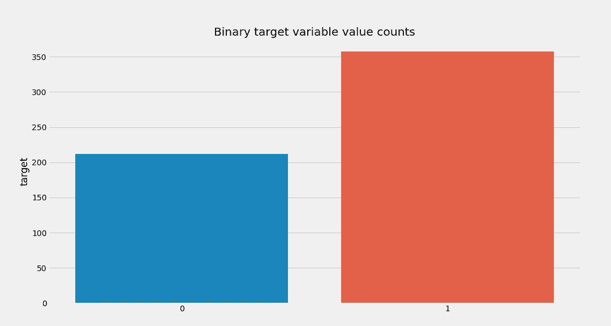
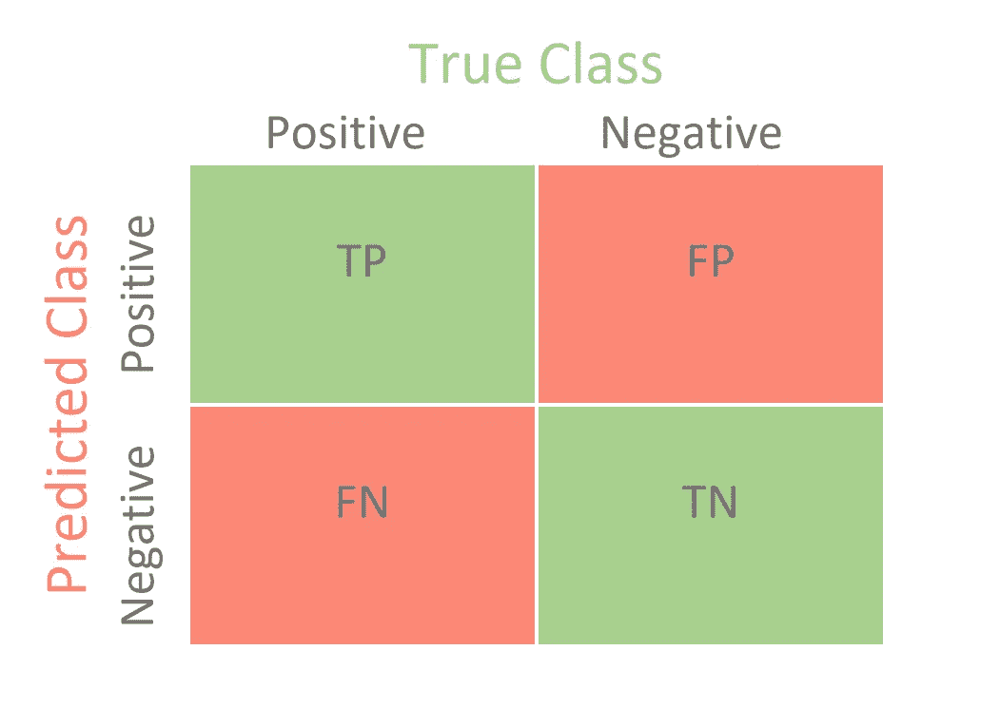
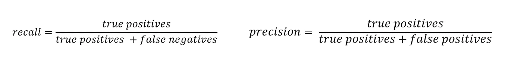
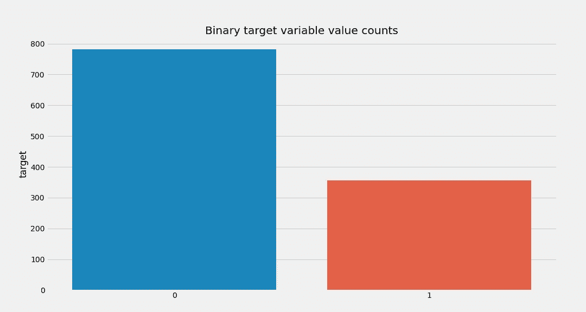
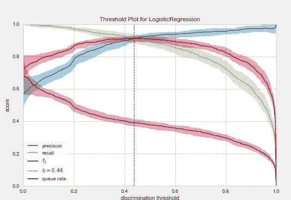
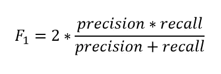
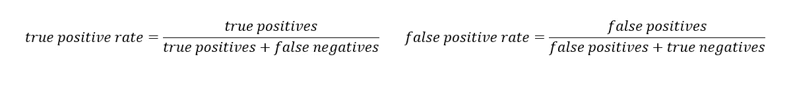
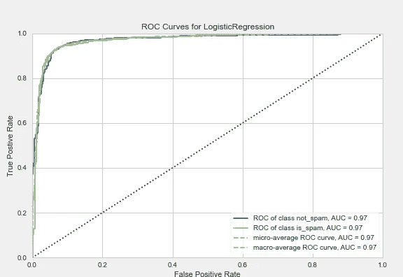

# 数据科学评估指标—揭示分类算法[第 1 部分]

> 原文：<https://pub.towardsai.net/data-science-evaluation-metrics-unravel-algorithms-267c55f09fa2?source=collection_archive---------4----------------------->


卢克·切瑟在 [Unsplash](https://unsplash.com?utm_source=medium&utm_medium=referral) 上的照片

## [数据科学](https://towardsai.net/p/category/data-science)，[机器学习](https://towardsai.net/p/category/machine-learning)

## L essons 了解分类任务的评估指标。

> 如果你不知道如何问正确的问题，你将一无所获。
> **——w·爱德华兹·戴明**

在机器学习的世界里，有无数的评价可能性，每天都有新的加入。在本文的开头，我还想提到，没有解决所有数据科学问题的灵丹妙药，它总是提供分析结果的最佳方法。
有一些流行且非常强大的方法，但在许多情况下，必须对它们进行调整，或者开发一种特定于应用的方法。
为了避免不必要地夸大本文，我想将指标分为两个经典的数据科学应用组，分类和回归。后者将在本系列文章的第二部分中讨论，本文将专门讨论可用于评估分类算法的度量标准。

***编辑 30.12.2020:文章刚刚发表，可以在这里访问*** [***。***](https://maximilianstaebler.medium.com/data-science-evaluation-metrics-unravel-algorithms-for-regression-part-2-85201ab14ae0)

> 少说话，多内容。
> **-我**

**基础知识:**为了保证对本文的理解和可再现性，这里使用的所有代码都可以在我的 [Github【链接】](https://github.com/maxistaebler/towardsdatascience/tree/main/evaluation-metrics)上获得。使用的笔记本只需要库 *pandas、scikit-learn、yellowbrick、matplotlib 和 seaborn* 。所有使用的数据集也可以通过 *scikit-learn* 导入或包含。

**分类方法:**对于分类，使用逻辑回归(二元类)。没有提供算法的解释。不过在以下链接下可以找到优秀的描述。

逻辑回归:[链接](https://towardsdatascience.com/introduction-to-logistic-regression-66248243c148)
【1】潘特，a .，*逻辑回归导论(2019)* ，走向数据科学

此外，我只能建议每一位*有经验的*数据科学家使用 Seaborn 库快速创建情节，但我不会深入研究这些情节的创建。确切的程序也可以在[笔记本上看到。](https://github.com/maxistaebler/towardsdatascience/tree/main/evaluation-metrics)

# 服从度量


照片由[凯蒂·罗德里格斯](https://unsplash.com/@katertottz?utm_source=medium&utm_medium=referral)在 [Unsplash](https://unsplash.com?utm_source=medium&utm_medium=referral) 上拍摄

我们将重点关注的最常见的指标是:

*   ***准确度***
*   ***精度***
*   **回忆*回忆*回忆**
*   ***F1-得分***
*   ***ROC & AUC 曲线***

我们在本文中考虑的第一个指标可能是整个数据科学领域中最容易理解的指标:准确性。
像每个周六我都输钱，像每个周六我的*准确率 10%* 。

一个更好的例子(对我来说也更便宜)可以用 *scikit-learn* 中非常著名的*乳腺癌*记录来描述。该数据集用总共 30 个协变量描述了患者是否患有癌症。



二元目标变量(癌症或无癌症)的分布

至于所有其他示例，我们现在将训练一个模型，该模型将以前从未见过的数据集分为两类，并形成我们评估指标的基础。这里我们将使用逻辑回归。

**准确性** —绝对的基础知识

我们现在要做的是计算我们的第一个指标(**准确性**)来比较我们的模型如何为许多患者预测正确的类别。

所以，我们得到了 94%的准确率——对于一个简单的模型来说还不错，对吧？答案是肯定的，也是否定的。是的，在大多数情况下，94%的准确率已经相当不错了，除非你犯了一个技术错误，比如错误的列车测试分割。
但是现在想象一下，你总共有 100 个病人，其中 94 个没有癌症，6 个体内有癌细胞。在这种情况下，数据集将是倾斜的，并且您可以通过预测常数 0(无癌症)的模型达到 94%。
一般来说，偏斜意味着一个二进制类远远超过其他类，因此有更多的条目。
在这些情况下，建议不要使用准确度作为预测准确度的衡量标准。

为了解决这些问题，我们将使用和在学校学习外语时一样的方法:首先是词汇，然后是应用。
我们再次使用与之前相同的数据集，但为了简单起见，将假设状态如下:
— *0 =无癌症
— 1 =胸部癌细胞*。我们的模型将再次对不同的患者进行预测，然后与已知的状态进行比较。因此，我们的预测可以假设 4 种状态，如图所示:



我们预测的四种状态的混淆矩阵

顺便说一句:查看 Mohajon 先生关于混淆矩阵的帖子[ [链接](https://towardsdatascience.com/confusion-matrix-for-your-multi-class-machine-learning-model-ff9aa3bf7826) ]，我也是在那里偷了上面的图片:-)

**真阳性(TP):** 我们的模型预测病人得了癌症，病人真的得了癌症。— *左上*
**真阴性(TN):** 我们的模型预测患者没有癌症，患者没有癌症。— *右下* **假阳性(FP):** 我们的模型预测一个病人患有癌症，但是这个病人是无癌的。 *—右上* **假阴性(FN):** 我们的模型预测一个病人没有癌症，但是这个病人有癌症。 *—左下方*

很好，现在我们知道如何标记我们的预测了。每个状态的大小(预测量)现在可以用来让我们更好地理解我们的模型做得好的地方和需要改进的地方。例如，在医学中(或者在我们的应用案例中)，检测所有的癌性疾病是极其重要的。如果可能的话，不应该忽略任何一个病人。如果一些患者被错误地归类为“患病”，这不是一件好事，但随着进一步的测试，这些患者几乎在所有情况下都会被检测出来。

**精准** **召回**——灵丹妙药？

精确和召回正好可以用于这样的应用。以下是这两个指标的公式:



[https://towards data science . com/confusion-matrix-for-your-multi-class-machine-learning-model-ff 9 aa 3 BF 7826](https://towardsdatascience.com/confusion-matrix-for-your-multi-class-machine-learning-model-ff9aa3bf7826)

从前面的定义和公式可以直接看出，一个好的模型应该具有最高的**精度**和**召回**的可能值。对于我们的第一个模型，分数是:

*准确率:93.27%—召回率:98.88%*

两个分数都很高，那么这是我们找到有史以来最好的模型的最终证明吗？没有。我们的数据集非常平衡。让我们改变这种情况，创建一个更现实的真实世界的用户案例。
提醒一下，我们之前有一个大致平衡的数据集，班级规模约为 200 人和 350 人，但现在班级规模已分别更改为 1919 人和 357 人，我们应该会看到很大的差异。



倾斜数据集-乳腺癌

度量结果:

```
Accuracy: 0.71
Precision: 0.5244
Recall: 0.8543
```

很好，很好，很好…可以清楚地看到，所有指标都大幅下降。我不想在这里贬低模型的影响，但是度量的解释更重要:
由于**精度低，**我们可以得出结论，我们的模型产生了**相当多的误报。**这意味着，我们预测许多患者患有癌症，而实际上他们没有患癌症。
此外，召回的 **okay 值**是一件好事，因为如上所述，当患者实际上患有乳腺癌时，我们不想说他们没有患癌。我们的假阴性更少了。

到目前为止，这一切都很好，但是如果我们的精度和召回值不令人满意，我们该怎么办呢？
要回答这个问题，你得了解机器学习模型是如何在二分类中做出决定的:**阈值**。
在大多数预测概率的模型中，阈值被设置为 0.5，但这意味着什么呢？基本上只有随机变量*小于阈值(0.5)的每一个概率被归类为 0，*和*大于阈值的每一个概率被归类为 1* 。
虽然这个阈值是一个常见的基线模型，但它肯定不是每个应用程序的理想选择。根据阈值的不同，精度和召回值可能会发生显著变化。
计算众多阈值的精度和召回值并绘制出来怎么样？该死的好主意——祝贺你:我们刚刚得出了**精确召回曲线**。

注意:下面的许多图都是用 *Yellowbrick 库*创建的，这使得分析 scikit-learn 模型变得极其容易！绝对推荐！[【链接】](https://www.scikit-yb.org/en/latest/index.html)

**精确召回曲线**

对于曲线的可视化，我们将使用一个新的数据集。它包含电子邮件的 NLP 特征以及邮件是否是垃圾邮件的信息。所以我们想再次把它归类为二进制。

用于创建阈值图的代码



使用逻辑回归的垃圾邮件数据集的阈值图。

显示的图提供了许多关于模型、其功能和潜在限制的有用信息。*最佳阈值为 0.44。* 我们可以直接看到的是，在准确率随着阈值的增加而增加的同时，召回曲线也同时越来越下降。
对两条曲线形状的一个解释，在用心看完上半部分(满怀希望)之后，绝对是符合逻辑的:
如果我们越来越多地提高阈值，直到每封邮件都被标记为垃圾邮件，我们就不会漏掉任何一封真正的垃圾邮件(最大精度)。尽管如此，我们还是会将所有实际上不是垃圾邮件的邮件标记为不需要的邮件(召回率非常低)。

图中还直接显示了一个代表精度和召回率调和平均值的值，即 **F1 值。**



F1 公式—来源:[https://towards data science . com/beyond-accuracy-precision-and-recall-3da 06 bea 9 f6c](https://towardsdatascience.com/beyond-accuracy-precision-and-recall-3da06bea9f6c)

所以你可以分析**红色 F1 图**而不是看精度(蓝色)和召回(绿色)这两个图。该值也总是介于 0 和 1 之间，其中 1 表示完美的预测。因为该值是从精度和召回曲线中得出的，所以该值非常适合倾斜的数据集。

与精确度和召回率或 F1 值类似，其他指标可以从混淆矩阵的结果中计算出来。这些指标的名称清楚地概括了它们的含义:
*TPR —真阳性率:*与精度完全相同
*FPR —假阳性率:*1—FPR 也称为特异性(真阴性率)



TPR & FPR —来源:[https://towards data science . com/beyond-accuracy-precision-and-recall-3da 06 bea 9 f6c](https://towardsdatascience.com/beyond-accuracy-precision-and-recall-3da06bea9f6c)

**ROC & AUC 曲线——混淆矩阵的可视化**

AUC-ROC 曲线是分类问题的不同阈值设置中的输出测量。详细来说:
**ROC 是概率的曲线
AUC 是可分性的程度或度量。**
**两者结合在一起显示了模型能在多大程度上区分群体。**

模型正确预测类别越好，AUC 越高(最佳值 1，最差值 0)。在我们的垃圾邮件数据集的上下文中，较高的 AUC 意味着该模型将更好地预测邮件是否是垃圾邮件。*用图形来说，AUC 就是 ROC 曲线下的面积！*和往常一样，看一个例子就容易理解多了。以下是垃圾邮件数据集和模型的 ROC-AUC 曲线的代码和生成图:



ROC-AUC 曲线

> 剧情马克西不错，但是现在怎么用呢？

类似于之前的阈值图，该图可用于选择最佳阈值。此外，该图给出了有关各自阈值如何影响 *FPR(假阳性率)*和 *TPR(真阳性率)*的直接信息，这对某些应用至关重要！

以垃圾邮件为例:这里的总体目标是检测所有垃圾邮件。如果单封邮件未经授权就进入了垃圾邮件文件夹，这在一定程度上是可以接受的(现实假设是没有完美的模型)。用专业术语来说，这意味着我们想要非常高的真阳性率和低的假阴性率。
这转化为 ROC 曲线，这意味着我们想要最高的 **TPR 值(Y 轴)**和最低的 **FPR 值(X 轴)**。但是由于垃圾邮件检测具有优先权，理论上人们愿意在 X 轴上做出让步。如果你想要更少的*假阳性，*你就会得到更多的*假阴性*。对于这个例子，你可以看到，如果你想有 100%的概率检测到垃圾邮件，你会得到近 40%的邮件被错误地标记为垃圾邮件。另一方面，另一个阈值为“仅”检测到约 97%的垃圾邮件的模型只会将约 7%的正常邮件标记为垃圾邮件。如前所述，决策由用户做出。

AUC 在处理倾斜数据集时也被广泛使用！ *AUC* 所做的是，它通知您有几个错误分类的阳性结果(FP ),尽管由于主导类别，您有很高的准确性，因此在这种情况下它会返回一个低分。这样做的原因是假阳性的数量会增长，因此分母变得更大(TP / (TP + **FP** ))。

# 摘要

在这些文章中，提出了评价分类问题的重要标准。尽管在一些(简单的)用例中，仅准确性可能就足够了，但建议包括其他指标来分析结果。由于 *ROC & AUC* 曲线非常详细地揭示了分类模型的能力和问题，因此它可能是所介绍的方法中使用最多的。
然而，应该注意的是，还有许多其他更精确、更复杂、可能更适合的方法。

*本文的第 2 部分将讨论评估回归问题的最常见方法。*

**保持联系:**

领英:[https://www.linkedin.com/in/maximilianstaebler](https://www.linkedin.com/in/maximilianstaebler)
推特:[https://twitter.com/ms_staebler](https://twitter.com/ms_staebler)