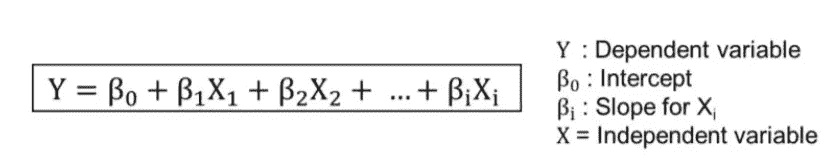
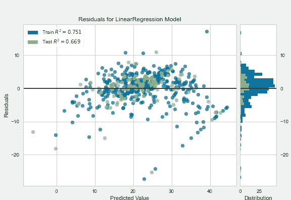
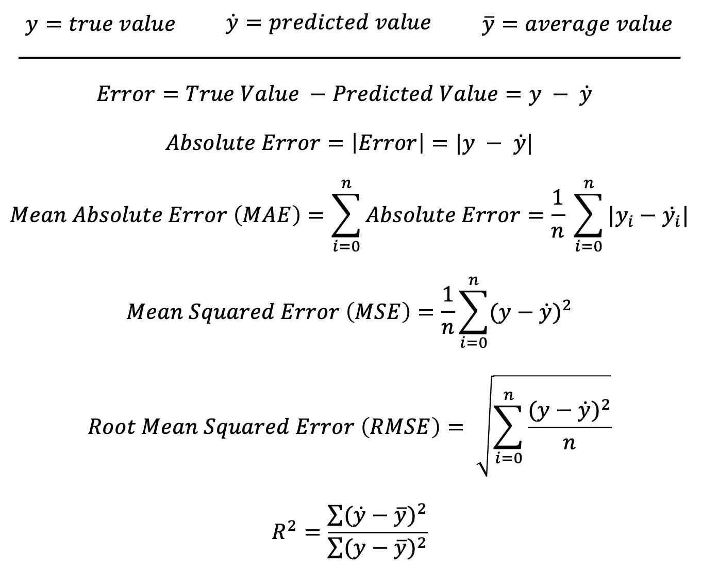
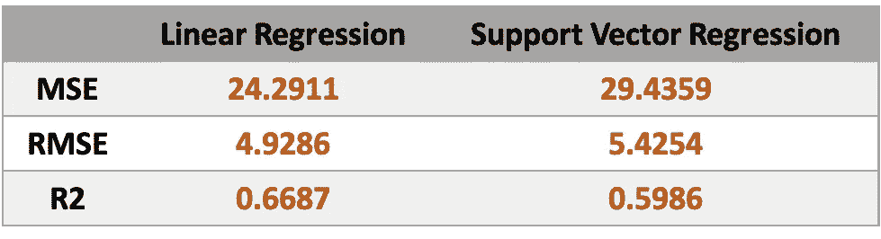

# 误差公式数据科学评估指标—揭示回归算法[第 2 部分]

> 原文：<https://pub.towardsai.net/data-science-evaluation-metrics-unravel-algorithms-for-regression-part-2-85201ab14ae0?source=collection_archive---------2----------------------->

## [数据科学](https://towardsai.net/p/category/data-science)

## 关于分类任务评估指标的经验教训。

照片由[米卡·鲍梅斯特](https://unsplash.com/@mbaumi?utm_source=medium&utm_medium=referral)在 [Unsplash](https://unsplash.com?utm_source=medium&utm_medium=referral) 上拍摄

在我们开始之前:这篇文章专门讨论回归的评估指标！我已经写了另一个帖子(第一部分)关于确定分类问题质量的方法。那篇文章可以在这里打开 [**。**](https://medium.com/towards-artificial-intelligence/data-science-evaluation-metrics-unravel-algorithms-267c55f09fa2)

现在这一点已经清楚了，让我们转向监督学习应用领域的第二个也是剩余的方法。因此，我们将再次使用带标签的数据集，在不同算法的帮助下预测连续的目标变量( *y* )。
简而言之，回归模型的目标是建立一个数学方程，将 *y* 定义为 *x* 变量的函数。接下来，该等式可用于基于预测变量的新值( *x* )来预测结果( *y* )。最简单同时也是最著名的回归形式是线性回归。每个学生在上学期间都用过这个公式。下图显示了多元回归的公式:

线性回归公式— [来源](https://towardsdatascience.com/multiple-linear-regression-for-manufacturing-analysis-c057d4af718b)

然而，正如在本系列文章的第 1 部分中，我们将不会关注各种回归算法或它们的优缺点，而是关注如何评估一个回归结果。
这里最常用的度量就是所谓的 ***误差*** 。这个错误很容易实现，甚至更容易理解。基本上，您只需将预测值与真实值进行比较，并计算差异。所有这些差异就是所谓的 ***残差*** ！因此，统计或机器学习模型中的残差是数据的观测值和预测值之间的差异。它们是评估模型质量时使用的诊断方法。

**残差——我为什么要关心？**

一般来说，人们应该总是看一看残差图，因为在正确解释的情况下，所用算法的许多缺陷和问题都在那里得到了说明。这里是一个概述:(残差重要性的详细描述可以在[这里](https://www.displayr.com/learn-what-are-residuals/)阅读)

-可以通过查看残差的大小和残差的任何模式来评估模型的质量。
—对于一个完美的模型，所有的残差都是 0。残差离 0 越远，模型越不精确。在线性回归的情况下，残差平方和( ***均方误差*** —稍后解释)越大，R 平方统计量越小，其他条件相同。
—如果平均残差不为 0，则意味着模型存在系统性偏差(即持续高估或低估)。
—如果残差包含模式，则意味着模型在质量上是不正确的，因为它无法解释数据的属性。模式的存在使大多数统计检验无效。

[*和第一部一样，在我的 Github 账号上可以克隆相应的笔记本。所有使用的数据集也包括在内。*](https://github.com/maxistaebler/towardsdatascience/tree/main/evaluation-metrics)

有黄砖的残留剧情(牛逼！)

残差图-波士顿住房数据的线性模型

在我们看残差图之前，我想提醒你，残差不是别的，就是真实值和我们的模型预测的模型之间的差异！考虑到这一点，现在让我们看看已知数据集(波士顿住房数据)的线性回归残差图。
这里的目标是根据某项资产的特征来预测其平均值。虽然我们有一个非优化的模型，但我们可以看到残差的近似随机分布。一般来说，是个好兆头！应该让我们思考的是残差的平均值略微向上移动，这也可以在右侧的直方图中看到。看不到任何模式。因此，我们可以说，我们的模型并不差，但肯定需要一些微调，以修复房地产价值的不断高估。

**好的，我明白了残差是如何工作的——还能使用什么？**

非常好的问题，这个问题的答案会让一些读者高兴，也会让一些读者失望:
在回归中评估模型的方法和途径不像在分类中那么多。在那里，人们可以用混淆矩阵或多种不同的 ROC 图为每个模型找到一个单独的分析方法。
另一方面，在回归任务中，大多数度量标准都是基于所呈现的残差，只是以不同的方式对它们进行聚合。为什么会这样是回归的本质:
你预测一组特定协变量的值，并将其与真实值进行比较。这里没有分类变量，只有计算预测错误程度的能力。

因此，不想记住无数不同方法的人在这里可能会很高兴，而喜欢手头有不同评估方法的人在这一点上可能会有点失望。然而，对于后者，下面的内容始终适用:这里介绍的方法并不构成评估回归的所有度量的完整概述！仅显示最常见的指标。

残差的变化例如是 ***绝对误差*** (偏差的绝对值) ***平均绝对误差*** (绝对误差值的平均值) ***均方误差*** (平方误差) ***均方根误差*** (均方误差的平方根)和***R-平方。***

在我们在一个例子中实现这些之前，有必要看一下各个公式。您可以看到，这些指标是相互建立的，残差构成了每个指标的计算基础。

对于符号:

误差公式

在我看来，单个指标的公式非常容易理解——我希望你也这么看。这些指标中的每一个在某些应用中都是最合适的。但是，必须明确说明的是， ***MSE、*** 和 ***R 平方*** 是最广为人知和最常用的度量。出于这个原因，我想更详细地解释这三个，并说他们可以提供什么优势。

## 均方误差(mean square error)

MSE 通过平方来确保负值不会抵消正值。MSE 越小，模型就越符合数据。MSE 的单位是垂直轴上绘制的任何值的平方。如您所见，平方的结果是，误差越大，权重越大。然后，算法继续将它们相加并求平均值。如果你担心离群值，这是值得一看的数字。请记住，它和我们的从属值不是一个单位。

## 均方根误差

均方根误差(RMSE)就是均方误差的平方根。这可能是最容易解释的统计数据，因为它与纵轴上绘制的数量具有相同的单位。RMSE 可根据测量单位直接解释，因此是比相关系数更好的拟合优度测量方法。人们可以将 RMSE 与典型点的测量中观察到的变化进行比较。两者应该是相似的，这样才合理。

## r 平方

回归 R 平方的决定系数，也称为经验决定系数，是一个无量纲的测量值，表示因变量测量值中的可变性部分，这由线性模型“解释”。给定平方和分解，回归的决定系数定义为回归解释的平方和与总平方和的比率。
R-squared 具有有用的属性，即其标度是直观的:它的范围从 0 到 1，0 表示所提出的模型没有改进对平均模型的预测，1 表示完美的预测。回归模型的改进导致 R 平方成比例增加。R 平方的一个缺陷是，它只能随着回归模型中预测因子的增加而增加。当预测者实际上没有提高模型的拟合度时，这种增加是人为的。

## 行动中的指标

为了比较指标，我们将比较支持向量回归和线性回归，并根据值决定哪种方法给出更好的结果。
重要提示:不强调单个方法的优化。只需使用默认设置。

线性回归和支持向量回归的比较代码

三种不同指标的结果

我们可以看到，我们的线性回归模型在每个指标上都优于 SVR。因此，决定在后续步骤中使用哪个模型并不困难。

## 摘要

在这篇文章的结尾，我想再次总结最重要的几点:

与分类任务相反，回归并没有那么多不同的度量标准可以用来评估不同的模型。最常见的指标是 MSE、RMSE 和 R2。
我个人最喜欢的是 R2，原因很简单，因为它的解释很直观，可以很容易地比较不同的型号。

我希望通过这两篇文章，我可以对分类和回归任务的评估标准有更深入的了解。

**非常感谢您的关注！**

以下是一些更有用、更深入的信息:

[回归要领](http://www.sthda.com/english/wiki/regression-analysis-essentials-for-machine-learning)
[R 的平方解释](https://www.theanalysisfactor.com/assessing-the-fit-of-regression-models/)
[MSE 和 RMSE](https://www.vernier.com/til/1014)