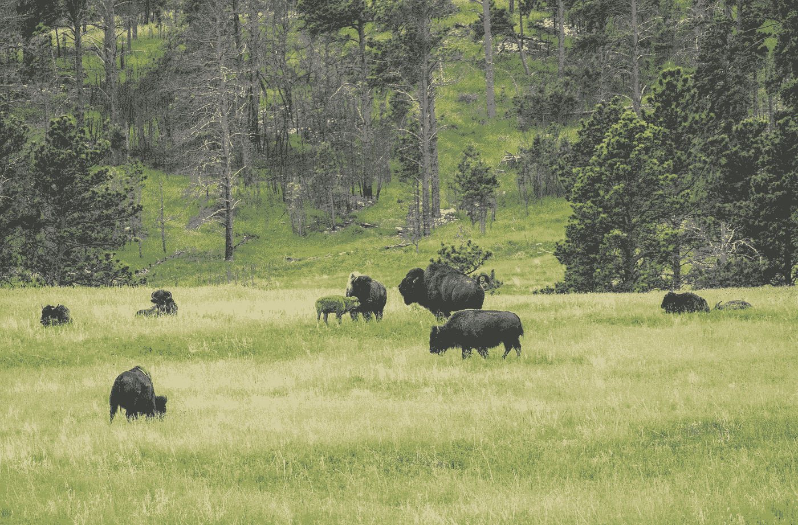
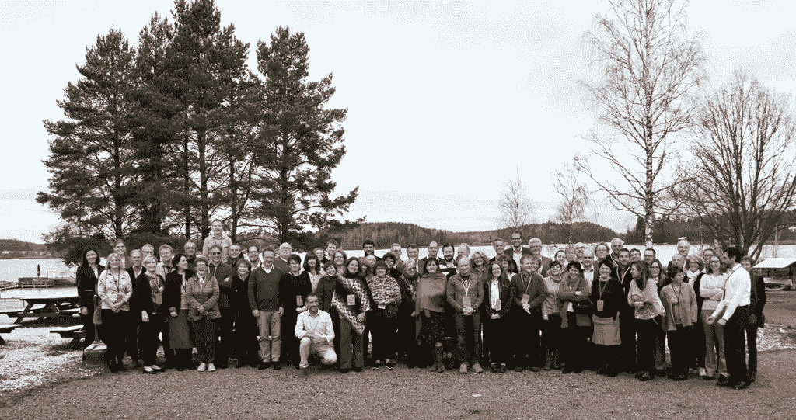
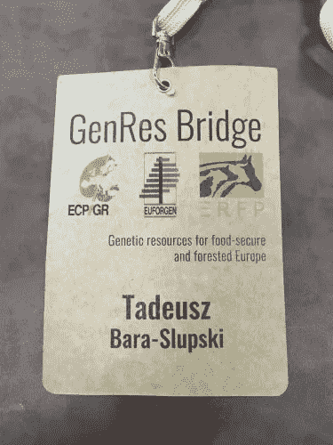
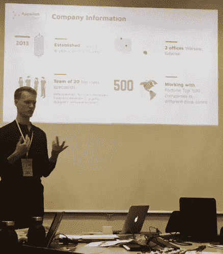

# 生物多样性数据科学

> 原文：<https://pub.towardsai.net/data-science-for-biodiversity-5fbb24a36d97?source=collection_archive---------1----------------------->

乔纳森·马斯特在 [Unsplash](https://unsplash.com/?utm_source=unsplash&utm_medium=referral&utm_content=creditCopyText) 拍摄的照片

# 保护植物、动物和森林遗传资源

应对气候变化的努力正在成为一个数万亿美元的产业。在这样一个以众多不同项目为特征的环境中，很难辨别在为我们的星球而战的过程中什么会真正带来最大的好处。

解决这个问题的一个方法是求助于特定的启发法，很长一段时间以来，我一直在咨询那些**在地面上弄脏自己手的人。他们往往对自己领域的错综复杂最为敏感，而且往往对自己的工作最为投入。为了适应这个不断变化的世界，我们需要做出许多努力，这些努力需要数十年的承诺。我有幸在最近于芬兰图苏拉举行的[流派桥梁](http://www.genresbridge.eu/)会议上见到了这样的人。**

会议聚集了遗传资源保护领域的近 70 名利益攸关方，涉及三个领域:植物、动物和森林。虽然复杂，但他们的工作归根结底是保护生物多样性和确保后代的粮食安全。这在气候变化的时代尤为突出。我们目前为建立新的森林栖息地而种植和收获的许多物种可能无法适应不断变化的环境温度或降水。因此，我们需要**模拟这些变化**，**预测**未来生态系统的性质，并将它们与适当的植物品种相匹配，以便我们现在的保护努力不会在最需要它们的成果时被证明是徒劳的。我们还需要将这些品种储存在安全的地窖里，以防自然灾害或战争。

流派桥牌参与者合影

这一领域的组织包括各种各样的参与者，从农民协会到基因库(比如你可能听说过的挪威永久冻土中的[基因库)再到跨国机构，它们收集和管理数据，并制定战略和政策。在欧洲，我们有三个处理遗传资源的主要组织:](https://www.croptrust.org/our-work/svalbard-global-seed-vault/) [ECPGR](http://www.ecpgr.cgiar.org/) (植物) [ERFP](https://www.animalgeneticresources.net/) (动物) [EUFORGEN](http://www.euforgen.org/) ，还有 [EFI](https://www.efi.int/) (森林)。

流派桥梁倡议旨在将他们的三个领域结合在一起，以制定一个共同的战略，并在欧盟产生更大的游说力量。为了获得公众和欧盟官员的更大兴趣，这些组织需要更好地利用他们的数据——既用于讲故事，也用于在工作中创造更高的跨学科影响。欧洲森林研究所邀请 Appsilon 向生物多样性社区展示我们可以提供什么样的服务来支持他们。

# 作为数据科学咨询机构与生物多样性社区合作

由于主题的复杂性和快节奏的研讨会和讨论，为期四天的会议极具挑战性。作为一家数据科学公司的代表，我在遗传资源保护方面没有多少背景，我尽最大努力赶上我对问题的理解，以充分参与讨论。当然，在改进不同领域的协调的实质性问题上，我没有太多东西可以提供。尽管如此，我还是带来了一个局外人的视角，这在很多场合都受到重视。

然而，至关重要的是，我可以向参与者提供并教育他们潜在的数据科学、改进的分析和可视化可以给他们的工作带来什么。这不是一项容易的任务，因为参与组织普遍资源不足，无法对数据相关事项投入太多精力。他们花费在重要的保护工作上的资源。尽管如此，我还是很受鼓舞，因为一旦 Appsilon 的 AI for Good 计划在参与者中传开，不同的利益相关者就带着问题和兴趣来找我。我也有机会向与会者简要介绍我们的产品。

赫尔辛基流派桥的人工智能探讨

该社区对数据科学服务有着巨大的需求。我坚信它代表了环境可持续性和气候变化领域的许多此类团体。然而，同样清楚的是，我们正处于提高这些参与者对数据科学可能给他们的工作带来的潜在影响的认识的早期阶段。大多数组织需要基本的数据库维护服务和支持，以便将分散的数据相互联系起来，为作为保护工作的一部分而产生的信息创建参考点。他们很少有时间去想象机器学习和人工智能更高级的应用，需要这方面的支持。

# 前进和经验教训

会议一结束，我们就和一个利益相关者开始了一个项目。国际植物园保护组织收集、管理和传播来自世界上所有植物园的植物资源数据。这使得研究人员、环保主义者和其他组织能够更好地了解全球植物遗传物质资源，从而更好地规划保护工作。我们将帮助他们[开发一个自动数据输入验证器](https://appsilon.com/data-quality/)，并清理他们数据库中的不一致数据，如重复或不完整的条目。

虽然我们很高兴能够在这个早期阶段为社区做出贡献，但我们非常渴望参与更广泛的教育工作。我们的目标是建立一个全球 AI for Good movement，它包容并欢迎所有专业领域的组织。为此，我们认识到，这样的组织需要对当前出现的机会有一些基本的了解。他们需要 DS/ML/AI 如何应用的例子。因此，我们目前正在为生物多样性社区计划一次网络研讨会，这将有助于填补这一空白，并为新的激动人心的项目铺平道路。

总的来说，我被所有与会者的努力和知识所鼓舞和感动。看到人们对数据科学服务的需求和兴趣，我也非常兴奋。我相信我们收集了宝贵的见解，我强烈鼓励其他数据科学从业者参加此类特定领域的会议，以建立联系并更好地了解为我们的星球而战的实际情况。

感谢阅读。在推特上关注我，地址: [@tbaraslupski](https://twitter.com/tbaraslupski)