# 面向所有人的数据科学:了解您的数据—第 1 部分

> 原文：<https://pub.towardsai.net/data-science-for-everyone-getting-to-know-your-data-part-1-bb8b6d7782b1?source=collection_archive---------2----------------------->

## [数据科学](https://towardsai.net/p/category/data-science)，[教育](https://towardsai.net/p/category/education)

## “人人共享数据科学”的第一篇文章:旨在解决社区数据素养问题的系列文章*。*

图 1:数据和科学:这种融合使得所有的科学和技术突破成为可能(照片由[科学高清版](https://unsplash.com/@scienceinhd?utm_source=medium&utm_medium=referral)在 [Unsplash](https://unsplash.com?utm_source=medium&utm_medium=referral) 上拍摄)

“数据科学”在过去十年中成为技术界的流行词汇之一。“数据科学家”的职业角色被称为“21 世纪最性感的工作”[1]。

该领域和其他相关技术的进步，如机器学习、人工智能、数据应用的高性能硬件/软件平台，为一些新的专业角色铺平了道路，如数据工程师、机器学习/人工智能工程师、机器学习/人工智能应用开发人员等。

*“根据 IBM 在 2017 年的一项调查***，该领域的职位空缺数量预计将在 5 年内增长 28%，2020 年预计将超过 61，000 个。”[2]**

*那么，什么是数据科学？科学和数据有什么关系？数据科学是一个新的研究领域吗？我们如何准确描述数据科学家的角色？数据科学家的角色与其他相关工作角色有何不同？是什么让数据科学家有资格被认可为科学家？有些问题的答案并不总是很明确。*

> *如今，每个人都习惯在工作中使用某种形式的数据科学方法。他们的大部分职业和个人生活都受到数据驱动型产品和工具(如社交媒体、在线购物等)的影响。).因此，无论您的教育水平、背景或职业如何，至少对数据科学和相关概念有一个基本的了解是必不可少的。*

*在试图理解数据科学到底是什么之前，让我们首先理解数据和科学分别是什么意思，以及它们是如何连接起来服务于目的的。数据科学不仅仅属于数据科学家，甚至不仅仅属于计算机和信息技术(ICT)专业人员。它仅仅是一个与科学和非科学领域几乎所有学科交叉的广阔领域。*

> *“数据素养”是指将数据作为信息进行阅读、理解、创建和交流的能力。它将是世界上识字率测量的一个重要组成部分，这个世界正在快速地经历“数字转型”时代，其复杂性也在不断增加[3，4]。*

*本系列文章将采用哲学的方法将点点滴滴连接起来，构建一个概念性的图像，以帮助每个人更好地理解数据科学、相关概念以及数据科学家作为一种职业的角色。*

## *你生活中的数据*

*无论您是否是数据专业人士，都不应该低估您在生活中与数据的关系。每当你登录互联网，进行网络搜索，阅读一些博客文章，在社交媒体上与他人互动，发送或接收电子邮件，订购食品杂货，购买商品，你都在从全球存在的大规模数据池中访问数据。同时，您有意无意地向同一个池提供了更多数据。*

*您在创建个人资料时提供的信息、您通过聊天发送的消息、您在社交网络上上传的照片、您对他人消息发表的赞和评论、您发送的电子邮件都是您**有意贡献**的一部分。**无意的贡献**比如你手机的 GPS 追踪到的你当前的位置，登录，社交媒体和网站记录的活动细节(包括你用的什么设备，用的什么操作系统，用的什么浏览器等等。)，你的购物记录。*

**

*图 2:通过数据连接的世界(照片由[雅各布·欧文斯](https://unsplash.com/@jakobowens1?utm_source=medium&utm_medium=referral)在 [Unsplash](https://unsplash.com?utm_source=medium&utm_medium=referral) 上拍摄)*

*这些来自您的数据主要由社交媒体、互联网服务提供商、众多其他营销机构和政府机构等公司拥有。您还会使用他们使用数据科学方法构建的**产品和工具，这些方法使用了上面提到的巨大的**数据池。这就是你如何在你的在线视频流中播放下一个广告，在社交媒体中建议你下一个应该联系谁，建议你需要从在线商店购买的下一件商品，下一家你想去的餐馆，在当前交通状况下去一个地方的最短或最快路径是什么，等等。*

# *数据:制定概念*

## *定义*

*单词 data 是单词 datum 的复数形式，具有“[单个信息的含义，如事实、统计数据或代码](https://www.dictionary.com/browse/datum)【5】。另一个定义是[“特别是作为推理或推论的基础而给出或承认的东西”](https://www.merriam-webster.com/dictionary/datum) [6]*

> *简而言之，数据可以定义为数字、字符、单词、声音或符号，用于描述、量化、识别物理或虚拟实体。*

*例如，如果你能用一些数据点(数据)充分描述一个人，如姓名、出生日期、性别、外貌(肤色和体型)、身高、体重等。同样的信息也可以用于识别的目的来区分一个人和另一个人。*

**

*图 3:分配了值的数据字段。(*图片作者)**

*让我们来看看这两个人的对话*那个* ***高个子*******男孩*** *】与* ***棕发*** *】在* ***ABC 咖啡吧当一名* ***咖啡师我想他的名字是[* ***詹姆士****。 **[]** 中的单词是您可以在正常对话以及系统数据应用中用来识别特定人的数据点。*******

**数据点有时被称为特征、数据字段、特性、事实和属性。这在高层次上应被视为相同的概念。**

**我们可以用来描述一个人的数据字段的集合可以被称为一个人的数据模型。当这些值被分配给这些字段时，这就变成了一个**记录**。类似地，我们可以用描述其特征的数据点来表示其他物理对象，如车辆、建筑物、书籍。**

****

**图 4:用来表示一个人的数据字段。(*图片作者)***

**几个相关的记录可以排列成一个结构，例如一个**表**或一个列表。想象一个包含大约 100 个不同人的数据的表格，一个**行**代表每个人，每个**列**用于存储一个数据点。**

**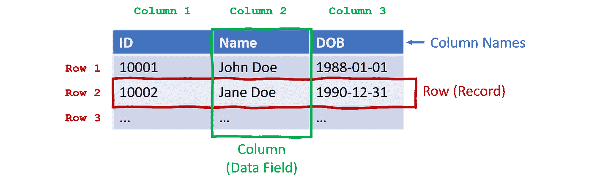**

**图 5:表格**

**许多相关的数据结构被组合成一个更大的结构，成为一个**数据库**。根据应用的不同，有多种类型的**数据库**和**数据库管理系统**可供选择。**

## **数据和信息**

**我们看了每个人都应该知道的数据的基本概念。让我们快速看看另一个与数据相关的概念。那是信息。让我们试着理解信息和数据的区别。**

**正如我们上面讨论的，数据有两个主要部分，结构和上下文。没有它们，数据就没有任何意义或价值。**

> **当数据具有结构、上下文和意义时，我们称之为信息。**

**这里有一个例子，你得到了一些数据:一个不同颜色名称的值列表。这当然是数据，但它能给你任何背景吗？这些数据有意义或有用吗？这两个问题的答案都可能是否定的。**

****

**图 6:资料(威廉·艾文在 [Unsplash](https://unsplash.com?utm_source=medium&utm_medium=referral) 上拍摄)**

**如果相同的列表中每个颜色值都有另一个数据点:汽车型号和品牌，会怎么样？这些数据现在有了一些背景和意义。再加一个数据点怎么样:价格？我们现在给数据添加了一些上下文，可以用来从中获得有用的信息。**

**在图 4 所示的个人数据示例中，所有属性“姓名”、“出生日期”、“身高”、“体重”等。没有用处，除非它们连接到 person 实体(图中的箭头)。**

## **数据结构**

> **根据它们的排列方式，数据集合可以分为结构化、非结构化和半结构化。**

**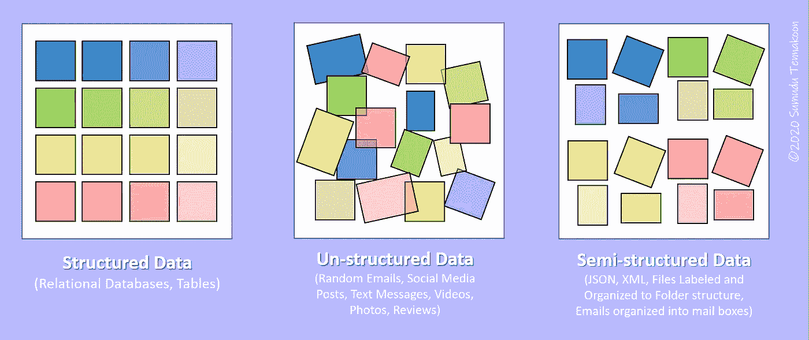**

**图 7:说明结构化、非结构化和半结构化数据。(*图片作者)***

**最传统的数据收集形式是将数据组织成表格，便于人和机器处理。**结构化数据**更易于搜索和管理。**

****图像、视频、声音等非结构化数据，以及书籍、信件、段落等大型文本内容，甚至在计算机时代之前，已经被人类使用了数百年。管理和搜索非结构化数据非常麻烦。根据《福布斯》技术委员会的一篇文章，提到了 [Gartner](https://www.gartner.com/document/3077117?ref=solrAll&refval=184973918&qid=7ac0f5706d57ff6d65c141149d8da3e4) 、*“估计今天超过 80%的企业数据是非结构化的*【7】”。因此，在这一领域，数据科学的研究和开发工作非常繁重。****

**随着互联网的出现和计算机技术的发展，半结构化数据形式如标记语言、分层数据结构在存储和传输数据方面变得流行。半结构化数据被认为是自描述数据，它有助于存储不容易组织成表的复杂数据。**

**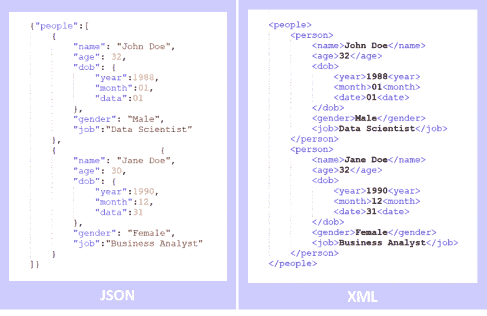**

**图 8:半结构化数据格式(XML 和 JSON)。(*图片作者)***

**在分析数据的过程中，利用合适的数据科学方法将非结构化数据转换成结构化或半结构化形式。**

## **数据类型**

**现在让我们从不同的角度来理解数据。**

> **数据可以用许多不同的方式表示，如数字、字符、符号、象形图、颜色、符号、对象排列等。**

**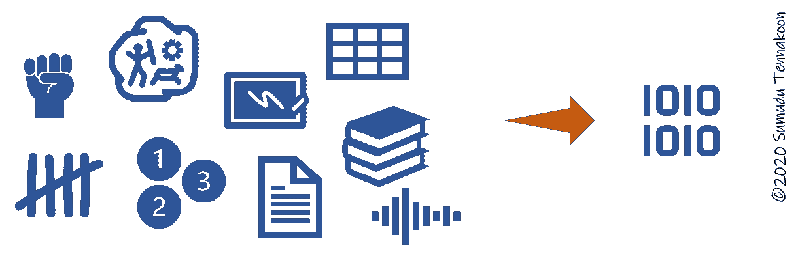**

**图 9:不同的数据表示和转换成数字形式。(*图片作者)***

**在数字计算机化的数据表示法中，当存储、传输和计算时，每一种其他的表示法都将被分解成数字，并以二进制形式结束。**

**我们可以找到一个在计算中使用的数据类型系统，比如作为主要类型的**布尔**、**整数**、**浮点**和**字符**。**

**它们的派生类型是字符串、数组、列表、集合、向量、矩阵、张量、复数、结构、枚举器、字典、表格和对象，使我们在这个时代受益的复杂计算应用成为可能。**

**一种特殊的数据类型被称为 null、none 或 void，这取决于用来表示“无”的编程语言。**

**计划在以后的文章中深入讨论不同的数据类型及其用途。**

**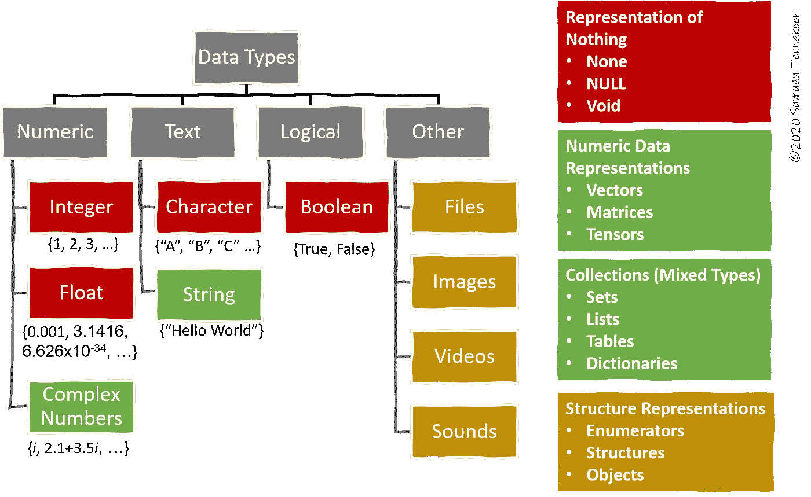**

**图 10:计算中使用的数据类型。(*图片作者)***

## **数据文件类型**

**传统上，您从印刷材料、视频、展板等获取数据。在计算机系统中，你的数据以文件或数据流的形式出现。常见的文件类型有文本、二进制、图像/照片、音频、视频、存档、压缩、数据库。计划在以后的文章中详细讨论这些文件格式及其用途。**

## **数据编码**

**您访问的数据并不总是保持呈现给您的格式。我们了解到，在数字系统中，数据的最终形式将是二进制(1/0)。但是，在存储和传输数据时使用了中间表示。**

**当数据从一个位置移动到另一个位置时，它们的表示形式也会发生变化。参照一个表示，我们称之为**编码**和**解码**。一种常见的编码方案是美国信息交换标准码(ASCII) [8]，它用来表示字符(字母、数字和特殊符号)。图 10 展示了将文本“DATA@8”编码成 ASCII。用于相同目的的普遍接受的编码方案是已知的和 UNICODE [9]。**

**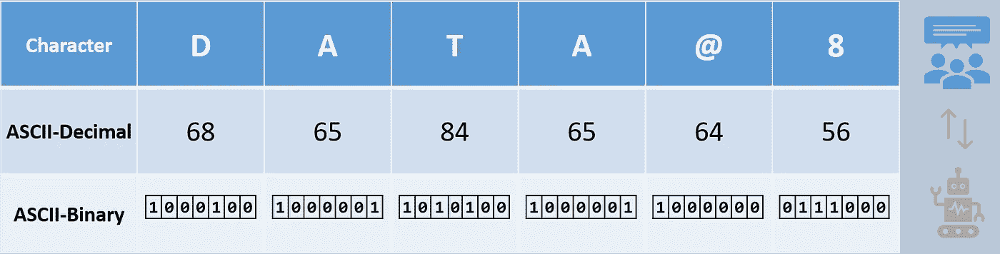**

**图 11:字符编码示例(ASCII) ( *作者图片)***

**不应将编码与加密混淆，加密会对非预期方隐藏数据内容。关于编码-解码、加密-解密及其用途的详细讨论将在以后的文章中进行。**

## **模拟与数字数据**

**在自然界中，数据以模拟形式存在，我们需要将它们转换成机器可识别的二进制形式，以便与数字计算机器一起使用。术语“**数字化**用于命名这种转换过程【10】。在电子学中，这有时被称为模拟到数字编码。**

**数字化的一些例子是扫描纸质文档以创建其数字副本，从您的移动电话麦克风记录声音，使用 GPS 数据记录您的行走轨迹。**

**当数字存储的数据需要作为模拟输出时，使用数模转换。在您的个人设备中，如移动电话、视频显示器、录音机、照相机、音乐播放器等，您正在使用这种模拟到数字的转换，反之亦然。**

**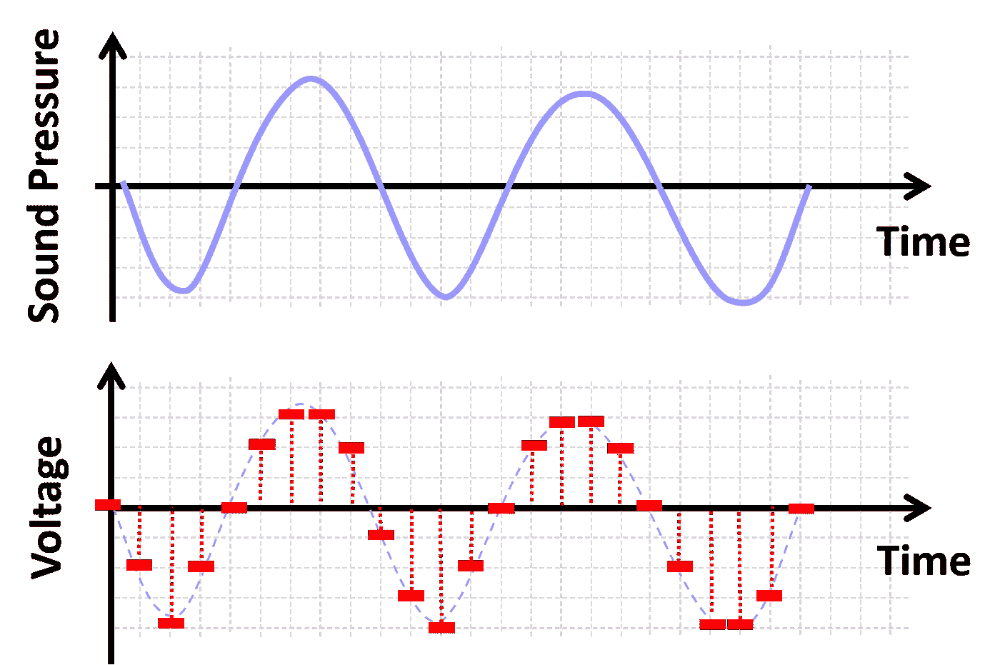**

**图 12:模拟和数字转换:声音信号的数字化。(*图片作者)***

## **数据的定性和定量性质**

> **每一个数据测量也可以被分类为定性的和定量的，以及它们的子类。**

**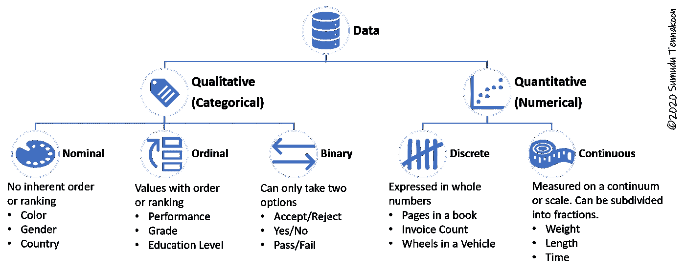**

**图 13:根据数据测量的定性和定量性质对其进行分类。(*图片作者)***

**数据是一个广泛的概念，可以从多种角度进行研究。你越是结合这些不同的观点，你就能更好地掌握你正在处理的数据。因此，我们上面讨论的概念在数据科学工作流的每个阶段都至关重要。在您使用数据或数据驱动的应用程序的任何时候，它们都非常重要。**

## **测量数据**

**数据是可以量化的。数字数据的最小单位称为**位，**位也用作衡量数据的尺度。一位可以存储 0 或 1 的值。**

**在数据编码示例中，我们展示了 ASCII 使用 7 位，这使得 2⁷ = 128 种可能的组合。换句话说，使用一个 ASCII 值可以表示 128 个不同的字符。**

**一组 8 位(八位字节)被认为是一个**字节**，它是测量数据的基本单位。国际单位制(SI)定义的符号是 b。为了测量大量的数据， **SI 加在**前面，如 Kilo (K)、Mega (M)、Giga (G)等。被使用[11]。这些前缀的使用不能与许多应用中使用的前缀的**二进制解释混淆，如 Ki、Mi、Gi 等。[12,13]****

**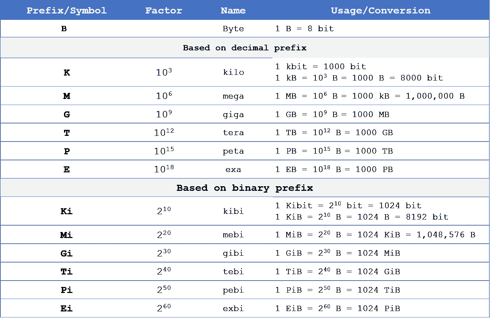**

**图 14:测量数字信息的单位系统(*作者图片，信息来源:[12])***

## **数据可视化**

**您已经看到了图表、绘图和各种信息图，它们将数据和信息浓缩成图形表示。可视化是一种非常有效的数据交流方式。**

**在数据科学工作流的早期阶段，理解数据以及进入后期阶段之前的各种质量控制措施也很重要。一些人认为数据可视化既是艺术也是科学。计划在以后的文章中深入讨论数据可视化方法及其用途。**

**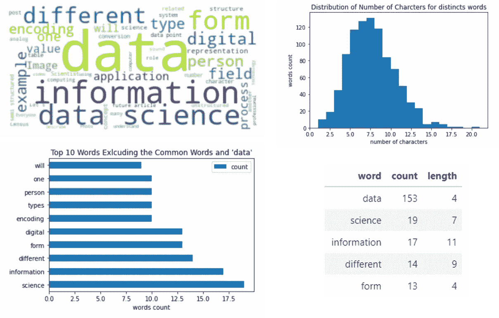**

**图 15:文章中文本数据的可视化表示(贡献的内容[15])**

# **数据生命周期**

**和我们人类、动物、植物、宇宙万物一样，数据也是有生命周期的。**

> **在一个计算机化的过程中，数据将经历一个生命周期，我们可以将其归纳为以下六个简单的步骤。收集、组织、数字化、存储、处理、分析、可视化。**

**这些术语中的大部分是不言自明的，但是我们将在稍后详细讨论这些步骤。数据在这个循环中流动，从原始数据开始，经过处理，成为我们可以用来产生有用见解的信息。**这幅图中缺少的一块是不再需要数据时的数据处理**。这将在以后的文章中详细讨论。**

**数据是由许多不同的自然和人工(人为)来源产生的，但从来不是由它们自己收集的。一个或多个对数据源敏感的受体被用于观察、测量和记录原始数据。接收器可以是人、传感器、记录设备、计算机输入设备或通信网络中的节点。**

**在组织步骤中，收集的原始数据经过验证、过滤、转换、结构化、连接不同的源、分离成不同的结构等。数据的数字化有时是在组织数据之前完成的，以便在该过程中获得数字计算工具的支持。**

**数据的价值是在转化为信息的时候体现出来的。在这个过程中，数据被分析，用汇总或概括来解释，通常伴随着图形表示来讲述数据背后的故事。关于数据可视化的详细讨论是本系列未来文章的主题。简而言之，收集的数据是原始形式的无用输入，而信息是该周期的有用输出产品。**

****

**图 16:数据生命周期。(*图片作者)***

****例子:人口普查数据****

**让我们以十年一次的人口普查为例。这一过程涉及大量的数据收集实地工作和组织、存储、处理、分析和解释的技术工作。**

**传统上，每个家庭都有一张表格，用于填写他们的基本数据，并在计票日之前提交给人口普查局。这一过程现在通过 web 表单变成了一项在线任务。人口普查员在计票日访问每家每户，并通过当面访谈核实报告的数字(如果有的话)[16]。收集的数据必须经过概述的数据生命周期。**

**这一过程的最终结果将用于管理、资金分配、决定每个地区的代表人数、经济决策等许多不同的应用。分析报告也可供公众查阅。下图从概念上并在很高的层次上说明了这一过程。**

**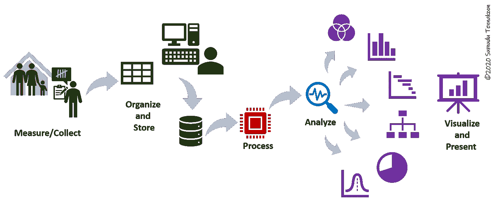**

**图 17:普查数据作为数据科学应用的一个例子。(*图片作者)***

# **走向**

**本文为理解数据的一些基本概念奠定了基础。接下来的文章将继续讨论数据的特征和变化，然后讨论数据如何在我们的日常生活中使用，以及它如何通过促进我们的知识、科学和技术来帮助塑造我们的人类文明。**

** [## 了解您的数据—第 2 部分(透过“数据光圈”查看数据)

### “面向所有人的数据科学”的第二篇文章:解决社区中数据素养问题的系列文章。

pub.towardsai.net](/getting-to-know-your-data-part-2-seeing-data-through-the-data-iris-c4db68960cd5)** 

# **感谢**

**作者要感谢许多数据科学和机器学习主题的内容创作者，不仅限于在线学习平台和博客，他们提供了有见地的资源来探索和学习数据科学这一迷人的主题。**

# **放弃**

***本文所表达的观点和意见为作者个人观点和意见，不代表雇主或与作者相关的其他机构的观点和意见。本文是旨在解决社区数据素养问题的更广泛出版物的一部分。作者投入了大量的精力来研究所讨论的主题，简化技术术语以增加对内容的理解，查找相关参考资料以确保所呈现事实的有效性。欢迎讨论、批评、不同的想法和建议。***

# **参考**

**[1]达文波特、托马斯 h 和 D. J .帕蒂尔。[“数据科学家:21 世纪最性感的工作。”](http://hbr.org/2012/10/data-scientist-the-sexiest-job-of-the-21st-century/)(2012 年 10 月)。*哈佛商业评论* 90 年，第 10 期:70–76 页。**

**[2] IBM 云教育，“[数据科学](https://www.ibm.com/cloud/learn/data-science-introduction)”。(2020 年 5 月)。 [IBM 云学习中心](https://www.ibm.com/cloud/learn)。**

**[3] Baykoucheva，Svetla。 [*管理科学信息和研究数据*](https://www.sciencedirect.com/book/9780081001950/managing-scientific-information-and-research-data)*。(2015).马萨诸塞州沃尔瑟姆:钱多斯出版社。第 80 页。[ISBN](https://en.wikipedia.org/wiki/ISBN_(identifier))9780081001950。[via [维基百科](https://en.wikipedia.org/wiki/Data_literacy)***

***[4]卡尔森，杰克；约翰斯顿，丽莎。 [*数据信息素养:馆员、数据、新一代研究人员的教育*](http://www.thepress.purdue.edu/titles/format/9781612493527) *”。* (2015)。印第安纳州西拉斐特:普渡大学出版社。第 15 页。[ISBN](https://en.wikipedia.org/wiki/ISBN_(identifier))9781557536969。[via [维基百科](https://en.wikipedia.org/wiki/Data_literacy) ]***

**[5]基准定义:[https://www.dictionary.com/browse/datum](https://www.dictionary.com/browse/datum)(2020 年 12 月 10 日检索)**

**[6]基准定义:[https://www.merriam-webster.com/dictionary/datum](https://www.merriam-webster.com/dictionary/datum)(2020 年 12 月 10 日检索)**

**[7]朱丽叶·里兹卡拉。[大(非结构化)数据问题](https://www.forbes.com/sites/forbestechcouncil/2017/06/05/the-big-unstructured-data-problem)。(2020 年 6 月)。[福布斯科技委员会](https://www.forbes.com/sites/forbestechcouncil/)。**

**【8】[ASCII](https://en.wikipedia.org/wiki/ASCII)。维基百科。(检索于 2020 年 12 月 17 日)**

**[9]“[Unicode 标准](https://www.unicode.org/standard/standard.html)”。Unicode Inc .(于 2020 年 12 月 17 日检索)**

**[10] Gupta，Mark sen . .[什么是数字化、数字化、数字化转型？](https://www.arcweb.com/blog/what-digitization-digitalization-digital-transformation)”。(2020 年 3 月)。ARC 顾问团博客。**

**[11]“[IEC 80000—2008 年 13:量和单位—第 13 部分:信息科学与技术](https://www.iso.org/standard/31898.html)[”](https://www.iso.org/standard/31898.html)。国际标准化组织(ISO)。(2008).(经由[维基百科](https://en.wikipedia.org/wiki/Kilobyte)2020 年 12 月 17 日)**

**[12] NIST。[前缀为二进制倍数](https://physics.nist.gov/cuu/Units/binary.html)。常数、单位和不确定性的 NIST 参考。(检索于 2020 年 12 月 17 日)**

**[13]“[1541–2002-IEEE 二进制倍数前缀标准](https://ieeexplore.ieee.org/document/5254933)”。(2009).IEEE **。doi:10.1109/IEEE STD . 2009.5254933。ISBN 978–0–7381–6107–5。(经由[维基百科](https://en.wikipedia.org/wiki/IEEE_1541-2002)2020 年 12 月 17 日)****

**[14]格申，纳胡姆；呼叫沃德。“讲故事能为信息可视化做些什么”。(2001).*ACM 的通信*。**44**(8):31–37。[doi](https://en.wikipedia.org/wiki/Doi_(identifier)):[10.1145/381641.381653](https://doi.org/10.1145%2F381641.381653)。**

**15 马希沙·坦纳库恩。使用 Python 的数据可视化(未发布)。**

**【16】[人口普查](https://en.wikipedia.org/wiki/Census)。维基百科。(检索于 2020 年 12 月 10 日)**