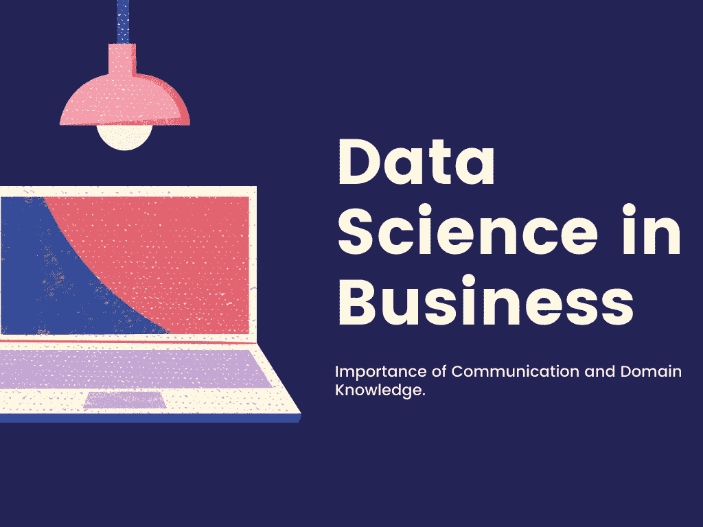
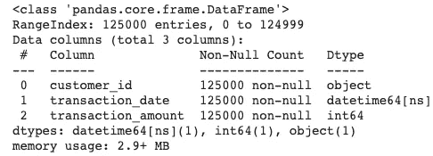
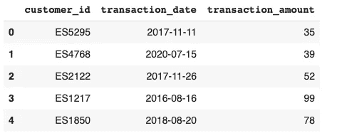
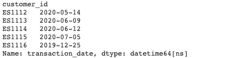
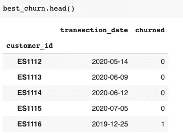
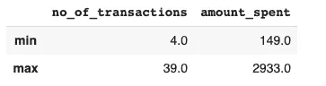
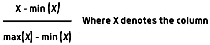
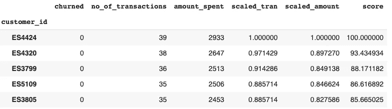
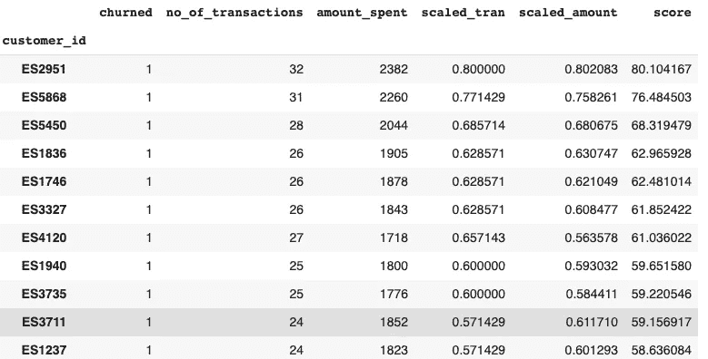

# 商业中的数据科学

> 原文：<https://pub.towardsai.net/data-science-in-business-8266fae71a87?source=collection_archive---------1----------------------->

## [数据科学](https://towardsai.net/p/category/data-science)，[观点](https://towardsai.net/p/category/opinion)

## 一个实时场景，展示了沟通、领域知识和在数据科学中快速做出决策的能力的重要性。



> “有句谚语说，‘什么都懂，什么都不懂。’说到成为一名数据科学家，你需要有点像这样，但也许更好的说法是，**“多面手，精通一些。””—布伦丹·蒂尔尼**

我相信上面引用的 **some** 这个词包含了沟通和领域知识。您可能已经阅读了许多关注数据科学技术方面的文章。在本文中，我们将通过描绘一个场景来讨论数据科学家在日常生活中遇到的一些非技术性的方面。

# 方案

我在一家大型零售公司 **Eastside** 的线上部门做**数据从业人员**。我的经理在去开会的路上路过我的办公桌，让我找出“我们最好的客户”，然后匆匆离开了。

这里的**最佳**是什么意思？是指消费过最多的客户吗？还是指买的多的客户？注意花费最多和买很多物品是完全不同的两回事。

上述情况在数据领域是常见的。**模糊**(含糊)语言的用法。更多的时候，我们会听到人们用自然语言表达他们的想法，这种语言起初看起来不错，但仔细观察却很模糊。

在上面的情况中，你注意到了糟糕的沟通会产生怎样的负面影响。Linkedin 的一项研究表明，沟通是最受欢迎的软技能。即使我的经理的要求不明确，我也可以寻求澄清。如果我们找到请求的最终目标。他为什么想知道最好的客户？我们可以决定我们的方法。

在联系我的经理时，他解释说在*营销预算*中还有**1000 美元**，他想用这笔钱通过给实体店的顾客发送一些**免费优惠券**来将他们转化为网店。这里有一点需要注意的是，我们不应该偷走实体店的顾客，因为这可能会给实体店的负责人带来问题。他还提到这项任务必须在两小时内完成！！

这就是领域知识发挥作用的地方。**偷客户是什么意思？**这意味着我们不应该向实体店的活跃客户发送优惠券，因为这可能会阻止他们前往实体店。相反，我们可以向一些最受欢迎的顾客发送优惠券。

**客户流失** —指客户不再是客户。(我在网飞上订阅了 3 个月，后来退订了。我是一个被搅动的顾客。)

我向我的经理解释说，如果顾客在过去 3 个月内没有从实体店购买任何东西，我们会认为他受到了骚扰(大多数顾客只从实体店购买食品杂货。可以有把握地假设，过去 3 个月没有购买任何东西的人已经搅拌过了)。我的经理同意了，并给了我所有实体店顾客的数据集。

你可能会认为这个针对顾客的想法并不完美。在数据科学中会出现一种情况，由于时间限制或无法测量，我们不知道真相。我们使用接近真实的近似值。这些被称为**代理**。当请求很紧急时，通常使用代理。

# 方法

让我们来探究一下给出的实体店的数据。

```
import pandas as pd
import datetimedata = pd.read_csv("/content/es_phy_store.txt")
```

**输出—**



总共有 1，25000 行和 3 列。我们的目标是返回最佳客户的 id。我们还可以看到，所有的列都是**非空的**，这表明数据是干净的。

为了找出被搅动的客户，我们将按`customer_id`对数据进行分组，并找出每个客户的最新`transaction_date`。

```
group_by_customer = data.groupby("customer_id")
last_transaction = group_by_customer["transaction_date"].max()
last_transaction.head(5)
```

**输出—**



由于如果客户的最后一次交易是在三个月前，则认为客户受到了影响，因此我们将创建一个截止日期 2020 年 5 月 1 日，并相应地标记客户。

我们将创建一个名为 **best_churn** 的独立数据帧，它由`customer_id`、`transaction_date`和一个表示客户是否被搅动的布尔列`churned`组成。

**输出—**



## 对客户进行排名

我们发现了被激怒的顾客。主要目的是找到最受欢迎的顾客。首先，我们需要*根据一些标准对客户进行排名*，接下来，我们需要找到一个*阈值*来识别最佳客户。

由于时间限制，我们不能使用复杂的 ML/DL 模型。我们可以使用简单的**加权和模型**对客户进行分类。该模型为每个客户分配一个**数字(分数)**来表示他们有多优秀。在我们的例子中，我们需要考虑两个标准— **花费金额**和**购买次数**。两者必须给予同等的重视，即。一个消费多的顾客，就相当于一个购买多的顾客。因此，我们可以将客户得分定义为—
得分= (1/2 ×购买次数)+(1/2 ×消费金额)

例如，如果一个顾客购买了两次价值 500 美元的商品，他的得分就是(1/2 × 2) + (1/2 × 500) = 251。

让我们找到每个客户的交易数量并创建一个单独的列。这可以通过基于 customer_id 对数据进行分组并使用`size()`方法来实现。我们还可以通过使用`transaction_amount`列上的`sum()`方法找到*花费的总金额*。我们还将删除不再需要的`transaction_date`列。

```
best_churn["no_of_transactions"] = group_by_customer.size()
best_churn["amount_spent"] = group_by_customer.sum()
```

**输出—**


一切似乎都很好，但如果我们仔细看看这个公式，我们会发现一个缺陷。我们看到，当一个顾客花 500 美元买了两次东西时，他的得分是 251。如果一个顾客在 20 次不同的购买中花费了 400 美元，他的得分将是 210，这似乎是不公平的，因为第二个顾客似乎比第一个顾客更有规律，并且从长远来看显示出更多的消费潜力。这主要是由于两个原因。
1)花出去的钱总是超过交易的次数。我们对这两个标准使用了相同的权重。

让我们从 best_churn 数据框架中找出最小和最大交易数量和金额。

```
best_churn[["no_of_transactions", "amount_spent"]].describe().loc[["min", "max"]]
```



我们可以看到，与花费的金额相比，交易的数量实在太少了。为了解决这个问题，我们将使用**最小-最大比例**，它用于以有意义的方式比较不同的比例。最小-最大缩放的公式是—



让我们将上述公式应用于我们的`no_of_transactions`和`amount_spent`列，使用缩放值找出分数，并基于分数对数据帧进行排序。

**输出—**



## 我们如何找出阈值分数值？

我们应该选择前 20 个客户吗？还是前 50 个客户？还是前 10%的人？标准应该是什么？同样，领域知识在这里起着至关重要的作用。我们知道预算是 1000 美元。每张息票的价值是不确定的，我们必须决定它的价值。优惠券价值不能太高，因为它减少了客户的数量。

我们都知道，一笔交易的 30%折扣是一笔相当不错的交易。
因此，让我们找出我们拥有的初始数据框架中所有 1，25000 笔交易的平均值，并找出该平均值的 30%。

```
coupon = data["tran_amount"].mean() * 0.3Output - 19.4976
```

让我们把这个数四舍五入到 20。因此，每张息票价值为 20 美元。我们知道我们的预算是 1000 美元。除以 1000/20 得 50。因此，我们可以从搅拌值为 1 的`best_churn`数据中选择**前 50 名客户**，并邮寄优惠券。

```
top_50_churned = best_churn.loc[best_churn["churned"] == 1].head(50)
```

**输出—**



# 结论

在这篇文章中，我们了解了交流的重要性以及模糊语言的使用是如何成为障碍的。我们还采用了一个真实的场景，解决了一个有许多约束条件的问题，并且还需要使用沟通技巧、领域知识和快速决策。我希望你今天学到了新东西。

如果想联系，**在**[**LinkedIn**](https://www.linkedin.com/in/saiteja-kura-49803b13b/)**上联系我。**