# 数据科学面试指南

> 原文：<https://pub.towardsai.net/data-science-interview-guide-a705c87d1a69?source=collection_archive---------0----------------------->

## [职业](https://towardsai.net/p/category/careers)，[数据科学](https://towardsai.net/p/category/data-science)

## 帮助您开始数据科学职业生涯的指南


照片由 Unsplash 提供

## 给我发邮件到 dsinterviewprep@gmail.com[的](https://mail.google.com/a/?view=cm&fs=1&to=dsinterviewprep@gmail.com)，安排模拟面试、简历回顾和职业指导！

# 序

嗨！

以下页面旨在帮助那些希望进入数据科学领域的人。它们是我大学毕业后第一份全职工作前所有笔记的汇编。这些笔记是通过准备电话和技术屏幕，现场，研究和许多许多采访后的改编而获得的。我希望它可以帮助您，并随意将其分发给其他人，以便他们可以开始自己的旅程，追求数据科学的职业生涯。

TLDR:这些是我采访的笔记。它们旨在帮助实习和新毕业的数据科学家。这个指南并不是要取代课程，它更多的是一个补充。

# 关于我

我刚刚从加州大学伯克利分校毕业，获得了数据科学学士学位。我现在是脸书大学的数据科学家。我只能通过导师和其他人的指导才能达到这一步。我想分享我的采访过程和笔记，以帮助学生，主要是在技术领域代表性不足的社区中促进数据科学。在我的空闲时间，我打篮球，因为“球就是生命。”

# 目录

1.  **我的求职策略步骤**
2.  **我的面试策略步骤**
3.  **编码(Python/R)**
4.  **SQL**
5.  **统计和概率**
6.  **其他(业务和产品相关)**
7.  我和一起面试过的公司

# 我的求职策略

1.  润色你的简历——这是你进入职场的敲门砖。请人们回顾和评论它，去你大学的就业中心，让别人看一下它并给你反馈
2.  早点开始——我怎么强调都不为过，如果你等太久才申请，实习机会就会被填满。八月/九月开始申请和研究暑期实习。这是一个漫长的过程，早点开始会让你拥有巨大的优势。
3.  到处申请 —你想申请尽可能多的地方。当你刚开始工作并且经验有限时，这纯粹是一个数字游戏，你申请的职位越多，你在面试中的机会就越大。此外，更多的面试意味着更多的实践，这意味着在未来的面试中的改进。例如:谷歌“数据科学实习生”,申请名单中的每一份工作(显然要记住你的地理位置限制，也就是说，如果你在国外工作不可行，就不要申请国外的工作)。
4.  **联系 LinkedIn 上的人**——让公司内部的人为你担保并给你推荐是一件大事，可以让你的简历脱颖而出。
5.  **即使在面试的时候也要坚持申请**——即使你是一名专业人士，并且在所有面试中都表现出色，竞争性的工作机会也只能帮助你。不要因为已经开始面试就停止申请公司，有 B、C、D 等计划总是好的

# 我的分步面试策略

1.  对你的简历了如指掌——你应该能够简洁清晰地讲述你过去的项目、经历和工作。你还应该能够回答一些关于你的经历的问题，比如:“描述一次你不得不与其他人一起工作的经历。”练习向他人解释你所做的工作，并准备这些问题的答案。
2.  调查这家公司——面试官会问你为什么想去那里工作，你应该准备聪明地回答。在面试前对公司进行调查(公司成立于何时，他们做什么，他们的目标客户是谁，等等)。
3.  了解角色——非常简单明了，知道你申请的工作的职责和要求。能够将这个角色的要求与你自己的技能和经验联系起来。如果你没有太多经验，突出你是一个“快速学习者”。
4.  **你可能会被问到的实践和研究问题** —如果你在谷歌上搜索“特斯拉数据科学实习生面试问题”，你可能会找到一大堆之前面试过的人，他们正在分享自己的经历。使用尽可能多的可用资源，尽可能做好准备。
5.  在 LinkedIn 上查找你的面试官——知道你将和谁交谈总是一个好主意。也许你们上的是同一所学校，或者来自同一个地区，这可以帮助你在更人性化的层面上与面试官交流，而不仅仅是作为一名候选人。
6.  把你的简历和公司笔记放在你面前——显然在电话/视频屏幕阶段更容易做到，但是能够参考你的笔记而不是仅仅依靠你的记忆是有帮助的。
7.  **在最后提问**——面试官正在评估你的兴趣，通过问一些深思熟虑的问题来展示你的兴趣。例子:“我听说你要推出 X 产品，这对公司的长期愿景有什么影响？”或者询问该角色的日常职责或文化。重点是问点事。
8.  **自信**——你已经练习和准备过了，你能行！一定要从每一次面试中学习，并重复这一经验，以提高下次。没有人走进他们的第一次面试就搞砸了，熟能生巧。
9.  事后发一封感谢邮件——大多数人不这么做，但这是你应该经常做的事情。用你的技术和人际交往技巧取胜。

# 编码(Python/R)

用 Python 和 R 编写代码是 DS 面试过程的重要部分。其中大部分集中在字符串和数组/字典操作、for/while 循环用法和 SQL(我将在后面的章节中介绍)。

练习编码和 SQL 的免费资源有[https://leetcode.com/](https://leetcode.com/)和[https://www.hackerrank.com/](https://www.hackerrank.com/)。数据科学的面试问题通常属于简单和中等类别。

# r(就这部分，后面的都是 Python 的)

列表:包含不同类型元素的向量

原子向量:元素属于同一类型

# 元组与列表

元组是不可变的( )

*   可以引用对象而不改变它们

列表是可变的[ ]

*   可以追加和更改值

# 词典{ }

无序的、可变的和索引的

{唯一键:值}

# 使用切片反转字符串

`string[::-1]`

示例:

`‘Hello’[::-1]`

->《欧莱》

# 哈希表

哈希(例如:唯一的学生 id)

*   哈希是从一组相似的对象中唯一识别对象的过程
*   使用哈希函数将大密钥转换为小密钥(例如:随机数生成器+数据表中已转换字段的二进制数字之和)
*   如果有冲突，你可以使用单独的链接(链表)

# 获取一个字符串的所有子字符串

```
string = ‘hello’result = [string[i:j] for i in range(len(string)) for j in range(i + 1, len(string) + 1)]
```

-> ["h "，" he "，" hel "，" hell "，" hello "，" e "，" el "，" ell "，" ello "，" l "，" ll "，" llo "，" l "，" lo "，" o]]

# 获取列表中某项的索引

`list.index(element)`

示例:

`[‘a’, 2, ‘k’].index(‘a’)`

-> 0

# 两点

两个指针是一种处理数组操作问题的算法技术。它基本上对数组中的元素进行排序，并有两个“指针”，一个在数组的开头，一个在数组的结尾。随着函数的进行，两个指数会向左和向右移动，直到满足目标条件。这种方法的一个常见用法是找出一个数组的两个元素相加是否等于某个数字。

```
x = target conditioni = 0j = len(array) -1while(i < j):
   if (array[ i ] + array[ j ] == x):
      return True #this is when you have found a match
   else if (array[ i ] + array[ j ] < x):
      i += 1 #get a larger value from the left of the array
   else:
      j -= 1 #get a smaller value from the right of the array
```

# String.format()

此函数格式化指定的值，然后将它们放入字符串占位符{ }中

示例:

`“{}, A computer science portal for geeks.”.format(“GeeksforGeeks”)`

-> GeeksforGeeks，极客的计算机科学门户网站。

# 链接列表

链表是一种数据结构，它是一组称为“节点”的小型数据结构


有三个节点的单链表

^This 是一个单向链表

节点—在这种情况下包含两个属性:一个值(5)和一个指向下一个节点的指针

头/尾节点—分别是第一个和最后一个节点


具有两个节点的双向链表

^In 一个双向链表，每个节点既指向它前面的节点，又指向它后面的节点

您可能已经注意到，空值不指向任何东西，但是节点可以指向它们。

# 链接列表代码

```
class linkedListNode:
  def __init__(self, value, nextNode=None):
   self.value = value
   self.nextNode = nextNode#To create Node, pass in valuenode1 = linkedListNode(‘3’)node2 = linkedListNode(‘7’)#Connect nodesnode1.nextNode = node2
```

#3 -> 7 ->空

# 遍历链表

获取节点的值:node.value

获取下一个节点:node.nextNode

1.  跟踪当前节点
2.  检查当前节点是否为空

*   a)当 currentNode 不为 None:
    print(current node . value)
    current node = current node . next node

# 结构化查询语言

SQL 是一种数据查询语言。除了数据可视化工具之外，数据科学家还使用 SQL 来制作图表、获取相关信息和生成表格。

# 明显的

返回唯一值

示例:

`SELECT DISTINCT(user_id) FROM table`

# SQL 执行顺序

1.  来自/加入
2.  在哪里
3.  分组依据
4.  拥有
5.  挑选
6.  明显的
7.  命令
8.  限制

# 联盟

将查询与所有查询中的所有行组合成一个结果

示例:

```
SELECT row1, row2 FROM table1UNIONSELECT row1, row2 FROM table2
```

# 子查询

子查询是相互嵌套的查询

示例:

```
SELECT column-namesFROM table-name1WHERE value IN (SELECT column-nameFROM table-name2WHERE condition)
```

# 获取符合标准的表的百分比

`SELECT (COUNT(case when … else null end) * 100)/COUNT(*) FROM table1`

基本上，你得到的是与你所寻找的相匹配的所有东西的计数，然后除以总行数

count(*)包括空值

*或*

`SELECT AVG(IF(condition,1,0)) FROM table1`

思考:count(column_name)忽略空值

count(*)包括空值

# 行号、秩和密集秩

SELECT column1，row_number() over (column2，desc，…) order by column2，row_number

行数，等级，密集等级

1, 1, 1

2, 2, 2

3, 2, 2

4, 4, 3

5, 4, 3

6, 6, 4

行号没有关系，不会跳过

排名有平局和跳票

密集等级有联系，不跳过

…将()排在(…，…)之上

……dense _ rank()over(…，…)

# CTE

开始时给表起别名，然后再从中进行选择

用表 1 作为(select … from … where…)，

table2 as (select … from … where…)，

表 3 as(select…from…where…)#结尾没有逗号

从表 1、表 2、表 3 中选择…

# IN 子句

返回值在指定约束内的结果

```
SELECT * FROM tableWHERE col1 in (1,2,3)
```

# 拥有

当您有集合函数并且想要对它们应用条件语句时使用

```
SELECT MAX(col1), year FROM table1GROUP BY yearHAVING MAX(col1) > 400
```

# 案例/时间

用于在表中创建新列，该列的值基于用户定义的条件。

```
SELECT col1, (CASE WHEN col1 < 10 THEN 1WHEN col1 BETWEEN 10 AND 20 THEN 2ELSE 0END) AS case_when_column FROM table1
```

# 左边和右边

从字符串的左边或右边提取指定数量的字符

`LEFT(column_name, number of characters)`

`RIGHT(column_name, number of characters)`

# 子链

从具有指定开始和停止位置的字符串中提取字符

`SUBSTRING(string, start, stop)`

# 串联

将字符串加在一起(连接它们)

`CONCAT(string1, string2, …)`

# 累积和

在表格中移动时重新计算的累计

示例:

```
SELECT id, SUM(col1) OVER (ORDER BY id DESC rows BETWEEN unbounded preceding AND current row) AS col2FROM table1 ORDER BY id DESC
```

Id，列 1，列 2

1, 10, 10

2, 2, 12

3, 7, 19

在这种情况下，“col2”是在计算中使用 col1 中的数字的累计总数。

# 联合

返回第一个非空值

示例:

`SELECT COALESCE(null, null, 1, null, null, 3)`

-> 1

在计算过程中也处理空值

`COALESCE(sum(col1), 0)`

#如果在计算总和时某个值为空，它会将其视为零

# 创建一个模式+表

模式—数据库中数据的组织

表格—组织成水平行和垂直列的数据

`CREATE schema schema_name`

`CREATE table table_name`

`(col1 int, col2, int, col3 string)`

`GO`

# 数数

count(col 1)-计算具有非空值的行数

计数(*) —计算表中的总行数

# 连接(非常重要)

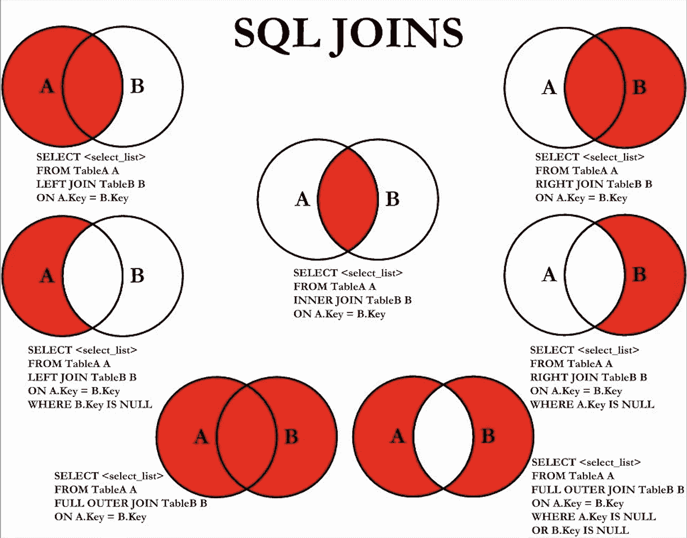

这些是最常见的 SQL 连接

# 自连接

自联接是指将一个表联接到自身，为了实现这一点，需要多次引用该表，并使用不同的名称作为别名

选择 a 键，b 键

来自表 1 A、表 1 B

A.id 在哪！= B.id

并且 A.key2 = B.key2

# 无函数秩

假设表“emp”包含列“salary”和“dept_id”

```
SELECT emp.*,(SELECT count(*)FROM emp emp2WHERE emp2.dept_id = emp.dept_id AND(emp2.salary > emp.salary ORemp2.salary = emp.salary AND emp2.emp_id <= emp.emp_id)) AS “row_number”,(SELECT 1 + COUNT(*)FROM emp emp2WHERE emp2.dept_id = emp.dept_id ANDemp2.salary > emp.salary)) AS “rank”,(SELECT COUNT(DISTINCT salary)FROM emp emp2WHERE emp2.dept_id = emp.dept_id andemp2.salary >= emp.salary) AS “dense_rank”,FROM emp
```

# 处理表中的反向重复项

示例:

col1，col2 #这是初始表

0, 1

1, 2

1, 0

2, 1

3, 7

7, 3

```
SELECT col1, col2 FROM table1WHERE col1 != col2AND col1 < col2col1, col2
```

#这是后来的桌子

0, 1

1, 2

3, 7

# 从日期获取月份

提取(从日期开始的月份)

# 群组连接

将多行连接成一个字段

`GROUP_CONCAT(col_name ORDER BY col2 SEPARATOR string_value)`

# 除...之外

包括两个表中不常见的值，类似于左连接

```
SELECT col1 FROM table1EXCEPTSELECT col1 FROM table2
```

# 超过

Over 就像一个运行总数，函数在 SQL 输出的每个“步骤”上重新计算

```
SELECT name, weight, AVG(weight) OVER (ORDER BY name)FROM table1 ORDER BY namename, weight, avg_weight
```

安迪，50，50

鲍勃，100，75

塞德里克，50，63 岁

当您在表格中移动时,“avg_weight”列会重新计算，同时考虑新数据和前面的行

# 划分依据

进一步细分“over ”,功能在每个分区重置

```
SELECT name, weight, country, AVG(weight)OVER (ORDER BY name PARTITION BY country)FROM table1 ORDER BY namename, weight, country, avg_weight
```

安迪，50 岁，英国，50 岁

鲍勃，100，英国，75

塞德里克，50 岁，法国 50 岁

戴夫，70 岁，德国，70 岁

埃里克，70 岁，法国，60 岁

# 统计和概率

大多数公司要求对回归和分类器的工作原理有基本的了解。他们还希望你熟悉不同种类的分布(正态分布和二项式分布)、置信区间、解释 p 值和基本概率概念(期望、贝叶斯定理)。你还应该了解描述性统计(均值、中位数、众数、标准差等)。

# 逻辑回归

*   使用目标变量的“对数概率”构建
*   给出给定独立变量的正分类概率
*   更改阈值以影响分类率

# AUC-ROC 曲线

*   用于评估逻辑回归模型的性能
*   说明模型能够在多大程度上区分不同的类别
*   查看真阳性率和假阳性率之间的阈值权衡

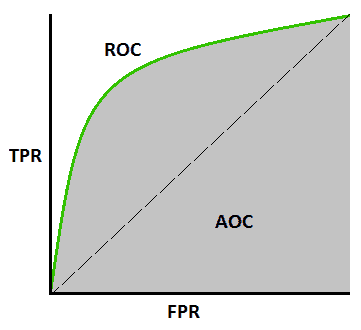

**ROC** —概率曲线

**AOC/AUC** —可分性的度量

# 混淆矩阵

概述您的模型所做的分类

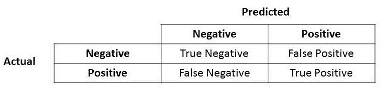

# 精确度、召回率、准确度

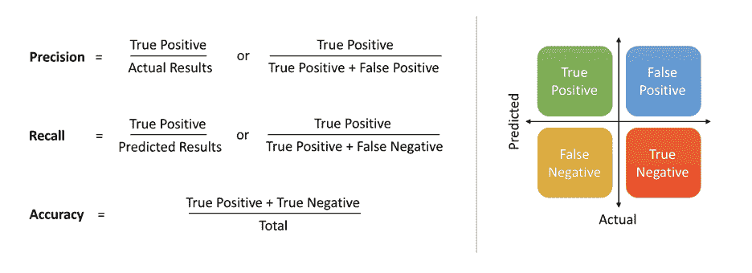

精确度—相关结果的百分比

回忆/敏感度—正确分类的相关结果的百分比

# 对数变换

您可以记录转换数据，以减少失真

# 平均公式

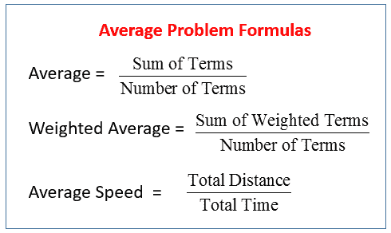

# 机器学习

特征-独立变量

标签—响应变量

监督—用于构建分类器的输入和输出数据

无监督-仅输入数据

# k 均值

无监督的机器学习模型，将数据分成聚类进行分类

步骤:

1.  指定分类的数量
2.  随机选择 k 个数据点作为初始聚类中心
3.  根据欧几里德距离将其他数据点分配到聚类中心
4.  通过获取聚类中所有数据点的平均值来重新计算聚类中心
5.  重复
6.  迭代最小化平方和，直到聚类中心不变

# k-最近邻

受监督的机器学习模型，使用与被分类的数据点接近的其他数据点来进行预测

步骤:

1.  选择 k 的值，通常为 n，其中 n 是数据点的总数
2.  对于每个示例，计算两点之间的距离，并按从小到大的顺序排列
3.  挑选前 k 个条目以获得标签(模式)
4.  如果回归，返回 x

# 大数定律

随着样本量中数据点数量的增加，样本均值越来越接近总体均值

# 拔靴带

任何依赖于随机抽样替换的测试或度量

# 中心极限定理

如果你从总体中抽取重复的大样本(n > 30)并计算平均值，你将得到一个正态分布

# p 值

假设零假设为真，获得至少与观察值一样极端的值的概率

# 置信区间

值的范围 X%可能包含真实值，使用样本来估计总体

如果使用相同的技术重复采样，平均值将有 X%的时间处于您创建的置信区间内

# A/B 测试

*   变体被随机选择并显示给不同的用户
*   统计分析用于确定哪种变化表现更好

步骤:

1.  获取基线数据:转化率、流量、点击率等
2.  形式假设
3.  创建实验并运行它
4.  计算样本平均值和标准偏差，并检查统计显著性
5.  分析并得出结论

# 邦费罗尼校正

用于说明多重测试，例如。测试每种颜色的彩虹糖与流感的相关性

方法:将 alpha 值除以您正在运行的测试数量( *alpha* / *n* )

# t 检验

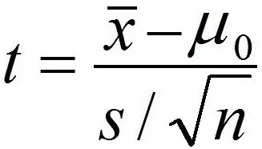

样本均值—分子中的零假设

s =样本标准偏差

n =样本量

# 统计能力

假设存在一种效应，检测到这种效应的可能性

# 决策树

入职步骤:

1.  培训数据、功能
2.  确定要分割的“最佳特征”
3.  根据最佳特征分成子集
4.  重复分割，直到精度最大化，同时最小化节点

用于分类的基尼函数:

sum(pk(1-pk))最大化拆分的信息增益

修剪—遍历每个节点，并根据成本函数评估删除

# 连续整数的和

(整数个数/2)(第一个数字+最后一个数字)

# 制袋材料

一种并行机器学习训练方法

*   集成-使用相同的算法训练多个模型
*   用替换法随机抽样，产生新的学习者，并对他们进行平均
*   考虑了所有特征

# 助推

一种迭代机器学习训练方法

*   错误分类的数据增加了权重，以便后续的学习者关注它
*   顺序而非并行
*   学员的加权平均值，表现越好=权重越大

# 随机森林

*   作为一个整体的大量个体树
*   每棵树都有预测，投票最多的类成为预测
*   随机选择的特征子集用于分割

# 交互效度分析

用于评估 ML 模型的技术，例如。列车-测试分离

# k 倍

交叉验证技术

步骤:

1.  将数据随机分成 k 倍(重叠的组)
2.  使用 k 作为测试，k-补码(不在 k 中的所有内容)作为训练，遍历折叠
3.  取记录分数的平均值，这就是你的绩效指标

# r 平方

模型解释的变化比例

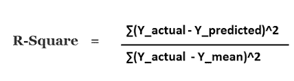

# 标准偏差

数据点与平均值的平均距离

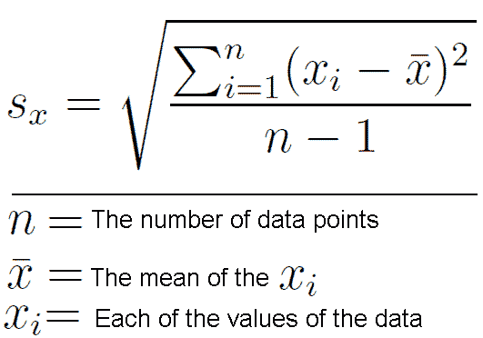

# 回归公式

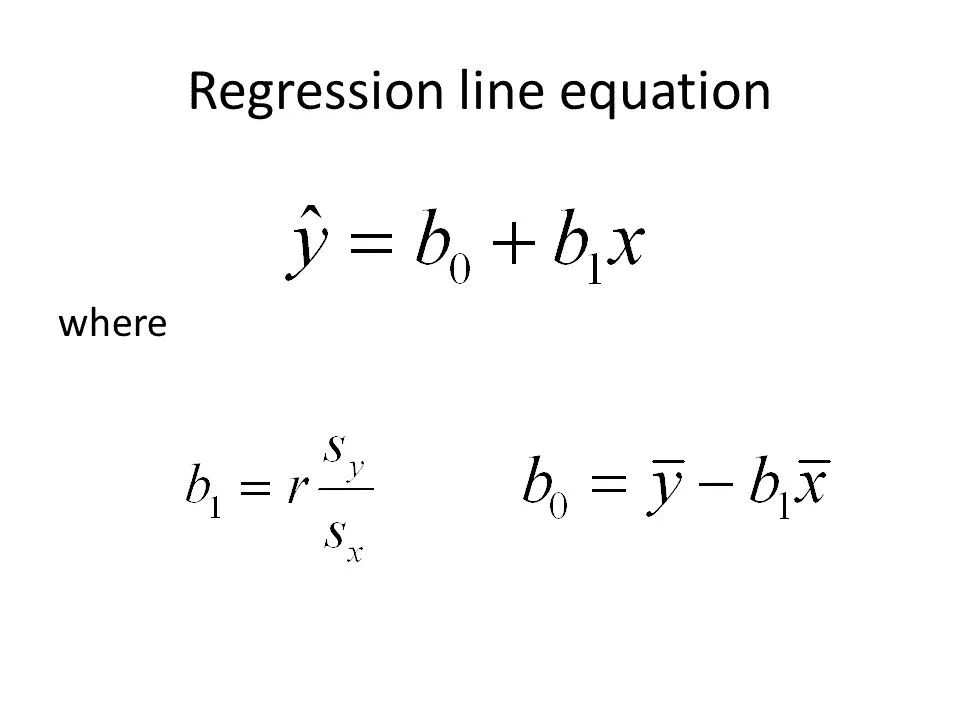

# 协方差

两个变量一起变化了多少

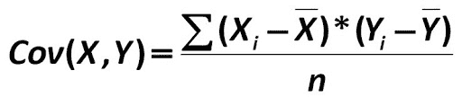

# 相互关系

数据有多接近直线

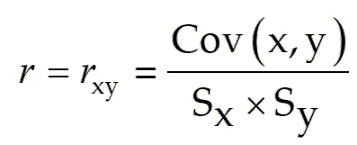

# 预期

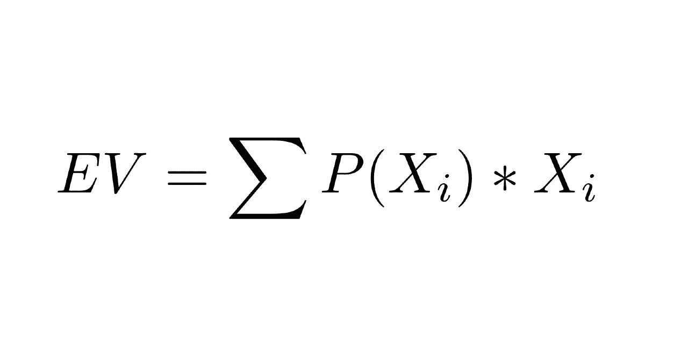

EV =期望值

P(Xi) =结果的概率

Xi =结果

# 贝叶斯定理

有两个公式需要了解

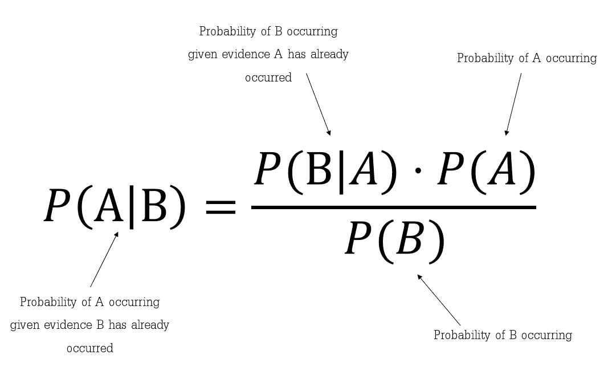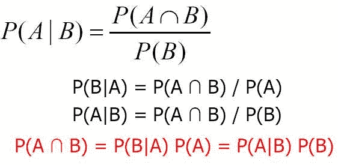

# 排列

这是为了秩序。站成一排的人们

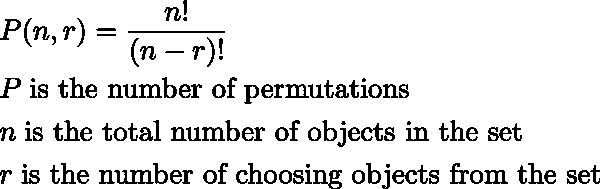

# 组合

当顺序不重要时，例如。从帽子里挑选彩球

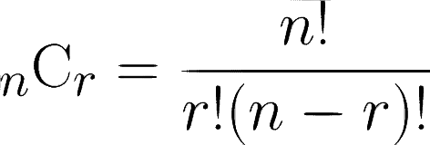

# f 统计量

方差分析—找出两个群体之间的平均值是否有显著差异

回归-回归系数为 0 的概率

# 二项分布

成败在此一举。

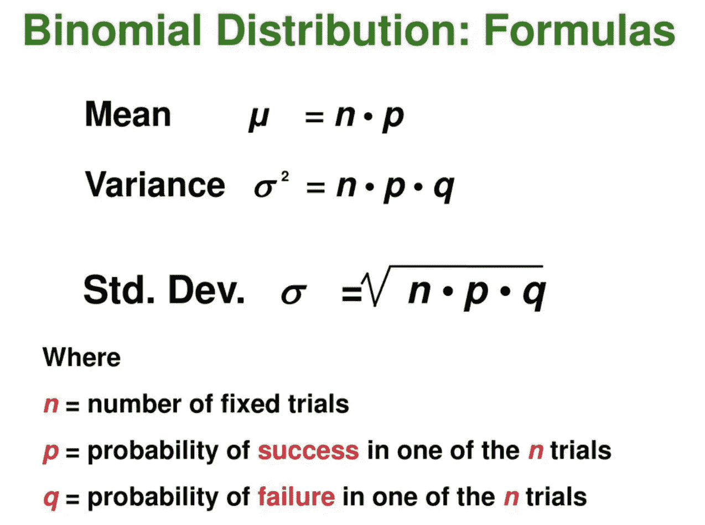

# 置信区间公式

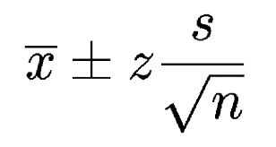

x 条=样本平均值

z = z 得分

s =样本标准偏差

n =样本量

# 多重共线性

当两个本应独立的变量相互关联时

示例:使用平方英尺和房间数量对房价进行回归。随着房间数量的增加，面积也在增加。这两个变量非常相关，因此不是独立的。

# z 得分

衡量一个点离平均值有多少标准差

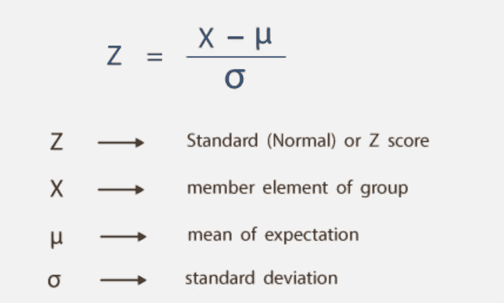

# 其他(业务和产品)

许多数据科学面试都包括使用“数据驱动的决策”来解决业务问题。这基本上可以归结为进行一个 A/B 测试，然后进行一个 T 测试，以确定你的结果是否有意义。

# 应用程序接口

应用程序编程接口—允许程序相互交互的接口

# 处理数据中的空值

如果它是连续的和非独立的(例如:天气数据，今天的温度和天气条件影响明天的条件和温度)，那么您可以根据周围的数据进行平均或外推(例如:如果您有 7 天的温度数据，但缺少第 4 天的数据，您可以使用第 3 天和第 5 天的平均值)。

如果是分类的(例如:调查数据)，您应该忽略或从您的分析中删除这些行。例如:如果您有调查响应数据，那么假设人们独立地做出响应，因此一个人的响应不能用于推断另一个人的响应，因为人们有不同的观点和经历，即使他们在相同的“人口统计”中。

# 软件开发工具包(Software Development Kit)

软件开发工具包—用于开发应用程序的一套工具

# 广告指标

CPI——每印象成本(广告的眼球数)

每次点击成本(流量)

CPA —每次操作的成本(取决于业务问题，可能是购买，可能是订阅，等等)

点击率——点击广告的人数除以看到广告的人数

跳出率——到达后立即离开的人

转换率—获得期望的行动

基线数据:

*   网站流量
*   销售
*   电子邮件订阅
*   社交媒体上的关注者
*   新用户与回头客
*   用户来自哪里
*   投资回报、销售额和每次点击成本的变化

# 广告需要考虑的事情

*   安置
*   独特性
*   类型(横幅、旋转木马等)
*   显示一天中的广告时间
*   与用户的相关性
*   行动呼吁
*   目标(转化、流量等)
*   语言和词汇选择
*   视觉吸引力
*   交互性

# 行为问题的启动方法

1.  **情形** —描述事件或情形
2.  **任务** —解释要完成的任务
3.  **行动** —描述为完成任务所采取的行动
4.  **结果** —以结果和影响收尾

# 盈亏平衡

收入=成本

# 利润

利润=总收入-总成本

# 要问面试官的问题

1.  日常职责
2.  公司价值观
3.  工作中最喜欢和最不喜欢的部分
4.  成长的机会
5.  工作中最具挑战性的部分
6.  我的背景有没有让你质疑我能否胜任这份工作的地方(**)如果他们提出任何问题，那就强调你的优势，解决他们的顾虑**

# 我面试过的公司

面试过程很漫长，我已经被数不清的公司拒绝了。正如我提到的，这是一个数字游戏，尽可能扩大你的网。我总共申请了 400 多份工作，得到了大约 50 份工作的回复和面试，最终只有不到 10 份工作机会。

# 电话和技术屏幕(我记得)

Square、Twitter、Chewy、Carvana、优步、惠普、Duolingo、Affirm、Quora、iRobot、Viagogo、Stubhub、Akuna Capital、Revature、Udemy、upgrade、Foundry.ai、c3.ai、Etsy、Two 适马、Blend、特斯拉、道琼斯、希捷、Sikka、Splunk、Expedia、Xoriant Solutions、Lime、Raybeam、Citadel、Komodo Health、CareDash、IBM、甲骨文、Salesforce、Qualtrics、高盛

# 现场

贝莱德、Wayfair、Capital One、Snap Inc. (Snapchat)、谷歌、Poshmark、Looker、DoNotPay、Pandora

# 聘书(实习生和全职)

SAP、脸书、Nextdoor、思科、国营农场、帕洛阿尔托网络、福特汽车公司

# 坚持申请，不要放弃:)

# 祝您的数据科学之旅好运，感谢您使用本指南！


宿醉带来的迷因

你们