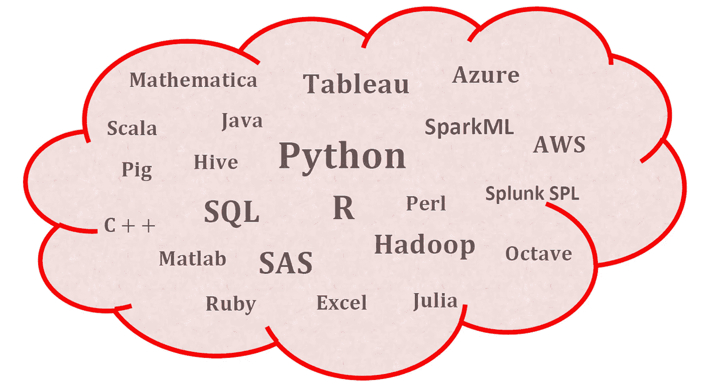
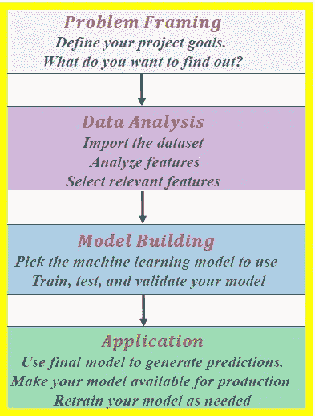

# 数据科学:这不仅仅是关于你选择的语言

> 原文：<https://pub.towardsai.net/data-science-its-not-only-about-the-language-you-choose-339d0ddbc703?source=collection_archive---------4----------------------->

**数据科学和机器学习的平台和编程语言。本杰明·欧·塔约的图片**

## [数据科学](https://towardsai.net/p/category/data-science)

## 数据科学的基本技能是掌握逻辑推理和流程，而不是所使用的编程语言

# 一.导言

数据科学和机器学习项目实现有几种平台和编程语言(**见上图**)。尽管 Python 和 R 被认为是数据科学和机器学习的两种顶级编程语言，但数据科学的基本技能是掌握逻辑推理和流程，而不是使用的编程语言。

在本文中，我们考虑两个数据科学项目的工作流，这两个项目演示了逻辑推理和流程流，而不考虑实现所采用的编程语言。

# 二。数据可视化工作流

数据可视化工作流通常由以下组件组成。这个工作流程可以用任何编程语言实现，比如 R、Python、Matlab、C++等。

数据可视化项目的典型工作流程。本杰明·欧·塔约的图片

a) **数据成分**:决定如何可视化数据的第一个重要步骤是了解数据的类型，例如分类数据、离散数据、连续数据、时间序列数据等。

b) **几何组件:**您可以在这里决定哪种可视化适合您的数据，例如散点图、线形图、条形图、直方图、Q-Q 图、平滑密度、箱线图、配对图、热图等。

c) **映射组件:**这里你需要决定用什么变量作为你的 *x 变量(自变量或预测变量)*和用什么作为你的 *y 变量(因变量或目标变量)*。这一点非常重要，尤其是当数据集是包含多个要素的多维数据集时。

d) **秤组件:**在这里您可以决定使用哪种秤，例如线性秤、对数秤等。

e) **标签组件:**这包括轴标签、标题、图例、使用的字体大小等。

f) **伦理成分**:在这里，你要确保你的可视化讲述真实的故事。在清理、汇总、操作和生成数据可视化时，您需要意识到您的行为，并确保您没有使用您的可视化来误导或操纵您的受众。

使用 Python 和 R 实现的数据可视化工作流示例可在此处找到:

[数据可视化的艺术——使用 Matplotlib 和 Ggplot2 进行天气数据可视化](https://towardsdatascience.com/the-art-of-data-visualization-weather-data-visualization-using-matplotlib-and-ggplot2-4d4b48b5b7c4)

# 三。机器学习工作流

机器学习工作流将由以下步骤组成，这些步骤独立于用于实现的编程语言。

**机器学习项目的典型工作流程。Benjamin O. Tayo 拍摄的图片**

## a)框架问题

***明确你的项目目标。你想知道什么？有数据可以分析吗？***

在这里，您可以决定您试图解决的问题类型，例如，将电子邮件分类为垃圾邮件或非垃圾邮件的模型，将肿瘤细胞分类为恶性或良性的模型，通过将呼叫路由到不同类别来改善客户体验的模型，以便呼叫可以由具有适当专业知识的人员接听的模型，预测贷款在贷款期限结束后是否会取消的模型，基于不同特征或预测因素预测房价的模型，等等。

## b)数据分析

***收集和提炼你的数据。准备一个存储库来存储您的数据***

这是您处理可用于构建模型的数据的地方。它包括特征的数据可视化、缺失数据的处理、分类数据的处理、分类标签的编码、特征的规范化和标准化、特征工程、降维、数据划分为训练集、验证集和测试集等。

## c)模型构建

***挑选与你的数据和想要的结果相匹配的机器学习工具。在自动化流程、图形编辑器或编码您自己的模型之间进行选择。用可用数据训练模型。***

在这里，您可以选择想要使用的模型，例如线性回归、逻辑回归、KNN、SVM、k 均值、蒙特卡洛模拟、时间序列分析等。数据集必须分为训练集、验证集和测试集。超参数调整用于微调模型，以防止过度拟合。执行交叉验证是为了确保模型在验证集上表现良好。在微调模型参数之后，将模型应用于测试数据集。该模型在测试数据集上的性能大约等于该模型用于对未知数据进行预测时的预期性能。

## d)应用

***给你的模型打分生成预测。使您的模型可用于生产。根据需要重新训练您的模型*** *。*

在这个阶段，最终的机器学习模型被投入生产，以开始改善客户体验或提高生产率，或者决定银行是否应该批准向借款人提供信贷，等等。该模型在生产环境中进行评估，以评估其性能。这可以通过使用诸如 A/B 测试的方法将机器学习解决方案的性能与基线或控制解决方案进行比较来完成。从实验模型转换到生产线上的实际性能时遇到的任何错误都必须进行分析。然后，这可以用于微调原始模型。

使用 Python 实现的机器学习工作流的示例可在此处找到:

[机器学习过程教程](https://medium.com/swlh/machine-learning-process-tutorial-222327f53efb)

# 四。总结和结论

总之，我们检查了两个数据科学项目的案例研究，突出了所涉及的逻辑步骤和过程，而不考虑用于实现的编程语言。数据科学的基本技能是掌握逻辑推理和流程，而不是所使用的编程语言。

# 其他数据科学/机器学习资源

[数据科学需要多少数学知识？](https://medium.com/towards-artificial-intelligence/how-much-math-do-i-need-in-data-science-d05d83f8cb19)

[数据科学最低要求:开始做数据科学需要知道的 10 项基本技能](https://towardsdatascience.com/data-science-minimum-10-essential-skills-you-need-to-know-to-start-doing-data-science-e5a5a9be5991)

[数据科学课程](https://medium.com/towards-artificial-intelligence/data-science-curriculum-bf3bb6805576)

[机器学习的基本数学技能](https://medium.com/towards-artificial-intelligence/4-math-skills-for-machine-learning-12bfbc959c92)

[进入数据科学的 5 个最佳学位](https://towardsdatascience.com/5-best-degrees-for-getting-into-data-science-c3eb067883b1)

[数据科学的理论基础——我应该关心还是仅仅关注实践技能？](https://towardsdatascience.com/theoretical-foundations-of-data-science-should-i-care-or-simply-focus-on-hands-on-skills-c53fb0caba66)

[机器学习项目规划](https://towardsdatascience.com/machine-learning-project-planning-71bdb3a44349)

[如何组织你的数据科学项目](https://towardsdatascience.com/how-to-organize-your-data-science-project-dd6599cf000a)

[大型数据科学项目的生产力工具](https://medium.com/towards-artificial-intelligence/productivity-tools-for-large-scale-data-science-projects-64810dfbb971)

[数据科学作品集比简历更有价值](https://towardsdatascience.com/a-data-science-portfolio-is-more-valuable-than-a-resume-2d031d6ce518)

如有问题和疑问，请发邮件给我:benjaminobi@gmail.com