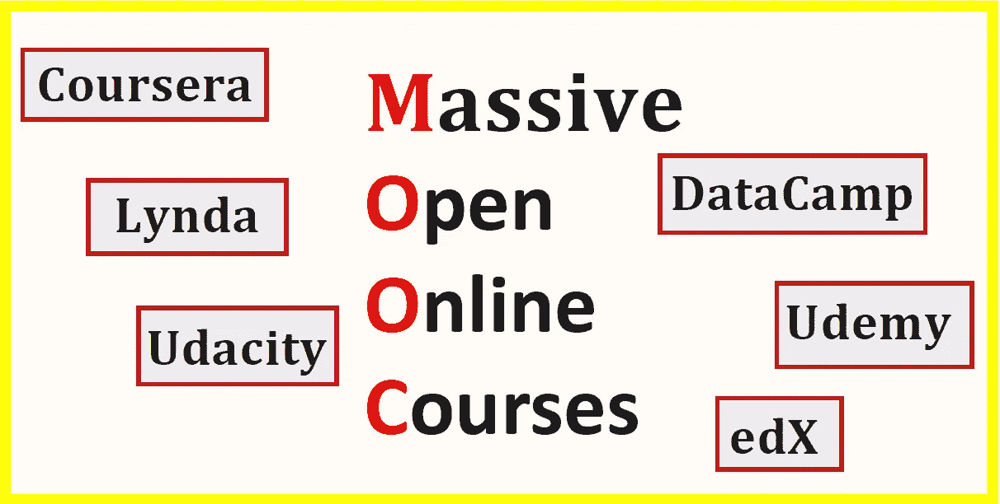

# 数据科学 MOOCs 太肤浅了

> 原文：<https://pub.towardsai.net/data-science-mooc-are-too-superficial-1ca90db7787a?source=collection_archive---------0----------------------->

Benjamin O. Tayo 的图片

## 意见

## 大部分海量开放在线课程都过于肤浅。这些课程是入门课程。对于深入的知识，需要更多。

## 一.导言

数据科学、机器学习和分析被认为是最热门的职业道路。行业、学术界和政府对熟练数据科学从业者的需求正在快速增长。因此，正在进行的“*数据热潮*”吸引了如此多具有不同背景的专业人士，如物理、数学、统计、经济和工程。数据科学家的就业前景非常乐观。 [IBM 预测](https://www.forbes.com/sites/louiscolumbus/2017/05/13/ibm-predicts-demand-for-data-scientists-will-soar-28-by-2020/#7916f3057e3b)到 2020 年，对数据科学家的需求将飙升 28%。

对数据科学从业者不断增长的需求导致了大规模开放在线课程(MOOC)的激增。最受欢迎的 MOOC 提供商包括:

一)**EDX**:[https://www.edx.org/](https://www.edx.org/)

b)**Coursera**:[https://www.coursera.org/](https://www.coursera.org/)

c) **数据营**:[https://www.datacamp.com/](https://www.datacamp.com/)

d) **乌迪米**:[https://www.udemy.com/](https://www.udemy.com/)

e) **乌达城**:[https://www.udacity.com/](https://www.udacity.com/)

林达:[https://www.lynda.com/](https://www.lynda.com/)

由于 MOOC 变得越来越受欢迎，每个数据科学野心家应该问自己的自然问题是: ***数据科学 MOOC 对我有意义吗？***

要回答这个问题，让我们来看看 MOOCs 的优缺点。

## 二。MOOCs 的优势

MOOCs 大多是免费的在线课程，任何人都可以注册。MOOCs 提供了一种负担得起且灵活的学习新技能的方式。MOOCs 涵盖了领导力、分析、数据科学、机器学习、专业技能、工程、商业和管理、人文、计算机科学等广泛的在线课程。这些课程通常由世界各地的顶尖大学提供，如麻省理工学院、哈佛大学、加州大学伯克利分校、密西根大学、EPFL 大学、香港理工大学、昆士兰大学等等。一些课程也由大公司提供，如 IBM、Google 和微软。MOOC 最大的优势是有机会向领导和专家学习，有特权选修世界顶尖大学的课程。

## 三。数据科学 MOOCs 的缺点

大多数数据科学 MOOC 都是入门级别的课程。这些课程对那些已经在补充学科(物理、计算机科学、数学、工程、会计)中有坚实背景并试图进入数据科学领域的个人很有帮助。在我的数据科学之旅中，我发现以下 3 个数据科学专业在质量和严谨性方面名列前茅。

a) [数据科学专业证书(HarvardX，通过 edX)](https://www.edx.org/professional-certificate/harvardx-data-science)

b) [分析:基本工具和方法(Georgia TechX，通过 edX)](https://www.edx.org/micromasters/analytics-essential-tools-methods)

c) [应用数据科学与 Python 专业化(密歇根大学，通过 Coursera)](https://www.coursera.org/specializations/data-science-python)

如果你对探索数据科学领域感兴趣，我建议从 MOOC 开始，然后在建立了数据科学基础知识的坚实背景之后，你可以使用下一节讨论的方法来提高你在该领域的知识。

## 四。在 MOOC 培训之外提升数据科学知识的步骤

除了从 MOOC 获得的培训，以下步骤将帮助您提升数据科学知识和专业技能。

**a)从教科书中学习**

从教科书中学习提供了比你从在线课程中获得的更精炼和更深入的知识。这本书对数据科学和机器学习提供了很好的介绍，代码包括:**“Python 机器学习”，作者 Sebastian Raschka** 。作者以一种非常容易理解的方式解释了机器学习的基本概念。此外，代码也包括在内，因此您实际上可以使用提供的代码来练习和构建您自己的模型。我个人认为这本书在我作为数据科学家的旅程中非常有用。我会向任何数据科学爱好者推荐这本书。你所需要的是基本的线性代数和编程技能，以便能够理解这本书。其他优秀的数据科学教材还有韦斯·麦金尼的《 [Python for Data Analysis](https://sushilapalwe.files.wordpress.com/2018/04/python-for-data-analytics-book.pdf) 》、库恩&约翰逊的《应用预测建模、伊恩·h·威滕的《数据挖掘:实用机器学习工具和技术》、艾贝·弗兰克&马克·a·霍尔的《数据挖掘:实用机器学习工具和技术》等等。

**b)与其他数据科学有志者建立联系**

从我的个人经历来看，通过与其他数据科学有志者合作，我从每周关于数据科学和机器学习各种主题的小组对话中学到了很多东西。与其他数据科学有志者建立联系，在 GitHub 上分享你的代码，在 LinkedIn 或 Medium 上展示你的技能，这将帮助你在短时间内学习许多新概念和工具。你还会接触到新的做事方式，以及新的算法和技术。

**c)将知识应用于现实世界的数据科学问题**

请记住，单靠在线课程不会让你成为数据科学家。在建立了强大的数据科学基础后，你可以寻求实习或参加 Kaggle 竞赛，在那里你可以从事真正的数据科学项目。

## 动词 （verb 的缩写）总结和结论

总之，我们已经讨论了数据科学 MOOC 的优点和缺点。如果你在物理、数学、经济、工程或计算机科学等分析学科方面有坚实的背景，并且你对探索数据科学领域感兴趣，最好的方式是从 MOOC 开始。在建立了坚实的基础后，您可能会寻求其他方式来增加您的知识和专业技能，例如从教科书中学习、参与项目以及与其他数据科学有志者建立联系。

## 其他数据科学/机器学习资源

[数据科学最低要求:开始从事数据科学工作需要知道的 10 项基本技能](https://towardsdatascience.com/data-science-minimum-10-essential-skills-you-need-to-know-to-start-doing-data-science-e5a5a9be5991)

[数据科学课程](https://medium.com/towards-artificial-intelligence/data-science-curriculum-bf3bb6805576)

[机器学习的基本数学技能](https://medium.com/towards-artificial-intelligence/4-math-skills-for-machine-learning-12bfbc959c92)

[进入数据科学的 5 个最佳学位](https://towardsdatascience.com/5-best-degrees-for-getting-into-data-science-c3eb067883b1)

[数据科学的理论基础——我应该关心还是仅仅关注实践技能？](https://towardsdatascience.com/theoretical-foundations-of-data-science-should-i-care-or-simply-focus-on-hands-on-skills-c53fb0caba66)

[机器学习项目规划](https://towardsdatascience.com/machine-learning-project-planning-71bdb3a44349)

[如何组织你的数据科学项目](https://towardsdatascience.com/how-to-organize-your-data-science-project-dd6599cf000a)

[大型数据科学项目的生产力工具](https://medium.com/towards-artificial-intelligence/productivity-tools-for-large-scale-data-science-projects-64810dfbb971)

[数据科学作品集比简历更有价值](https://towardsdatascience.com/a-data-science-portfolio-is-more-valuable-than-a-resume-2d031d6ce518)

***如有疑问和咨询，请发邮件给我*【benjaminobi@gmail.com :**