# 2020 年开始使用的数据科学工具

> 原文：<https://pub.towardsai.net/data-science-tools-to-get-started-in-2020-f0228a8d56a0?source=collection_archive---------0----------------------->


随着世界变得越来越依赖于海量的数字信息，数据科学是一门越来越重要的学科。它是对数据的研究，涉及收集、存储和分析信息的方法，以提取通过传统数据分析不容易获得的知识和见解。

数据科学家利用数据科学工具，这些工具旨在处理由企业和组织处理的大量且通常是非结构化的信息存储库。

如果您刚刚开始学习数据科学，那么选择用什么工具开始学习数据科学，以及使用哪种工具来实现某种目的，似乎会很复杂。

在这里，我们将概述您应该开始使用的数据科学基本工具包。

数据科学家工具包可以包含各种数据科学技术。这些包括关系数据库、NoSQL 数据库、可视化工具、大数据框架、数据搜集和挖掘工具、编程语言、集成开发环境(ide)、人工智能和深度学习方法。需要大量的数据分析工具来处理不同的来源，科学家需要将这些来源结合起来，以确定趋势并做出准确的预测。

在本文中，我们将讨论目前最流行的数据科学工具。这些是科学家用来应对处理大数据复杂性的数据科学工具和技术。

# 最佳数据科学工具列表

[研究表明](https://www.kdnuggets.com/2019/05/poll-top-data-science-machine-learning-platforms.html)根据采用这些解决方案的数据科学家的百分比，这些是一些顶级的数据科学工具。让我们更深入地了解一下目前可用的这些专有和开源数据科学工具。

# 快速采矿机

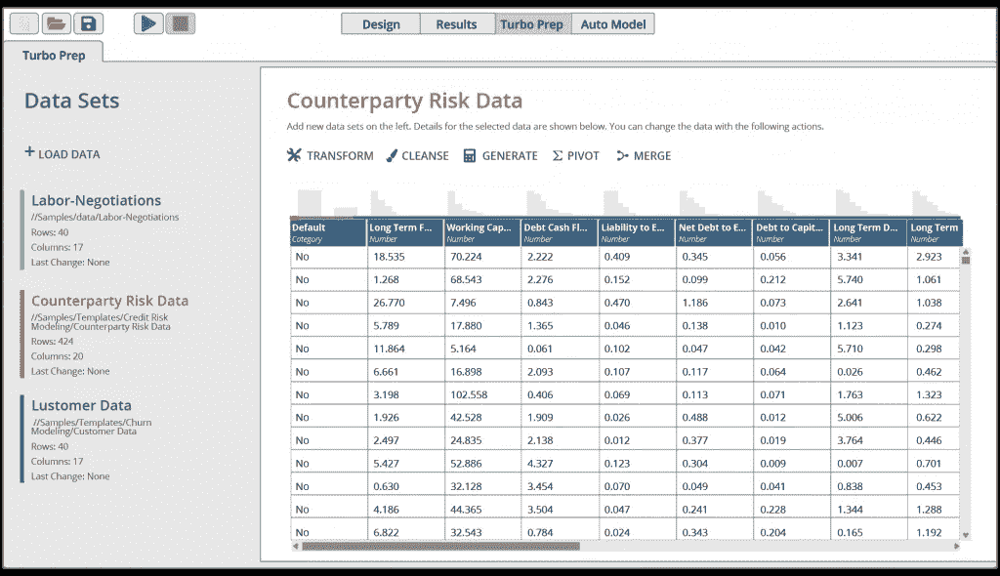

[RapidMiner](https://rapidminer.com/)

RapidMiner 是一个数据科学平台，提供端到端的协作平台，使团队能够基于组织的数据资源提供闪电般的业务影响。它为数据科学家提供了深入的功能，也为非技术利益相关者提供了简化的解决方案。该工具为用户提供了一个超过 1500 个功能的平台，可用于统一的数据准备、机器学习和模型部署。它的协作特性使它成为为机器学习制定完全透明和治理的优秀工具。它是一种数据科学家工具，允许完全自动化的操作，从而提高整个企业的生产力和性能。

# r 语言

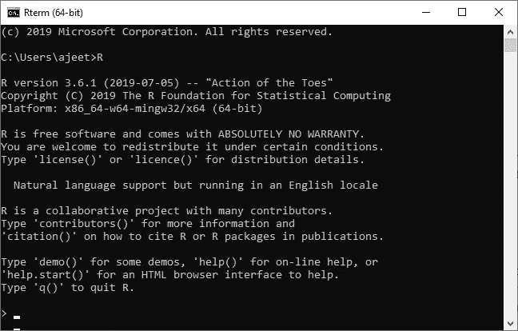

JavatPoint

R 编程语言是一个开源解决方案，它提供了大量的统计和图形方法。其中包括实现机器学习、线性回归、时间序列和统计推断的算法。它被广泛应用于学术机构以及主要的尖端企业。R 语言包含五个数据分析步骤。它们是编程、转换、发现、建模和交流。r 的学习曲线比一些替代品更陡峭，但它为数据科学家提供了一个具有高级分析功能的有用工具。

# 计算机编程语言

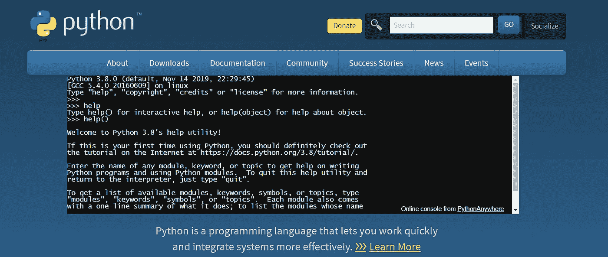

[Python](https://www.python.org/)

许多不同形式的数据科学家广泛使用这种开源编程语言。它是一种解释性的、面向对象的高级语言，具有易于学习的语法、内置的数据结构以及动态类型和绑定。

Python 支持程序模块化和代码重用，是快速应用开发和数据科学的优秀工具[。许多基于 Python 的数据科学工具补充了标准的函数和数据类型库，其中一些将在我们的解决方案列表中讨论。除此之外，Python 支持广泛的数据科学库](https://www.softermii.com/blog/rapid-application-development-model-how-and-when-to-use-it-in-your-software-project)的[集合，这使得这种语言成为数据科学编程的最佳匹配之一。这使得 Python 知识成为数据科学家最抢手的技能之一。](https://medium.com/towards-artificial-intelligence/five-cool-python-libraries-for-data-science-7f1fce402b90?source=false---------1)

# 擅长

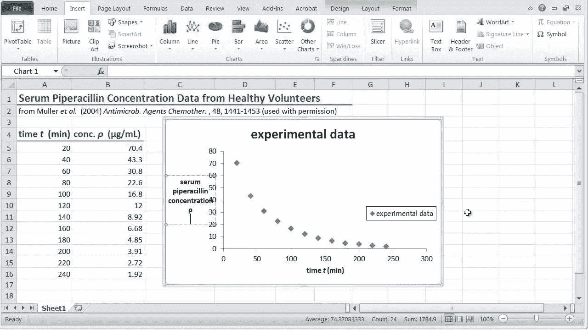

油管（国外视频网站）

这个软件解决方案可能是最著名的数据分析工具。大多数计算机用户在某种程度上都有使用 Excel 的经验，即使是创建简单的电子表格。您可能会惊讶地发现，它是一个用于执行数据科学过程的通用且随时可用的工具。它在行数和列数方面有所限制，这可能使它在大数据应用程序方面不如人意，但通常足以调查每天影响业务的真实数据。激活 Excel 的分析工具库为 Excel 注入了更高级的分析功能。

# 蟒蛇


蟒蛇

这是一个完整的开源数据科学包，在 Linux、macOS 和 Windows 机器上有超过 600 万用户。它易于下载和安装，并为用户提供超过 1，000 个数据包和一个虚拟环境管理器，使其易于启动和运行。

# 结构化查询语言

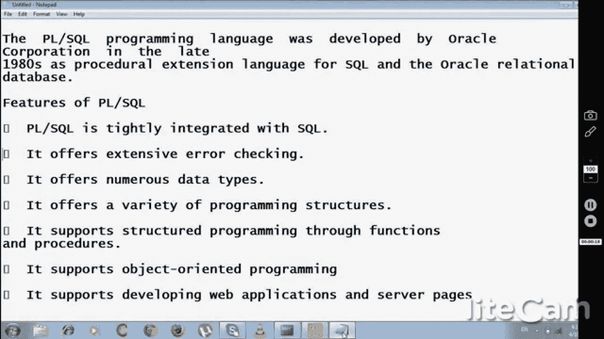

油管（国外视频网站）

结构化查询语言(SQL)为许多计算专业人员所熟悉，主要是那些使用关系数据库的人员。[SQL 编程知识](https://medium.com/towards-artificial-intelligence/sql-from-intermediate-to-superhero-26b4e6cdcf53?source=false---------0)对于从事数据科学的个人来说，是最关键的技能之一。在商业和工业中，关系数据库仍然是重要的企业信息库之一。SQL 支持与数据的直接交互，消除了在处理之前复制数据的需要，从而简化了分析。

# 张量流

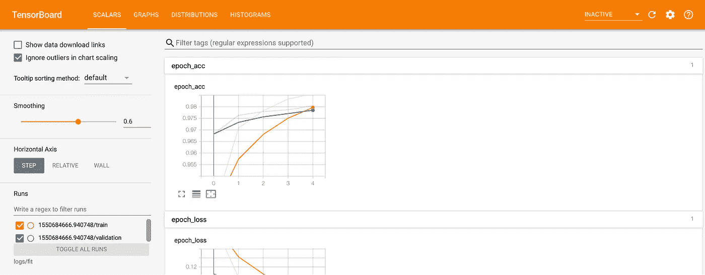

开源代码库

这是一个基于 Python 语言的数据科学工具。这是谷歌大脑开发的机器和深度学习框架。该工具帮助数据科学家使用神经网络来处理多个数据集。该工具的每个新版本都扩展了它的功能。这里是从 Tensorflow 开始的[权威指南。](https://medium.com/towards-artificial-intelligence/baby-steps-to-tensorflow-22972dd3bd7e?source=false---------6)

# 克拉斯

另一个可用于数据科学的 Python 库是 Keras。它提供了一种建立神经网络和建模的简单方法。这个可扩展的包利用了 TensorFlow 和微软的集成认知工具包。Keras 采用了简化开发的极简主义方法。

*用 Tensorflow 安装 Keras】*

```
# Requires the latest pip
pip install --upgrade pip# Current stable release for CPU and GPU
pip install tensorflow# Or try the preview build (unstable)
pip install tf-nigh#sudo pip install keras#git clone [https://github.com/keras-team/keras.git](https://github.com/keras-team/keras.git)#cd keras
sudo python setup.py install
```

# sci kit-学习

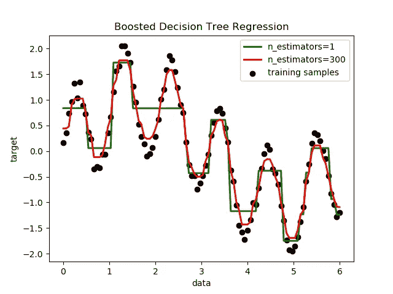

[Scikit-learn](https://scikit-learn.org/stable/)

Python 程序员可以通过 sci-kit-learn 库提高生产率，并将机器学习引入生产系统。这个工具是作为 2007 年谷歌代码之夏项目开发的，建立在 Scientific Python (SciPy)之上。该库的主要目的是数据建模。库中包含的一些建模组用于聚类、监督模型的交叉验证和参数调整，以充分利用模型。

# （舞台上由人扮的）静态画面

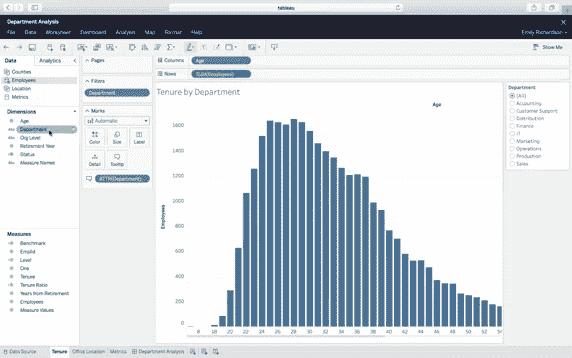

（舞台上由人扮的）静态画面

Tableau 是一个端到端的数据分析平台，可以提升数据的能力。它允许您准备您的数据，并在其桌面上执行拖放可视化分析。该工具可以用作在线应用程序，也可以安装在您的硬件上进行企业级分析。

# 阿帕奇火花

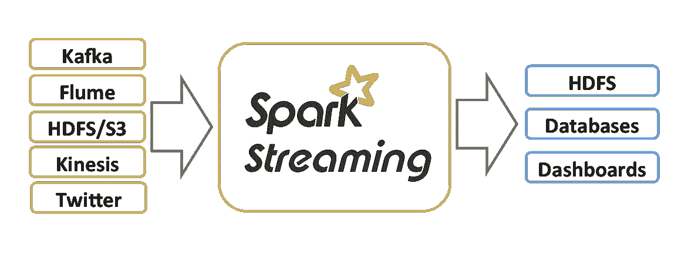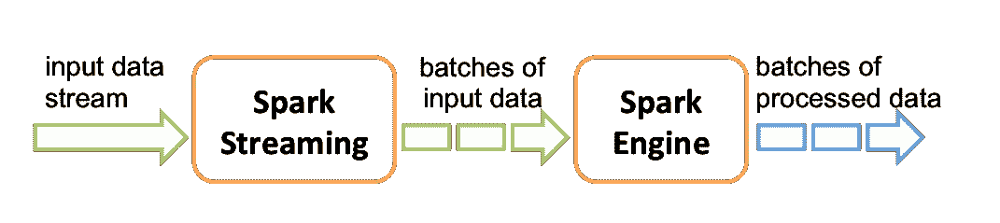

阿帕奇火花

这种开源的统一分析引擎非常适合处理大数据和实施机器学习。Spark 核心 API 利用了 Python、R、SQL、Scala 和 Java 语言。它是专为性能而设计的，在处理大规模数据时比 Hadoop 快 100 倍。

# BigML

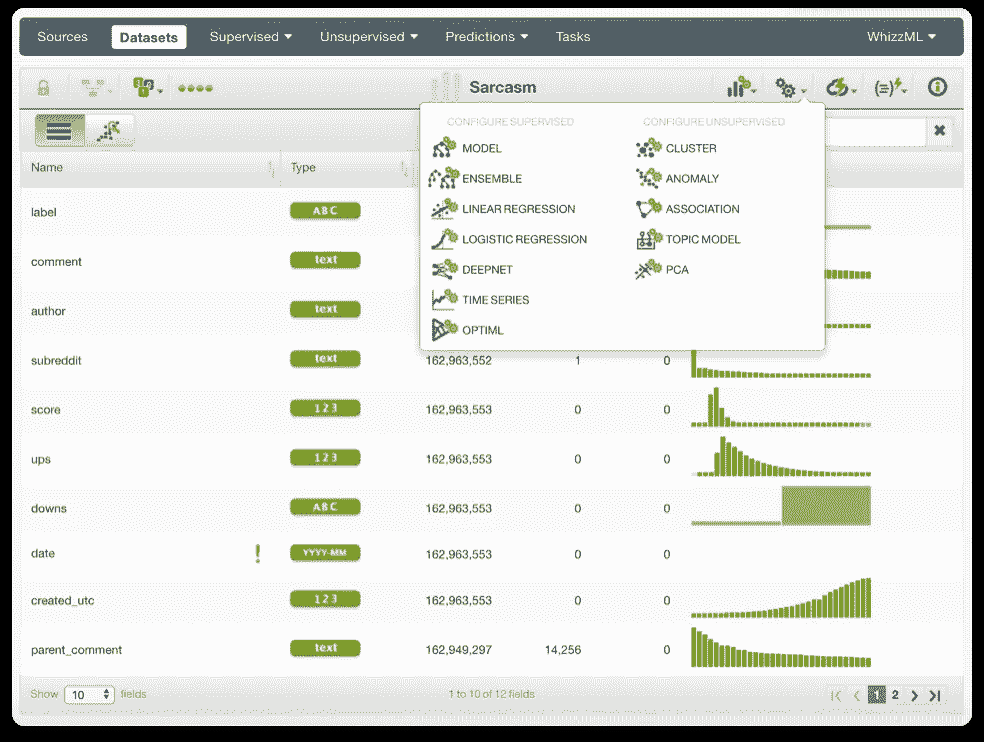

BigML

与其他云计算产品相比，机器学习即服务(MLaaS)鲜为人知。 [**BigML**](https://bigml.com/) 是 MLaaS 的一个例子，它为数据科学家或普通用户使用高级机器学习技术提供了一种简单易懂的方式。其基于云的 GUI 可以通过免费帐户或高级订阅来访问，具体取决于各个组织的需求。REST APIs 可用于增强平台的功能。工作流自动化和可重复使用的脚本使得微调使用该工具开发的超参数模型成为可能。大量的模型和数据集可以帮助您开始使用 BigML。

# 矩阵实验室

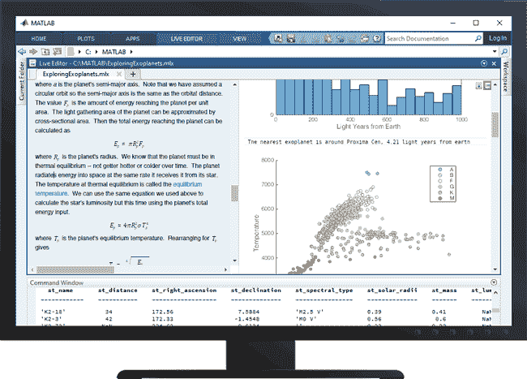

[MatLab](https://www.google.com/url?sa=i&url=https%3A%2F%2Fwww.mathworks.com%2Fproducts%2Fmatlab.html&psig=AOvVaw3Y166N5Lgx3AX1dn13rrZK&ust=1585067415010000&source=images&cd=vfe&ved=0CAMQjB1qFwoTCOimprWCsegCFQAAAAAdAAAAABAD)

这个专有的数据科学软件是一个众所周知的统计分析和数值计算工具。它提供了一个迭代的、带有编程语言的桌面环境，便于执行矩阵和阵列数学。MATLAB 是传统数据分析工具的一个例子，当数据科学家使用时，它也有很大的效用。该工具可用于快速建立神经网络模型，并创建复杂统计信息的可视化。

# 包扎

如您所见，有许多工具可供数据科学家使用。有些只是辅助数据可视化，而另一些则可用于构建神经网络和利用机器学习技术。根据需求的范围和重点，其中一个解决方案应该符合您组织中数据科学家的需求。