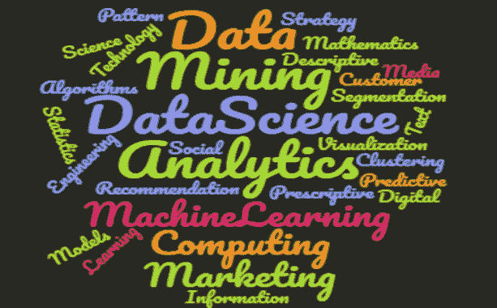
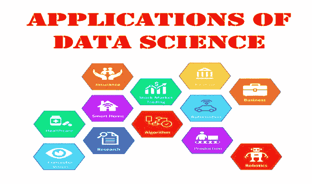
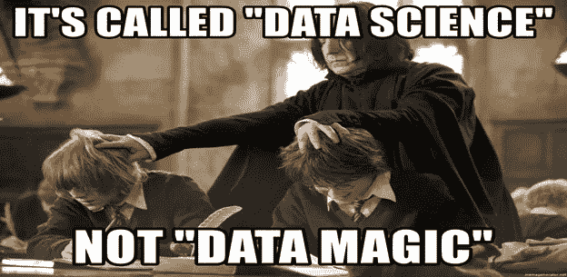
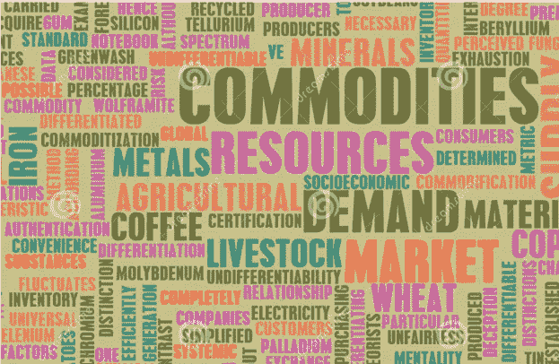
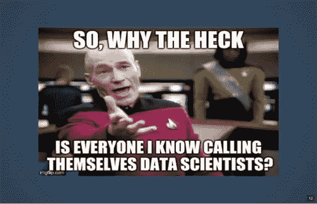
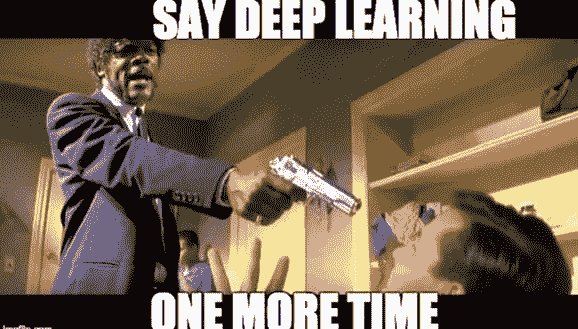

# 数据科学家可能会成为一种商品——是时候修补方法了……

> 原文：<https://pub.towardsai.net/data-scientists-might-become-a-commodity-high-time-to-mend-ways-19d711de3e45?source=collection_archive---------2----------------------->

## [未来](https://towardsai.net/p/category/future)

作者图片

数据科学是“21 世纪最热门的工作，薪水高于平均水平”。

根据 AIM Research 的 2021 年人工智能和数据科学薪酬研究，数据科学/分析专业人员的薪酬比软件开发人员高 44%，比 IT 开发人员高 36%。

全球各地的公司和地区都提供了优厚的待遇来雇佣熟练的数据、科学专业人员。几乎所有行业都在以这样或那样的方式利用数据科学，大多数国家都需要数据科学家。最重视数据科学家的国家是美国、瑞士、挪威、澳大利亚、加拿大、德国、南非、法国、荷兰和英国。这份清单绝非详尽无遗。

但一个大问题是，这是否意味着它将永远保持不变？其实这是一个争论的话题。

今天，数据科学和机器学习带来了一波变革，这是十年前任何人都无法想象的。大多数公司现在都在使用数据科学技术和应用程序。

来源——【https://morioh.com/p/debc898d81f3 

数据科学在几乎所有领域都有无数的应用，如地理信息系统、国防系统、产品推荐系统、商业决策、智能车辆、计算机视觉、医疗保健、零售、电子商务、制造、电信、航空、智能家居、智能工厂、智能办公室和建筑、银行等。这个清单真的很长。

随着新工具和技术在异常短的时间内出现，增值分析能力正在各个活动领域扩展。俗话说“需要是发明之母”。因此，新的问题伴随着新的发明，而这一切都完成得非常快。组织可以无与伦比地访问构建这些高级功能所需的组件。随着这些组件的成本和费用日益下降，分析消费变得更容易、更便宜，也就是说，越来越多的组织能够将分析纳入其流程。

来源—[https://www . LinkedIn . com/pulse/8-skills-you-really-need-been-data-scientist-2021-Michael-song？trk = public _ profile _ article _ view](https://www.linkedin.com/pulse/8-skills-you-really-need-become-data-scientist-2021-michael-song?trk=public_profile_article_view)

随着分析变得对所有组织都可用，数据科学家就像商品一样。

这是什么意思？

为了理解这一点，让我首先解释一下商品。

任何能在商品市场上容易交易(买卖)的东西都是商品。

如果没有得到明智的利用，每一项热门技术和技能最终都会从新兴产品变成商品。

来源—[https://www . dreams time . com/royalty-free-stock-image-commodities-trading-image 18038796](https://www.dreamstime.com/royalty-free-stock-image-commodities-trading-image18038796)

未来几年，数据科学家倾向于呈现商品的特征。随着这一领域的飞速发展，现在每个人都想加入这场科学竞赛而不被落下。

这让我想起了电影《超人特工队》中的一段对话，我将它解释为:

“每个人都可以是超级或特别的！！！

当每个人都是超级或特别的，那么没有人是。"

随着越来越多的公司采用和适应分析，数据科学家即将到来的商品化意味着什么？

未来的数据科学家很有可能像商品一样被交易。

这样一个时代的思想是可怕的，本身就需要更深入的分析和考察。

想象一下，当数据科学家不再能够提供新的和卓越的观点时，会发生什么？

通过新的和不同的观点，它意味着一套新的观点和好处，而不是现有的已证实的观点和好处。

数据将继续以多种方式生成，但处理这些数据的技术可能会变得停滞不前，并且可能不会提供额外的杰出观点，因为数据科学家的业余技能可能仍然无法与算法、工具和技术相匹配。

来源—[https://analyticsindiamag . com/10-memes-data-scientists-absolute-love/](https://analyticsindiamag.com/10-memes-data-scientists-absolutely-love/)

我再详细说明一下。

最近一个明显的趋势是，今天的许多数据科学家已经毫不犹豫地进入了高薪领域。不幸的是，他们被魅力指数和金钱利益所驱使。数据科学是关于定义和解决业务问题的，但一方面，他们无法理解或欣赏问题的业务方面，另一方面，他们缺乏开发解决方案的工程方面以及领域知识。

此外，

有什么不同的方法可以避免这种情况？

未来的数据科学家如何塑造自己，使自己不被淘汰？

他们需要投资哪些技能？

以下是不完整的列表。

1.理解问题的业务方面，因为最终一切都需要根据业务利益来实现。

2.发展领域知识

3.学习、思考和谈论商务语言。大多数时候，学到的简单商业规则会增加很多价值。

4.没有扎实的算法、数学、统计基础，不专注于时髦的技术。例如，许多数据科学家假设他们只需要理解深度学习，而没有全面理解对数据做出了什么假设、需要如何评估它们、转向参数具有什么影响、深度学习在哪里比机器学习更重要等等。)

5.在不需要深度学习时不使用它，在 80–90%的商业案例中，数据科学家不需要它。

6.时刻保持正念，越来越多的获得解决问题的技巧。

7.每天都要学习——像一台学习机器一样，但要记住循序渐进，遵循改善原则。

8.花大部分时间了解领域、业务问题、数据以及如何通过分析增加价值。

9.预测很容易，创造商业影响很难。因此，此外，与营销团队合作，深入了解业务环境、客户需求等。

10.很多时候为了更好的业务表现而牺牲模型的性能。

11.为有见地的行动提供建议，因为建议可以是商品，但行动不是。

12.始终关注需要影响/改进的决策。

13.始终探索从分析中增加价值的机会。

14.侧重于选择标准。

15.关注成功标准或 KPI。

我的结论是。这完全是我提到的我的观点。请不要认为这是一个最终的和有约束力的现实。无论如何，这个话题仍有待长时间的讨论。