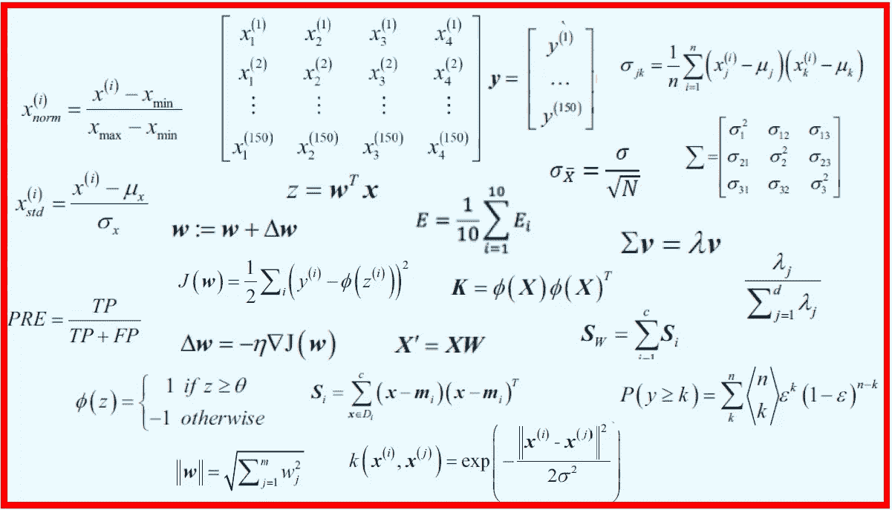
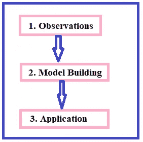

# 数据科学家必须拥抱数学

> 原文：<https://pub.towardsai.net/data-scientists-must-embrace-mathematics-ab8244241942?source=collection_archive---------1----------------------->

## [数据科学](https://towardsai.net/p/category/data-science)，[数学](https://towardsai.net/p/category/mathematics)

## 数据科学家需要接受数学，以便使用数据构建可靠的模型



Benjamin O. Tayo 的图片

D 数据科学是一个跨学科领域，使用科学方法、流程和算法从数据中提取知识和见解。数据科学领域有几个细分领域，如数据挖掘、数据转换、数据可视化、机器学习、深度学习等。作为一门科学学科，数据科学任务可以分为 3 个主要阶段:



说明数据科学任务。图像由本杰明·欧·塔约拍摄。

## 1.观察

在这个阶段，数据被收集、分析以揭示数据中的模式和关系，问题被要求使用数据来回答。

## 2.模型结构

这就是数学技能发挥作用的地方。在这一阶段，使用数学工具构建模型(预测模型)来量化模式或研究数据集中要素之间的关系。

## 3.应用

在此阶段，数学模型被部署并投入生产。该模型根据新的未知数据进行验证和确认。模型的性能被反馈到阶段 1，并且数学模型被相应地改进。

数据科学是一个非常注重动手和实践的领域。数据科学需要扎实的数学和编程基础。作为一名数据科学家，您必须了解数据科学的理论和数学基础，以便能够构建具有真实应用程序的可靠模型。

有很多好的软件包可以用来构建预测模型。一些最常见的描述性和预测性分析包包括

```
*Ggplot2**Matplotlib**Seaborn**Sci-kit learn package**Caret package**Tensorflow**PyTorch Package**Keras Package*
```

重要的是，在使用这些包之前，你要掌握数据科学的基础知识，这样你就不会把这些包简单地当作黑盒工具来使用。

理解机器学习模型功能的一种方法是让你理解每个模型背后的理论和数学基础。作为一名数据科学家，您构建可应用于现实世界问题的可靠且高效的模型的能力取决于您的数学技能有多好。

本文将讨论一些对数据科学实践至关重要的理论和数学基础。

## (一)统计和概率

统计和概率用于特征的可视化、数据预处理、特征转换、数据插补、降维、特征工程、模型评估等。以下是您需要熟悉的主题:

```
*1\. Mean**2\. Moving average**3\. Median**4\. Mode**5\. Standard deviation/variance**6\. Correlation coefficient and the covariance matrix**7\. Probability distributions (Binomial, Poisson, Normal)**8\. p-value**9\. Baye’s Theorem (Precision, Recall, Positive Predictive Value, Negative Predictive Value, Confusion Matrix, ROC Curve)**10\. Central Limit Theorem**11\. R_2 score**12\. Mean Square Error (MSE)**13\. A/B Testing**14\. Monte Carlo Simulation*
```

例如，**表示**、**中值、**和**模式**用于显示给定数据集的汇总统计数据。它们也用于数据插补(平均数插补、中位数插补和众数插补)。

**相关系数**和**协方差矩阵**用于研究数据集中各种特征之间的关系，也可用于特征选择和降维。

**概率分布**用于特征缩放，例如特征的标准化和规范化。概率分布和蒙特卡罗模拟也用于模拟数据。例如，如果样本数据根据具有已知平均值和标准偏差的正态分布分布，则可以使用正态分布的随机数生成器来生成群体数据集。

**贝叶斯定理**用于模型测试和评估，并用于计算精度得分。

**中心极限定理(CLT)** 是统计学和数据科学中最重要的定理之一。CLT 认为，使用具有大量观测数据的样本数据集进行建模是有利的，因为样本越大，越接近总体。从这里了解更多关于 CLT 的知识: [**利用蒙特卡罗模拟证明中心极限定理**](https://towardsdatascience.com/proof-of-central-limit-theorem-using-monte-carlo-simulation-34925a7bc64a) 。

**R2 得分**和 **MSE** 用于模型评估。下面是一篇用 R_2 分数和 MSE 进行模型评估的文章:

[**从零开始构建机器学习推荐模型**](https://medium.com/towards-artificial-intelligence/machine-learning-model-for-recommending-the-crew-size-for-cruise-ship-buyers-6dd478ad9900) 。

## ㈡多变量微积分

大多数机器学习模型是用具有几个特征或预测器的数据集构建的。因此，熟悉多变量微积分对于建立机器学习模型极其重要。以下是您需要熟悉的主题:

```
*1\. Functions of several variables**2\. Derivatives and gradients**3\. Step function, Sigmoid function, Logit function, ReLU (Rectified Linear Unit) function**4\. Cost function**5\. Plotting of functions**6\. Minimum and Maximum values of a function*
```

关于如何在机器学习过程中使用**多变量微积分**的示例，请参见以下示例:

[**建立你的第一个机器学习模型:线性回归估计器**](https://towardsdatascience.com/building-your-first-machine-learning-model-linear-regression-estimator-ba86450c4d24)

[**采用最小二乘法的基本感知器模型**](https://medium.com/towards-artificial-intelligence/basic-perceptron-model-using-least-squares-method-17900e0d1eff)

## ㈢线性代数

线性代数是机器学习中最重要的数学技能。数据集被表示为矩阵。线性代数用于数据预处理、数据转换、降维以及模型评估。

以下是您需要熟悉的主题:

```
*1\. Vectors**2\. Norm of a vector**3\. Matrices**4\. Transpose of a matrix**5\. The inverse of a matrix**6\. The determinant of a matrix**7\. Dot product**8\. Eigenvalues**9\. Eigenvectors*
```

例如，**协方差矩阵**是一个非常有用的矩阵，可以显示特征之间的相关性。使用协方差矩阵，可以选择将哪些特征用作预测变量。下面是一个如何使用协方差矩阵进行特征选择和降维的例子: [**使用协方差矩阵图进行特征选择和降维**](https://medium.com/towards-artificial-intelligence/feature-selection-and-dimensionality-reduction-using-covariance-matrix-plot-b4c7498abd07) 。

其他高级的特征选择和降维方法有**主成分分析** (PCA)，和**线性判别分析** (LDA)。要理解 PCA 和 LDA 是如何工作的，你需要理解线性代数的主题，比如转置一个矩阵；矩阵的逆矩阵；矩阵的行列式；点积；特征值；和特征向量。以下是 LDA 和 PCA 的一些实现:

[**机器学习:通过主成分分析进行降维**](https://medium.com/towards-artificial-intelligence/machine-learning-dimensionality-reduction-via-principal-component-analysis-1bdc77462831)

[**机器学习:通过线性判别分析进行降维**](https://medium.com/towards-artificial-intelligence/machine-learning-dimensionality-reduction-via-linear-discriminant-analysis-cc96b49d2757)

## ㈣优化方法

大多数机器学习算法通过最小化目标函数来执行预测建模，从而学习为了获得预测标签而必须应用于测试数据的权重。以下是您需要熟悉的主题:

```
*1\. Cost function/Objective function**2\. Likelihood function**3\. Error function**4\. Gradient Descent Algorithm and its variants (e.g. Stochastic Gradient Descent Algorithm)*
```

数据科学和机器学习中如何使用优化方法的例子可以在这里找到: [**机器学习:使用梯度下降的 Python 线性回归估计器**](https://medium.com/towards-artificial-intelligence/machine-leaning-python-linear-regression-estimator-using-gradient-descent-b0b2c496e463) 。

## 培养基本数学技能的资源

## ***1。可汗学院***

Khan academy 是一个学习数据科学所需的基本数学、统计学、微积分和线性代数技能的伟大网站。对于对数据科学感兴趣但没有必要的定量背景的个人来说，这应该是一个很好的资源。

## ***2。*** ***YouTube***

YouTube 包含几个教育视频和教程，可以教你数据科学所需的基本数学和编程技能，以及几个面向初学者的数据科学教程。一个简单的搜索就会产生几个视频教程和讲座。YouTube 上一个很好的线性代数课程是麻省理工学院教授吉尔伯特·斯特朗的课程:[吉尔伯特·斯特朗的线性代数](https://www.youtube.com/playlist?list=PL49CF3715CB9EF31D)

## 摘要

总之，我们已经讨论了数据科学和机器学习中需要的基本数学和理论技能。有几门免费的在线课程会教你在数据科学中需要的必要的数学技能。作为一名数据科学家，一定要记住，数据科学的理论基础对于构建高效可靠的模型至关重要。

## 参考

1.  [在具有高度相关特征的数据集上训练机器学习模型](https://medium.com/towards-artificial-intelligence/training-a-machine-learning-model-on-a-dataset-with-highly-correlated-features-debddf5b2e34)。
2.  [使用协方差矩阵图进行特征选择和降维](https://medium.com/towards-artificial-intelligence/feature-selection-and-dimensionality-reduction-using-covariance-matrix-plot-b4c7498abd07)。
3.  拉什卡、塞巴斯蒂安和瓦希德·米尔贾利利**。** *Python 机器学习，第二版*。Packt 出版公司，2017 年。
4.  Benjamin O. Tayo，*预测船只船员规模的机器学习模型*，[https://github . com/bot 13956/ML _ Model _ for _ Predicting _ Ships _ Crew _ Size](https://github.com/bot13956/ML_Model_for_Predicting_Ships_Crew_Size)。