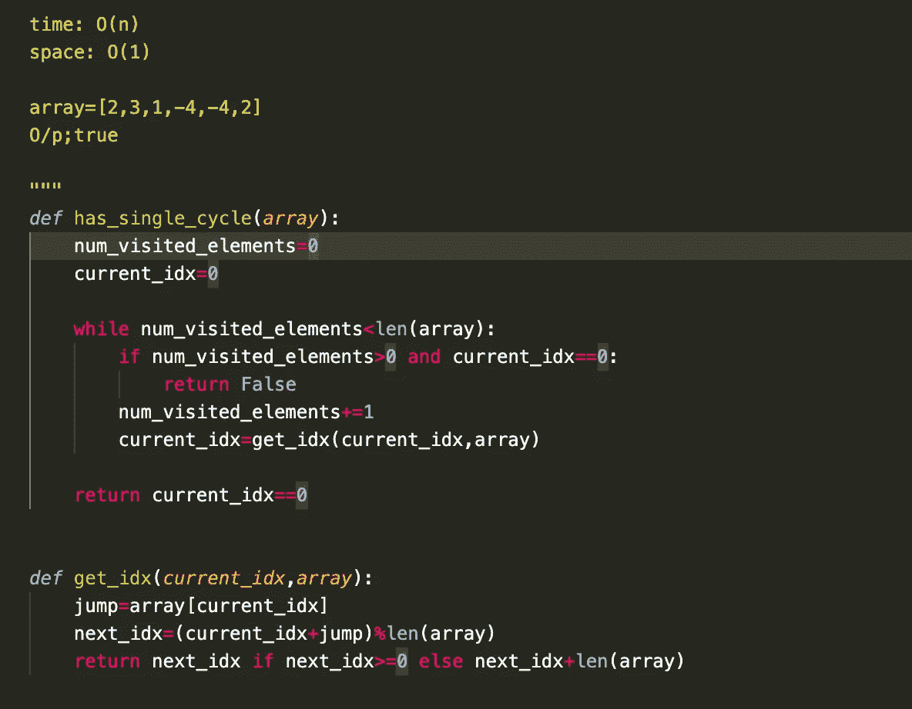
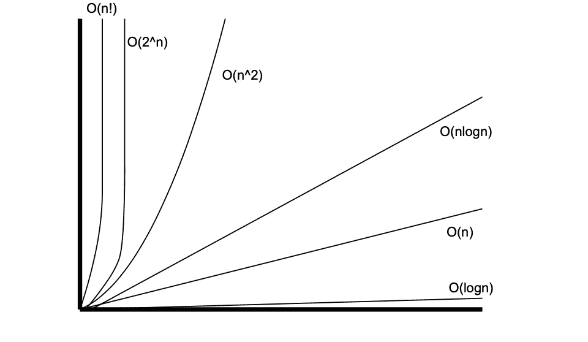

# 使用 Python 的数据结构和算法:编程系列 101

> 原文：<https://pub.towardsai.net/data-structures-and-algorithms-using-python-programming-series-101-dbd41d48ab4d?source=collection_archive---------2----------------------->

## [编程](https://towardsai.net/p/category/programming)

图片由作者提供。

对于那些已经开始学习编程或者愿意在需要编程知识的领域学习和追求职业生涯的人来说，这篇文章将帮助你们理解数据结构和算法的基础。
数据结构和算法是任何计算机科学讲座中教授的编程的最基本方面之一。你可以学习任何编程语言，但要成为一名优秀的程序员，你必须掌握数据结构和算法。那么什么是数据结构，什么是算法，为什么要学呢？

顾名思义，数据结构是任何编程/编码的构建块，您可以使用编程语言设计任何方法来解决任何问题。这种方法在计算机科学术语中也被称为算法。

例如，如果给你一个按排序顺序排列的学生名单，并要求你用最少的时间和计算资源通过编程找出给定学生的名字是否出现在该班级中。
为了解决这个编程问题，你将开始考虑方法，这被称为算法。一旦你有了解决问题的方法(无论是否在最少的时间和计算资源内)，你也将开始考虑如何以一种最佳的方式存储输入，这被称为数据结构。

对于我们的问题，我们可以使用一个搜索算法(比如在输入排序时使用二分搜索法)和任何合适的数据结构，比如 python 中的列表。
不同的编程语言有不同的方式来实现供使用的数据结构。

数据结构的主要类别如下:

# 数据结构的类型:

1.  **原语:**

这些是存在于机器级别的最基本的数据结构。

例如整数、浮点、字符、指针等。

**2。非原语:**

这些是从原始数据结构中派生出来的数据结构。

**2.1 数组:**

数组由连续内存分配中的同质元素的集合组成。

**2.2。文件:**

这是一个记录集合，主要用于管理大量记录。

**2.3。列表:**

这种数据结构由原始数据结构的动态内存分配组成。

**2.3.1。线性列表:**

这些元素按顺序存储。

**Stack:** 这个数据结构以后进先出(LIFO)格式存储和检索元素。

**Queue:** 这个数据结构以先进先出格式(FIFO)存储和检索元素。

2.3.2。非线性列表:

这些元素不是按顺序存储的。

**树**:数据结构以树形格式存储，节点和顶点以树形结构连接。这是图的一个特例。

**图**:数据结构是用节点和顶点存储的，其中有数据的节点与顶点相连。

# **堆栈:**

为了设计一个栈数据结构，我们将使用一个基本的 python 数据结构**列表**。

堆栈中的不同功能有:

1.  **push():** 在堆栈中存储元素。
2.  **pop():** 从堆栈中检索元素。
3.  **is_empty():** 检查堆栈是否为空。
4.  **size():** 获取堆栈的大小。
5.  **top ():** 返回栈顶元素。

# **时空复杂度:**

算法的时间和空间复杂度是在编码任何算法时要计算的一个重要方面。

图片提供:谷歌

大 Oh 符号(用 O 表示):它度量算法完成执行所用的最长时间/案例。在计算算法的时间/空间复杂度时，我们着眼于算法完成任何执行所需的可能的最坏情况或最坏的时间/情况。

想了解更多，可以访问这个[链接](https://www.tutorialspoint.com/data_structures_algorithms/asymptotic_analysis.htm)。

在分析任何算法时，我们都试图在最坏的情况下计算时间和空间复杂度。

**插入** : O(1)

**删除/检索** : O(1)

**搜索** : O(n)

**空间复杂度** : O(n)

# **利弊:**

元素的后进先出存储模式在某些应用中是有用的，例如，在计算器中运算符具有一定的优先级。

缺点是数据存储和访问不能是随机的，因此不适用于存储器管理不能连续的应用。

我希望你喜欢这篇文章。如果您有任何疑问或建议，请让我知道您的想法，我们希望听到更多您的意见。

你可以关注我关于人工智能/机器学习、编程、数据分析和商业智能的教程。你可以在 [LinkedIn](https://www.linkedin.com/in/anurag-bisht-39935a59/) 上和我联系。