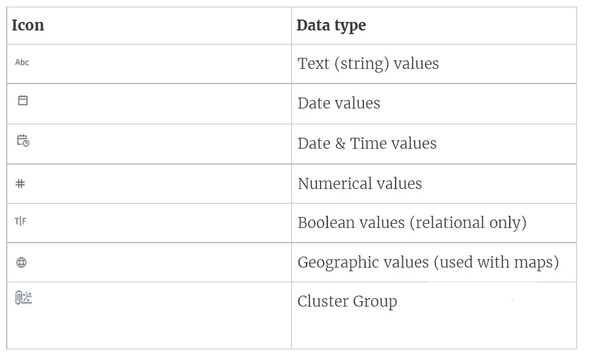
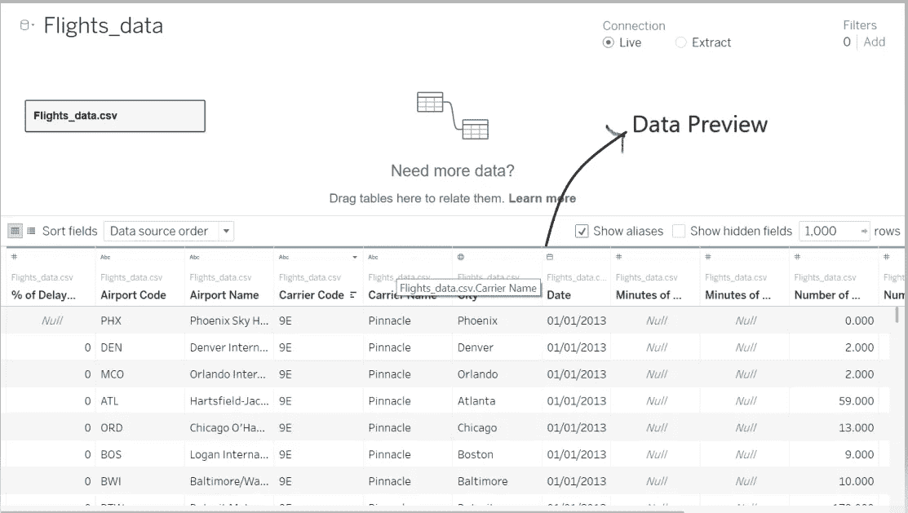
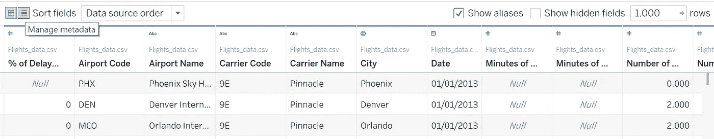
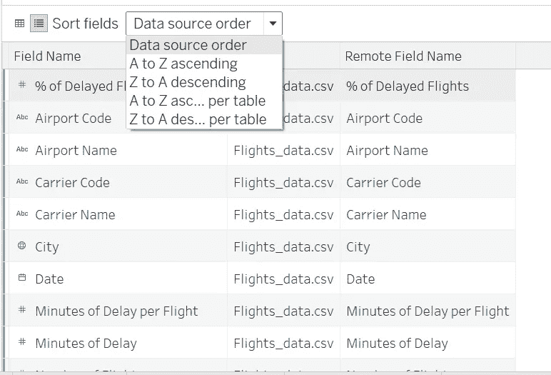
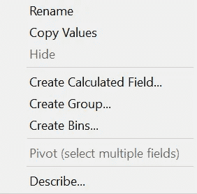
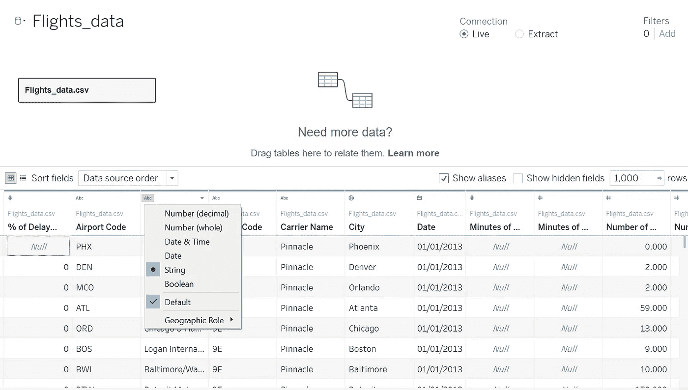
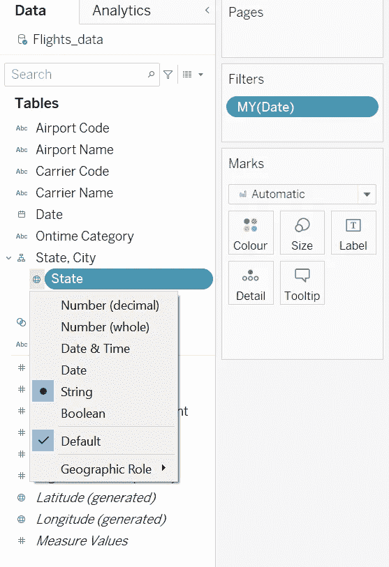
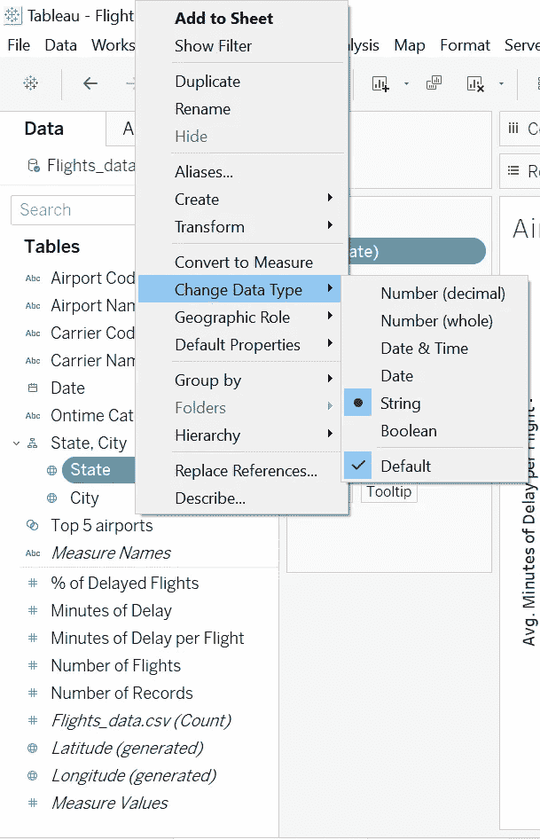

# Tableau 中的数据类型:使用和清理；Tableau 桌面专家认证之路

> 原文：<https://pub.towardsai.net/data-types-in-tableau-using-cleaning-a-road-to-tableau-desktop-specialist-certification-7793111f60bd?source=collection_archive---------0----------------------->

## 第 3 章:深入 Tableau 数据类型和元数据

欢迎来到第三章，在这一章中，我们将学习 [Tableau](https://medium.com/u/fcbe60d0bf8b?source=post_page-----7793111f60bd--------------------------------) 中可接受的数据类型以及如何清理它们。此外，我们还将了解一下元数据。

> 如果你想浏览其他章节，请访问:**画面:这是什么？为什么它是最好的？；Tableau 桌面专家认证之路。**

> 如果你想直接上 Tableau 桌面专家笔记，请在这里访问→[https://dakshtrehan . comment . site/Tableau-Notes-c 13 fceda 97 b 94 BDA 940 edbf 6751 cf 303](https://dakshtrehan.notion.site/Tableau-Notes-c13fceda97b94bda940edbf6751cf303)
> 
> 使用链接访问免费 Tableau 认证转储(有效期至 2022 年 7 月 6 日):
> 
> [https://www . udemy . com/course/tableau-desktop-specialist-certification-dumps-2022/？coupon code = e3f 08189 fa 4 bafae 72 BC](https://www.udemy.com/course/tableau-desktop-specialist-certification-dumps-2022/?couponCode=E3F08189FA4BAFAE72BC)

当用户连接到 Tableau 时，他们数据集中的数据字段被自动分配一个**角色**和一个**类型**。

**角色**可以有以下两种类型:

1)维度

2)测量

*(在后面的章节中有更多关于尺寸和测量的内容)*

**类型**可以是以下类型:

1)字符串

2)数量

3)地理

4)布尔型

5)日期

6)日期和时间

# 目录:

*   **Tableau 中的数据类型**
*   **探索元数据**
*   **修改元数据**
*   **更改数据类型**
    –在源页面中更改数据类型
    –在数据窗格中更改数据类型
    –在视图中更改数据类型
*   **处理混合数据类型**
*   **本题的样题**

# Tableau 中的数据类型

数据是 Tableau 的燃料，数据集中的每个字段都构成了属于通用数据类型的数据。数据类型有助于软件理解存储在该字段中的数据类型。

**Tableau 支持 7 种数据类型。**新数据上传后，Tableau 会自动检测数据类型并将其分配给字段。数据上传后，也可以手动修改数据类型。

Tableau 支持的数据类型，[来源](https://help.tableau.com/current/pro/desktop/en-us/datafields_typesandroles_datatypes.htm)

**String→**“String”数据类型由零个或多个用单引号或双引号括起来的字符组成。

例如“Tableau 是一个 BI 工具”或“Tableau 是一个 BI 工具”。

字符串数据类型可以分为:

*   **Char** :在 Char 数据类型中，字符串的值是固定长度的。如果我们试图加载一个长度大于指定长度的值，Tableau 会抛出一个错误。此数据类型用于存储字母数字数据值。
*   **Varchar:** Varchar 代表可变字符，这里字符的长度是灵活的，没有内存分配限制。

**日期&时间值** →该数据类型用于存储日期和时间。Tableau 可以以 dd-mm-yy，dd-mm-yyyy，mm-dd-yyyy 格式存储日期。

有些字段只包含日期，因此可以存储在日期数据类型中。一些存储日期和时间(更像时间戳)的字段可以存储在日期和时间数据类型中。

时间值可以是十年、年、季度、月、日、小时、分钟、秒等。

如果您希望以“字符串”格式输入日期，请在日期前使用“#”。例如# 14–01–2022，它将以字符串格式存储。

**数值→** 该数据类型可以包含浮点或整数数据点。我们还可以对它们进行手动计算，以更深入地了解我们的数据。

**布尔值→** 该数据是关系计算的结果，只能包含两个值:真或假。

**地理值→** 该数据类型由地球表示，包含可在地图中使用的数据。这包括纬度、经度、国家、城市、地区、邮政编码等。

我们可以将文本字段转换成地理数据

我们可以改变一个维度的地理角色。

有两种地图可用-符号地图和填充地图。

地理区域数据类型也是字符串。

**集群组→** 有时数据过于粗糙，表示混合数据类型，这是存储在集群组中的数据类型。

这种数据既可以通过分离字段来手动处理，也可以让 Tableau 创造奇迹。

# 探索元数据

在 Tableau 中，当我们将数据连接到起始页时，我们会得到一个数据预览，从中可以检查每一列的元数据。

默认情况下，我们只能看到 1000 行。

要了解有关元数据的更多信息，请点击“管理元数据:→

我们可以按以下顺序获取元数据→

元数据包含“字段名”、“数据类型”、“表名”和“远程字段名”。元数据由 Tableau 自动识别，并且可以进一步手动修改。

当使用管理元数据选项时，当我们更改字段的名称时，它被称为“**字段名**”，以前被称为“**远程字段名**

# 修改元数据

我们可以使用“托管元数据”选项对字段执行以下操作→

Tableau 可以进一步定义它的决定(关于它如何选择该字段具有的数据类型)以及关于该字段的更多信息。

# 更改数据类型

Tableau 自动为每个字段定义一个数据类型，但是我们也可以手动质疑它的决定并更改每个字段的数据类型。

这可以通过三种方式实现:

## 在源页面中更改数据类型→

要更改源页面上的数据类型，请转到预览菜单，单击为每个字段指定的数据类型，然后选择新的数据类型。

## 从数据窗格更改数据类型→

也可以从数据窗格中更改数据类型，单击为每个字段指定的数据类型，然后切换到新的数据类型。

## 更改视图中的数据类型→

要更改视图中的数据类型，右键单击字段，转到“更改数据类型”并选择新的数据类型。

# 处理混合数据类型

有时，列包含多种数据类型。列可能由日期、日期时间、字符串或空格组成。当我们尝试将数据文件连接到 Tableau 时，混合列被映射到渗入我们数据的单一数据类型，即被 Tableau 标识为“数字数据类型”的列也可能包含日期、字符串或空格。

Tableau 考虑 Excel 文件的前 10000 行和 CSV 文件的前 1024 行，也就是说，如果我们接收一个包含 10000 行的 xlsx 文件，并且其中大部分是字符串，那么 Tableau 会将整个列视为一个字符串。

当 Tableau 确定每个字段的数据类型时，如果值与相应的数据类型不匹配。Tableau 试图通过向那些与指定数据类型不匹配的记录添加“null”值来处理该字段。

[来源](https://help.tableau.com/current/pro/desktop/en-us/datafields_typesandroles_datatypes.htm)

例如，在布尔映射列中，如果有文本、日期或数字，这些记录将被视为空。

在数字映射列中，如果我们得到文本，它将被视为 Null，但如果我们得到日期，它将被转换为该日期与 1900 年 1 月 1 日的差值。

# 本主题的试题示例

**默认情况下元数据显示多少行？**

1.  1000
2.  5000
3.  100
4.  10000

**溶液** : 100

我们能改变维度的地理角色吗？

1.  真实的
2.  错误的

**解决方案**:真

**使用管理元数据选项时，当我们更改字段名称时，它被称为？**

1.  字段名
2.  远程字段名称
3.  名字
4.  田

**解决方案**:字段名称

**说明**:在使用管理元数据选项时，当我们更改一个字段的名称时，它被称为“字段名”，以前被称为“远程字段名”。

我们能把文本数据转换成地理字段吗？

1.  真实的
2.  错误的

**解**:真

**包含 _____ 和 ______ 值的尺寸不能是连续的。【选择题】(选 2)**

1.  布尔代数学体系的
2.  日期
3.  日期和时间
4.  线

**解:**布尔与字符串

选择我们可以改变数据类型的方式。

1.  不可能改变
2.  来自数据源
3.  从数据窗格
4.  从数据源和数据窗格中

**解决方案**:来自数据源&数据窗格两者

> 使用链接访问免费 Tableau 认证转储(有效期至 2022 年 7 月 6 日):
> 
> [https://www . udemy . com/course/tableau-desktop-specialist-certification-dumps-2022/？coupon code = e3f 08189 fa 4 bafae 72 BC](https://www.udemy.com/course/tableau-desktop-specialist-certification-dumps-2022/?couponCode=E3F08189FA4BAFAE72BC)

# 参考资料:

[1] [Tableau 帮助| Tableau 软件](https://www.tableau.com/support/help)

[2] [个人笔记](https://dakshtrehan.notion.site/Tableau-Notes-c13fceda97b94bda940edbf6751cf303)

[3] [Tableau 桌面专家考试(新模式— 2021) — Apisero](https://apisero.com/tableau-desktop-specialist-exam-new-pattern-2021/)

# 感谢阅读！

请随意鼓掌，这样我就知道这篇文章对你有多有帮助，并在你的社交网络上分享它，这对我会很有帮助。

如果你喜欢这篇文章，想了解更多关于**机器学习，数据科学，Python，BI。**请考虑订阅我的时事通讯:

> [达克什·特雷汉的简讯](https://mailchi.mp/b535943b5fff/daksh-trehan-weekly-newsletter)。

在网上找到我:[www.dakshtrehan.com](http://www.dakshtrehan.com/)

在 LinkedIn 与我联系:[www.linkedin.com/in/dakshtrehan](http://www.linkedin.com/in/dakshtrehan)

阅读我的科技博客:[www.dakshtrehan.medium.com](http://www.dakshtrehan.medium.com/)

在 Instagram 和我联系:[www.instagram.com/_daksh_trehan](http://www.instagram.com/_daksh_trehan_)

# 想了解更多？

[YouTube 是如何利用 AI 推荐视频的？](/how-is-youtube-using-ai-to-recommend-videos-38a142c2d06d)
[利用深度学习检测新冠肺炎](https://towardsdatascience.com/detecting-covid-19-using-deep-learning-262956b6f981)
[逃不掉的 AI 算法:抖音](https://towardsdatascience.com/the-inescapable-ai-algorithm-tiktok-ad4c6fd981b8)
[GPT-3 向一个 5 岁的孩子解释。](/gpt-3-explained-to-a-5-year-old-1f3cb9fa030b)
[Tinder+AI:一场完美的牵线搭桥？](https://medium.com/towards-artificial-intelligence/tinder-ai-a-perfect-matchmaking-b0a7b916e271)
[一个内部人士的使用机器学习卡通化指南](https://medium.com/towards-artificial-intelligence/an-insiders-guide-to-cartoonization-using-machine-learning-ce3648adfe8)
[谷歌是如何做出“哼哼来搜索？”](/how-google-made-hum-to-search-865f224b70d0)
[一行神奇的代码执行 EDA！](/one-line-magical-code-to-perform-eda-f83a731fbc35)
[给我 5 分钟，我给你深度假！](/give-me-5-minutes-ill-give-you-a-deepfake-ce83a645b0f9)

> *欢呼*