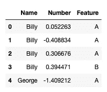
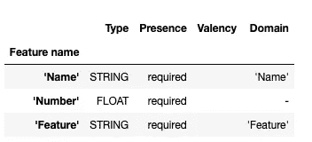
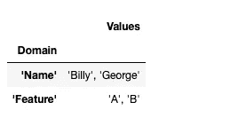
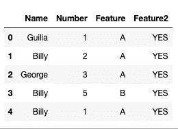
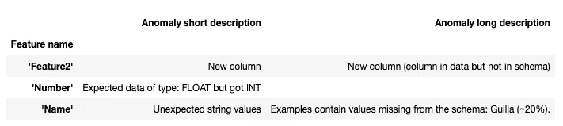

# 使用 TFDV 进行机器学习的数据验证

> 原文：<https://pub.towardsai.net/data-validation-for-machine-learning-using-tfdv-be61a1d5ce65?source=collection_archive---------3----------------------->


作者图片

## [机器学习](https://towardsai.net/p/category/machine-learning)

## 生产中机器学习最重要的部分

在机器学习模型部署之后，我们需要以某种方式验证传入的数据集，然后再将它们输入到 ML 管道中。我们不能仅仅依赖我们的消息来源，想当然地认为数据会没问题。可能会有新的列、新的值，甚至是错误类型的数据，大多数时候模型会忽略它们。这意味着我们最终可能会使用过时或有偏见的模型。

在这篇文章中，我将向你展示一种简单快捷的方法，使用 [Tensorflow 数据验证](https://www.tensorflow.org/tfx/data_validation/get_started)来验证你的数据。TFDV 是一个强大的库，可以[计算描述性统计](https://predictivehacks.com/3-ways-to-perform-quick-exploratory-data-analysis-in-python/)，推断方案，并检测大规模的数据异常。它用于分析和验证谷歌每天生产的数千个不同应用程序中数 Pb 的数据。

但是首先，让我们创建一些虚拟数据。

```
**import** pandas as pd**import** numpy as np**import** tensorflow_data_validation as tfdvdf**=**pd.DataFrame({'Name':np.random.choice(['Billy','George'],100),'Number': np.random.randn(100),'Feature': np.random.choice(['A','B'],100)})df.head()
```



# 该模式

首先，TFDV 将为我们的原始数据创建一个“模式”,这样我们可以在以后使用它来验证新数据。

```
df_stats = tfdv.generate_statistics_from_dataframe(df)

schema = tfdv.infer_schema(df_stats)

schemafeature {
  name: "Name"
  type: BYTES
  domain: "Name"
  presence {
    min_fraction: 1.0
    min_count: 1
  }
  shape {
    dim {
      size: 1
    }
  }
}
feature {
  name: "Number"
  type: FLOAT
  presence {
    min_fraction: 1.0
    min_count: 1
  }
  shape {
    dim {
      size: 1
    }
  }
}
feature {
  name: "Feature"
  type: BYTES
  domain: "Feature"
  presence {
    min_fraction: 1.0
    min_count: 1
  }
  shape {
    dim {
      size: 1
    }
  }
}
string_domain {
  name: "Name"
  value: "Billy"
  value: "George"
}
string_domain {
  name: "Feature"
  value: "A"
  value: "B"
}
```

如您所见，该模式是一个 JSON 类型的输出，具有数据的特征。我们可以用如下的好格式显示它:

```
tfdv.display_schema(schema)
```



```
from tensorflow_data_validation.utils.schema_util import write_schema_text, load_schema_text

#save
write_schema_text(schema, "my_schema")

#load
schema = load_schema_text("my_schema")
```

假设我们用上面的数据创建了一个机器学习模型。现在我们将创建我们想要验证的假设的新数据。

```
test=pd.DataFrame({'Name': {0: 'Guilia', 1: 'Billy', 2: 'George', 3: 'Billy', 4: 'Billy'},
 'Number': {0: 1,
  1: 2,
  2: 3,
  3: 5,
  4: 1},
 'Feature': {0: 'A', 1: 'A', 2: 'A', 3: 'B', 4: 'A'}})

test['Feature2']='YES'

test.head()
```



# 数据有效性

这是验证新数据的时候了。

```
new_stats = tfdv.generate_statistics_from_dataframe(test)

anomalies = tfdv.validate_statistics(statistics=new_stats, schema=schema)

tfdv.display_anomalies(anomalies)
```



我们得到了新数据中所有的异常情况。新数据有一个新列，列“**编号”**有错误的数据类型，在“**名称”**列有一个新值。这可能表示数据漂移。现在我们可能需要重新训练我们的模型或者应用不同的数据预处理。此外，TFDV 可以选择更新模式或忽略一些异常。

# 总结一下

使用 TFDV 进行数据验证是验证新的传入集合的一种经济有效的方式。它将解析新数据并报告任何异常情况，如缺少值、新列和新值。它还可以帮助我们确定是否存在数据漂移，并防止我们使用过时的模型。

*最初发表于 https://predictivehacks.com*[。](https://predictivehacks.com/data-validation-for-machine-learning-using-tfdv/)