# Apache Spark 中针对大数据迁移工作负载的数据验证框架

> 原文：<https://pub.towardsai.net/data-validation-framework-in-apache-spark-for-big-data-migration-workloads-44858b6050c?source=collection_archive---------1----------------------->

## [数据科学](https://towardsai.net/p/category/data-science)，[编程](https://towardsai.net/p/category/programming)

质量保证测试是大数据的关键领域之一

数据质量问题可能会毁掉许多大数据、数据湖、ETL 项目的成功。无论数据是大是小，对数据质量的需求不会改变。高质量的数据是从中获得洞察力的绝对驱动力。数据的质量是根据它是否通过获得必要的洞察力来满足业务需求来衡量的。

> 在这篇博客中，我们将看到在将数据从源迁移到目的地时确保数据质量正确的步骤。

## 涉及的步骤

1.  行和列计数
2.  列名检查
3.  无哈希的子集数据检查
4.  统计数据比较—最小值、最大值、平均值、中值、标准差、第 25、第 50、第 75 百分位
5.  **sha 256 对整个数据进行哈希验证 **

## 排除故障

当源和接收器不匹配时，如何在可能有 3000+列和数百万条记录的整个数据中获取特定的损坏数据？

让我们看看每一步的行动…

# 方案

我们已经将数据从 MySQL 迁移到 Data Lake。在下游应用程序使用数据之前，需要验证数据的质量。

出于演示目的，我在 Spark Dataframe 中读取了样本客户数据(1000 条记录)。虽然演示的数据量很小，但是这个解决方案可以扩展到海量数据。

## 场景-1

相同的数据在两个数据框架中，所以我们的验证框架将是一个绿色信号。

## 场景 2

我特意修改了第二个数据帧中最后 2 条记录的数据，以便我们可以看到这个哈希验证框架是如何帮助我们的。

## 本博客中使用的完整代码片段

让我们以相反的顺序来看这些步骤，因为这是验证的核心部分。

# 步骤 5:对整个数据进行 SHA256 哈希验证

在本例中，我选择了 SHA256，还有其他一些哈希算法，如 MD5。

## 哈希算法

哈希算法是从给定输入生成固定长度结果(哈希或哈希值)的函数。哈希值是原始数据的汇总。检查[在线哈希生成器](https://emn178.github.io/online-tools/sha256.html)中的 SHA-256 哈希值。

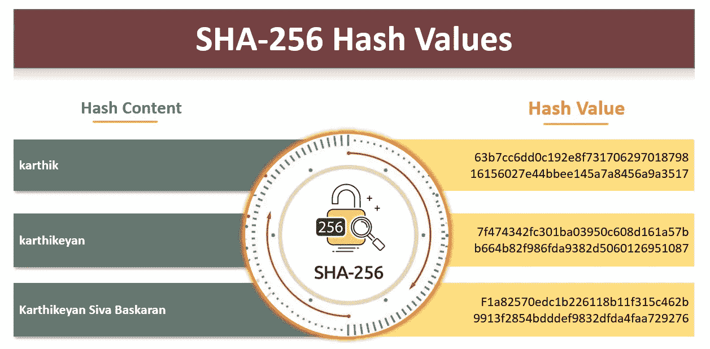

示例散列内容和相应的散列值

*即使是最小的变化(一个字母)也会使整个散列不同*

广泛用于数字签名、认证、在散列表中索引数据、检测重复或作为校验和(检测发送的文件是否遭受意外或故意的数据损坏)。

> 但是，在这里，我们将了解如何在大数据验证中利用哈希的强大功能。

## 哈希冲突

**冲突**或**冲突**是指当两个不同的数据片段具有相同的哈希值、校验和、指纹或加密摘要时发生的情况。可以为不同的字符串生成相同的哈希代码。然而，两个字符串具有相同散列的概率非常低，除非存在暴力攻击。

*冲突的影响取决于应用程序，在我们的场景中，我们在另一个验证步骤中处理这些冲突(4 —* ***统计比较*** *)。*

## 哈希验证如何以及为什么有助于数据验证

当我们拥有数百万条记录和 3000 多列时，很难比较源系统和目标系统的数据不匹配情况。为此，我们需要大量的内存和计算引擎。为了解决这个问题，我们使用哈希将所有 3000+列连接成一个长度仅为 64 个字符的哈希值列。当您比较 3000+柱长和大小时，这个体积可以忽略不计。

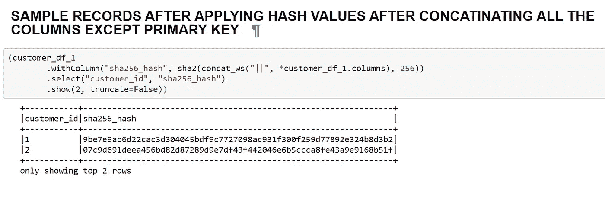

Spark 中创建哈希值的示例

## 通过组合除主键之外的所有列，对两个数据帧应用散列:

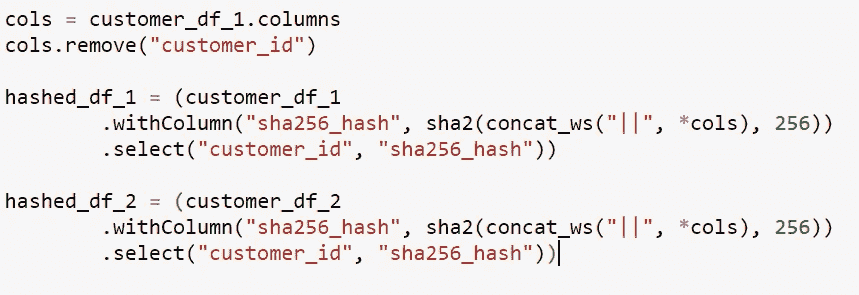

**将所有 3000+列转换为一个散列值列**

## 连接并获取不匹配记录的 id:

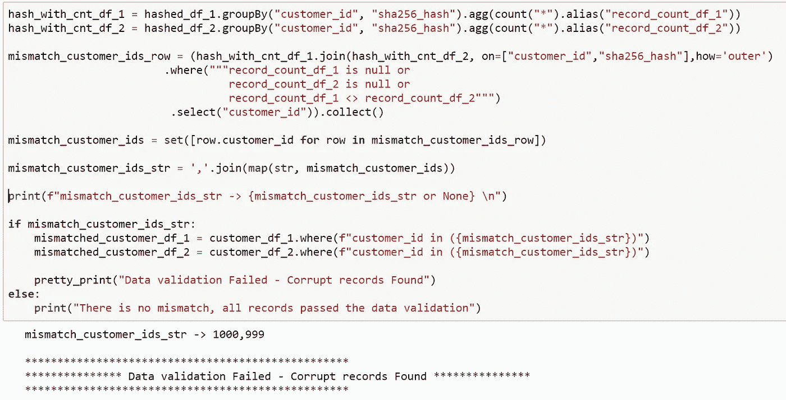

通过利用散列的力量，而不是利用大量资源，我们知道有 2 个损坏的记录(**主键— 999，1000** )。现在，通过只过滤这两个 id，我们可以比较这两个数据帧以获得损坏的值。

## 使用 Join、eqNullSafe 和 Stack 运算符获取不匹配的记录:

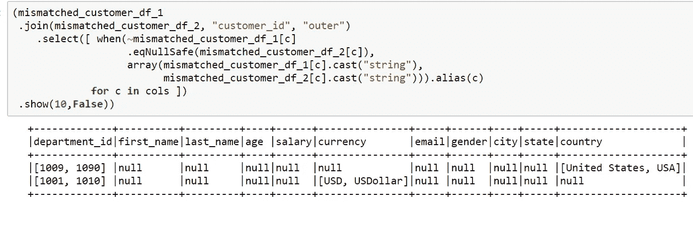

进一步钻取，仅获取两个数据框中不匹配的列及其相应的值。

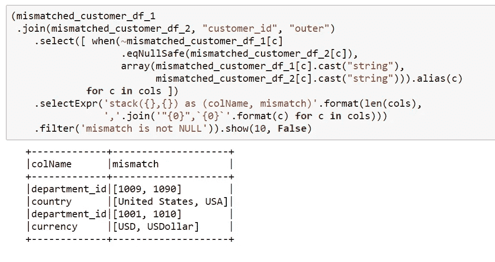

# 步骤 4:统计数据比较—最小值、最大值、平均值、中间值、标准偏差、第 25、第 50、第 75 百分位

在极少数情况下，哈希验证可能会发生冲突，从而导致数据损坏。这可以通过计算数据中每一列的统计数据来避免。

## 几列上的示例摘要

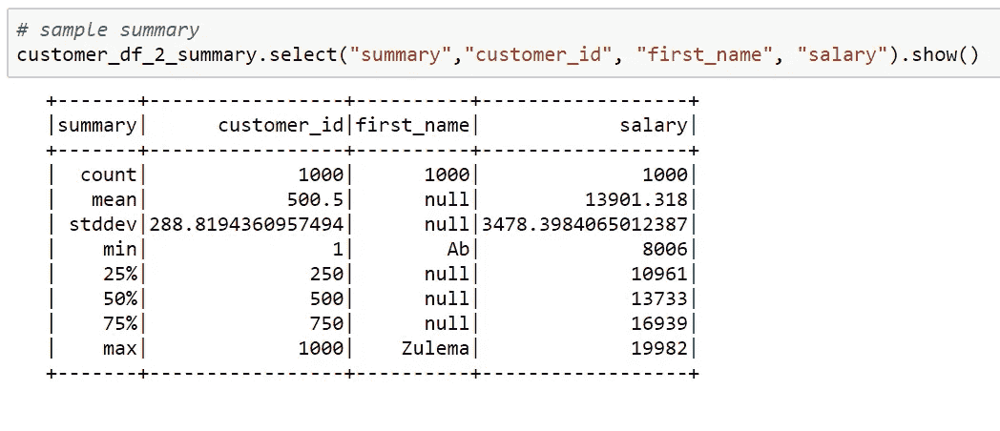

获取所有列的统计数据的 Dataframe summary 方法

比较两个数据帧上的摘要统计信息，找出不匹配的情况。`Numeric`列将计数、平均值、标准差、最小值、最大值和百分位数。`String`列将根据 Ascii 值给出计数、最小值和最大值。

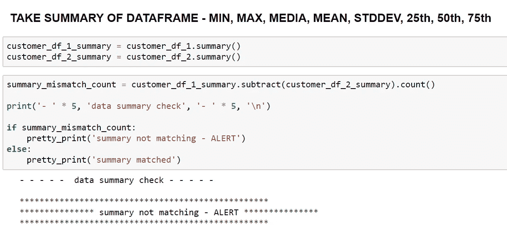

# 步骤 3:不进行哈希运算的子集数据检查

这种检查是苹果到苹果的比较，这意味着这将验证实际数据，而不应用哈希。但是，这将限于几个记录，因为如果我们处理大量数据，这可能会消耗更多资源。

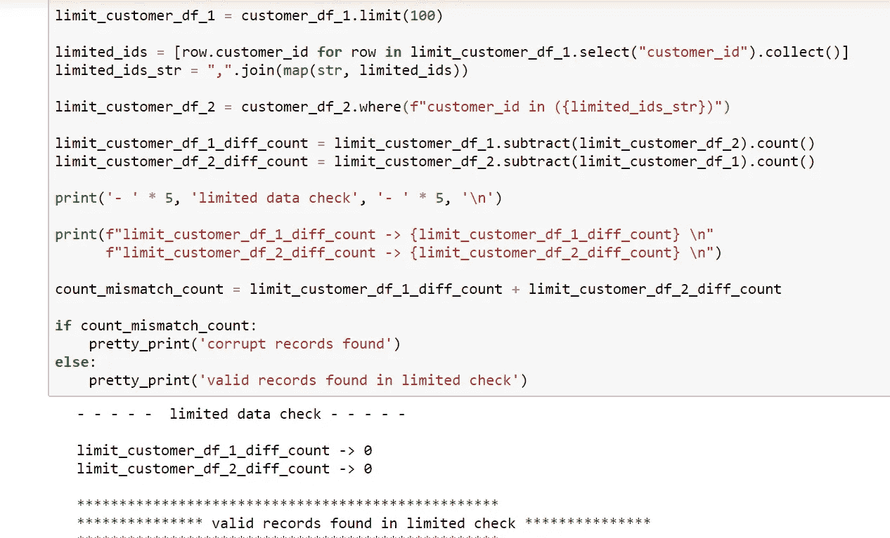

但是，这项检查的一个缺陷是，我们不能 100%确定我们的数据是有效的。因为我们在第 999 和 1000 行中有无效数据。但是，当我们将支票与仅有的 100 条记录进行比较时，它返回我们的数据是有效的。

# 步骤 2:列名检查

这项检查将确保我们没有损坏或额外的列

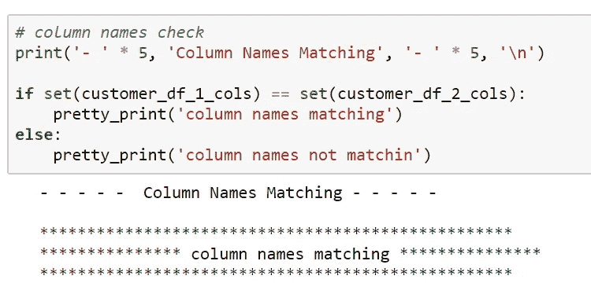

# 步骤 1:行和列计数

这种检查将在典型的数据迁移管道中进行。

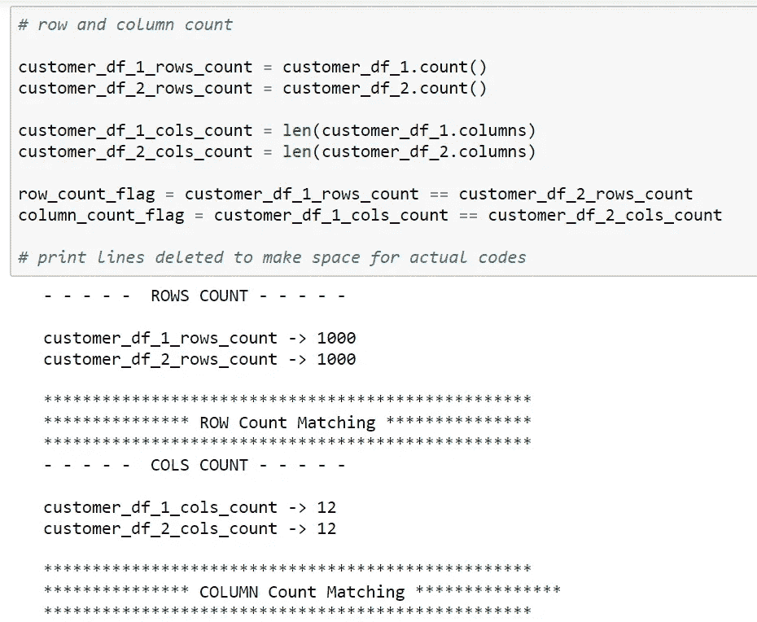

# 包扎

糟糕的数据质量会耗尽团队修复数据的宝贵时间。我希望这篇博客有助于解决使用 Spark 从源迁移到目的地后的数据质量问题。这个现成的解决方案不仅适合分布式系统，而且如果数据量较少，还可以复制到普通 python 中运行。

如果你喜欢这个博客，请分享给你的队友，朋友，鼓掌👏在 1 到 50 英寸的范围内。[每篇帖子最多可以鼓掌 50 次](https://help.medium.com/hc/en-us/articles/115011350967-Claps)。