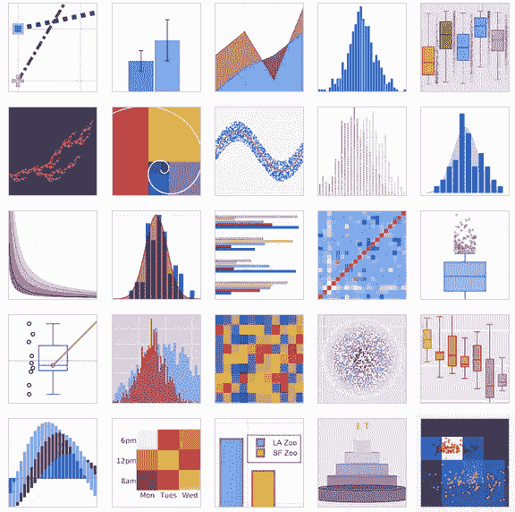
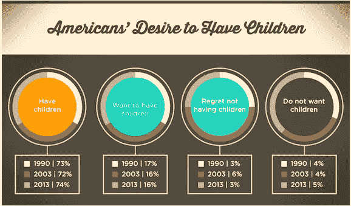
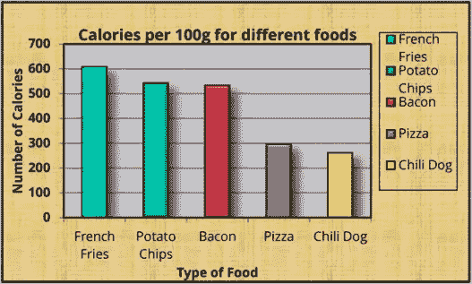
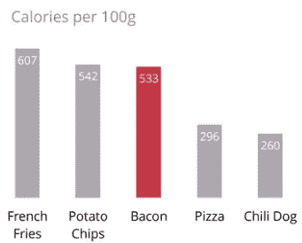
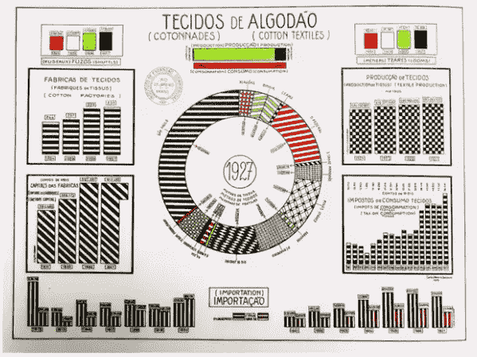
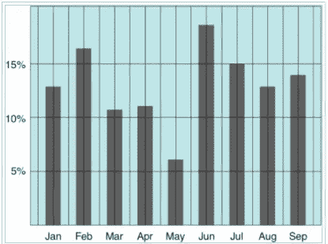
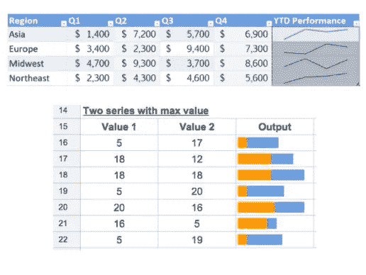
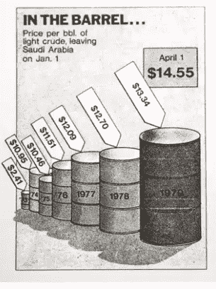

# 数据可视化——一门被低估的艺术

> 原文：<https://pub.towardsai.net/data-visualisation-an-underrated-art-d7372614cb99?source=collection_archive---------0----------------------->

选对了才是根本！(来源—数据科学中心)

如果你曾经遇到过数据可视化和数据可视化工具(如 Tableau)以及 Python 模块(如`matplotlib`、`plotly`和`seaborn`)，请举手。我不会谈论这些工具中的任何一个，但是我将解释数据可视化的启发以及好的/不好的视觉如何影响用户体验。

> 根据谷歌的说法，如果信息是口头呈现的，三天后我们会记住大约 10%。在这种情况下，一个图形被用来表示数字高达 65%的事物。

# 什么是数据可视化？

**数据可视化**以一种吸引人的方式呈现信息，让人类赏心悦目。数据可视化有助于快速掌握错综复杂的信息。它还有助于发现数据组中的模式、趋势和异常值。

一般来说，理解图像比阅读整块的文本要容易得多。我们的大脑天生就能更好地理解视觉而不是文本。说到可记忆性，视觉效果对你的内容创作至关重要。

# 良好数据可视化技术的重要性:

来源 Sparefoot

让我们看看上面的例子。当每个人看到*扁平的设计*和漂亮的*字体*时，他们都会被吸引。但是数据可视化的错误**在这里是足够普遍的，它不应该发生。简而言之，图表应该显示 3 个不相邻的时间间隔(1990 年、2003 年和 2013 年)之间的时间变化。**快速提示，如果你试图展示一段时间内的变化，饼状图永远不会是正确的选择；条形图更适合这项任务。****

这里另一个突出的问题是，显示的三个时间间隔(1990 年、2003 年、2013 年)并不是一个完整的 100%的一部分，但它们似乎是这样显示的。例如，附在“想要孩子”饼图上的三个值并不组合成 100%。通过尝试在饼图中表示上述统计数据，创建者无意中改变了数字的含义。实际值为 17、16、16，但如果计算图表值，则在 34、33、33 左右，不应该是这样的。

> 上图中的修饰完成得很好，但是信息并没有像预期的那样传达。

# 数据可视化启发式

可视化领域的先驱爱德华·塔夫特给出了有效数据可视化的四条规则。

## 1.数据-油墨比

根据爱德华·塔夫特的说法，**数据墨比**定义为印刷图形所需的**数据墨量**除以**总墨量**。这并不意味着我们直接测量创建图形所用的墨水，但这意味着我们删除了那些不会给图形添加新信息的组件。让我们考虑一个条形图，如下所示。

来源——黑马分析公司。

这个条形图第一眼看起来似乎没问题，但是当我们观察时，我们可以注意到一些**冗余**和**不必要的细节**。第一步是去除不想要的背景图像，因为它对理解图表没有任何价值。我们也删除了灰色背景，因为它没有提供太多的价值。然后，我们消除所有的冗余。这包括去掉图例(图表旁边的方框),因为每个条形都直接沿 x 轴标注。

y 轴标签中的标题被修剪了，因为很明显我们在谈论卡路里。有一些粗线形成的边界没有增加任何价值，所以我们也可以删除它们。网格和阴影也可以，因为它们没有增加多少价值。除了一种颜色外，其他颜色也被删除，以便根据需要用它们来表示中间值、最低值和最高值。因为这里的数据值非常简单，所以让我们直接标记图中的每个条形。这就是我们的图表现在的样子！

来源——黑马分析公司。

通过**增加数据-墨水比率**，我们不仅使图形更加直观、可读性更强，而且增加了浏览者看到的信息量。

## 2.图表垃圾

根据爱德华·塔夫特的说法，通常有两种图表垃圾。

1.  **非预期的光学艺术**

来源——质量信息的可视化显示(爱德华·塔夫特)

这是由于图表特征的*过度阴影*或*图案*造成的，如上图所示。这里的图案过于醒目，容易造成视觉疲劳。对此的解决方案是不要将这些内容模式化；最好*直接标注*图表图形。
我们看到在上面的数据中使用了墨比。

**2。网格**

source-I[nfovis-wiki . ne](https://infovis-wiki.ne/)t

图表垃圾的第二种形式是网格。建议网格是不必要的，因为它与正在共享的实际数据竞争。删除或淡化这些网格线会让生活更轻松，而不是被页面上的行数淹没。*数据的直接标记*可能是这个解决方案的一个问题。

## **3。火花线**

火花线是小而轻的图表，通常没有轴，存在于电子表格的单个单元格中。它们是可视化数据的一种漂亮而快捷的方式，不需要复杂的完整图表。这些线条为您提供了与其相邻的原始数据的精确而紧凑的图形表示。

## **4。谎言因子**

**Lie factor** 是视觉上显示的效果**的**大小**除以**数据中实际效果**的**大小**。这是无意的，试图帮助讲述一个故事，然而，它误导了观察者。**

来源—[http://davidgiard.com/](http://davidgiard.com/)

在上图中，显示了不同的石油桶，也显示了六年来的石油价格。但是观众并不清楚一个桶的大小对其他人意味着什么，部分原因是这里有一个透视的元素。
1。这些桶的大小不同吗，或者它们看起来是不同的，因为一些桶在另一些桶的前面？
2。代表成本增长的是桶的体积，还是桶的高度？

这些问题似乎是有效的，虽然不是故意的，但上面这个视觉效果的创作者在设计上面这个视觉效果时并没有考虑到每个人的观点。

> 图形的优雅总是存在于设计的简单和数据的复杂中。

# 收场白

数据可视化是数据科学中一项高度相关且至关重要的任务。我试图展示适当的数据可视化技术的重要性，以及为什么遵循启发式规则是必要的。希望您已经掌握了一些有助于实时可视化数据的概念。请随时分享您的反馈和回应。如果你今天学到了新东西，请举手。