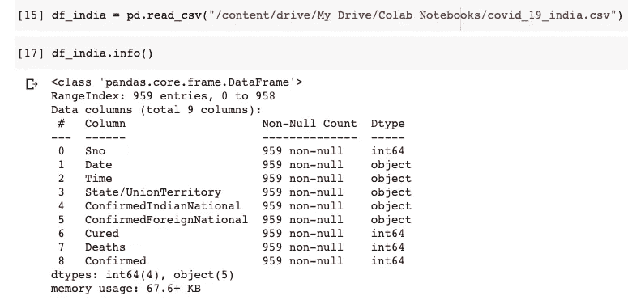
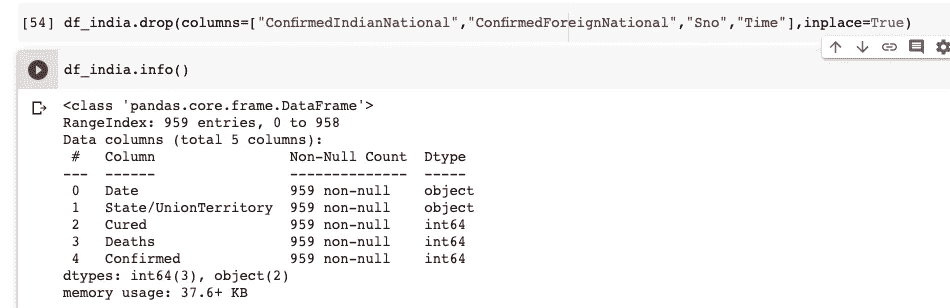
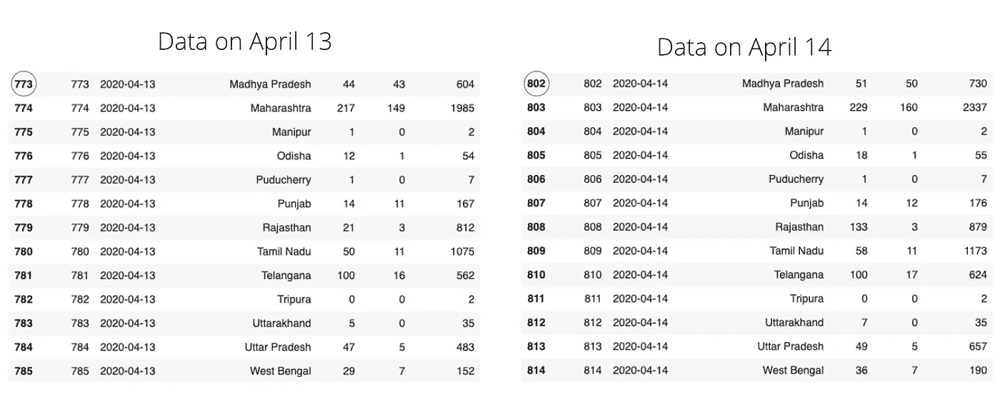
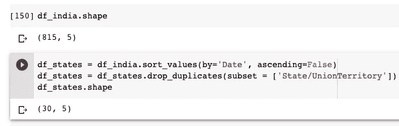
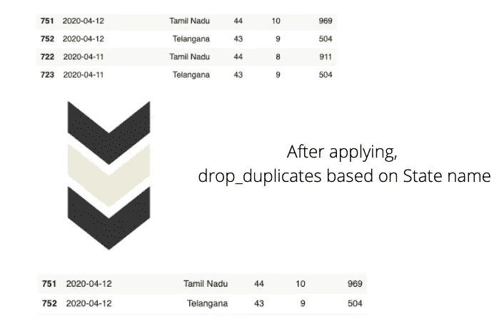
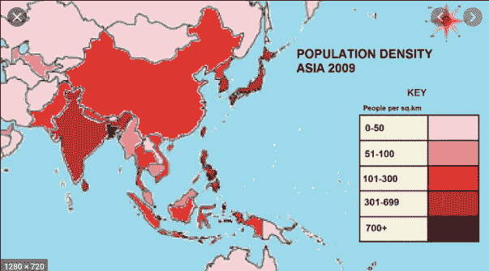
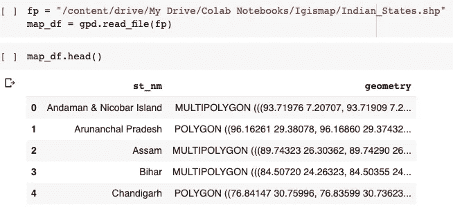
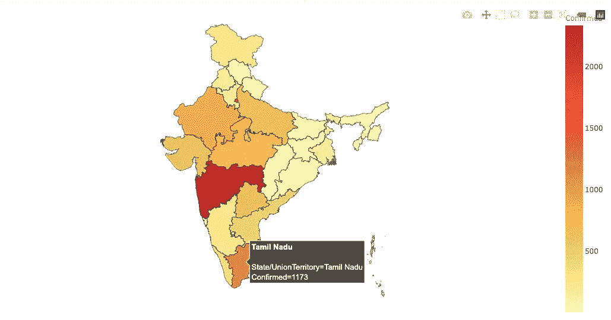

# 使用 Pandas 和 Plotly 实现数据可视化

> 原文：<https://pub.towardsai.net/data-visualisation-using-pandas-and-plotly-970df88fba6f?source=collection_archive---------0----------------------->

## [数据科学](https://towardsai.net/p/category/data-science)，[数据可视化](https://towardsai.net/p/category/data-visualization)


来源— Dribbble

让我们假设你正试图说服一个客户投资你的公司。您以 excel 表格的形式展示所有员工的记录及其成就，而不是条形图或饼图。想象你站在客户的角度。你会有什么反应？(数据多了不会这么铺天盖地吗？).这就是数据可视化发挥作用的地方。

数据可视化是指将原始数据转换成可视化的图形和图表，以使人类大脑更容易理解。主要目标是使研究和数据分析更快，并有效地传达趋势和模式。

> 与冗长的纯文本相比，人脑对视觉上吸引人的数据的理解能力更强。

在本文中，让我们获取一个数据集，根据需要清理数据，并尝试可视化数据。数据集取自 Kaggle。这里可以找到[。](https://www.kaggle.com/sudalairajkumar/covid19-in-india)

首先，为了从外部源加载数据并清理它，我们将使用 Pandas 库。你可以在我之前的文章[这里](https://medium.com/towards-artificial-intelligence/introduction-to-the-pandas-library-4e00f07fc18)研究更多关于熊猫的内容。

为了使用它，我们需要导入 Pandas 库。我们可以用它来导入。

```
import pandas as pd
```

让我们加载取自 Kaggle 的 CSV 文件，尝试了解更多。



我们可以理解数据集总共有 9 列。日期和时间列表示最后更新的日期和时间。我们不打算使用 ConfirmedIndianNational 和 ConfirmedForeignNational 列。因此，让我们删除这两列。时间栏也无关紧要。让我们也放弃吧。由于数据帧已经有了索引，因此也不需要序列号(Sno)列。



马上，我们可以看到数据帧只有 5 列。丢弃冗余数据是一个很好的做法，因为保留冗余数据会占用不必要的空间，并且可能会使运行时陷入停滞。

在这里，Kaggle 数据集每天更新。追加新数据，而不是覆盖现有数据。例如，4 月 13 日数据集有 925 行，每行代表一个特定州的累积数据。但是在 4 月 14 日，数据集有 958 行，这意味着 4 月 14 日追加了 34 个新行(因为数据集中总共有 34 个不同的州)。



在上图中，您可以注意到相同的状态名称，但请尝试观察其他列中的变化。每天都有新病例的数据被添加到数据集中。这种形式的数据有助于了解传播趋势。就像-

1.  随着时间的推移病例数量的增加。
2.  执行时间序列分析

但是我们只对分析最新的数据感兴趣，而不考虑以前的数据。因此，让我们删除那些不需要的行。

首先，让我们按日期降序排列数据。并通过使用州名对数据进行分组来消除重复值。



您可以看到 df_states 数据框只有 30 行，这意味着有一个唯一的行显示每个州的最新统计信息。当我们使用日期列对数据框进行排序时，我们将根据日期以降序对数据框进行排序(注意，在代码中 ascending = False ), remove _ duplicates 存储第一次出现的值，并删除所有重复出现的值。



现在让我们来谈谈数据可视化。我们将使用 Plotly 来可视化上面的数据框。

直方图、条形图、散点图能有效地解释模式和趋势，但由于我们处理的是地理数据，我更喜欢 choropleth 图。

**什么是 Choropleth 地图？**

根据 Plotly 的说法，Choropleth 地图描绘了划分的地理区域，这些地理区域相对于数据变量而言是有颜色或阴影的。这些地图提供了一种快速简单的方法来显示一个地理区域的价值，也揭示了趋势和模式。



来源——Youtube

在上图中，区域根据人口密度进行着色。颜色越深意味着该地区的人口越多。现在关于我们的数据集，我们也将基于确诊病例创建一个 choropleth 图。确诊病例越多，特定区域的颜色越深。

要呈现一幅印度地图，我们需要一个带有州坐标的 shapefile。我们可以在这里下载印度[的 shapefile。](https://www.igismap.com/download-india-boundary-shapefile-free-states-boundary-assembly-constituencies-village-boundaries/)

> 根据维基百科的说法， **shapefile** 格式是地理信息系统(GIS)的地理空间矢量数据格式。

在使用 shapefiles 之前，我们需要安装 GeoPandas，这是一个 python 包，可以轻松处理地理空间数据。

```
pip install geopandas
import geopandas as gpd
```



您可以看到数据框有一个州名及其矢量形式的坐标。现在我们将把这个 shapefile 转换成所需的 **JSON** 格式。

```
import json#Read data to json.merged_json = json.loads(map_df.to_json())
```

接下来，我们将使用 Plotly Express 创建 Choropleth 地图。`px.choropleth`功能。制作 choropleth 地图需要几何信息。

1.  这可以是以 GeoJSON 格式(我们在上面创建的)提供的，其中每个要素都有一个唯一的标识值(就像我们例子中的 st_nm)

2.Plotly 中包含美国各州和世界各国的现有几何图形

GeoJSON 数据，即(我们上面创建的 merged_json)被传递给`geojson`参数，测量的度量被传递给`px.choropleth.`的`color`参数

每个 choropleth 地图都有一个`locations`参数，它将州/国家作为参数。因为我们正在为印度的不同邦创建 choropleth 地图，所以我们将 State 列传递给参数。

```
fig = px.choropleth(df_states, 
                    geojson=merged_json, 
                    color="Confirmed", 
                    locations="State/UnionTerritory", 
                    featureidkey="properties.st_nm",
                    color_continuous_scale  = ["#ffffb2","#fecc5c","#fd8d3c","#f03b20","#bd0026"],
                    projection="mercator"
)fig.update_geos(fitbounds="locations", visible=False)fig.update_layout(margin={"r":0,"t":0,"l":0,"b":0})fig.show()
```

第一个参数是数据框本身，颜色将根据确认的值而变化。我们将`fig.updtae_geos()`中的`visible`参数设置为假，以隐藏底图和框架。我们还设置了`fitbounds = "locations"`来自动缩放世界地图以显示我们感兴趣的区域。



我们可以在各州之间盘旋，以了解更多关于它们的信息。

你可以在 Github [这里查看完整代码。](https://github.com/kurasaiteja/Data-Visualisation)

数据可视化是一门被高度低估的艺术。希望您已经掌握了一些在实时可视化数据时会有所帮助的概念。请随时分享您的反馈和回应。如果你今天学到了新东西，请举手。