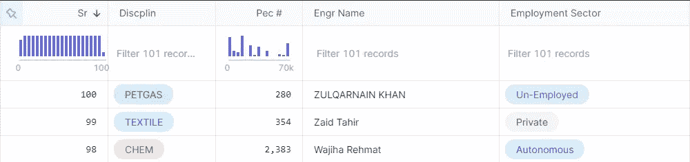
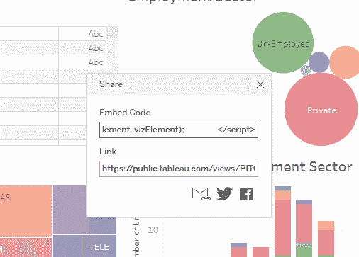

# 当管理层要求你创造一个人工智能魔法时

> 原文：<https://pub.towardsai.net/data-visualization-71a54e8bd038?source=collection_archive---------4----------------------->

## [数据可视化](https://towardsai.net/p/category/data-visualization)

## 使用 Plotly 和 Tableau 制作交互式图表和仪表盘，给管理团队留下深刻印象。

[活动发起人](https://unsplash.com/@campaign_creators?utm_source=medium&utm_medium=referral)在 [Unsplash](https://unsplash.com?utm_source=medium&utm_medium=referral) 上的照片

# 介绍

高层管理人员给了我相当简单同时又很艰巨的任务。数据集包含五列，其中两列是类别，另外三列是唯一标识符。

作者图片

所以，我只剩下两个专栏，他们想要一些人工智能产品或华而不实的东西，而我不知道如何制作华而不实的东西。我从来没有处理过这么小的数据，没有几个重要的特征。因此，我开始使用 [CTGAN](https://github.com/sdv-dev/CTGAN) 从样本数据中生成更多的数据，但这并不华丽，大量的代码会混淆而不是解决问题。

我已经缩小了一些想法

*   CTGAN 培训和生成
*   Deepnote 上的数据分析
*   在 Tableau 上创建可视化
*   仪表板
*   将简单数据与更大的可用数据相结合

*我把它缩小成简单的可视化在*[***Deepnote***](https://deepnote.com/)*并把*[***Tableau***](https://www.tableau.com/)**整合到笔记本里。**

# *数据分析*

*导入[熊猫](https://pandas.pydata.org/)和[剧情](https://plotly.com/)浮华可视化。*

*数据集包含五列，由于隐私和不相关，我们删除了其中的两列。我使用了`Pec #`作为索引列，这样我们可以只关注两个有用的列。你可以看到数据有多简单，我想出一个分析有多难。*

## *工程学科的简单直方图*

*我们可以观察到计算机和电气工程处于领先地位。实际上，土木工程、电气工程和机械工程的需求量很大，另一方面，这些数据是样本数据，我们用它来构建样本分析，这样我们就可以添加原始数据。*

## *工程学科的朝阳*

*这是我第一次使用[旭日图](https://plotly.com/python/sunburst-charts/)获取分类数据。这是相当互动的，如果你点击任何学科，它会打开生命之花，显示有多少人就业或失业。我想我现在会经常使用这种类型的可视化。*

*快速浏览一下数据，您会发现石油和天然气行业有更多失业的工程师，为了简化，您可以与数据进行交互，以注意到每个重要的工程领域要么有私人合同，要么失业。*

## *就业部门的简单饼图*

*我使用了 [Plotly 饼状图](https://plotly.com/python/pie-charts/)并定制了一些看起来像甜甜圈的东西。很明显，大多数工程师要么受雇于私营企业，要么失业。这在巴基斯坦是一个真正的问题，因为大学每年都在输送越来越多的工程师，但没有足够的公司雇佣他们，这在工业领域造成了巨大的不平衡。*

# *Deepnote 中的 Tableau 可视化*

*与此同时，我开始制作 [Tableau public](https://public.tableau.com/en-us/s/) 并发表了最初可视化的故事。起初，整个事情很简单，因为它有条形图和简单的饼图。我想把这一切都转换成仪表板，所以我开始把我所有的可视化添加到 tableau 平台，并创造了这种美。我想我已经完成了我所要求的工作。我不能生产一些神奇的人工智能产品，但生产一个工作的仪表板是非常令人满意的。*

## *如何将公共 Dashboard 集成到 Deepnote 中？*

*这很简单，只需几个搜索，我就找到了解决[堆栈溢出](https://stackoverflow.com/questions/36645351/tableau-viz-embedded-in-ipython-notebook)的方法。在`public.tableau.com`保存仪表板后，你可以点击 viz 底部的分享按钮。然后复制所有嵌入的代码。*

**

*作者图片*

*在您的代码单元中添加`%%HTML`,然后粘贴嵌入的代码，整个仪表板将出现在您的 python 笔记本中。*

# *结束语*

*我认为我们可以在 Jupyter 笔记本上做得更多，老实说，我很惊讶看到我创造的东西。这个故事的寓意很简单:即使事情没有按照你的计划进行，也要继续寻找解决方案。在这几天里，我学到了很多东西，这让我更好地处理问题，即使是在较小的数据集中。*

*最后，管理团队对我华丽的仪表盘和可视化很满意。他们现在正在推进更大的数据集，他们希望我建立一个数据管道，从工程师那里收集数据，并将关键信息分发到特定部门，以便其他部门可以根据数据做出更好的决策。*

> *你可以在 LinkedIn 和 T2 上关注我，我每周都会在那里发表文章。*

# *别忘了给你的👏*

**

*作者 Gif*