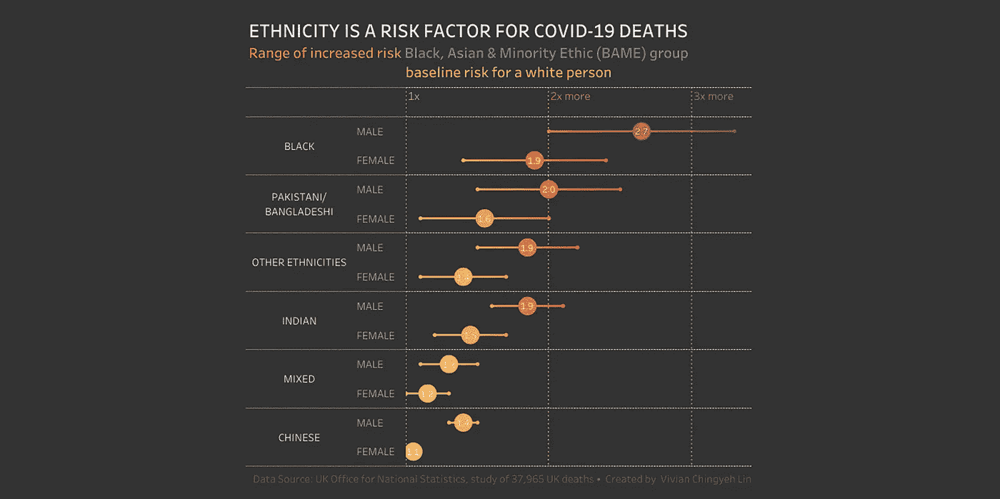
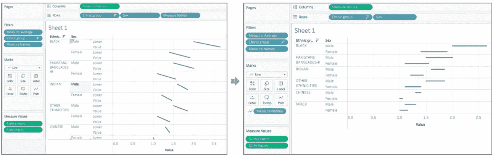
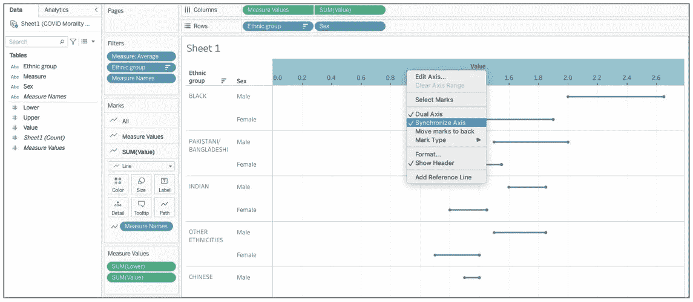
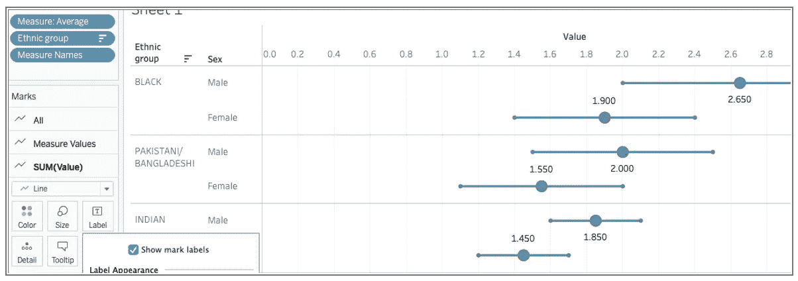
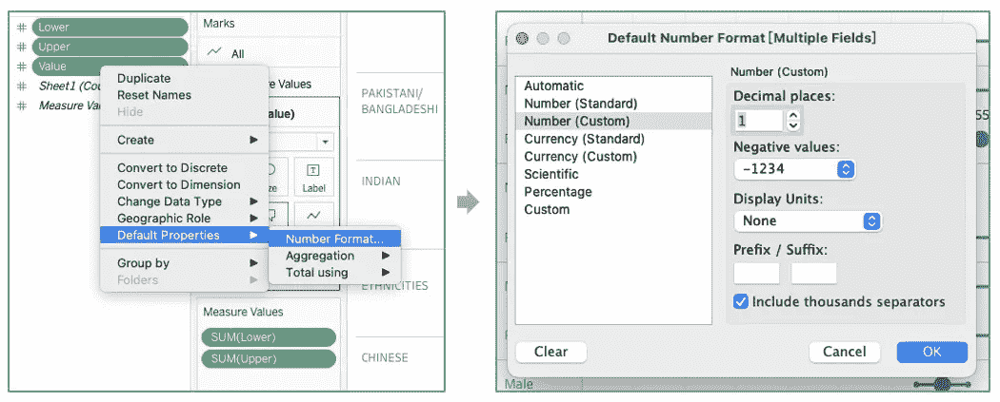
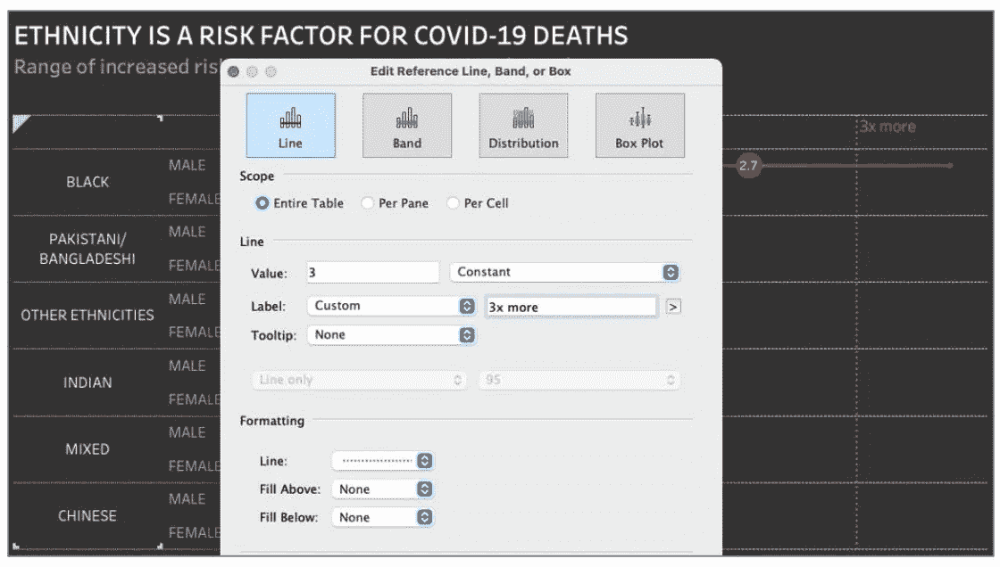

# 数据可视化用 Tableau 进行数据分析:种族在 COVID 死亡中起作用吗？

> 原文：<https://pub.towardsai.net/data-visualization-performing-a-data-analysis-with-tableau-does-ethnicity-play-a-role-in-covid-20a359922108?source=collection_archive---------3----------------------->

## [数据可视化](https://towardsai.net/p/category/data-visualization)

疫情给了我们大量的数据来分析。通过使用 Tableau(用于数据分析目的的最佳软件之一)，我将分析包含关于种族和 Covid19 数据的数据集。在本文中，我将向您展示如何使用这个原始数据集来获得这个图，从中我可以得出几个结论。

我制作了一个双轴组合图，以代表英国按种族划分的冠状病毒(新冠肺炎)死亡率。你可以看到与怀特相比的风险范围。它显示非白人有更高的风险，黑人男性死于新冠肺炎的风险最大。数据来源和我制作图表的主要步骤说明如下。

数据来源于[信息是美丽的](https://docs.google.com/spreadsheets/d/1g_YxmDfQx7aOU2DKzNZo9b-NTk62Bju6X3z6OuCa6gw/edit#gid=2004630296)通过英国国家统计局。这包括 2020 年 3 月 2 日至 2020 年 5 月 15 日英格兰和威尔士按种族划分的新冠肺炎相关死亡。死亡总人数为 37956 人。我使用的数据是种族和性别的风险比。

英国国家统计局解释说，风险比是一种衡量每个少数民族相对于白人的新冠肺炎死亡率的高低的指标。他们使用白人族群作为参考类别，因为它拥有最多的人口。

该数据包含与参照组和不同测量值相比，新冠肺炎死亡率的较低、较高和平均比率。有平均比率和调整比率，如(1)年龄调整，(2)地区和人口密度调整，(3)剥夺，社会经济地位，教育，和(4)职业暴露。首先，将所有测量结果放入原始数据中一个名为“测量”的列中。然后，我将 Tableau 中所有测量结果的上限值和下限值结合起来。只需将“度量名称”从“行”拖到“路径”中。

第二，拖动平均值到轴上，点击“同步轴”。

我想用一个圆来显示平均值，所以我选择了“圆”并放大尺寸来强调它。然后我点击“标签”并勾选“显示标记标签”。

在其他要四舍五入到第二个小数位，你可以改变数字格式从"默认属性"。

第三，我用“格式底纹”更改了工作表的背景色，并将线条的颜色从红色改为金色。

第四，添加参考线，使图表易于阅读。在“分析”中，我使用了自定义参考线来绘制 1 倍、2 倍和 3 倍的线。

最后，从工作表中选择“显示标题”并调整仪表板的大小。这是我制作图表的方式。我的灵感来自于《改头换面的星期一》和《信息是美丽的》。正如我们所看到的，有不同的种族受到疫情的不同影响，可能是因为各种不同的因素。数据可视化的使用很容易让我们获得洞察力，并探索解码其复杂性的数据。感谢您的阅读。非常欢迎任何反馈。

# insightextraction # tableau #数据可视化#数据转换#covid19 #race