# 使用 Pandas、NumPy 和 Matplotlib Python 库实现数据可视化

> 原文：<https://pub.towardsai.net/data-visualization-using-pandas-numpy-and-matplotlib-python-libraries-768ad5357ec?source=collection_archive---------3----------------------->

## [数据可视化](https://towardsai.net/p/category/data-visualization)

为了分析哪些学生在数学、物理和化学等科目中获得了最高的百分比，我们需要一个条形图来显示它。有许多方法可以探索数据集。但在我看来，Python 起了主要作用。它易于理解，并且需要较少的代码行。

照片由[负空间](https://www.pexels.com/@negativespace?utm_content=attributionCopyText&utm_medium=referral&utm_source=pexels)从[像素](https://www.pexels.com/photo/grayscale-photo-of-computer-laptop-near-white-notebook-and-ceramic-mug-on-table-169573/?utm_content=attributionCopyText&utm_medium=referral&utm_source=pexels)

为什么要构建视觉效果？

__ 清晰地传达数据并进行探索性数据分析

__ 共享数据的无偏表示

__ 可以使用它们来支持对不同利益相关者的建议。

创建视觉效果时，请始终记住:

__ 你在你的情节中包括的任何特征或设计，以使它更有吸引力，并且应该传达情节要传达的信息，而不是分散注意力。应该是有效的。

在探索数据集之前，让我们了解一下 Pandas、NumPy 和 Matplotlib。

**熊猫:**

Pandas 是 Python 必不可少的数据分析工具包。它是一个 Python 包，提供了快速、灵活和富有表现力的数据结构，旨在处理关系数据或标签数据。它的目标是成为用 python 进行实际的、真实世界的数据分析的基础高级构建块。

**NumPy:**

Numpy 是 Python 中科学计算的库，也是熊猫的基础。它提供了一个高性能的多维数组对象和工具来处理这些数组。numpy 数组类似于这个列表。它通常大小固定，每个元素都是同一类型。我们可以通过首先导入一个列表来将它转换成一个 numpy 数组。Numpy 数组包含相同类型的数据，我们可以使用属性“dtype”来获取数组元素的数据类型。

**Matplotlib:**

Matplotlib 是 Python 中使用最广泛(如果不是最流行的话)的数据可视化库之一。它以各种硬拷贝格式和跨平台的交互环境生成高质量的数字。Matplotlib 可用于 Python 脚本、IPython shell、jupyter notebook、web 应用服务器和 GUI 工具包。如果你想用 python 创建有影响力的可视化，matplotlib 是一个必不可少的工具。

让我们开始探索 medium.com 数据集。

数据集:[https://www.kaggle.com/dorianlazar/medium-articles-dataset](https://www.kaggle.com/dorianlazar/medium-articles-dataset)

导入所需资源:

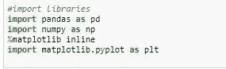

导入库

接下来，使用 pd.read_CSV 和 df.head (10)函数读取 CSV(逗号分隔值)文件，以显示前 10 行。

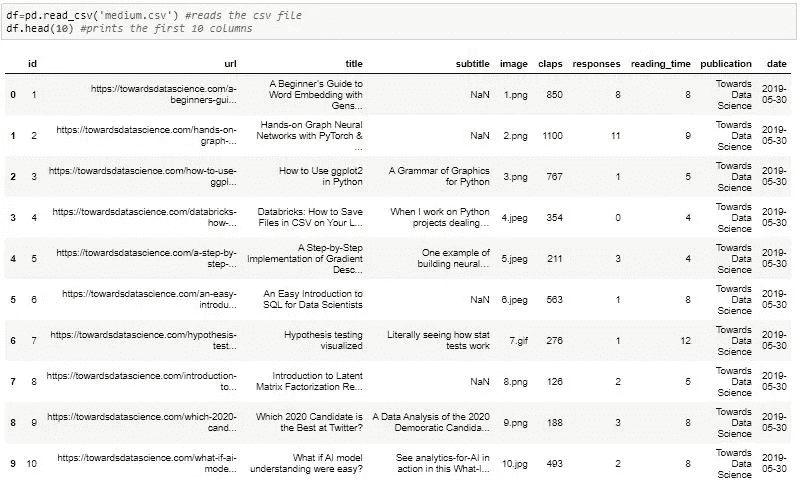

读取 csv 文件并打印前 10 行

注意:如果我们想要显示数据集的所有行，您可以使用 df 函数，如果您想要显示最后的行，您可以使用 df.tail()。

要查看数据框的尺寸。形状参数已部署:

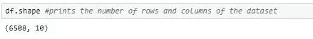

显示行数和列数

接下来，我们将使用 drop 方法删除不必要的列:

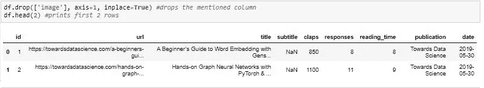

删除该列并显示前 2 行

在熊猫中，轴=0 表示行，轴=1 表示列

要重新排列这些列，我们可以使用重建索引的方法:

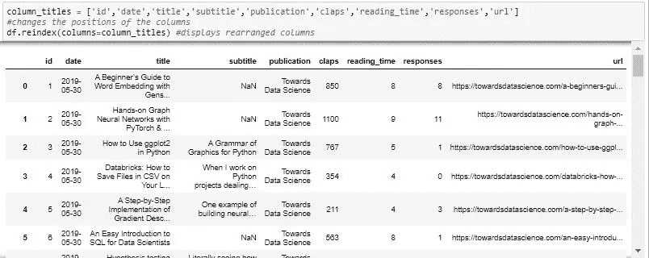

重新排列列

我们还将添加“总计”列，该列汇总如下:

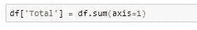

总计栏

要了解统计信息，我们可以使用`describe()`方法:

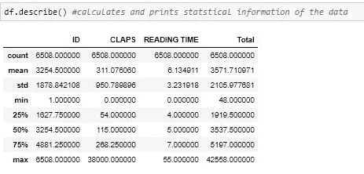

数据集的统计信息

检查数据集中有多少空对象，如下所示:

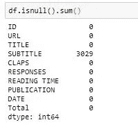

显示空对象

为了知道最小和最大的拍手次数，使用了 min()和 max()函数:

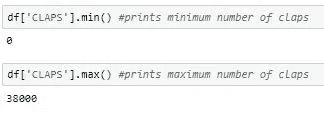

最小和最大拍手次数

要返回包含唯一值计数的序列，我们可以使用`value_counts()`函数来了解哪个发布出现得更频繁，并可以计算其百分比，条形图如下:

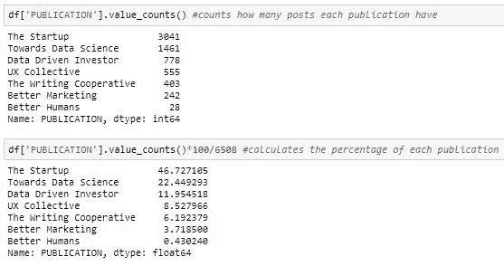

出版物的数量及其百分比

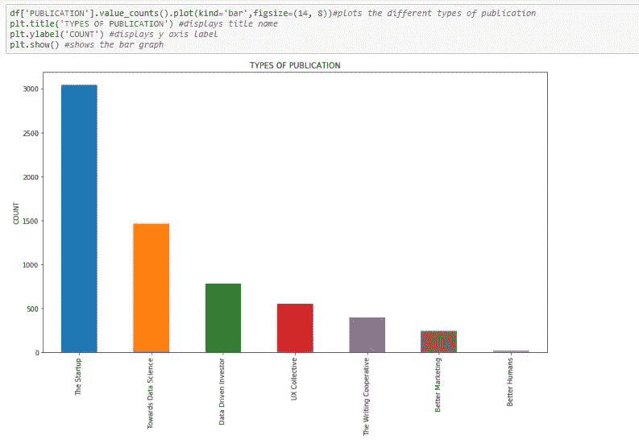

每个出版物的条形图

要知道哪个标题和出版物获得了更多的掌声和回应，我们可以使用`max()`函数和 df.loc 属性来访问给定数据帧中的行和列:

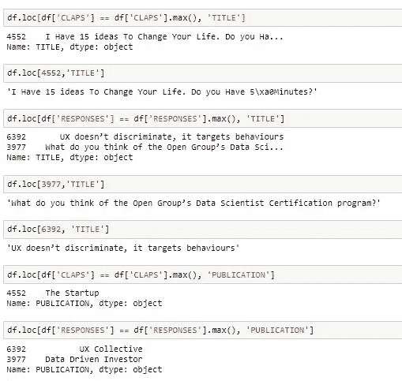

标题和出版物的最大鼓掌和响应次数

最后，要知道点击次数最多的前 5 个出版物，我们可以使用`sort_values()`方法和`transpose()`函数对该列进行排序，如下所示:

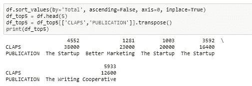

排名前五的出版物和为其鼓掌的次数。

您可以参考下面链接中提到的代码:

 [## medium article.md

### 编辑描述

drive.google.com](https://drive.google.com/file/d/1lrjaSGrGYbXDrBXHTXEZkFD9BUY6GNvz/view?usp=sharing)