# 使用 Seaborn 的数据可视化

> 原文：<https://pub.towardsai.net/data-visualization-using-seaborn-369ec156f03e?source=collection_archive---------3----------------------->


照片由[安德森·格拉](https://www.pexels.com/@andersonguerra?utm_content=attributionCopyText&utm_medium=referral&utm_source=pexels)从[佩克斯](https://www.pexels.com/photo/photo-of-woman-portrait-wall-art-1154198/?utm_content=attributionCopyText&utm_medium=referral&utm_source=pexels)拍摄

## [数据可视化](https://towardsai.net/p/category/data-visualization)

## Seaborn 地块

# 使用 Seaborn 的数据可视化

Seaborn 用于数据可视化，它基于 matplotlib。它提供了一个高层次的界面来绘制有吸引力的和信息丰富的统计图形。

数据可视化用于从数据中发现非常有意义的见解。它用于可视化数据的分布，两个变量之间的关系。当数据被适当地可视化时，人类视觉系统可以看到指示关系的趋势和模式。

让我们在本文中了解不同类型的 seaborn 地块。

# 目录

1.  **可视化数据集的分布**

*   柱状图
*   Kdeplot
*   距离图
*   接合图
*   配对图

**2。可视化两个或多个定量变量之间的关联**

*   散点图
*   线图
*   lmplot
*   点图

**3。绘制分类数据**

*   条形图
*   计数图
*   紫罗兰花
*   脱衣舞场
*   群集图

# 资料组

为了便于理解，我选取了一个小数据集。

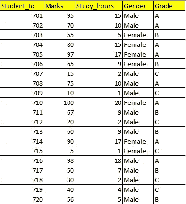

资料组

# 可视化数据集的分布。

## 1.单变量分布

*   柱状图
*   kdeplot
*   距离图

**2。二元分布**

*   联合地块
*   配对图

# 单变量分布

## 1.柱状图

直方图用于可视化单个变量的分布(单变量分布)。直方图是一个条形图，其中代表数据变量的轴分为一组条柱，每个条柱下的观察计数显示在另一个轴上。

`Data variable vs count`

## 导入库和数据集

```
**import** pandas **as** pd
**import** numpy **as** np
**import** matplotlib.pyplot **as** plt
%matplotlib inline
**import** seaborn **as** snsdf=pd.read_csv(**"Results.csv"**)
df.head(3)
```


现在我们将创建直方图。

为“标记”变量创建直方图。让我们来看看这个数据集中的标记分布。

```
sns.histplot(x=**"Marks"**,data=df)
```

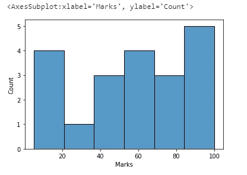

## 推理

1.  从图中可以看出标记的范围。(5 到 100)
2.  这个图也清楚地表明，更多的学生得到了 80 分以上的分数。

## 色彩

在 **seaborn** 中， **hue** 参数决定数据帧中的哪一列应该用于颜色编码。

我们可以包括“等级”变量作为色调参数。

```
sns.histplot(x=**"Marks"**,data=df,bins=10,hue=**"Grade"**)
```

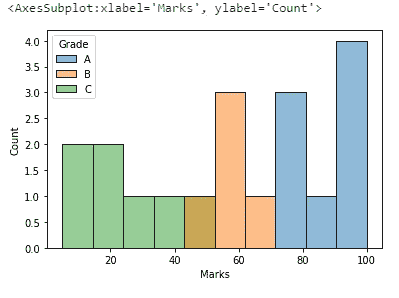

**推论。**

现在，在添加色调参数后，我们获得了更多信息，如哪个范围的标记属于哪个等级。

## 2.KDE 图

核**密度**估计( **KDE** ) **图**是一种可视化数据集中观察值分布的方法，类似于直方图。 **KDE** 使用一维或多维的连续概率**密度**曲线表示数据。

KDE→核密度估计是确定连续变量的概率密度函数的方法。

`Data variable vs density`

```
sns.kdeplot(x=**"Marks"**,data=df)
```

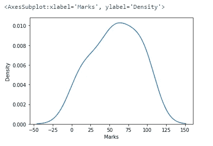

**推论**

通过使用 KDE 图，我们可以推断出连续变量的概率密度函数。

**KDE 图中的色调参数**

```
sns.kdeplot(x=**"Marks"**,data=df,hue=**"Grade"**)
```

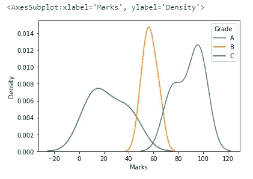

# 3.距离图

Distplot 是直方图和其上的线条(密度图)的组合。Distplot 也用于可视化单个变量的分布(单变量分布)。

在 distplot 中，y 轴代表密度。所以直方图高度显示的是密度而不是计数。如果绘制了 KDE 或拟合密度，这是隐含的。

`sns.distplot(df[“Marks”])`

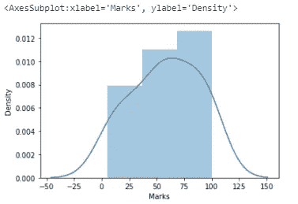

为了只可视化一个密度图，我们可以给`hist=False`。

`sns.distplot(df[“Marks”],hist=False)`

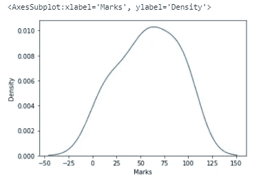

为了只可视化直方图，我们可以给出`kde=False`。

`sns.distplot(df[“Marks”],kde=False)`

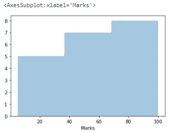

# 二元分布

# 1.接合图

Jointplot 显示两个数值变量之间的关系。它是散点图和直方图的结合。

`sns.jointplot(x=”Marks”,y=”Study_hours”,data=df)`

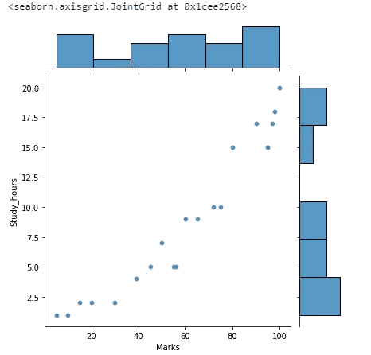

如果我们提到 kind=" reg "，联合图还会绘制一条回归线。

`sns.jointplot(x=”Marks”,y=”Study_hours”,data=df,kind=”reg”)`

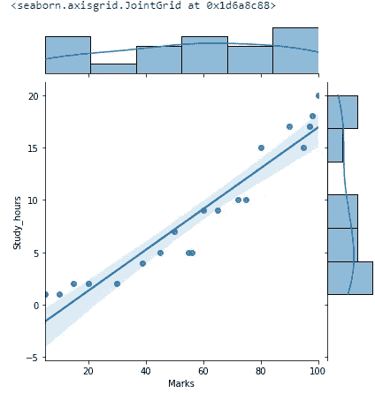

**使用色调作为参数**

`sns.jointplot(x=”Marks”,y=”Study_hours”,data=df,hue=”Grade”)`

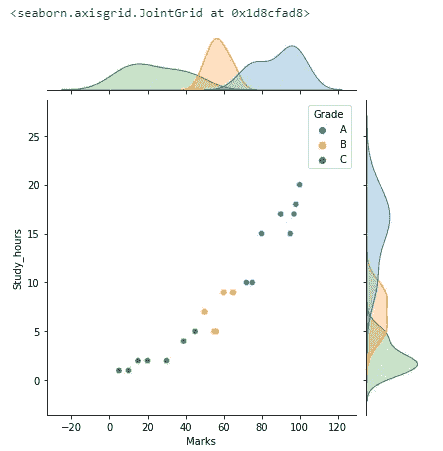

# 配对图

Pairplot 用于描述数据集中的成对关系。Pairplot 用于可视化数据集中所有变量的单变量分布及其所有成对关系。对于 n 个变量，它产生 n*n 个网格。
对角线图是直方图，所有其他图是散点图。

`sns.pairplot(df)`

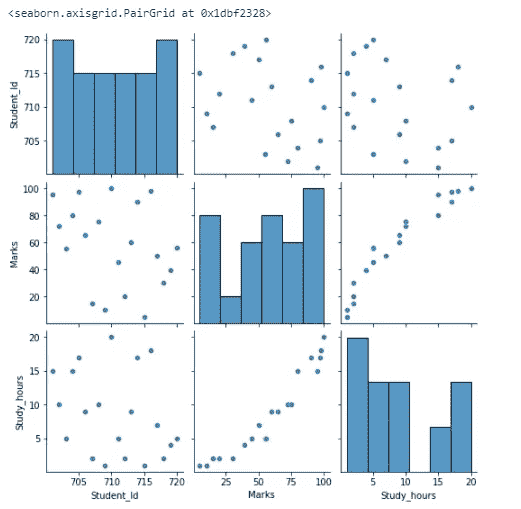

**推论**

数据分布应该显示一些趋势。在本例中，分数与学习时间呈线性关系(正相关)。

Student_Id 列没有显示与“分数”和“学习时间”变量的任何关系。

可以从数据集中删除 Student_Id 列。

**在成对绘图中使用色调参数。**

`sns.pairplot(df,hue=”Grade”)`

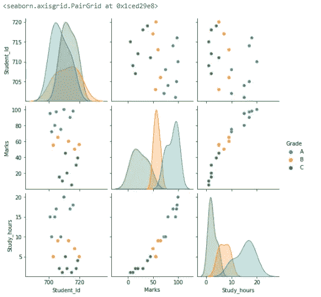

# 可视化两个或多个定量变量之间的关联

# **1。KDE 剧情**

KDE 图也可用于二元分布。

让我们看看“学习时间”与“分数”的数据分布

```
sns.kdeplot(x=**"Study_hours"**,y=**"Marks"**,data=df)
```

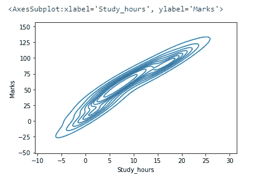

# 2.散点图

散点图显示了两个数值变量之间的关系。

**推论**

从散点图中，我们可以确定变量之间的相关性

*   **正相关:**两个变量同向运动时两个变量之间的关系。
*   **负相关:**两个变量向不同方向运动时两个变量之间的关系。
*   **零相关:**两个变量之间没有关系。

**例 1:让我们看看“分数”和“学习时间”的关系**

```
sns.scatterplot(x=**"Marks"**,y=**"Study_hours"**,data=df)
```

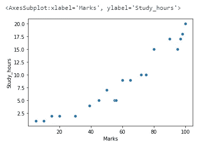

**推论:**

表示**正相关**。随着学习时间的增加，分数也会增加。

**例 2:让我们看看“学生 Id”和“分数”之间的关系。**

```
sns.scatterplot(x=**"Marks"**,y=**"Student_Id"**,data=df)
```

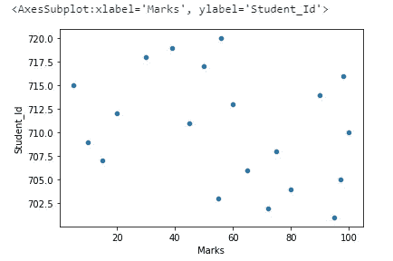

**推论:**

我们可以看到“Student_Id”和“Marks”之间的相关性为零。我们可以从数据集中删除列“Student_Id ”,因为它与“Marks”变量无关。

**示例 3:在散点图中使用色调参数。**

在散点图中，我们可以通过提及色调参数来添加第三个变量。它将以彩色显示。

`sns.scatterplot(x=”Marks”,y=”Study_hours”,data=df,hue=”Grade”)`

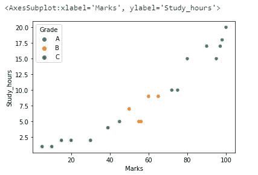

# 3.线形图

这两个变量之间的关系可以用线图来表示。

例 1:让我们看看“分数”和“学习时间”之间的关系

`sns.lineplot(x=”Marks”,y=”Study_hours”,data=df)`

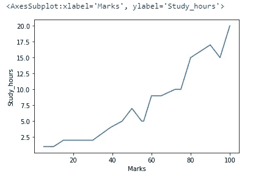

**推论**

“学习时间”增加，“分数”也会增加。

**使用线条图**中的色调参数

`sns.lineplot(x=”Marks”,y=”Study_hours”,data=df,hue=”Grade”,style=”Grade”)`

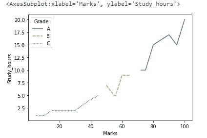

# 4.lmplot

线图是有趋势线的散点图。lmplot 用于绘制回归线。

`sns.lmplot(x=”Marks”,y=”Study_hours”,data=df)`

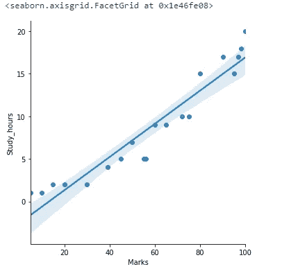

**推论:**

“分数”和“学习时间”变量具有线性关系。回归线周围的阴影分布表示数据分布。

**在 lmplot** 中使用色调参数

`sns.lmplot(x=”Marks”,y=”Study_hours”,data=df,hue=”Grade”)`

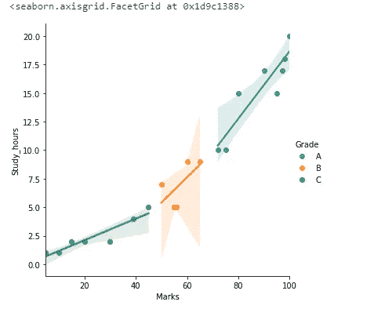

# 5.点图

`sns.pointplot(x=”Study_hours”,y=”Marks”,data=df)`

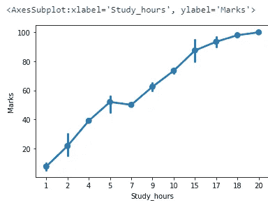

**推论:**

“学习时间”增加，“分数”也会增加。垂直线显示特定“学习时间”的数值范围(“分数”)。

`sns.pointplot(x=”Study_hours”,y=”Marks”,data=df,hue=”Grade”)`

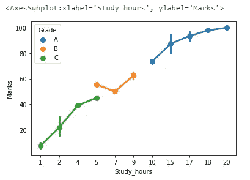

# 分类图

## 可视化数量

在许多情况下，我们可能希望将某组数字的大小可视化。比如每个班的学生总数或者在不同公司工作的员工总数。

为了直观显示数量，使用了条形图。

## 1.条形图

条形图用每个矩形的高度表示数值变量[平均值]的集中趋势估计值，并使用误差线提供该估计值周围不确定性的一些指示。

柱状图将只显示分类变量每个级别的数值变量的平均值。

如果我们想知道分类变量每一层的值的分布，我们可以使用箱线图或小提琴图。

例 1:让我们做一个“分数”和“分数”之间的柱状图[分类变量和数字变量]

`sns.barplot(x=”Grade”,y=”Marks”,data=df)`

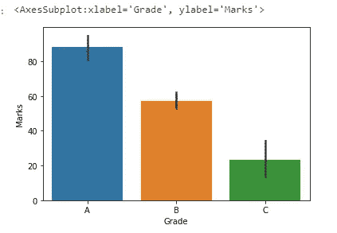

**推论:**

对于每个等级水平，显示“分数”的平均值。

让我们计算一下 a 级的平均分。

在 A 级中，“分数”是 95，72，80，97，75，100，90，98。

平均值=(95+72+80+97+75+100+90+98)/7 = 707/8
`Mean=88.375`

误差线显示为从 72 到 100(因为 A 级中“标记”的范围是从 72 到 100)

# 计数图

计数图使用条形显示每个分类箱中的观察计数。

`sns.countplot(x=”Grade”,data=df)`

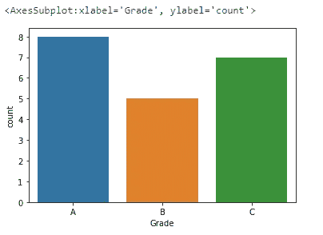

**推论:**

我们开始知道得了 A、B 和 C 的学生人数。

在计数图中添加色调参数

`sns.countplot(x=”Grade”,data=df,hue=”Gender”)`


**推论:**

我们开始了解每个年级的男女学生人数。

# 紫罗兰花

Violinplot 有助于根据核密度估计和箱线图来查看数据的分布。

`sns.violinplot(x=”Grade”,y=”Marks”,data=df)`

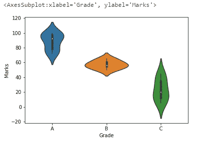

**推论**

中间的白点是中间值，中间的粗黑条代表四分位数范围。从它延伸出来的黑色细线代表数据中的最大值和最小值。

密度图旋转并保持在每一侧，以显示数据的分布。

# 脱衣舞场

条带图是给定数据的一维散点图，其中一个变量是分类变量。这通常在样本量较小时使用。

`sns.stripplot(x=”Grade”,y=”Marks”,data=df)`

# 群集图

群集图与剥离图相似，但点会随分类数据一起调整，因此它们不会重叠。Swarmplot 将比 stripplot 更好地描述数据。

`sns.swarmplot(x=”Grade”,y=”Marks”,data=df)`

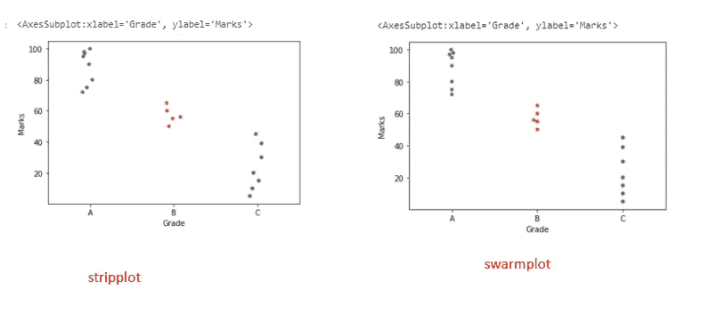

# 热图

热图是数据的二维图形表示，矩阵中包含的各个值用颜色表示。
让我们看看如何使用热图检查相关性。

相关性是一种统计技术，用于检查两个变量之间的关系。

`sns.heatmap(df.corr(),annot=True,vmin=-1,vmax=1)`

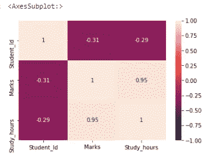

**推论:**

如果相关性为 1 或接近 1，则两个变量强相关。在这个数据集中，“分数”和“学习时间”有很强的相关性。

# 关键要点


作者图片

1.  条状图和群集图是分类散点图
2.  箱形图和小提琴图是分类分布图
3.  柱状图和计数图是分类估计图。
4.  直方图、kdeplot、distplot 是单变量分布图
5.  联合图是一个二元分布图。

**色相参数**

使用`hue`、`size`和`style`参数，可以为不同的数据子集显示`x`和`y`之间的关系。

如果色调参数以**的形式给出，数值变量**意味着默认情况下它们用顺序色图表示。

如果色调参数作为**分类变量给出，则**意味着它们用不同的颜色表示。

这涵盖了使用 seaborn 的一些数据可视化。

我希望这篇文章对你有所帮助。

*请关注此空间，了解更多关于 Python 和数据科学的文章。如果你喜欢看我的更多教程，就关注我的* [***中***](https://medium.com/@IndhumathyChelliah)[***LinkedIn***](https://www.linkedin.com/in/indhumathy-chelliah/)*[***推特***](https://twitter.com/IndhuChelliah) ***。****

*感谢阅读！*