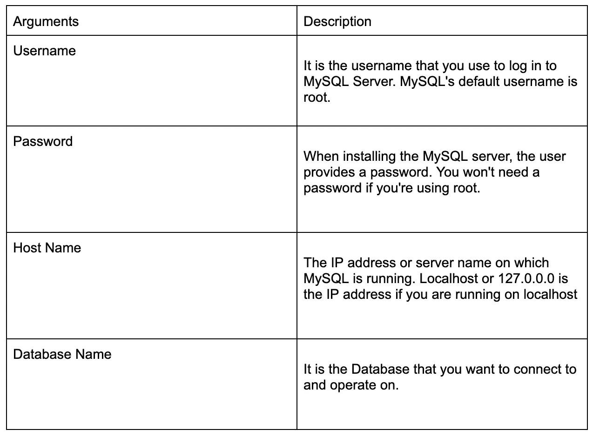
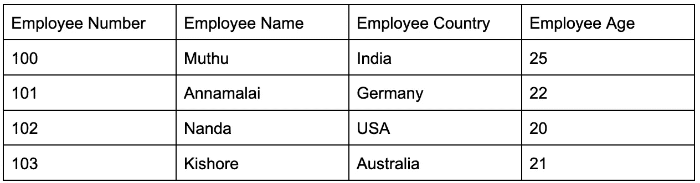
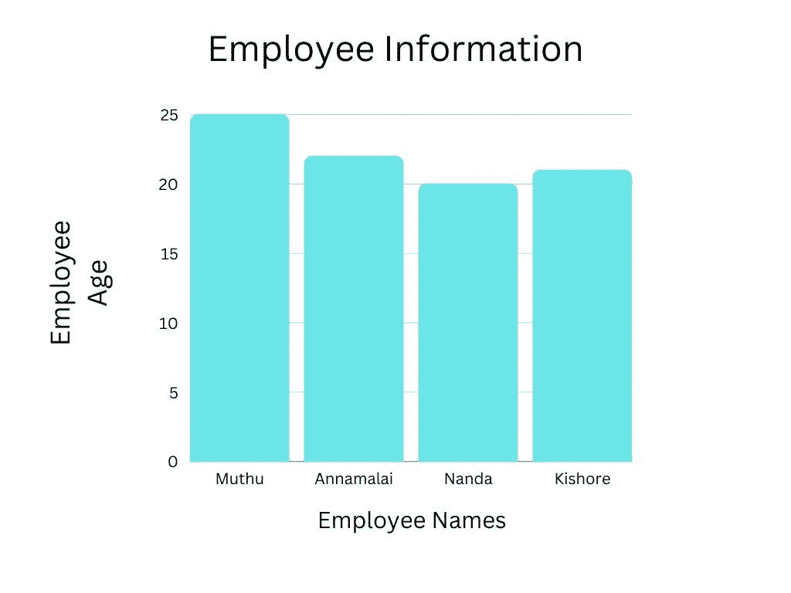

# SQL 数据可视化—简要指南

> 原文：<https://pub.towardsai.net/data-vizualization-with-sql-a-brief-guide-4be81f02c5a0?source=collection_archive---------3----------------------->


在数据分析中，一张图片胜过千言万语，尤其是如果它展示得很好的话。通过使用图表、图形和地图，数据可视化以可视化格式讲述了一个关于数据的有意义的故事。这是数据分析过程中至关重要的一部分——也是一种技术(或艺术形式！)可以适用于任何行业。

在本文中，让我们探索如何使用 SQL 来可视化数据

# 数据可视化是什么意思？

数据可视化包括可视化地呈现数据。它简化了在数据集中识别趋势、模式、异常值和相关性的过程。

假设您看到一个电子表格，其中显示了一行又一行的数据。如果不深入研究数据，你就不太可能识别趋势和模式，而破译这些数据需要大量的工作。

如果我们将同样的数据用条形图或彩色地图来表示，情况会有很大的不同。知道数据告诉你什么更容易，不是吗？看看下面的图表。描述信息是多么容易—


数据可视化就是理解数据。这种洞察力对任何人都是显而易见的，因此很容易理解。设计良好的数据可视化讲述了一个故事。这种讲故事的方式使得数据的可操作性成为可能。可视化数据弥合了拥有大量数据与了解如何使用数据来推动决策和行动之间的差距。

# 数据可视化的重要性

无论您的职业或业务是什么，数据可视化都可以帮助您高效地交付数据。在数据可视化过程中，对原始数据进行分析、建模和交付，以便得出结论。

随着[数据科学家](https://www.sas.com/en_us/insights/analytics/what-is-a-data-scientist.html)开发高级分析算法，他们使得将重要数据编译成易于理解的可视化数据变得更加容易。数据可视化有益于每个处理数据的行业，这也是它扩展到广泛领域的原因。

在每一项业务中，信息都是他们最有价值的资产。可视化的力量在于它能够高效和有效地交流信息。

数据可视化促进了快速、高效和通用的信息交流。通过这种实践，公司可以深入了解哪些方面需要改进，哪些方面会影响客户满意度，以及如何销售特定产品(在哪里向谁销售)。

决策者、利益相关者和企业所有者可以通过数据的可视化表示来预测未来的销售量。

数据可以通过仪表板、图表、信息图、地图、图表、视频、幻灯片等进行可视化和理解。使用数据可视化来关联数据，使决策者能够找到更好的见解，并获得数据可视化的好处，包括

## 1.可视化数据讲述了一个关于它的故事

可视化数据也可以用来讲述数据故事。使用可视化，您可以讲述一个故事，并在呈现易于理解的数据事实的同时，引导观众得出一个必然的结论。

这个数据故事必须有一个好的开头、一个基本的情节和一个结局。分析师可能会为公司高管制作一个详细说明各种产品盈利能力的数据可视化，然后根据利润和损失提出如何处理损失的建议。

## 2.更好地理解数据

业务涉众从分析报告中受益，因为他们可以关注需要关注的领域。分析师通过使用视觉媒介更好地理解他们的业务目标。

通过更好的分析和更好的商业决策，公司可以通过数据的可视化表示来增加利润，无论是销售报告还是营销策略。

## 3.可视化数据让你更好地理解

通过数据可视化，人们可以通过将数据置于其更大意义的上下文中来获得对数据的更深理解。基于整体数据，图片显示了特定的数据参考如何适合。

## 4.更快地做出决策

可视化表示比单调乏味的表格报告或表单更容易被人类处理。通过与数据的良好沟通，决策者可以根据新的见解迅速采取行动，这将加速业务增长和决策

# 如何可视化 MySQL 数据库中的数据

可视化 MySQL 数据库中的数据的先决条件是

## 1.我的 SQL 连接器

客户端程序可以使用 MySQL 连接器连接到 MySQL 服务器。MySQL API 可用于访问经典 MySQL 或 X 协议，以获得对 MySQL 资源的低级访问。

通过连接器和[API](https://en.wikipedia.org/wiki/API)，可以连接并执行其他语言和环境的 MySQL 语句，如 ODBC、Java (JDBC)、C++、Python、Node.js、PHP、Perl、Ruby、C++。使用以下命令安装 MySQL 连接器

```
pip install mysqlconnector
```

## 2.Numpy

一般来说，NumPy 可以用来处理数组。除了提供多维数组对象，它还提供了处理这些数组的工具。用 Python 进行科学计算依赖于这个 python [包](https://www.scaler.com/topics/python/python-packages/)。该软件是免费和开源的。使用以下命令安装 NumPy

```
import numpy as np
```

## 3.Matplotlib

在 Python 中，Matplotlib 提供了创建静态、动画和交互式可视化的能力。Matplotlib 软件包生成跨不同平台和硬拷贝的出版物质量的数字。

这个库可以用于 Python 脚本、Python/IPython shell 中的脚本、作为创建图形用户界面的工具包，以及通过各种 web 服务器使用。使用下面的命令安装 matplotlib

```
pip install matplotlib
```

将 matplotlib.pyplot 导入为 plt 允许我们用 plt 替换 matplotlib.pyplot，PLT 是使 matplotlib 工作的函数集合。

```
import matplotlib.pyplot as plt
```

将 MySQL 数据库连接到 Python 的步骤如下:

**1。**导入我们之前安装的 MySQL 连接器是第一步。为此，请写下:

```
import mysql.connector
```

**2。**让我们创建一个名为 database 的变量，它将存储连接的结果。这可以通过使用 mysql.connector 类的 connect()方法将 mysql 连接到 Python 来实现:

```
database=mysql.connector.connect(host="localhost",user="root",password="Your_Password",database="Database_Name")
```



我们现在已经完成了 MySQL 和 Python 之间的连接。因此，我们创建了一个名为 [mycursor](https://dev.mysql.com/doc/connector-python/en/connector-python-api-mysqlcursor-execute.html) 的变量，它将存储当前数据库的光标，因为我们打算从数据库中获取信息。

当使用游标时，可以在遍历查询时处理查询返回的每一行数据。

```
cursor=mydb.cursor()
```

我们将用来可视化的示例雇员数据库如下所示



可视化数据的代码如下所示

```
import mysql.connector
import numpy as np
import matplotlib.pyplot as plt
mydb = mysql.connector.connect(host="localhost",user="root",password="password",
database="Employee")
cursor = mydb.cursor()
cursor.execute("select EmployeeName, EmployeeAge from Employee")
result = cursor.fetchall
EmployeeName = []
EmployeeAge = []
for i in cursor:
 EmployeeName.append(i[0])
 EmployeeAge.append(i[1])
print("Name of Employee = ", EmployeeNames)
print("Age of Students = ",EmployeeAge)
plt.bar(EmployeeName, EmployeeAge)
plt.ylim(0, 5)
plt.xlabel("Name of Employee")
plt.ylabel("Age of Employee")
plt.title("Employee's Information")
plt.show()
```

**代码解释:**

我们现在使用 [cursor](https://www.mssqltips.com/sqlservertip/1599/cursor-in-sql-server/) execute()方法获得所需的查询，并通过使用 fetchall 从查询中检索结果来存储结果。我们试图从上面代码中的雇员表中检索雇员姓名和雇员年龄。为了在条形图中绘制他们的分数，我们现在将员工姓名和年龄存储在两个单独的列表中。

**输出:**



# **可视化 MySQL 数据的工具**

为了提高性能，MySQL 数据库管理员使用以下数据可视化工具进行数据分析:

## 1.我的 Sql 工作台

使用 MySQL Workbench，您可以在一个集成环境中开发、管理、设计、创建和维护数据库结构和表

## 2.（舞台上由人扮的）静态画面

[Tableau](https://www.tableau.com/node/62770) 与 RDBMSs 有非常好的兼容性，广泛用于数据可视化。本质上，它是商业智能的同义词，可以帮助公司分析和挖掘数据。DBA 可以使用 Tableau 实时分析数据库操作。Tableau 是一个多功能的 MySQL 数据可视化工具，提供了广泛的可视化图形。

## 3.Microsoft Power BI

在 Power BI 中，您可以组合不同的数据源来创建连贯的、视觉上身临其境的交互式洞察。根据您的需求，您的数据可能位于 Excel 电子表格中，也可能位于基于云的本地混合仓库中。

## 4.沙特奥

MySQL 数据库管理员可以利用 Chartio 的 SQL 和交互式查询模式来执行高级数据分析。Chartio 的直观界面通过快速访问数据、数据可视化和分析洞察，促进了分析洞察

# 结论

在本文中，我们详细探讨了如何使用 SQL 来可视化数据。希望这篇小信息对您学习 Python 数据可视化的基础有所帮助。