# 用 Python 处理数据——第 1 部分

> 原文：<https://pub.towardsai.net/data-wrangling-with-python-part-1-969e3cc81d69?source=collection_archive---------1----------------------->

## [数据科学](https://towardsai.net/p/category/data-science)，[编程](https://towardsai.net/p/category/programming)

## 数据科学中有用的转换方法


照片由[丹尼尔·伊德里](https://unsplash.com/@ricaros?utm_source=medium&utm_medium=referral)在 [Unsplash](https://unsplash.com?utm_source=medium&utm_medium=referral) 拍摄

## **数据争吵也称为数据争吵**

简单来说，数据角力就是清理(杂乱无章或不完整的原始数据)和统一杂乱(标准化)的复杂数据集以便于访问和分析的过程。

数据争论还涉及数据映射，这在任何数据集成过程中都是最重要的，如果没有适当的数据映射策略、数据转换和过滤，数据总是容易出错。

我们在 wrangling 中对数据执行的操作是连接解析、清理、统一或过滤数据集中的行或列，以产生所需的输出。

为什么我们需要数据争论？

数据专业人员几乎 72%的时间都花在数据争论过程中。这是数据处理中非常关键的一步。如果处理得当，它可以帮助企业用户根据市场需求做出具体而及时的决策。

此外，与 python 的数据争论是常见的，也是经常使用的。

数据争论的议程是

1.揭示更深层次的数据洞察

2.提供准确、可操作的数据

3.减少数据专业人员在收集和组织非结构化数据上花费的时间

4.更好的决策技能

在本文中，我们使用数据框进行辩论。数据框是表格(行和列)格式。数据框中的每一行对应一个观测值，每一列代表一个要素。

[](/data-preprocessing-concepts-with-python-b93c63f14bb6) [## Python 中的数据预处理概念

### 一种为机器学习估值器准备数据的稳健方法

pub.towardsai.net](/data-preprocessing-concepts-with-python-b93c63f14bb6) [](/z-statistics-t-statistics-p-statistics-are-still-confusing-you-87557047e20a) [## Z-统计量，T-统计量，P-统计量还在迷惑你？

### 机器学习统计学中的定义和概念

pub.towardsai.net](/z-statistics-t-statistics-p-statistics-are-still-confusing-you-87557047e20a) 

## 数据争论简介:

```
# Load library
import pandas as pd# Load data as a dataframe
dataframe = pd.read_csv(‘train.csv’)# Show first 5 rows
dataframe.head(5)
```

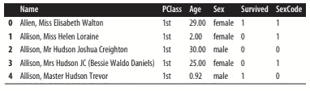

从结果中得到的启示:这里我们需要根据观察和特征来理解数据。

特征:姓名，P 级，年龄，性别，性别代码，幸存

观察:乘客信息

我们可以清楚地注意到，特征性别和性别代码持有相同的信息。我们希望我们的功能是独特的。所以我们可以移除任何一根柱子。

## 创建数据框

熊猫有许多创建新数据框的方法。

1.  要创建空数据框，请分别创建每一列

```
# Load library
import pandas as pd# Create DataFrame
dataframe = pd.DataFrame()# Add columns
dataframe[‘Name’] = [‘Jacky Jackson’, ‘Steven Stevenson’]
dataframe[‘Age’] = [38, 25]
dataframe[‘Driver’] = [True, False]# Show DataFrame
dataframe
```


在这里，我们可以通过以下方式将新行追加到底部

```
# Create row
new_person = pd.Series([‘Molly Mooney’, 40, True], index=[‘Name’,’Age’,’Driver’])# Append row
dataframe.append(new_person, ignore_index=True)
```

在熊猫中，我们有无数种方法来创建数据框。实际上，我们不能追加行来填充数据框。相反，我们有一个从其他来源的加载选项。

## 描述数据

我们可以看到数据帧的特征。

```
# Load library
import pandas as pd# Create URL
url = ‘[https://tinyurl.com/titanic-csv'](https://tinyurl.com/titanic-csv')# Load data
dataframe = pd.read_csv(url)# Show two rows
dataframe.head(2)
```

这里我们可以通过使用 head()看到前几行。为了知道数据集的维数，我们使用 shape 方法。

```
# Show dimensions
dataframe.shape
```

我们可以使用 describe()获得任何数字列的描述性统计信息。

```
# Show statistics
dataframe.describe()
```

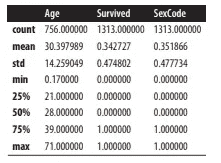

当我们加载数据时，我们可以了解它是如何构造的，以及它包含什么样的信息。我们可以抽取样本来查看小切片，并计算数据的汇总统计。

例如，如果目标要素幸存= 1，则表示乘客幸存。但是，对于分类特征来说，统计概要就没那么有用了。

## 导航数据框架

为了导航，我们可以使用 loc 或 iloc 通过一行或一个值

```
# Load library
import pandas as pd# Create URL
url = ‘[https://tinyurl.com//titanic-csv'](https://tinyurl.com//titanic-csv')# Load data
dataframe = pd.read_csv(url)# Select first row
dataframe.iloc[0]
```

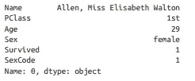

定义我们想要的一片行，比如选择第二、第三和第四行

```
# Select three rows
dataframe.iloc[1:4]
```

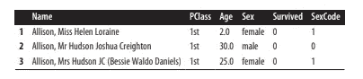

我们甚至可以用它来获取某一点之前的所有行，比如第四行之前的所有行

```
# Select three rows
dataframe.iloc[:4]
```

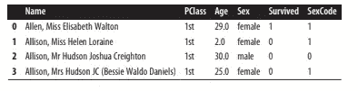

数据帧不需要数字索引。我们甚至可以更改用户定义的索引值，使每行都有一个唯一的值。

```
# Set index
dataframe = dataframe.set_index(dataframe[‘Name’])# Show row
dataframe.loc[‘Allen, Miss Elisabeth Walton’]
```

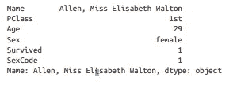

熊猫数据框中的每一行都有一个唯一的索引值。默认情况下，该索引号是一个整数。我们可以将它们更改为唯一的字母数字字符串或客户编号。为了选择单独的行和行的切片，pandas 提供了两种方法:

1.当数据帧的索引是一个标签(例如一个字符串)时，loc 是有用的

2.iloc 对于查看具有整数值的数据框中的位置非常有用。

## 基于条件选择行

我们可以从数据中选择所有女性

```
# Load library
import pandas as pd# Create URL
url = ‘[https://tinyurl.com/titanic-csv'](https://tinyurl.com/titanic-csv')# Load data
dataframe = pd.read_csv(url)# To get the top 2 rows where column ‘sex’ == ‘female’
dataframe[dataframe[‘Sex’] == ‘female’].head(2)
```

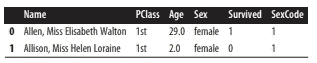

```
dataframe[‘Sex’] == ‘female’ is the conditional statement; by wrapping that in dataframe[] we can get “select all the rows in the DataFrame where the value of data frame[‘Sex’] is ‘female’.
```

我们也可以使用多个条件。我们可以选择乘客为 65 岁或以上女性的所有行。

```
# Filter rows
dataframe[(dataframe[‘Sex’] == ‘female’) & (dataframe[‘Age’] >= 65)]
```


有条件地选择和过滤数据是数据争论中最常见的任务。

## 替换值

在这里，我们可以将性别列中的任何“女性”实例替换为“女性”

```
# Load library
import pandas as pd# Create URL
url = ‘[https://tinyurl.com/titanic-csv'](https://tinyurl.com/titanic-csv')# Load data
dataframe = pd.read_csv(url)# Replace values, show two rows
dataframe[‘Sex’].replace(“female”, “Woman”).head(2)
```

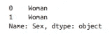

我们可以同时替换多个值。

```
# Replace “female” and “male with “Woman” and “Man” respectively in ‘sex’ column
dataframe[‘Sex’].replace([“female”, “male”], [“Woman”, “Man”]).head(5)
```

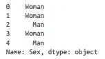

我们还可以通过指定整个数据框而不是单个列来查找和替换整个数据框对象:

```
# Replace values, show two rows
dataframe.replace(1, “One”).head(2)
```

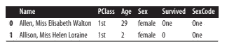

Replace 也接受正则表达式

```
# Replace values, show two rows
dataframe.replace(r”1st”, “First”, regex=True).head(2)
```

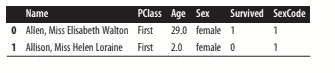

Replace()是一种简单但强大的接受正则表达式的能力。

## 重命名列

rename()将接受一个字典作为参数。我们可以使用字典一次改变多个列名。

```
# Load library
import pandas as pd# Create URL
url = ‘[https://tinyurl.com/titanic-csv'](https://tinyurl.com/titanic-csv')# Load data
dataframe = pd.read_csv(url)# Rename column, show two rows
dataframe.rename(columns={‘PClass’: ‘Passenger Class’}).head(2)
```

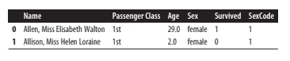

```
# Rename columns, show two rows
dataframe.rename(columns={‘PClass’: ‘Passenger Class’, ‘Sex’: ‘Gender’}).head(2)
```

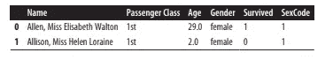

我们还可以用 dictionarys 的键-值对来改变列名。

```
# Load library
 import collections# Create dictionary
 column_names = collections.defaultdict(str)# Create keys
 for name in dataframe.columns:
 column_names[name]# Show dictionary
 column_names
```

## **查找最小值、最大值和其他特征。**

Pandas 提供 describe()方法，该方法给出描述性统计数据

```
# Load library
import pandas as pd# Create URL
url = ‘[https://tinyurl.com/titanic-csv'](https://tinyurl.com/titanic-csv')# Load data
dataframe = pd.read_csv(url)# Calculate statistics
print(‘Maximum:’, dataframe[‘Age’].max())
print(‘Minimum:’, dataframe[‘Age’].min())
print(‘Mean:’, dataframe[‘Age’].mean())
print(‘Sum:’, dataframe[‘Age’].sum())
print(‘Count:’, dataframe[‘Age’].count())
```

Pandas 提供了方差(var)、标准差(std)、峰度(kurt)、偏斜度(skew)、平均值的标准误差(sem)、众数(mode)、中位数(median)和许多其他值。

```
# Show counts
dataframe.count()
```

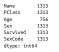

## 寻找独特的价值

Unique()用于查看数据集中某一列的所有唯一值的数组

```
# Load library
import pandas as pd# Create URL
url = ‘[https://tinyurl.com/titanic-csv'](https://tinyurl.com/titanic-csv')# Load data
dataframe = pd.read_csv(url)# Select unique values
dataframe[‘Sex’].unique()
```

或者，value_counts()将显示所有唯一值以及每个值在数据帧的选定列中出现的次数

```
# Show counts
dataframe[‘Sex’].value_counts()
```

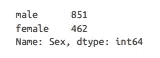

unique()和 value_counts()对于操作数据集中的分类列非常有用。

我们可以使用 nunique()获得所选列中唯一值的数量

```
# Show number of unique values
dataframe[‘PClass’].nunique()
```

## 处理缺失值

isnull()和 notnull()将返回一个布尔值，指示某个值是否缺失。

```
# Load library
import pandas as pd# Create URL
url = ‘[https://tinyurl.com/titanic-csv'](https://tinyurl.com/titanic-csv')# Load data
dataframe = pd.read_csv(url)# Select missing values, show two rows
dataframe[dataframe[‘Age’].isnull()].head(2)
```

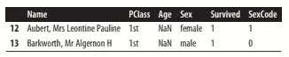

我们使用 Numpy 来处理缺失值。

```
# Load library
import numpy as np# Replace values with NaN
dataframe[‘Sex’] = dataframe[‘Sex’].replace(‘male’, np.nan)
```

## 删除列

Delete()用于删除参数 axis=1(即列轴)

```
# Load library
import pandas as pd# Create URL
url = ‘[https://tinyurl.com/titanic-csv'](https://tinyurl.com/titanic-csv')# Load data
dataframe = pd.read_csv(url)# Delete column
dataframe.drop(‘Age’, axis=1).head(2)
```

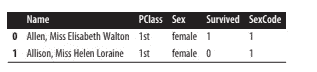

我们还可以通过指定列名来一次删除多个列

```
# Drop columns
dataframe.drop([‘Age’, ‘Sex’], axis=1).head(2)
```

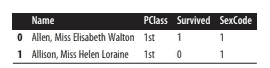

我们也可以通过指定 index 一次删除多个列

```
# Drop column
dataframe.drop(dataframe.columns[1], axis=1).head(2)
```

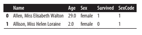

注意:不要使用 inplace=True 参数，许多 pandas 方法都包含一个 inplace 参数，当该参数为 True 时，将直接编辑数据帧。

## 结论

数据科学的基础来自基础学习。

我希望你喜欢这篇文章。通过我的 [LinkedIn](https://www.linkedin.com/in/data-scientist-95040a1ab/) 和 [twitter](https://twitter.com/amitprius) 联系我。

# 推荐文章

1.  [NLP——用 Python 零到英雄](https://medium.com/towards-artificial-intelligence/nlp-zero-to-hero-with-python-2df6fcebff6e?sk=2231d868766e96b13d1e9d7db6064df1)

2. [Python 数据结构数据类型和对象](https://medium.com/towards-artificial-intelligence/python-data-structures-data-types-and-objects-244d0a86c3cf?sk=42f4b462499f3fc3a160b21e2c94dba6)

3. [Python:零到英雄附实例](https://medium.com/towards-artificial-intelligence/python-zero-to-hero-with-examples-c7a5dedb968b?source=friends_link&sk=186aff630c2241aca16522241333e3e0)

4.[用 Python 全面讲解 SVM 分类](https://medium.com/towards-artificial-intelligence/fully-explained-svm-classification-with-python-eda124997bcd?source=friends_link&sk=da300d557992d67808746ee706269b2f)

5.[用 Python 全面解释 K-means 聚类](https://medium.com/towards-artificial-intelligence/fully-explained-k-means-clustering-with-python-e7caa573176a?source=friends_link&sk=9c5c613ceb10f2d203712634f3b6fb28)

6.[用 Python 全面解释线性回归](https://medium.com/towards-artificial-intelligence/fully-explained-linear-regression-with-python-fe2b313f32f3?source=friends_link&sk=53c91a2a51347ec2d93f8222c0e06402)

7.[用 Python 全面解释逻辑回归](https://medium.com/towards-artificial-intelligence/fully-explained-logistic-regression-with-python-f4a16413ddcd?source=friends_link&sk=528181f15a44e48ea38fdd9579241a78)

8.[Python 时间序列基础知识](https://medium.com/towards-artificial-intelligence/basic-of-time-series-with-python-a2f7cb451a76?source=friends_link&sk=09d77be2d6b8779973e41ab54ebcf6c5)

9. [NumPy:用 Python 零到英雄](https://medium.com/towards-artificial-intelligence/numpy-zero-to-hero-with-python-d135f57d6082?source=friends_link&sk=45c0921423cdcca2f5772f5a5c1568f1)

10.[机器学习中的混淆矩阵](https://medium.com/analytics-vidhya/confusion-matrix-in-machine-learning-91b6e2b3f9af?source=friends_link&sk=11c6531da0bab7b504d518d02746d4cc)