# 用 Python 处理数据——第 2 部分

> 原文：<https://pub.towardsai.net/data-wrangling-with-python-part-2-12165f68f372?source=collection_archive---------5----------------------->

## [数据科学](https://towardsai.net/p/category/data-science)，[编程](https://towardsai.net/p/category/programming)

## 数据科学中有用的转换方法


照片由[拍摄于](https://unsplash.com/@ffstop?utm_source=medium&utm_medium=referral) [Unsplash](https://unsplash.com?utm_source=medium&utm_medium=referral) 上的

## 删除一行

我们可以从数据框中删除一行或多行。在布尔条件的帮助下，我们可以创建一个新的数据框，排除我们想要删除的行。

```
# Load library
import pandas as pd# Create URL
url = ‘[https://tinyurl.com/titanic-csv'](https://tinyurl.com/titanic-csv')# Load data
dataframe = pd.read_csv(url)# Show the first two rows only with female 
dataframe[dataframe[‘Sex’] != ‘male’].head(2)
```

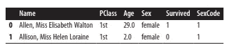

我们还可以使用类似 df.drop([0，1]，axis =0)的 drop 方法来删除前两行。更实用的方法是简单地将布尔条件包装在 df[]中。

```
dataframe[dataframe[‘Name’] != ‘Allison, Miss Helen
                                            Loraine’].head(2)
```

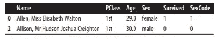

逐行索引删除单个行

```
# To see the first 2 rows after deleting a row
dataframe[dataframe.index != 0].head(2)
```

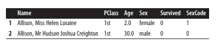[](/data-preprocessing-concepts-with-python-b93c63f14bb6) [## Python 中的数据预处理概念

### 一种为机器学习估值器准备数据的稳健方法

pub.towardsai.net](/data-preprocessing-concepts-with-python-b93c63f14bb6) [](/correlation-and-its-types-in-statistics-7a723dcfd12d) [## 统计学中的相关性及其类型

### 统计学有助于理解机器学习中的行为

pub.towardsai.net](/correlation-and-its-types-in-statistics-7a723dcfd12d) 

## 删除重复的行

要从数据框中删除重复行，请使用 drop_duplicates()

```
# Load library
import pandas as pd# Load data
dataframe = pd.read_csv(‘[titanic-csv](https://tinyurl.com/titanic-csv')’)# Drop duplicates show first two rows of output
dataframe.drop_duplicates().head(2)
```

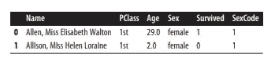

如果我们清楚地注意到，我们没有删除任何行()

```
# Show number of rows
print(“Length of an original data frame:”, len(dataframe))
print(“Number Of Rows After Deduping:”, len(dataframe.drop_duplicates()))
```

原因是 drop_duplicates()默认只删除所有列中匹配的行。数据框中的每一行都是唯一的。有时我们想只考虑列的子集来检查重复的行。

```
# Drop duplicates
dataframe.drop_duplicates(subset=[‘Sex’])
```

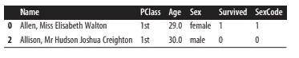

```
# Drop duplicates
dataframe.drop_duplicates(subset=[‘Sex’], keep=’last’)
```

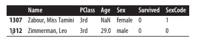

*drop_duplicates()* 默认情况下，保留重复行的第一个匹配项，删除列的其余部分。

*duplicate()*方法，返回表示一行是否重复的布尔序列。

## 按值对行进行分组

*group by()*是熊猫馆的一大特色。我们可以根据一些共享的值对单独的行进行分组。

```
# Load library
import pandas as pd# Create URL
url = ‘[https://tinyurl.com/titanic-csv'](https://tinyurl.com/titanic-csv')# Load data
dataframe = pd.read_csv(url)# calculating mean of group basis on 'sex' feature
dataframe.groupby(‘Sex’).mean()
```

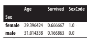

*groupby()* 在一个数据帧中非常常见，当我们像下面这样写单行的时候，返回类型就有点混乱了。

```
# Group rows
dataframe.groupby(‘Sex’)
```

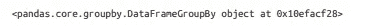

原因是 *groupby()* 需要与一个操作配对，该操作中应该有一些应用于组的内容，如计算聚合、总和、中值等。

为了返回有用的东西，我们可以如下应用 *count()*

```
# Group rows, count rows
dataframe.groupby(‘Survived’)[‘Name’].count()
```

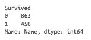

我们可以对第一列进行分组，然后通过第二列对该分组进行分组。

```
# Group rows, calculate mean
dataframe.groupby([‘Sex’,’Survived’])[‘Age’].mean()
```

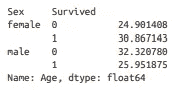

## 按时间对行进行分组

在 resample()的帮助下，我们可以按周期对单个行进行分组。

```
# Load libraries
import pandas as pd
import numpy as np# Create date range
time_index = pd.date_range(‘06/06/2017’, periods=100000, freq=’30S’)# Create DataFrame
dataframe = pd.DataFrame(index=time_index)# Create column of random values
dataframe[‘Sale_Amount’] = np.random.randint(1, 10, 100000)# calculating mean on the basis of per week
dataframe.resample(‘W’).sum()
```


标准的 titanic 数据集没有日期-时间列，所以我们可以创建一个简单的数据框，其中每一行都是单独的销售。

```
# Show three rows
dataframe.head(3)
```

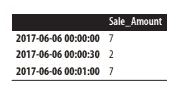

这里 *resample()* 要求索引是每次销售的日期时间值。

```
# Group by two weeks, calculate mean
dataframe.resample(‘2W’).mean()
```

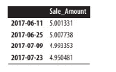

```
# Group by month, count rows
dataframe.resample(‘M’).count()
```

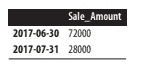

从这两个输出中，我们可以注意到日期时间索引是一个日期，尽管我们是按周和月分组的。原因是 *resample()* 会返回时间组右边“边缘”的标签。我们可以通过标注参数来缓解这种情况。

```
# Group by month, count rows
dataframe.resample(‘M’, label=’left’).count()
```

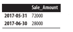[](/become-a-data-scientist-in-2021-with-these-following-steps-5bf70a0fe0a1) [## 按照以下步骤，在 2021 年成为一名数据科学家

### 走上数据科学家之路需要具备的基本点

pub.towardsai.net](/become-a-data-scientist-in-2021-with-these-following-steps-5bf70a0fe0a1) 

## 在列上循环

要迭代数据框中的每个元素，我们可以按顺序进行。

```
# Load library
import pandas as pd# Create URL
url = ‘[https://tinyurl.com/titanic-csv'](https://tinyurl.com/titanic-csv')# Load data
dataframe = pd.read_csv(url)# Print first two names uppercased
for name in dataframe[‘Name’][0:2]:
 print(name.upper())
```

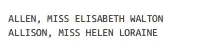

我们也可以使用列表理解来实现相同的功能，如下所示

```
# Show first two names uppercased
[name.upper() for name in dataframe[‘Name’][0:2]]
```

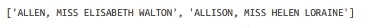

## 应用于所有列的元素的函数

如果我们希望对数据框中的所有元素应用某种函数，那么我们可以使用内置函数或自定义函数。

```
# Load library
import pandas as pd# Create URL
url = ‘[https://tinyurl.com/titanic-csv'](https://tinyurl.com/titanic-csv')# Load data
dataframe = pd.read_csv(url)# Create function
def uppercase(x):
 return x.upper()# Apply function, show two rows
dataframe[‘Name’].apply(uppercase)[0:2]
```

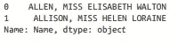

apply()是清理数据的好方法。我们可以编写一些有用的操作，如转换数据类型或重命名等。然后将该功能映射到数据集中的每个元素。

## 将函数应用于组

我们可以使用 groupby()和 apply()方法对行进行分组，并将函数应用于数据集中的每个元素

```
# Load library
import pandas as pd# Create URL
url = ‘[https://tinyurl.com/titanic-csv'](https://tinyurl.com/titanic-csv')# Load data
dataframe = pd.read_csv(url)# Group rows, apply function to groups
dataframe.groupby(‘Sex’).apply(lambda x: x.count())
```

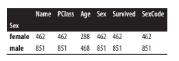

Apply()对组很有用，通过结合使用 apply()和 groupby()方法，我们可以计算自定义的统计数据。

我希望你喜欢这篇文章。通过我的 [LinkedIn](https://www.linkedin.com/in/data-scientist-95040a1ab/) 和 [twitter](https://twitter.com/amitprius) 联系我。

# 推荐文章

1.  [NLP —用 Python 从零到英雄](https://medium.com/towards-artificial-intelligence/nlp-zero-to-hero-with-python-2df6fcebff6e?sk=2231d868766e96b13d1e9d7db6064df1)

2. [Python 数据结构数据类型和对象](https://medium.com/towards-artificial-intelligence/python-data-structures-data-types-and-objects-244d0a86c3cf?sk=42f4b462499f3fc3a160b21e2c94dba6)

3. [Python:零到英雄附实例](https://medium.com/towards-artificial-intelligence/python-zero-to-hero-with-examples-c7a5dedb968b?source=friends_link&sk=186aff630c2241aca16522241333e3e0)

4.[用 Python 全面讲解 SVM 分类](https://medium.com/towards-artificial-intelligence/fully-explained-svm-classification-with-python-eda124997bcd?source=friends_link&sk=da300d557992d67808746ee706269b2f)

5.[用 Python 全面解释 K-means 聚类](https://medium.com/towards-artificial-intelligence/fully-explained-k-means-clustering-with-python-e7caa573176a?source=friends_link&sk=9c5c613ceb10f2d203712634f3b6fb28)

6.[用 Python 全面解释线性回归](https://medium.com/towards-artificial-intelligence/fully-explained-linear-regression-with-python-fe2b313f32f3?source=friends_link&sk=53c91a2a51347ec2d93f8222c0e06402)

7.[用 Python 全面解释逻辑回归](https://medium.com/towards-artificial-intelligence/fully-explained-logistic-regression-with-python-f4a16413ddcd?source=friends_link&sk=528181f15a44e48ea38fdd9579241a78)

8.[Python 时间序列基础](https://medium.com/towards-artificial-intelligence/basic-of-time-series-with-python-a2f7cb451a76?source=friends_link&sk=09d77be2d6b8779973e41ab54ebcf6c5)

9. [NumPy:用 Python 零到英雄](https://medium.com/towards-artificial-intelligence/numpy-zero-to-hero-with-python-d135f57d6082?source=friends_link&sk=45c0921423cdcca2f5772f5a5c1568f1)

10.[机器学习中的混淆矩阵](https://medium.com/analytics-vidhya/confusion-matrix-in-machine-learning-91b6e2b3f9af?source=friends_link&sk=11c6531da0bab7b504d518d02746d4cc)