# Databricks Community Edition 升级到付费计划 AWS 设置

> 原文：<https://pub.towardsai.net/databricks-community-edition-upgrade-to-paid-plan-aws-setup-33c00db7f91e?source=collection_archive---------2----------------------->

## 如何注册免费的 Databricks 社区版，使用 AWS 升级到付费计划，以及监控 Databricks 和 AWS 成本

约书亚·索蒂诺在 [Unsplash](https://unsplash.com?utm_source=medium&utm_medium=referral) 上拍摄的照片

Databricks 有免费的社区版和不同的付费计划。付费计划可以与 AWS、微软 Azure 或谷歌云集成。本教程涵盖:

*   如何注册免费的 Databricks 社区版？
*   如何使用 AWS 升级到付费计划？
*   如何监控 Databricks 和 AWS 成本？

要了解如何直接注册 14 天全面试用并设置 AWS，请参考我的教程 [Databricks AWS 帐户设置](https://grabngoinfo.com/databricks-aws-account-setup/)。

**本帖资源:**

*   YouTube[上这篇文章的视频教程](https://www.youtube.com/watch?v=5emvkOAgblM&list=PLVppujud2yJrb5CCEu0gqgI_W0YuCygIc&index=6)
*   关于 [Databricks 和 PySpark 的更多视频教程](https://www.youtube.com/playlist?list=PLVppujud2yJrb5CCEu0gqgI_W0YuCygIc)
*   更多关于 [Databricks 和 PySpark 的博客文章](https://medium.com/@AmyGrabNGoInfo/list/databricks-and-pyspark-7b59768e202d)

我们开始吧！

# 步骤 1: Databricks 免费社区版注册

要注册 Databricks 免费社区版，请前往[https://community.cloud.databricks.com](https://community.cloud.databricks.com)并点击蓝色**注册**。

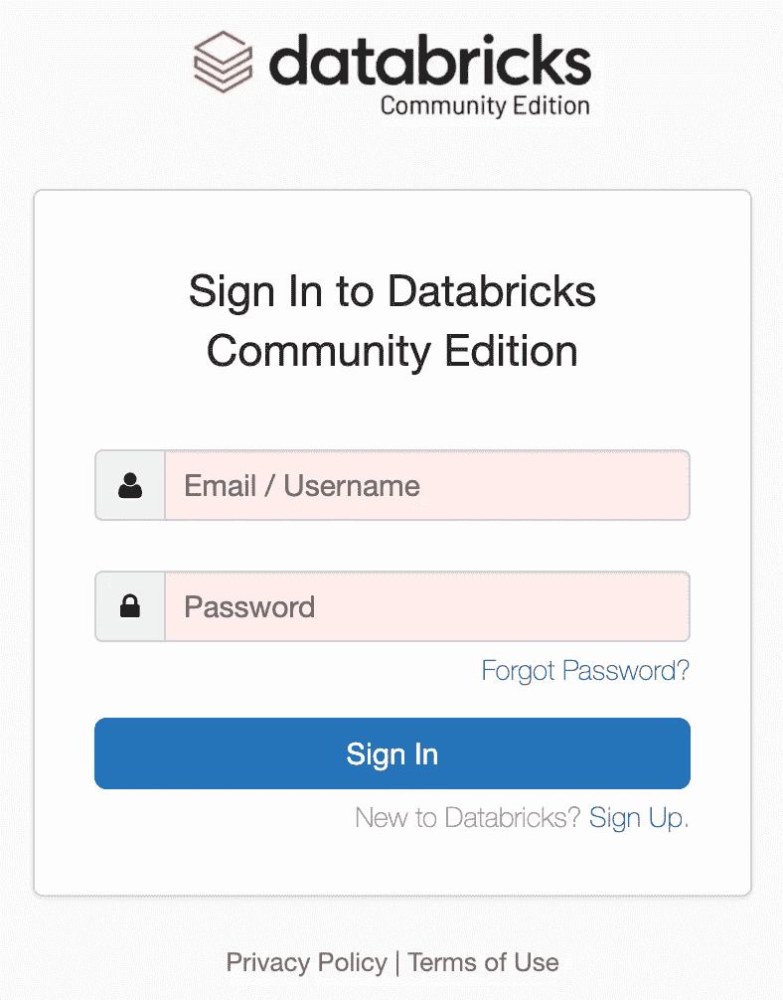

Databricks 免费社区版注册—图片来自 GrabNGoInfo.com

填写表格并点击橙色的**免费开始**按钮。

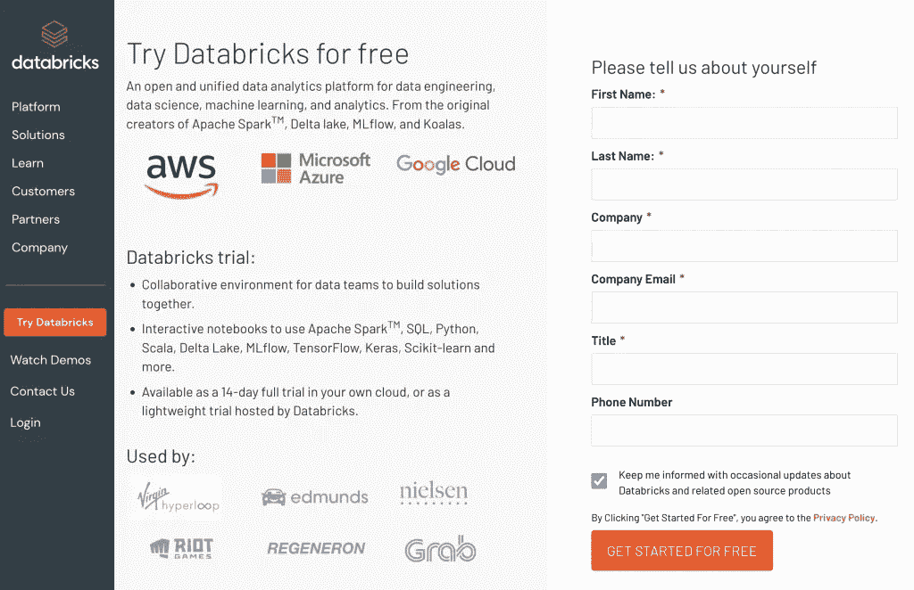

试试 Databricks 表单——来自 GrabNGoInfo.com 的图像

在**选择云提供商**页面，点击**开始使用社区版**。

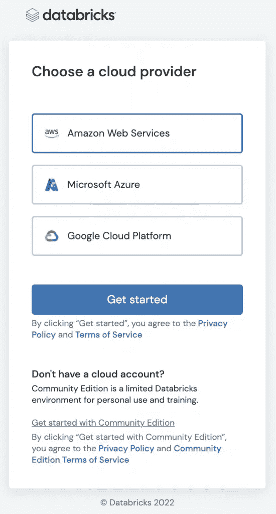

Databricks 注册社区版—图片来自 GrabNGoInfo.com

将弹出一个验证窗口。点击**验证**。完成验证后，您将被要求验证您的电子邮件。

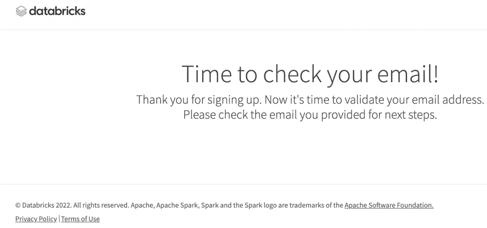

Databricks 注册电子邮件验证—图片来自 GrabNGoInfo.com

一封标题为“**欢迎来到 Databricks！请确认您的电子邮件地址**”将从 Databricks 发送到您的电子邮件中。单击电子邮件中的链接会将您带到一个设置密码的页面。

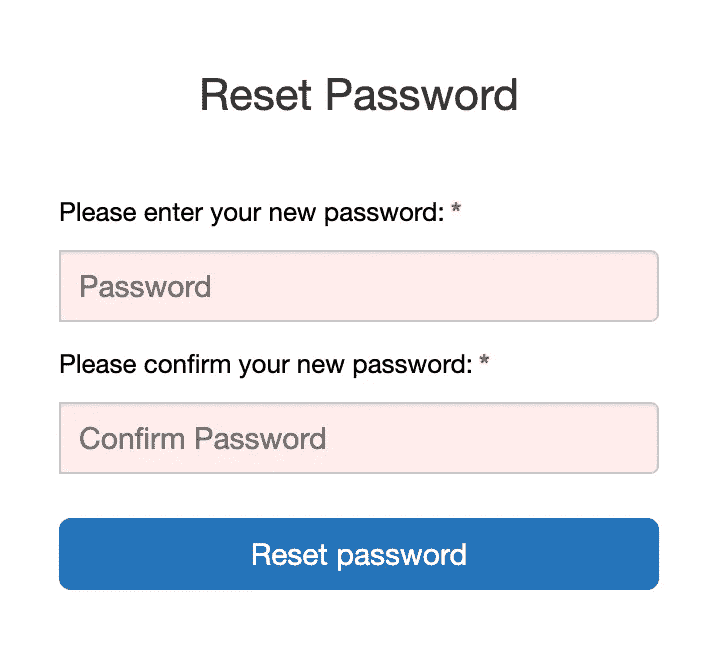

Databricks 注册社区版重置密码—图片来自 GrabNGoInfo.com

设置密码后，会看到 Databricks 主页，免费社区版已经可以使用了！

# 步骤 2: Databricks 付费计划选择

Databricks 免费社区版拥有大多数常用的功能，但也有一些功能只适用于付费计划。例如，只有付费计划拥有工作空间、集群、池、作业和表访问控制。

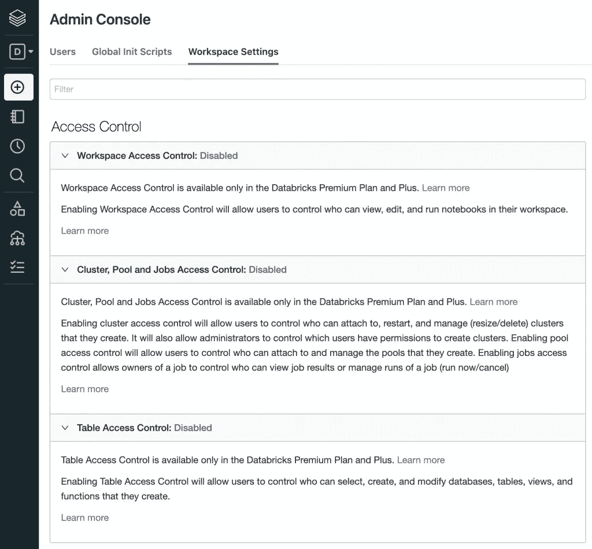

数据块只有付费计划才有工作区、集群、池、作业和表访问控制——图片来自 GrabNGoInfo.com

当需要使用社区版中没有的功能时，我们可以升级到付费计划。

若要切换到付费计划，请点按页面左下角的“设置”,然后点按“管理帐户”。

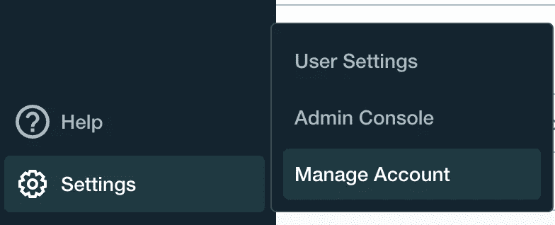

Databricks 管理帐户—图片来自 GrabNGoInfo.com

我们需要重新登录以管理该帐户。

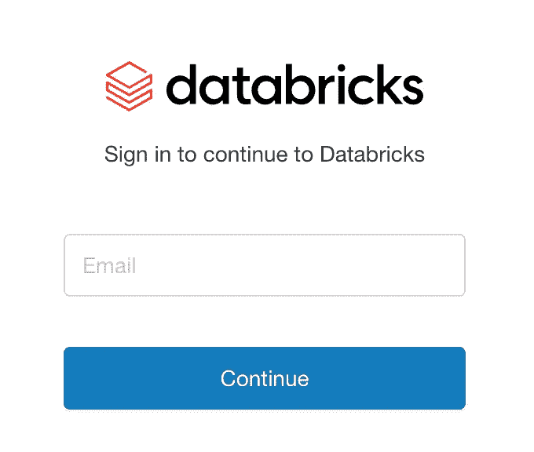

数据砖块登录管理帐户-图片来自 GrabNGoInfo.com

登录帐户后，就该选择订阅计划了。

*   **标准**计划为数据分析和机器学习工作负载提供了一个基础平台。它无权访问数据块 SQL、自动缩放和基于角色的访问控制。
*   **高级**计划可访问数据块 SQL、云原生安全性和自动扩展。这是最受欢迎的计划。
*   **企业**计划为关键任务数据提供高级合规性和安全性。它通常被大公司使用。

我们选择了高级计划，因为它具有数据科学和机器学习项目的所有常用功能。

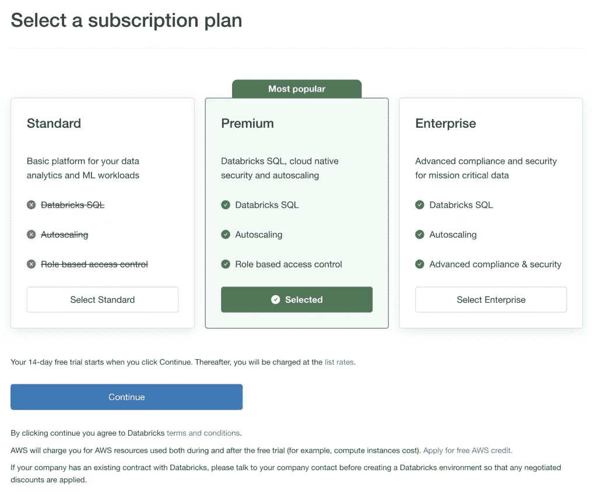

数据块选择订阅计划—图片来自 GrabNGoInfo.com

点击蓝色的**继续**按钮开始 14 天的免费试用。点击蓝色的**列表价格**，即可获得免费试用后的价格。

# 步骤 3:数据块工作空间设置

单击蓝色的**继续**按钮后，我们可以看到一个关于帐户、工作区和工具结构的页面。

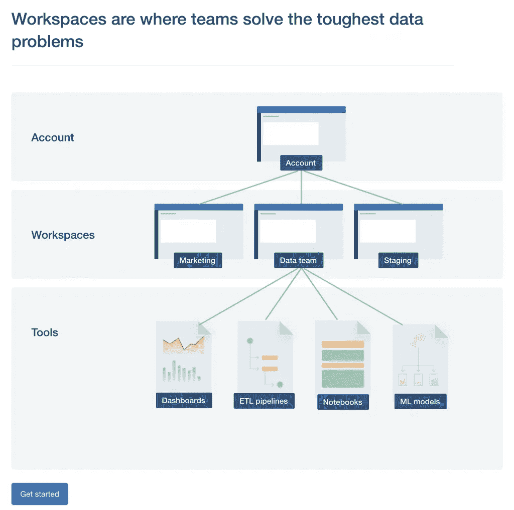

数据块帐户、工作空间和工具结构—来自 GrabNGoInfo.com 的图片

点击蓝色**开始**按钮后，我们需要确认:

*   已经创建了一个 AWS 帐户。
*   我们有了新创建的 Databricks 帐户的密码。
*   我们已经想好了工作区的名字。

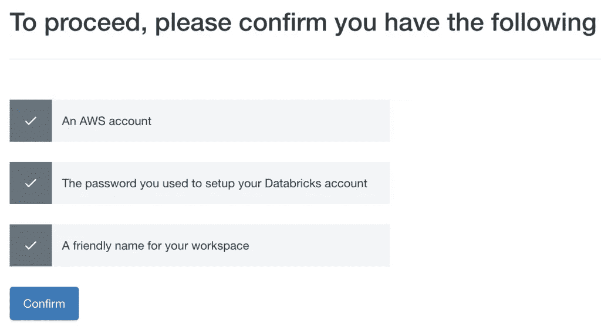

Databricks 工作空间要求—图片来自 GrabNGoInfo.com

如果三个项目都有，点击蓝色的**确认**按钮。

现在是时候设置第一个工作区了！为您的工作区命名，并从下拉列表中选择一个 AWS 区域。

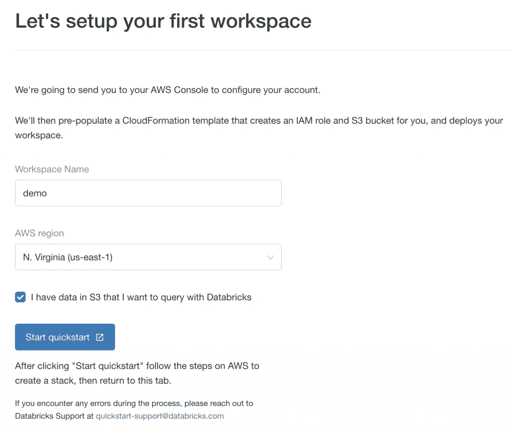

Databricks 为您的工作区命名，并选择一个 AWS 区域—来自 GrabNGoInfo.com 的图像

单击蓝色的“Start quickstart”按钮后，将打开一个 Databricks 工作区页面。

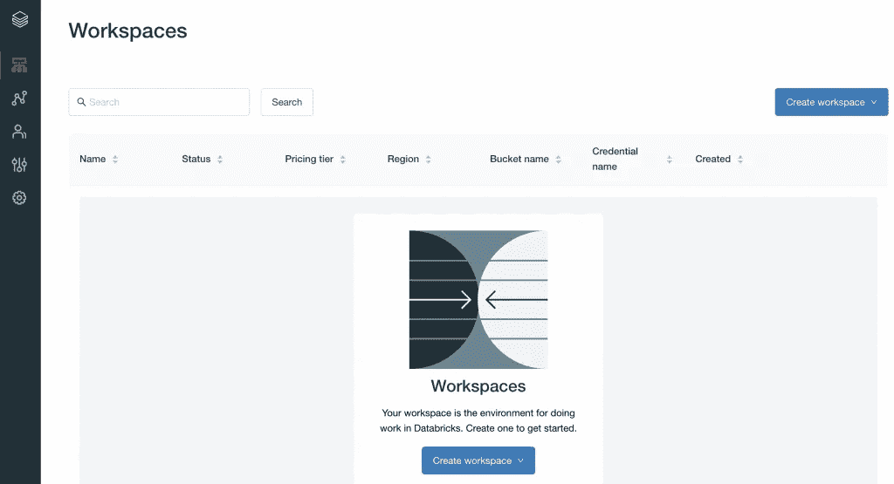

Databricks 工作区页面—图片来自 GrabNGoInfo.com

# 步骤 4: AWS 帐户设置

AWS 控制台中会打开一个新的日志记录选项卡。我们将进行 AWS 设置，然后返回到 Databricks 工作区页面。

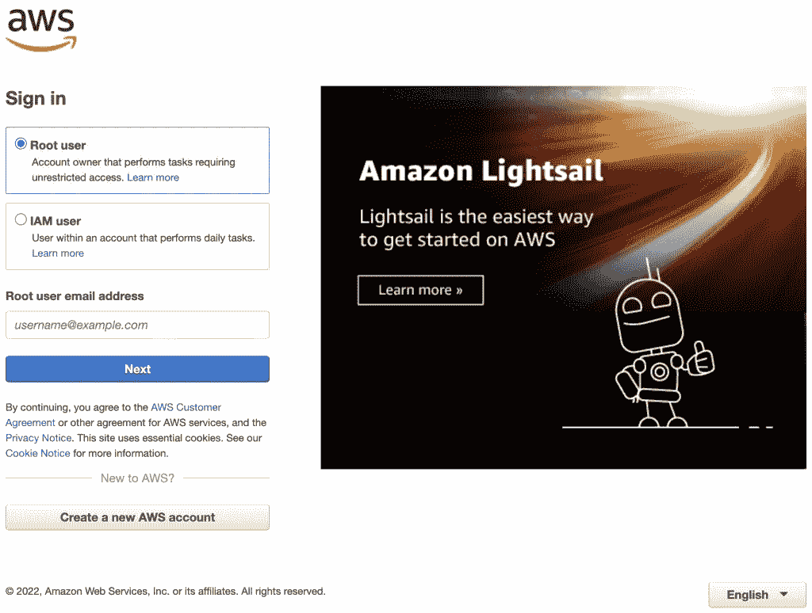

登录 AWS 控制台—图片来自 GrabNGoInfo.com

登录 AWS 帐户后，我们将创建一个堆栈。创建堆栈的大部分信息已经预先填充。需要输入 Databricks 帐户密码。

为数据块创建一个堆栈—来自 GrabNGoInfo.com 的图像

在“工作区配置”下，如果数据时段名称未预先填充，请输入星号(*)以访问任何 S3 时段中的数据。

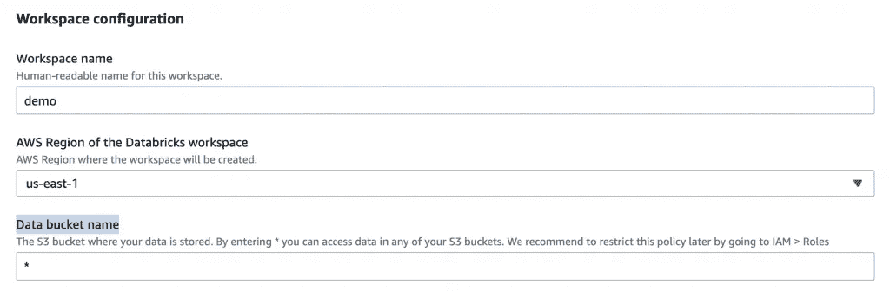

数据存储桶名称—图片来自 GrabNGoInfo.com

滚动到页面的末尾，在**功能**下，勾选**我承认 AWS CloudFormation 可能会创建具有自定义名称的 IAM 资源。**"并点击橙色的**创建堆栈**按钮。

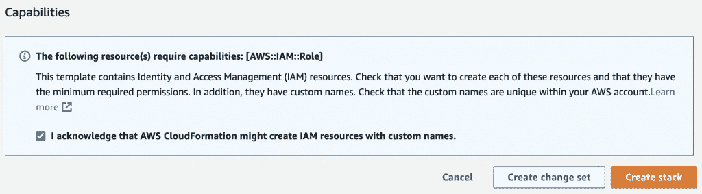

创建堆栈—来自 GrabNGoInfo.com 的图像

状态显示**创建进行中**。

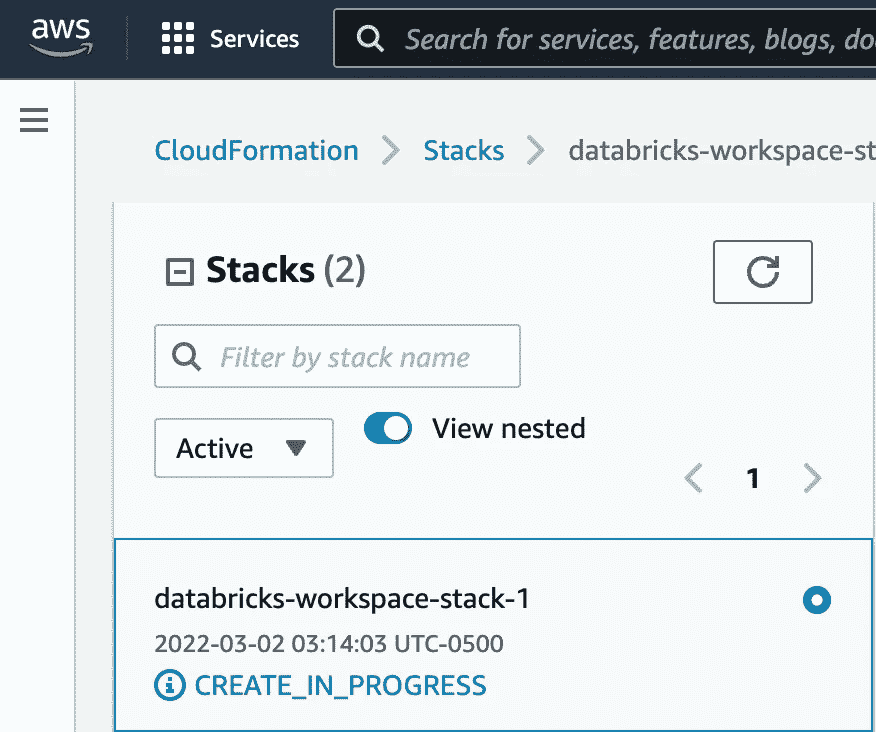

正在创建堆栈—图片来自 GrabNGoInfo.com

当堆栈创建完成时，状态变为 **CREATE_COMPLETE** 。

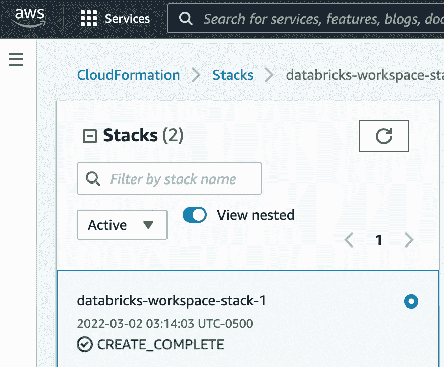

堆栈创建完成—来自 GrabNGoInfo.com 的图像

# 步骤 5: Databricks 工作区登录

现在，让我们返回到 Databricks 工作区页面。我们可以看到名为“demo”的工作区被创建。

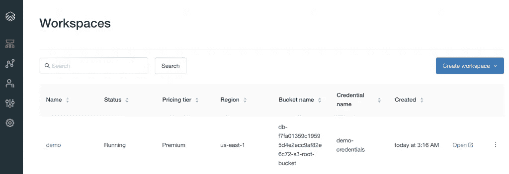

Databricks 工作空间已创建—图片来自 GrabNGoInfo.com

点击蓝色字**打开**将打开一个新的选项卡，用于登录数据块。

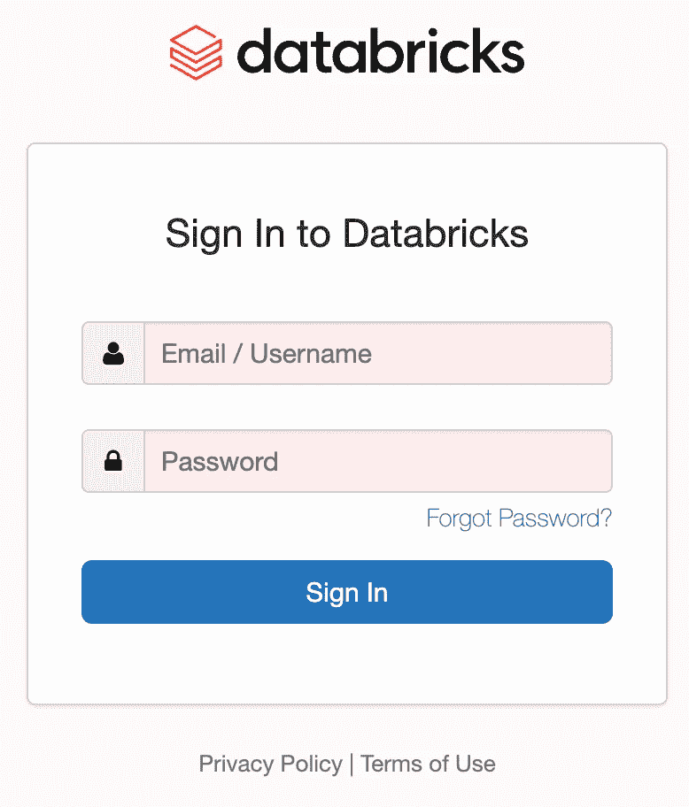

数据块登录—图片来自 GrabNGoInfo.com

输入用户名和密码后，我们将看到 Databricks 主页。在页面的右上角，有一条信息“免费试用 14 天后结束。请提供您的帐单信息，继续使用现收现付套餐。

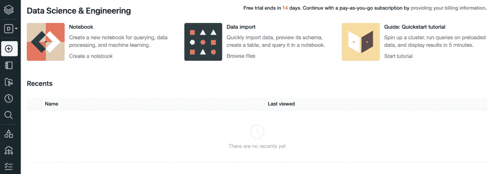

Databricks 主页——图片来自 GrabNGoInfo.com

Databricks 现在已成功连接到高级计划的 AWS 帐户！

# 步骤 6:验证当前计划并添加账单信息

要验证计划选择和 AWS 账户连接，点击页面左下角的**设置**，然后点击**管理账户**。

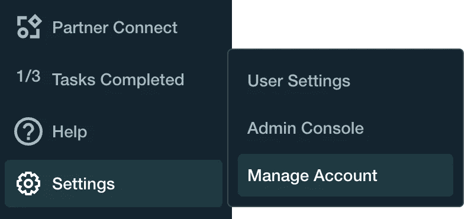

Databricks 管理帐户—图片来自 GrabNGoInfo.com

我们需要重新登录以管理该帐户。

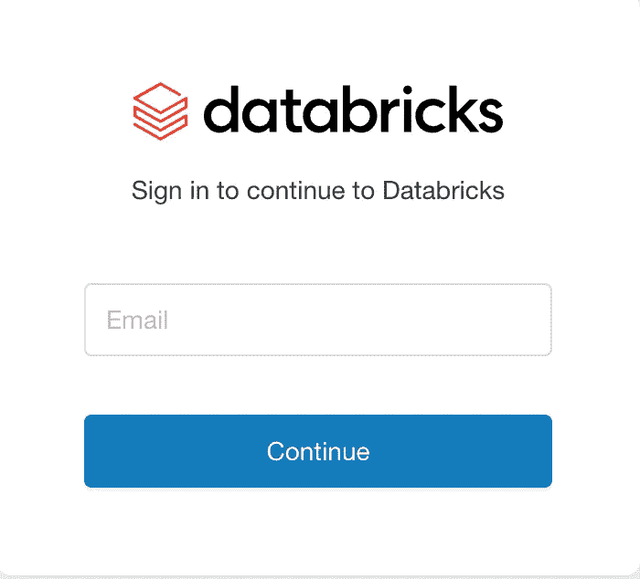

Databricks 登录—图片来自 GrabNGoInfo.com

转到左侧的**设置**档位图标，我们可以看到当前计划是 Premium。我们可以在这里添加账单信息。

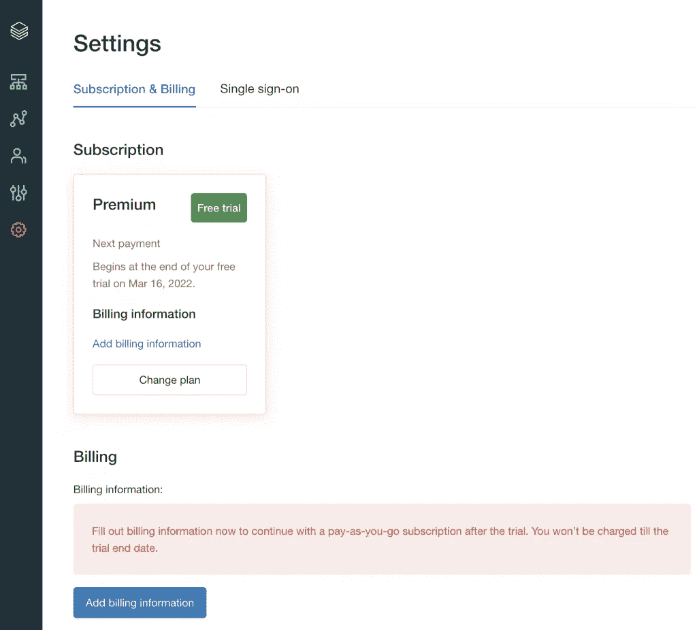

Databricks 订阅和计费—图片来自 GrabNGoInfo.com

# 步骤 7:跟踪 DBU 和 AWS 的成本

要查看 DBU 的使用情况和成本，请单击左侧的使用图标。

来自 GrabNGoInfo.com 的 Databricks DBU 使用和成本图片

需要在 AWS 账户中监控 AWS 成本。请按照我以前的教程 [AWS 成本控制使用预算监控警报](https://grabngoinfo.com/aws-cost-control-using-budget-monitor-alert/)来监控 AWS 成本。

# 摘要

在本教程中，您学习了:

*   如何注册免费的 Databricks 社区版？
*   如何使用 AWS 升级到付费计划？
*   如何监控 Databricks 和 AWS 成本？

更多教程可在 GrabNGoInfo [YouTube 频道](https://www.youtube.com/channel/UCmbA7XB6Wb7bLwJw9ARPcYg)和 GrabNGoInfo.com[网站](https://grabngoinfo.com/tutorials/)上获得

# 推荐教程

*   [GrabNGoInfo 机器学习教程盘点](https://medium.com/grabngoinfo/grabngoinfo-machine-learning-tutorials-inventory-9b9d78ebdd67)
*   [使用预算监控预警的 AWS 成本控制](https://medium.com/mlearning-ai/aws-cost-control-using-budget-monitor-alert-edf909a83205)
*   [将数据块安装到 AWS S3 并导入数据](https://medium.com/grabngoinfo/databricks-mount-to-aws-s3-and-import-data-4100621a63fd)
*   [Databricks 笔记本降价备忘单](https://grabngoinfo.com/databricks-notebook-markdown-cheat-sheet/)
*   [在数据块中创建表格的五种方法](https://grabngoinfo.com/five-ways-to-create-tables-in-databricks/)
*   [面向大数据的 Databricks 仪表盘](https://grabngoinfo.com/databricks-dashboard-for-big-data/)

 [## 通过我的推荐链接加入媒体-艾米 GrabNGoInfo

### 作为一个媒体会员，你的会员费的一部分会给你阅读的作家，你可以完全接触到每一个故事…

medium.com](https://medium.com/@AmyGrabNGoInfo/membership)