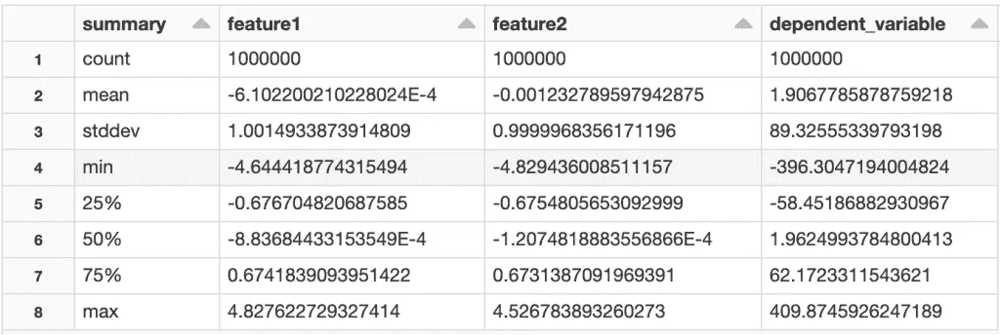
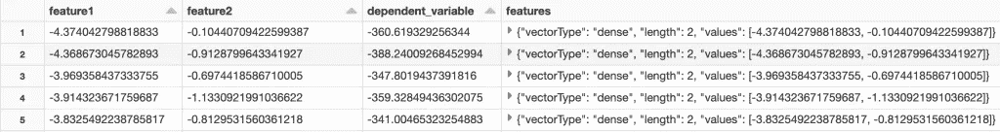
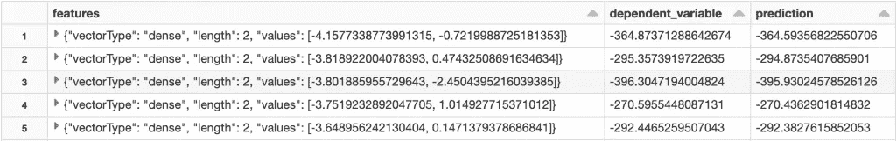
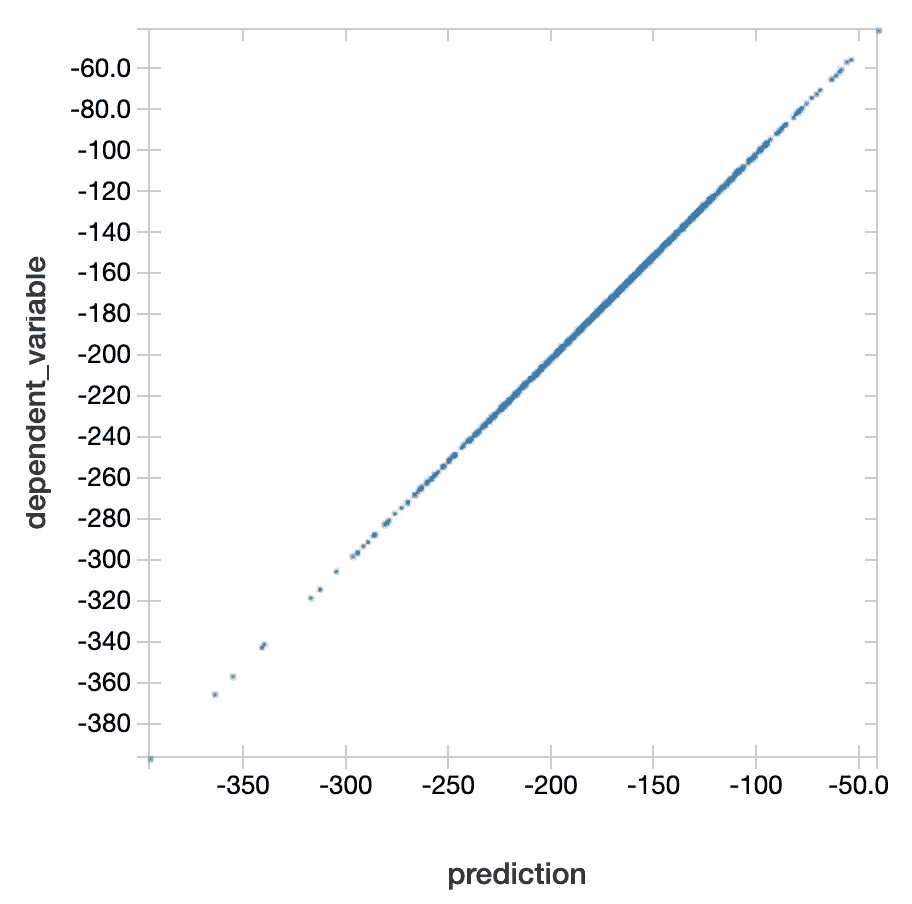
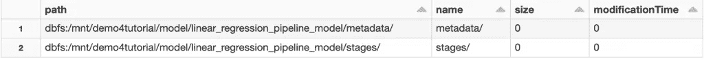

# 带 Spark ML 的数据块线性回归

> 原文：<https://pub.towardsai.net/databricks-linear-regression-with-spark-ml-6240180784e3?source=collection_archive---------0----------------------->

## 如何处理数据，拟合 Spark ML 线性回归模型，评估模型性能，保存模型，对新数据进行预测？


照片由 [Atharva Tulsi](https://unsplash.com/@atharva_tulsi?utm_source=medium&utm_medium=referral) 在 [Unsplash](https://unsplash.com?utm_source=medium&utm_medium=referral) 上拍摄

Apache Spark 为不同类型的机器学习模型提供了一个库。在本教程中，我们将讨论如何使用 Databricks 来实现 spark ML 线性回归模型。我们将涵盖:

*   Spark MLlib 和 Spark ML 有什么区别？
*   如何以正确的格式处理数据？
*   如何拟合一个 Spark ML 线性回归模型？
*   如何评价模型性能？
*   如何保存模型？
*   如何对新数据进行预测？

**本帖资源:**

*   YouTube 上这篇文章的视频教程
*   点击[此处](https://mailchi.mp/d093169f09b0/9a8dt5scel)查看数据砖笔记本
*   关于 [Databricks 和 PySpark 的更多视频教程](https://www.youtube.com/playlist?list=PLVppujud2yJrb5CCEu0gqgI_W0YuCygIc)
*   更多关于 [Databricks 和 PySpark](https://medium.com/@AmyGrabNGoInfo/list/databricks-and-pyspark-7b59768e202d) 的博客文章

我们开始吧！

# 步骤 0: Spark MLlib 与 Spark ML

首先说一下 spark MLlib 和 spark ML 的区别。

`spark.mllib`传统的机器学习 API 是建立在 RDDs 之上的吗？`spark.ml`是基于 dataframe 的新机器学习 API。

MLlib 这个名称包括基于 RDD 的 API 和基于数据帧的 API。基于 RDD 的 API 现在处于维护模式，所以不会有新的特性添加到基于 RDD 的 API 中。

在本教程中，我们将使用基于 dataframe 的 API，我建议您也使用它。

# 步骤 1:导入库

在步骤 1 中，我们将导入库。`pandas`是进行数据处理。`make_regression`用于创建合成建模数据集。

从 pyspark.ml 库中，我们导入了用于特征格式化的`VectorAssembler`、用于模型训练的`LinearRegression`、用于模型评估的`RegressionEvaluator`、用于管道创建和加载的`Pipeline`和`PipelineModel`。

```
# Data processing
import pandas as pd# Create synthetic dataset
from sklearn.datasets import make_regression# Modeling
from pyspark.ml.feature import VectorAssembler
from pyspark.ml.regression import LinearRegression
from pyspark.ml.evaluation import RegressionEvaluator
from pyspark.ml import Pipeline, PipelineModel
```

# 步骤 2:为线性回归创建数据集

在步骤 2 中，我们将为线性回归模型创建一个合成数据集。

使用`make_regression`，创建了一个包含一百万条记录的数据集。数据集有两个特征，偏差为 2，一个数字相关变量和 30%的噪声。random_state 确保随机创建的数据集是可重复的。随机状态不一定是 42。它可以是任何数字。

`make_regression`的输出是数组格式。我们把它转换成熊猫数据帧，然后再转换成火花数据帧。

`summary()`给出了数据集的汇总统计数据。

```
# Create a synthetic dataset
X, y = make_regression(n_samples=1000000, n_features=2, noise=0.3, bias=2, random_state=42)# Convert the data from numpy array to a pandas dataframe
pdf = pd.DataFrame({'feature1': X[:, 0], 'feature2': X[:, 1], 'dependent_variable': y})# Convert pandas dataframe to spark dataframe
sdf = spark.createDataFrame(pdf)# Check data summary statistics
display(sdf.summary())
```



来自 GrabNGoInfo.com 的合成数据图像的汇总统计

# 步骤 3:训练测试分割

在创建建模数据集之后，在步骤 3 中，我们将进行训练测试分割。

使用`randomSplit`，我们将数据集分成 80%的训练和 20%的验证。`seed=42`使随机分割结果可重复。但是，我们需要确保在复制分割时使用相同的集群和分区号。

```
# Train test split
trainDF, testDF = sdf.randomSplit([.8, .2], seed=42)# Print the number of records
print(f'There are {trainDF.cache().count()} records in the training dataset.')
print(f'There are {testDF.cache().count()} records in the testing dataset.')
```

分割后，我们在训练数据集中得到 800，299，在测试数据集中得到 199，701。

```
There are 800299 records in the training dataset.
There are 199701 records in the testing dataset.
```

# 步骤 4:矢量汇编程序

线性回归需要一个矢量输入作为特征，因此在第 4 步中，我们将使用 VectorAssembler 将特征转换为矢量格式。

```
# Linear regression expect a vector input
vecAssembler = VectorAssembler(inputCols=['feature1', 'feature2'], outputCol="features")
vecTrainDF = vecAssembler.transform(trainDF)# Take a look at the data
display(vecTrainDF)
```

我们可以看到，在新创建的名为“features”的列中，这两个特性以矢量格式列出。



Databricks Spark ML 特征格式—图片来自 GrabNGoInfo.com

# 步骤 5:拟合 Spark ML 线性回归模型

在第 5 步中，我们将拟合线性回归模型。

首先，为线性回归指定特征列和标注列。

然后，在矢量化的训练数据集上拟合线性回归模型。

之后，打印模型截距和系数。

```
# Create linear regression
lr = LinearRegression(featuresCol="features", labelCol="dependent_variable")# Fit the linear regresssion model
lrModel = lr.fit(vecTrainDF)# Print model intercept and coefficients
print(f'The intercept of the model is {lrModel.intercept:.2f} and the coefficients of the model are {lrModel.coefficients[0]:.2f} and {lrModel.coefficients[1]:.2f}')
```

我们可以看到，该模型的截距为 2，两个特征的系数分别为 82.09 和 35.03。

```
The intercept of the model is 2.00 and the coefficients of the model are 82.09 and 35.03
```

或者，我们可以创建一个管道，并在管道上安装模型。流水线通常包括数据处理步骤和模型拟合步骤。

```
# Create pipeline
stages = [vecAssembler, lr]
pipeline = Pipeline(stages=stages)# Fit the pipeline model
pipelineModel = pipeline.fit(trainDF)
```

# 步骤 6:模型性能评估

在步骤 6 中，我们将使用测试数据集评估模型性能。

为了进行模型性能评估，我们需要首先对测试数据集进行预测。使用上一步中创建的`pipelineModel`，我们可以用一行代码转换测试数据集并做出预测。

```
# Make predictions on testing dataset
predDF = pipelineModel.transform(testDF)# Take a look at the output
display(predDF.select("features", "dependent_variable", "prediction"))
```



Databricks Spark ML 车型性能评估—图片来自 GrabNGoInfo.com

获得预测值后，我们将预测列名和实际值列名传递到`RegressionEvaluator`。

`metricName`可以是下列值之一:

*   `rmse`:均方根误差为默认值
*   `mse`:均方误差
*   `r2` : R 方形
*   `mae`:平均绝对误差

```
# Create regression evaluator
regressionEvaluator = RegressionEvaluator(predictionCol="prediction", labelCol="dependent_variable", metricName="rmse")# RMSE
rmse = regressionEvaluator.evaluate(predDF)
print(f"The RMSE for the linear regression model is {rmse:0.2f}")# MSE
mse = regressionEvaluator.setMetricName("mse").evaluate(predDF)
print(f"The MSE for the linear regression model is {mse:0.2f}")# R2
r2 = regressionEvaluator.setMetricName("r2").evaluate(predDF)
print(f"The R2 for the linear regression model is {r2:0.2f}")# MAE
mae = regressionEvaluator.setMetricName("mae").evaluate(predDF)
print(f"The MAE for the linear regression model is {mae:0.2f}")
```

输出

```
The RMSE for the linear regression model is 0.30
The MSE for the linear regression model is 0.09
The R2 for the linear regression model is 1.00
The MAE for the linear regression model is 0.24
```

我们还可以创建一个散点图来直观地检查实际值和预测值之间的关系。要了解如何使用 Databricks 笔记本中的内置图表功能，请查看我之前关于[Data bricks Dashboard For Big Data](https://grabngoinfo.com/databricks-dashboard-for-big-data/)的教程。



Databricks Spark ML 线性回归实际值与预测值——图片来自 GrabNGoInfo.com

# 步骤 7:保存模型

在第 7 步中，我们将把管道模型保存到 AWS S3 存储桶中。要了解如何将 S3 铲斗安装到数据块，请查看我以前的教程[数据块安装到 AWS S3 和导入数据](https://grabngoinfo.com/databricks-mount-to-aws-s3-and-import-data/)。

```
# Path to save the model
pipelinePath = '/mnt/demo4tutorial/model/linear_regression_pipeline_model'# Save the model to the path
pipelineModel.write().overwrite().save(pipelinePath)
```

在将模型保存到 S3 后，我们可以使用`%fs ls`命令确认模型在桶中。

```
# Confirm the model is saved
%fs ls '/mnt/demo4tutorial/model/linear_regression_pipeline_model'
```

我们可以看到，为模型保存了管道阶段和元数据。



Databricks Spark ML 存储模型—图片来自 GrabNGoInfo.com

# 步骤 8:对新数据进行预测

在第 8 步中，我们将回顾如何使用保存的模型对新数据进行预测。

我们首先创建一个包含 1000 条记录的新数据集。特征的数量、偏差和噪声与训练数据集相同，以确保新数据集遵循相同的分布。

```
# Create a new synthetic dataset
X_new, y_new = make_regression(n_samples=1000, n_features=2, bias=2, noise=0.3, random_state=0)# Convert the data from numpy array to a pandas dataframe
pdf_new = pd.DataFrame({'feature1': X_new[:, 0], 'feature2': X_new[:, 1], 'dependent_variable': y_new})# Convert pandas dataframe to spark dataframe
sdf_new = spark.createDataFrame(pdf_new)# Check data summary statistics
display(sdf_new.summary())
```

然后，从 S3 桶加载管道模型，并对新数据集进行预测。

```
# Load the saved model
loadedPipelineModel = PipelineModel.load(pipelinePath)# Make prediction for the new dataset
predDF_new = loadedPipelineModel.transform(sdf_new)# Take a look at the data
display(predDF_new.select("features", "dependent_variable", "prediction"))
```

# 步骤 9:将所有代码放在一起

```
###### Step 1: Import Libraries# Data processing
import pandas as pd# Create synthetic dataset
from sklearn.datasets import make_regression# Modeling
from pyspark.ml.feature import VectorAssembler
from pyspark.ml.regression import LinearRegression
from pyspark.ml.evaluation import RegressionEvaluator
from pyspark.ml import Pipeline, PipelineModel ###### Step 2: Create Dataset For Linear Regression# Create a synthetic dataset
X, y = make_regression(n_samples=1000000, n_features=2, noise=0.3, bias=2, random_state=42)# Convert the data from numpy array to a pandas dataframe
pdf = pd.DataFrame({'feature1': X[:, 0], 'feature2': X[:, 1], 'dependent_variable': y})# Convert pandas dataframe to spark dataframe
sdf = spark.createDataFrame(pdf)# Check data summary statistics
display(sdf.summary()) ###### Step 3: Train Test Split# Train test split
trainDF, testDF = sdf.randomSplit([.8, .2], seed=42)# Print the number of records
print(f'There are {trainDF.cache().count()} records in the training dataset.')
print(f'There are {testDF.cache().count()} records in the testing dataset.') ###### Step 4: Vector Assembler# Linear regression expect a vector input
vecAssembler = VectorAssembler(inputCols=['feature1', 'feature2'], outputCol="features")
vecTrainDF = vecAssembler.transform(trainDF)# Take a look at the data
display(vecTrainDF) ###### Step 5: Fit Spark ML Linear Regression Model# Create linear regression
lr = LinearRegression(featuresCol="features", labelCol="dependent_variable")# Fit the linear regresssion model
lrModel = lr.fit(vecTrainDF)# Print model intercept and coefficients
print(f'The intercept of the model is {lrModel.intercept:.2f} and the coefficients of the model are {lrModel.coefficients[0]:.2f} and {lrModel.coefficients[1]:.2f}')# Create pipeline
stages = [vecAssembler, lr]
pipeline = Pipeline(stages=stages)# Fit the pipeline model
pipelineModel = pipeline.fit(trainDF) ###### Step 6: Model Performance Evaluation# Make predictions on testing dataset
predDF = pipelineModel.transform(testDF)# Take a look at the output
display(predDF.select("features", "dependent_variable", "prediction"))# Create regression evaluator
regressionEvaluator = RegressionEvaluator(predictionCol="prediction", labelCol="dependent_variable", metricName="rmse")# RMSE
rmse = regressionEvaluator.evaluate(predDF)
print(f"The RMSE for the linear regression model is {rmse:0.2f}")# MSE
mse = regressionEvaluator.setMetricName("mse").evaluate(predDF)
print(f"The MSE for the linear regression model is {mse:0.2f}")# R2
r2 = regressionEvaluator.setMetricName("r2").evaluate(predDF)
print(f"The R2 for the linear regression model is {r2:0.2f}")# MAE
mae = regressionEvaluator.setMetricName("mae").evaluate(predDF)
print(f"The MAE for the linear regression model is {mae:0.2f}")# Visualize the data
display(predDF.select("dependent_variable", "prediction")) ###### Step 7: Save Model# Path to save the model
pipelinePath = '/mnt/demo4tutorial/model/linear_regression_pipeline_model'# Save the model to the path
pipelineModel.write().overwrite().save(pipelinePath)# Confirm the model is saved
%fs ls '/mnt/demo4tutorial/model/linear_regression_pipeline_model' ###### Step 8: Make Predictions For New Data# Create a new synthetic dataset
X_new, y_new = make_regression(n_samples=1000, n_features=2, bias=2, noise=0.3, random_state=0)# Convert the data from numpy array to a pandas dataframe
pdf_new = pd.DataFrame({'feature1': X_new[:, 0], 'feature2': X_new[:, 1], 'dependent_variable': y_new})# Convert pandas dataframe to spark dataframe
sdf_new = spark.createDataFrame(pdf_new)# Check data summary statistics
display(sdf_new.summary())# Load the saved model
loadedPipelineModel = PipelineModel.load(pipelinePath)# Make prediction for the new dataset
predDF_new = loadedPipelineModel.transform(sdf_new)# Take a look at the data
display(predDF_new.select("features", "dependent_variable", "prediction"))# Actual vs. predicted
display(predDF_new.select("dependent_variable", "prediction"))
```

# 摘要

在本教程中，我们介绍了如何使用数据块来实现 spark ML 线性回归模型。你已经学会了:

*   Spark MLlib 和 Spark ML 有什么区别？
*   如何以正确的格式处理数据？
*   如何拟合一个 Spark ML 线性回归模型？
*   如何评价模型性能？
*   如何保存模型？
*   如何对新数据进行预测？

更多教程可在 GrabNGoInfo [YouTube 频道](https://www.youtube.com/channel/UCmbA7XB6Wb7bLwJw9ARPcYg)和[GrabNGoInfo.com](https://grabngoinfo.com/tutorials/)获得

# 推荐给你

*   [GrabNGoInfo 机器学习教程盘点](https://medium.com/grabngoinfo/grabngoinfo-machine-learning-tutorials-inventory-9b9d78ebdd67)
*   [数据块安装到 AWS S3 并导入数据](https://medium.com/grabngoinfo/databricks-mount-to-aws-s3-and-import-data-4100621a63fd)
*   [Databricks 笔记本降价备忘单](https://grabngoinfo.com/databricks-notebook-markdown-cheat-sheet/)
*   [在数据块中创建表格的五种方法](https://grabngoinfo.com/five-ways-to-create-tables-in-databricks/)
*   [Databricks 大数据仪表盘](https://grabngoinfo.com/databricks-dashboard-for-big-data/)

# 参考

*   [Apache Spark 机器学习库文档](https://spark.apache.org/docs/latest/ml-guide.html)
*   [Apache Spark 回归评估器文档](https://spark.apache.org/docs/latest/api/python/reference/api/pyspark.ml.evaluation.RegressionEvaluator.html)
*   [关于合成回归数据集创建的 Sklearn 文档](https://scikit-learn.org/stable/modules/generated/sklearn.datasets.make_regression.html)
*   [数据砖学院](https://academy.databricks.com/)

[](https://medium.com/@AmyGrabNGoInfo/membership) [## 通过我的推荐链接加入媒体-艾米 GrabNGoInfo

### 作为一个媒体会员，你的会员费的一部分会给你阅读的作家，你可以完全接触到每一个故事…

medium.com](https://medium.com/@AmyGrabNGoInfo/membership)